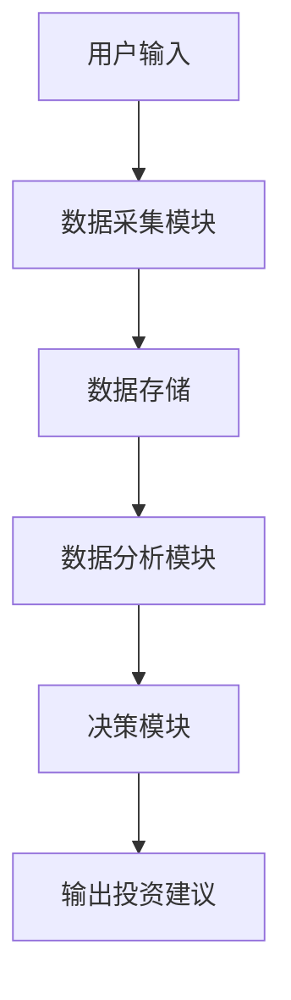

                 


# 如何将特价股票策略与动态资产配置相结合

> 关键词：特价股票，动态资产配置，股票投资，投资策略，资产配置优化，风险管理，动态调整

> 摘要：本文详细探讨如何将特价股票策略与动态资产配置相结合，通过优化投资组合和风险控制，提升投资效率和收益。文章结合理论与实践，提供系统设计和代码实现，帮助读者掌握这一投资策略。

---

## 第一部分：特价股票策略与动态资产配置概述

### 第1章：特价股票策略基础

#### 1.1 特价股票的定义与特征
- **1.1.1 什么是特价股票**
  特价股票是指在特定市场条件下，价格低于其内在价值的股票。这些股票通常被市场低估，具有较高的投资潜力。
- **1.1.2 特价股票的市场特征**
  特价股票通常出现在市场低迷或行业低谷时期，具有较高的安全边际和潜在的上涨空间。
- **1.1.3 特价股票的识别方法**
  识别方法包括基本面分析、技术分析和市场情绪分析，重点关注低市盈率、低市净率等指标。

#### 1.2 特价股票策略的类型
- **1.2.1 价值型策略**
  投资者寻找那些市场价格低于内在价值的股票，长期持有，等待价值回归。
- **1.2.2 成长型策略**
  投资于具有高成长潜力的特价股票，关注收入和利润的快速增长。
- **1.2.3 混合型策略**
  结合价值和成长因素，寻找价格合理且具有增长潜力的股票。

---

### 第2章：动态资产配置基础

#### 2.1 资产配置的定义与目标
- **2.1.1 资产配置的定义**
  资产配置是根据投资目标和风险承受能力，将资金分配到不同资产类别中的过程。
- **2.1.2 资产配置的目标**
  通过多元化投资降低风险，同时实现资产的长期增值。
- **2.1.3 资产配置的分类**
  包括战略资产配置、战术资产配置和动态资产配置。

#### 2.2 动态资产配置的理论基础
- **2.2.1 现代投资组合理论**
  通过分散投资降低风险，优化资产组合以实现收益最大化。
- **2.2.2 均衡与非均衡市场假设**
  在市场均衡状态下，资产价格反映所有信息；在非均衡状态下，存在套利机会。
- **2.2.3 动态资产配置的数学模型**
  使用均值-方差优化模型，考虑资产回报和风险的动态变化。

---

## 第二部分：特价股票策略与动态资产配置的结合

### 第3章：策略整合方法

#### 3.1 动态资产配置中的特价股票策略
- **3.1.1 策略整合的逻辑框架**
  将特价股票策略纳入资产配置模型，根据市场变化动态调整投资比例。
- **3.1.2 策略整合的实现步骤**
  1. 确定资产配置目标和风险偏好。
  2. 识别当前市场环境下的特价股票。
  3. 调整资产配置比例，增加特价股票的权重。
- **3.1.3 策略整合的优缺点分析**
  优点：提高收益，分散风险；缺点：需要频繁监控和调整。

#### 3.2 风险管理与策略优化
- **3.2.1 风险管理的必要性**
  通过设定止损点和止盈点，控制投资风险。
- **3.2.2 策略优化的数学模型**
  使用风险调整后的收益模型，如夏普比率和最大回撤。
- **3.2.3 策略优化的实现方法**
  通过回测和压力测试，验证策略的有效性。

---

### 第4章：系统分析与架构设计

#### 4.1 系统功能模块划分
- **4.1.1 数据采集模块**
  从数据源获取实时股票价格和市场数据。
- **4.1.2 数据分析模块**
  应用算法筛选特价股票，评估资产配置比例。
- **4.1.3 决策模块**
  根据分析结果生成投资建议，动态调整资产配置。

#### 4.2 系统架构图


---

### 第5章：项目实战

#### 5.1 环境安装
  需要安装Python、Pandas、NumPy、Matplotlib等库。

#### 5.2 核心实现代码
```python
import pandas as pd
import numpy as np

def identify_cheap_stocks(data):
    # 识别特价股票的逻辑
    cheap_stocks = data[data['市盈率'] < data['市盈率'].mean()]
    return cheap_stocks

def dynamic_asset Allocation(portfolio, market_data):
    # 动态资产配置的逻辑
    portfolio_allocations = {}
    for asset in portfolio:
        allocation = asset.weight * identify_cheap_stocks(asset.data)
        portfolio_allocations[asset] = allocation
    return portfolio_allocations
```

#### 5.3 代码应用解读
  - `identify_cheap_stocks`函数用于筛选低市盈率股票。
  - `dynamic_asset_Allocation`函数根据当前市场数据调整资产配置比例。

#### 5.4 实际案例分析
  通过回测分析，验证策略在不同市场环境下的表现。

---

### 第6章：总结

#### 6.1 最佳实践
  - 定期监控市场变化，及时调整资产配置。
  - 结合技术分析和基本面分析，提高策略的有效性。

#### 6.2 小结
  本文详细探讨了特价股票策略与动态资产配置的结合，通过系统设计和实际案例分析，展示了如何优化投资组合，实现风险可控下的收益最大化。

#### 6.3 注意事项
  - 风险管理是策略成功的关键。
  - 确保数据源的准确性和及时性。

#### 6.4 拓展阅读
  - 推荐阅读《投资学基础》和《算法交易》等书籍，深入理解相关理论和实践。

---

通过以上结构，文章系统地介绍了如何将特价股票策略与动态资产配置相结合，提供了理论支持、系统设计和实际案例，帮助投资者优化投资策略，实现长期收益。

