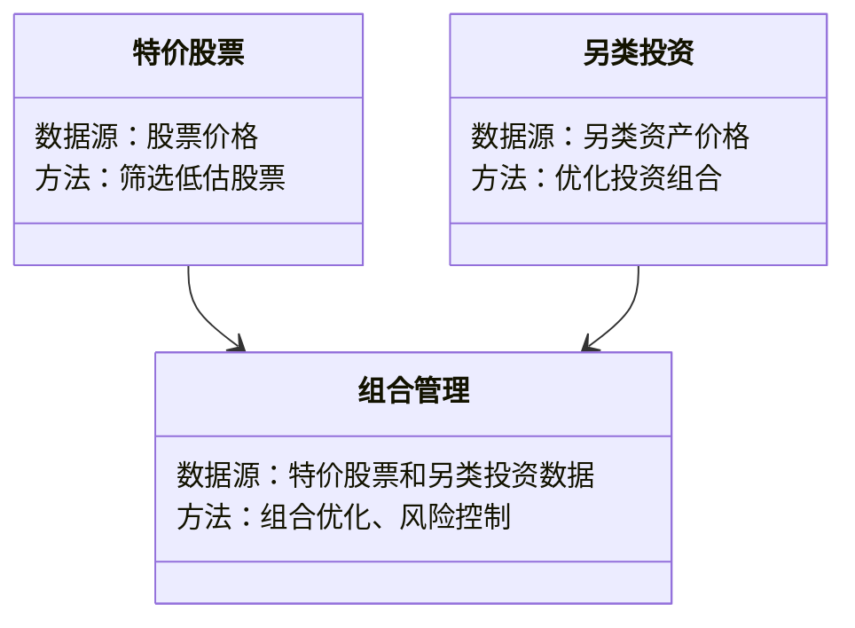
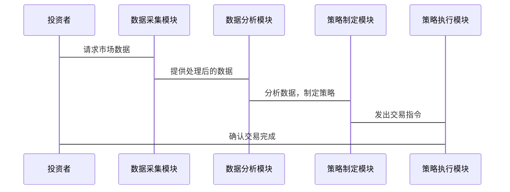

                 


# 如何将特价股票策略与另类投资结合

> 关键词：特价股票策略、另类投资、投资组合、风险控制、系统架构

> 摘要：本文探讨了如何将特价股票策略与另类投资相结合，通过数学建模、系统架构设计和项目实战，详细讲解了策略结合的原理、实现步骤和风险控制方法，最后给出了最佳实践和未来研究方向。

---

# 第一部分: 特价股票策略与另类投资的背景与基础

## 第1章: 特价股票策略的基础知识

### 1.1 特价股票的定义与特点

#### 1.1.1 什么是特价股票
特价股票是指在特定市场环境下，价格被低估的股票。这些股票通常具有较高的潜在回报，但同时也伴随着较高的风险。

#### 1.1.2 特价股票的市场特点
- 价格波动较大
- 市场流动性较低
- 投资周期较长

#### 1.1.3 特价股票的投资机会与风险
- 投资机会：潜在高回报
- 风险：市场波动、流动性风险

### 1.2 特价股票策略的核心要素

#### 1.2.1 策略的目标与原则
- 目标：寻找低估的股票，实现超额收益
- 原则：价值投资、分散投资

#### 1.2.2 策略的实施步骤
1. 筛选低估股票
2. 进行基本面分析
3. 技术分析辅助决策

#### 1.2.3 策略的适用场景
- 市场低迷期
- 行业周期性底部

### 1.3 特价股票策略的数学模型

#### 1.3.1 特价股票价格波动的数学公式
$$ P_{\text{true}} = P_{\text{market}} \times (1 + \epsilon) $$
其中，$\epsilon$ 表示市场波动率。

#### 1.3.2 策略收益的计算公式
$$ R = \frac{P_{\text{final}}}{P_{\text{initial}}} - 1 $$

#### 1.3.3 策略风险的评估模型
$$ \text{VaR} = \mu - z \times \sigma $$
其中，$\mu$ 是平均收益，$z$ 是标准正态分布的分位数，$\sigma$ 是标准差。

### 1.4 本章小结
本章介绍了特价股票的基本概念、市场特点、投资策略及其数学模型，为后续分析奠定了基础。

---

## 第2章: 另类投资的概述

### 2.1 另类投资的定义与特点

#### 2.1.1 什么是另类投资
另类投资是指传统股票和债券之外的投资方式，包括房地产、私募股权、对冲基金等。

#### 2.1.2 另类投资的市场特点
- 高收益潜力
- 高风险
- 低流动性

#### 2.1.3 另类投资的类型与分类
- 不动产投资
- 私募股权
- 对冲基金

### 2.2 另类投资的核心要素

#### 2.2.1 投资目标与原则
- 高回报
- 分散风险

#### 2.2.2 投资策略与方法
- 资产配置
- 杠杆策略

#### 2.2.3 投资风险与收益
- 高风险对应高收益
- 需要专业管理

### 2.3 另类投资的数学模型

#### 2.3.1 投资组合的优化公式
$$ \text{Maximize } \mu - \lambda \times \text{Var}(r) $$
其中，$\mu$ 是期望收益，$\lambda$ 是风险厌恶系数，$\text{Var}(r)$ 是收益的方差。

#### 2.3.2 风险调整后的收益计算
$$ R_{\text{adj}} = R - \lambda \times \text{Risk} $$

#### 2.3.3 投资组合的绩效评估
$$ \text{Sharpe Ratio} = \frac{\mu - R_f}{\sigma} $$
其中，$R_f$ 是无风险利率，$\sigma$ 是投资组合的标准差。

### 2.4 本章小结
本章详细介绍了另类投资的定义、类型、风险收益分析及其数学模型，为后续策略结合提供了理论支持。

---

## 第3章: 特价股票策略与另类投资的结合

### 3.1 策略结合的背景与动机

#### 3.1.1 特价股票策略的局限性
- 市场波动大，风险高
- 单一策略收益不稳定

#### 3.1.2 另类投资的优势与潜力
- 多样化收益来源
- 降低整体投资组合的风险

#### 3.1.3 结合策略的必要性与可行性
- 提高投资组合的稳定性
- 通过多元化降低风险

### 3.2 策略结合的核心原理

#### 3.2.1 策略结合的逻辑框架
- 利用特价股票的高收益潜力
- 通过另类投资分散风险

#### 3.2.2 策略结合的数学模型
$$ \text{Total Return} = \alpha \times R_{\text{stock}} + \beta \times R_{\text{alternative}} $$
其中，$\alpha$ 和 $\beta$ 是投资比例，$R_{\text{stock}}$ 和 $R_{\text{alternative}}$ 是两种策略的收益。

#### 3.2.3 策略结合的风险与收益分析
- 组合收益：两者的收益加权平均
- 组合风险：两者的风险相关性决定整体风险

### 3.3 策略结合的实现步骤

#### 3.3.1 确定投资目标与约束条件
- 设定总回报目标
- 确定风险承受能力

#### 3.3.2 构建投资组合
1. 确定特价股票和另类资产的投资比例
2. 选择具体的股票和另类资产
3. 进行资产配置

#### 3.3.3 监测与调整组合
- 定期评估组合表现
- 根据市场变化调整比例

### 3.4 本章小结
本章详细探讨了特价股票策略与另类投资结合的背景、原理和实现步骤，强调了策略结合的优势。

---

## 第4章: 组合投资模型的构建与优化

### 4.1 组合投资模型的概述

#### 4.1.1 组合投资的基本概念
- 组合投资是将资金分配到不同资产以优化风险和收益

#### 4.1.2 组合投资的核心要素
- 资产配置
- 风险控制
- 绩效评估

### 4.2 策略结合的组合优化

#### 4.2.1 组合优化的数学模型
$$ \text{Maximize } \mu_p - \lambda \times \text{Var}(r_p) $$
其中，$\mu_p$ 是组合的期望收益，$\text{Var}(r_p)$ 是组合的收益方差。

#### 4.2.2 组合优化的算法实现
使用均值-方差优化算法，通过调整权重来最小化风险或最大化收益。

#### 4.2.3 组合优化的案例分析
假设投资组合由50%特价股票和50%另类资产组成，计算组合的收益和风险。

### 4.3 策略结合的组合风险控制

#### 4.3.1 风险控制的原理与方法
- 利用相关性降低整体风险
- 设置止损点

#### 4.3.2 风险控制的数学模型
$$ \text{VaR}_{\text{portfolio}} = \mu_p - z \times \sigma_p $$

### 4.4 本章小结
本章详细讲解了组合投资模型的构建与优化，特别是如何通过策略结合来实现风险控制和收益优化。

---

## 第5章: 系统分析与架构设计方案

### 5.1 问题场景介绍
- 投资者希望构建一个结合特价股票和另类投资的系统
- 系统需要实时监控市场数据，自动调整投资组合

### 5.2 项目介绍
- 项目目标：构建一个智能化的投资管理系统
- 项目范围：涵盖数据采集、分析、策略制定和执行

### 5.3 系统功能设计

#### 5.3.1 领域模型（Mermaid 类图）


### 5.4 系统架构设计（Mermaid 架构图）
```mermaid
container 投资管理系统 {
    component 数据采集模块 {
        接口：API 数据接口
    }
    component 数据分析模块 {
        方法：数学建模
    }
    component 策略制定模块 {
        方法：组合优化
    }
    component 策略执行模块 {
        接口：交易系统接口
    }
}
```

### 5.5 系统接口设计

#### 5.5.1 数据采集模块
- 输入：市场数据
- 输出：处理后的数据

#### 5.5.2 策略执行模块
- 输入：优化后的组合
- 输出：交易指令

### 5.6 系统交互（Mermaid 序列图）


### 5.7 本章小结
本章通过系统架构设计和接口设计，详细讲解了如何构建一个智能化的投资管理系统，实现策略的自动化执行。

---

## 第6章: 项目实战

### 6.1 环境安装

#### 6.1.1 系统环境
- 操作系统：Linux/Windows
- 开发工具：Python、Jupyter Notebook
- 数据源：Yahoo Finance API

### 6.2 系统核心实现源代码

#### 6.2.1 数据采集模块
```python
import pandas as pd
import yfinance as yf

def get_stock_data(ticker, start, end):
    data = yf.download(ticker, start=start, end=end)
    return data['Adj Close']
```

#### 6.2.2 数据分析模块
```python
import numpy as np

def optimize_portfolio(weights, returns):
    cov_matrix = np.cov(returns)
    mu = np.mean(returns)
    return mu - 100 * np.dot(weights.T, np.dot(cov_matrix, weights))
```

#### 6.2.3 策略执行模块
```python
import pandas as pd
import numpy as np

def backtest(weights, data):
    portfolio_return = np.sum(weights * data.pct_change().mean(axis=0))
    return portfolio_return
```

### 6.3 代码应用解读与分析
- 数据采集模块从Yahoo Finance获取数据
- 数据分析模块进行组合优化
- 策略执行模块实现回测

### 6.4 实际案例分析和详细讲解剖析
- 选取特定时间段的数据
- 计算最优投资组合
- 比较策略结合与单一策略的收益和风险

### 6.5 本章小结
本章通过实际案例展示了如何在Python中实现特价股票策略与另类投资的结合，验证了策略的有效性。

---

## 第7章: 最佳实践、小结与展望

### 7.1 最佳实践 tips
- 定期评估和调整投资组合
- 注意市场变化和政策影响
- 保持分散投资

### 7.2 小结
本文详细讲解了如何将特价股票策略与另类投资结合，从理论到实践，提供了完整的解决方案。

### 7.3 未来研究方向
- 探讨更多另类资产的加入
- 研究人工智能在投资组合优化中的应用

### 7.4 本章小结
本章总结了全文，提出了未来的改进方向。

---

## 第8章: 结束语

### 8.1 再次强调策略结合的重要性
- 通过多样化降低风险
- 实现更稳定的收益

### 8.2 未来展望
- 更多创新策略的研究
- 技术驱动的投资优化

### 8.3 结束语
感谢读者的耐心阅读，希望本文能为投资者提供有价值的参考。

---

# 附录

## 附录A: 术语解释
- 特价股票：低估的股票
- 另类投资：非传统投资方式
- 组合优化：优化投资比例

## 附录B: 参考文献
- 《投资学》
- 《另类投资指南》
- 相关学术论文

---

通过以上结构，您可以根据需要进一步扩展每部分内容，确保每个章节都包含详细的理论、数学公式、系统设计和代码实现。

