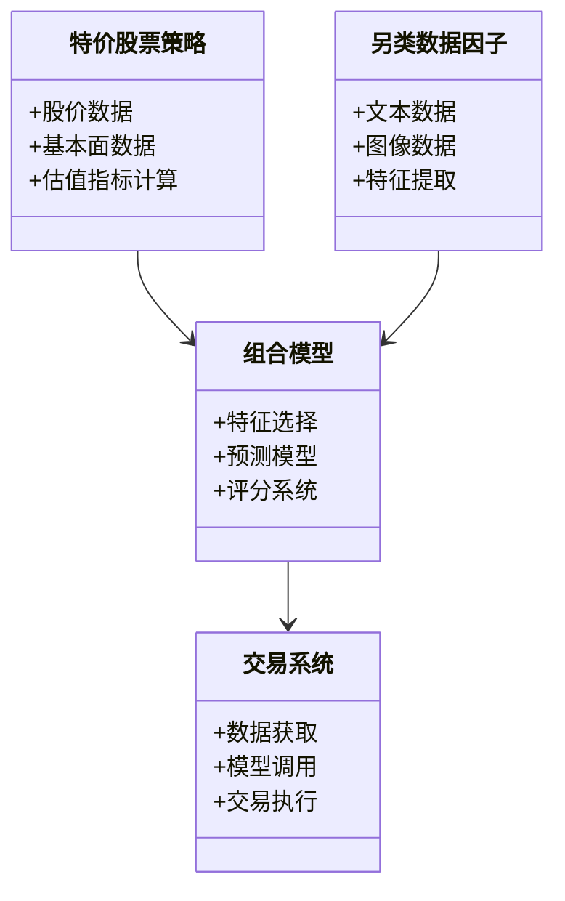

                 


# 如何将特价股票策略与另类数据因子挖掘策略相结合

> 关键词：特价股票策略，另类数据，因子挖掘，量化投资，机器学习

> 摘要：本文详细探讨了如何将特价股票策略与另类数据因子挖掘策略相结合，从背景介绍、核心概念、算法原理、系统架构到项目实战，层层深入，结合数学模型、代码实现和实际案例，为读者提供一个系统性的解决方案。

---

# 第一部分：特价股票策略与另类数据因子挖掘的背景与基础

## 第1章：特价股票与另类数据的基本概念

### 1.1 特价股票的定义与特点

#### 1.1.1 特价股票的定义
特价股票是指市场价格低于其内在价值的股票，通常被认为是被市场低估的投资机会。这种策略的核心在于寻找那些市场价格低于其基本面价值的股票。

#### 1.1.2 特价股票的特点
- **低估性**：市场价格低于内在价值。
- **价值驱动**：注重企业的基本面，如低市盈率、低市净率等。
- **长期性**：通常需要较长的时间来实现价值回归。

#### 1.1.3 特价股票的市场背景
特价股票策略在市场低迷或震荡时期尤为重要，因为这些时期更容易出现被低估的股票。然而，在市场繁荣时期，特价股票也可能面临更大的波动性和不确定性。

### 1.2 另类数据的基本概念

#### 1.2.1 另类数据的定义
另类数据是指传统金融数据之外的其他数据源，例如卫星图像、社交媒体数据、新闻数据、专利数据等。这些数据可以通过技术手段进行处理，提取出有用的金融信息。

#### 1.2.2 另类数据的分类
- **文本数据**：社交媒体、新闻、公司财报等。
- **图像数据**：卫星图像、股票图表等。
- **网络数据**：网页爬取数据、点击流数据等。
- **语音数据**：电话会议录音等。

#### 1.2.3 另类数据在金融领域的应用
- **情绪分析**：通过社交媒体数据判断市场情绪。
- **新闻事件分析**：通过新闻数据预测市场波动。
- **公司基本面分析**：通过专利数据、招聘信息等辅助判断公司实力。

---

## 第2章：特价股票策略的背景与应用

### 2.1 特价股票策略的背景

#### 2.1.1 特价股票策略的起源
特价股票策略起源于价值投资理念，由本杰明·格雷厄姆和菲利普·费雪等投资大师提出。他们认为，市场往往会过度反应，导致优质股票价格被低估。

#### 2.1.2 特价股票策略的发展历程
- **早期阶段**：基于基本面分析的手动选股。
- **量化阶段**：利用计算机技术进行大规模数据筛选。
- **现代阶段**：结合另类数据和机器学习技术优化选股策略。

#### 2.1.3 特价股票策略的现状
随着量化投资的兴起，特价股票策略逐渐从传统的基本面分析转向数据驱动的量化分析。然而，单纯依靠价格数据的策略在市场有效性提高的背景下效果有限，因此需要结合其他数据源进行优化。

### 2.2 特价股票策略的核心思想

#### 2.2.1 价值投资的基本理念
价值投资强调长期持有被低估的股票，等待其价格回归内在价值。这种方法在市场低迷时期尤为有效。

#### 2.2.2 特价股票的识别方法
- **估值指标**：市盈率（P/E）、市净率（P/B）、股息率等。
- **行业比较**：与同行业公司相比，判断是否低估。
- **历史数据分析**：通过历史数据寻找价格波动规律。

#### 2.2.3 特价股票策略的优缺点
- **优点**：风险较低，收益稳定。
- **缺点**：需要较长的投资周期，对市场波动敏感。

---

## 第3章：另类数据因子挖掘的背景与应用

### 3.1 另类数据因子挖掘的背景

#### 3.1.1 数据驱动投资的兴起
随着技术的进步，投资者可以利用更多的数据源进行分析，从而发现传统金融数据之外的投资机会。

#### 3.1.2 另类数据在量化投资中的作用
- **提高信息效率**：通过另类数据发现市场未反映的信息。
- **增强预测能力**：结合另类数据构建更准确的预测模型。

#### 3.1.3 另类数据因子挖掘的现状
当前，另类数据因子挖掘在量化投资中逐渐普及，但仍面临数据获取成本高、处理难度大等问题。

### 3.2 另类数据因子挖掘的核心思想

#### 3.2.1 另类数据的特征提取
- **文本数据**：关键词提取、情感分析。
- **图像数据**：图像识别、模式识别。
- **网络数据**：数据清洗、特征提取。

#### 3.2.2 另类数据因子的构建
通过机器学习算法（如LDA、PCA等）对另类数据进行降维和特征选择，构建有效的因子。

#### 3.2.3 另类数据因子的评估与优化
- **因子评估**：通过回测、风险调整收益等方法评估因子的有效性。
- **因子优化**：通过组合优化、动态调整等方法提升因子的表现。

---

## 第4章：特价股票策略与另类数据因子挖掘的关系

### 4.1 特价股票策略与另类数据因子的联系

#### 4.1.1 特价股票策略对另类数据的需求
- **数据支持**：需要更多的数据源支持基本面分析。
- **信息补充**：通过另类数据发现传统数据之外的投资机会。

#### 4.1.2 另类数据因子对特价股票策略的补充作用
- **信息丰富性**：另类数据提供了更多的市场信息，帮助投资者更全面地评估股票价值。
- **预测能力**：通过另类数据构建的因子可以提高选股模型的预测能力。

#### 4.1.3 另类数据因子在特价股票策略中的应用潜力
- **多因子模型**：将另类数据因子与传统因子结合，构建更有效的选股模型。
- **动态调整**：利用另类数据实时调整选股策略，提高策略的适应性。

### 4.2 特价股票策略与另类数据因子的对比分析

#### 4.2.1 数据来源对比
- 特价股票策略：依赖传统金融数据（如股价、市盈率等）。
- 另类数据因子：依赖非传统数据（如社交媒体、新闻等）。

#### 4.2.2 数据处理方法对比
- 特价股票策略：主要依赖基本面分析和简单统计方法。
- 另类数据因子：需要复杂的文本挖掘、图像识别等技术。

#### 4.2.3 数据分析目标对比
- 特价股票策略：寻找被低估的股票。
- 另类数据因子：寻找能够预测股价波动的因子。

---

## 第5章：特价股票策略与另类数据因子的结合模型

### 5.1 组合模型的基本框架

#### 5.1.1 模型的输入与输出
- **输入**：传统金融数据和另类数据。
- **输出**：选股信号或投资组合。

#### 5.1.2 模型的核心算法
- **特征选择**：通过Lasso回归或随机森林选择重要因子。
- **预测模型**：使用逻辑回归、支持向量机等方法进行预测。

#### 5.1.3 模型的评估指标
- **收益-风险比**：如夏普比率。
- **回测结果**：如年化收益、最大回撤等。

### 5.2 模型的优化与调整

#### 5.2.1 参数优化方法
- **网格搜索**：寻找最优参数组合。
- **贝叶斯优化**：通过概率分布寻找最优参数。

#### 5.2.2 模型的鲁棒性测试
- **交叉验证**：确保模型在不同数据集上的表现一致。
- **压力测试**：测试模型在极端市场条件下的表现。

#### 5.2.3 模型的实时性改进
- **滚动窗口法**：动态更新模型参数。
- **实时数据处理**：结合流数据处理技术，实时更新模型。

---

## 第6章：特价股票策略与另类数据因子的数学模型

### 6.1 特价股票策略的数学表达

#### 6.1.1 传统估值指标
$$ P/E = \frac{\text{股价}}{\text{每股收益}} $$
$$ P/B = \frac{\text{股价}}{\text{每股净资产}} $$

#### 6.1.2 组合模型的构建
$$ \text{综合评分} = \alpha \cdot P/E + \beta \cdot P/B + \gamma \cdot \text{另类因子} $$

### 6.2 另类数据因子的构建

#### 6.2.1 文本数据的特征提取
- 使用自然语言处理技术提取关键词和情感倾向。
- 使用TF-IDF方法提取文本中的重要特征。

#### 6.2.2 图像数据的特征提取
- 使用卷积神经网络（CNN）提取图像特征。
- 使用主成分分析（PCA）降低图像维度。

### 6.3 组合模型的优化

#### 6.3.1 参数优化
- 使用遗传算法优化模型参数。
- 使用梯度下降法优化权重。

#### 6.3.2 风险控制
- 使用马科维茨均值-方差模型优化投资组合。
- 使用VaR方法评估投资组合风险。

---

## 第7章：系统分析与架构设计方案

### 7.1 问题场景介绍

#### 7.1.1 项目目标
构建一个结合特价股票策略和另类数据因子的量化交易系统。

#### 7.1.2 项目需求
- **数据获取**：获取股票数据和另类数据。
- **数据处理**：清洗和预处理数据。
- **模型构建**：构建选股模型和投资组合优化模型。
- **系统实现**：开发一个实时交易系统。

### 7.2 系统功能设计

#### 7.2.1 领域模型（Mermaid 类图）


### 7.3 系统架构设计

#### 7.3.1 系统架构（Mermaid 架构图）


### 7.4 系统接口设计

#### 7.4.1 数据接口
- **数据获取接口**：从数据库获取股票数据和另类数据。
- **数据处理接口**：对数据进行清洗和预处理。

#### 7.4.2 模型接口
- **特征提取接口**：提取文本和图像特征。
- **预测接口**：调用预测模型获取评分。

### 7.5 系统交互流程

#### 7.5.1 交易系统交互流程（Mermaid 序列图）
```mermaid
sequenceDiagram
    客户端 ->> 服务器：请求数据
    服务器 ->> 数据库：查询股票数据
    数据库 --> 服务器：返回数据
    服务器 ->> 客户端：返回数据
    客户端 ->> 模型模块：调用预测模型
    模型模块 --> 客户端：返回预测结果
    客户端 ->> 交易系统：执行交易
```

---

## 第8章：项目实战

### 8.1 环境安装

#### 8.1.1 安装依赖
- **Python**：3.8+
- **库**：pandas、numpy、scikit-learn、tensorflow、pytorch等。

### 8.2 核心实现

#### 8.2.1 数据获取与预处理
```python
import pandas as pd
import requests

# 获取股票数据
def get_stock_data(ticker):
    url = f"https://api.example.com/stock/{ticker}"
    response = requests.get(url)
    return pd.DataFrame(response.json())

# 获取另类数据（例如社交媒体数据）
def get_alt_data(ticker):
    url = f"https://api.example.com/social_media/{ticker}"
    response = requests.get(url)
    return pd.DataFrame(response.json())
```

#### 8.2.2 特征提取与模型训练
```python
from sklearn.feature_extraction.text import TfidfVectorizer
from sklearn.model

