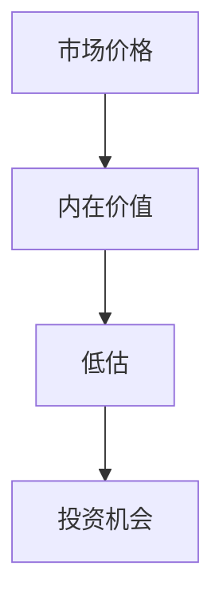
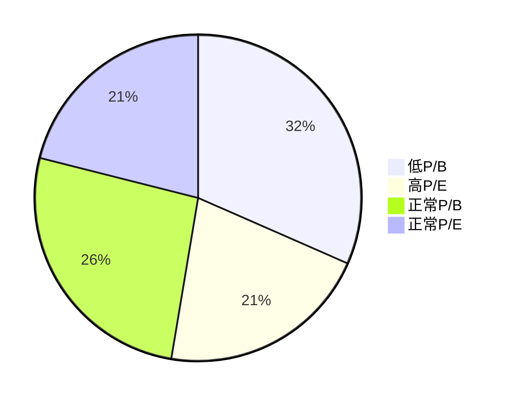
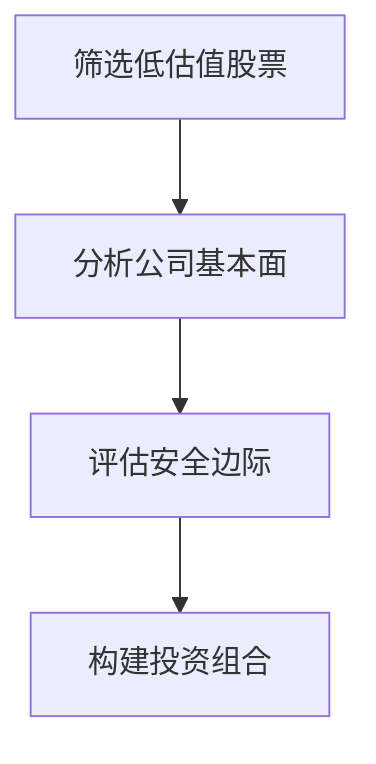
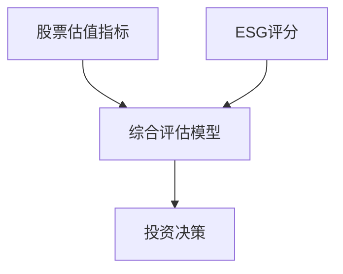
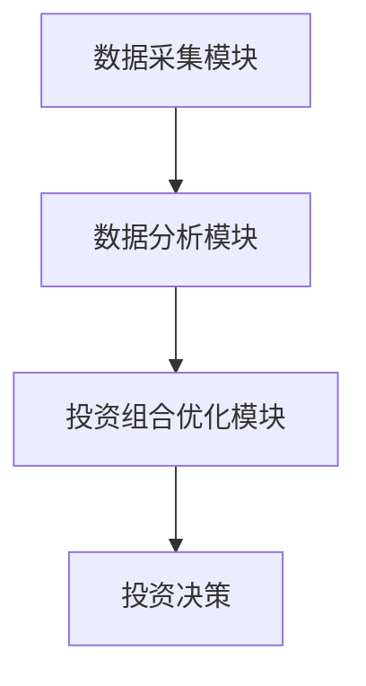
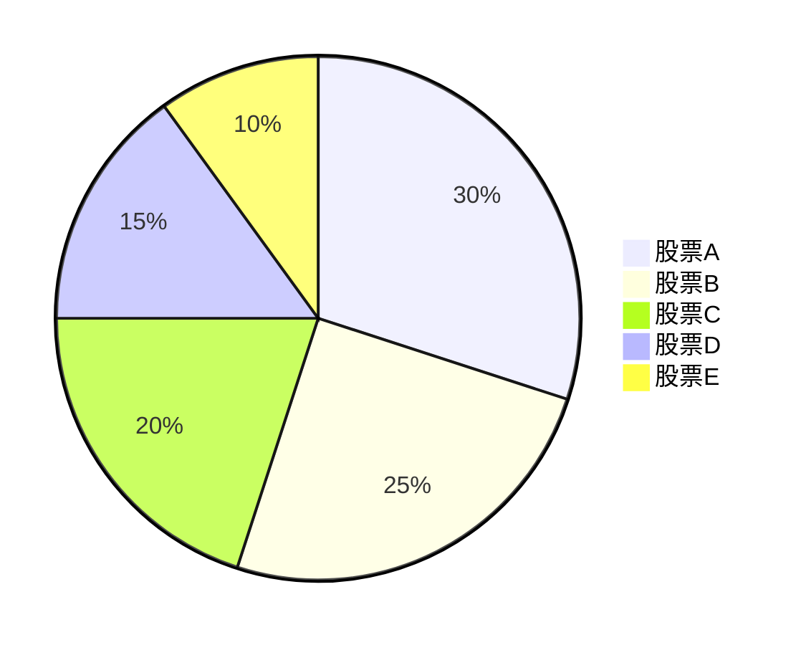

                 


# 如何将特价股票策略与可持续发展目标投资结合

> 关键词：特价股票策略、可持续发展目标投资、投资组合优化、ESG评分、价值投资、系统架构设计

> 摘要：本文探讨如何将特价股票策略与可持续发展目标投资相结合，通过分析两者的定义、特点及结合点，构建综合评估模型和投资组合优化策略，结合系统设计与实战案例，为投资者提供科学的指导。

---

## 第1章: 特价股票策略与可持续投资的背景介绍

### 1.1 特价股票策略的定义与特点

#### 1.1.1 特价股票的定义
特价股票是指市场价格低于其内在价值的股票，通常被认为是被市场低估的投资标的。这种策略的核心在于寻找价格与价值的偏离，利用市场的非效率性获利。

#### 1.1.2 特价股票的核心特点
- **低估值**：市盈率、市净率等指标显著低于行业平均水平。
- **周期性**：通常出现在市场低迷或行业低谷时期。
- **高潜力**：低估股票往往具有较高的反弹或增值潜力。

#### 1.1.3 特价股票在投资中的作用
- 提供较高的安全边际，降低投资风险。
- 在市场反转时，能够快速实现资本增值。

#### 图1.1 特价股票的筛选标准（示例）



### 1.2 可持续发展目标投资的定义与特点

#### 1.2.1 可持续投资的定义
可持续投资是以环境、社会和治理（ESG）因素为核心，旨在实现长期价值创造的投资策略。它强调企业对社会和环境的积极影响，同时兼顾经济效益。

#### 1.2.2 可持续投资的核心特点
- **ESG评分体系**：通过对企业在环境保护、社会责任和公司治理方面的表现进行评分。
- **长期导向**：关注企业的可持续发展能力，而非短期收益。
- **社会价值**：通过投资促进社会进步和环境保护。

#### 1.2.3 可持续投资的社会意义
- 推动企业履行社会责任，减少环境破坏。
- 通过投资引导社会资源流向可持续发展的领域。

### 1.3 特价股票与可持续投资的结合背景

#### 1.3.1 当前投资环境的挑战
- 市场波动加剧，传统投资策略面临挑战。
- 社会对可持续发展的关注度不断提高，投资者期望兼顾收益与社会责任。

#### 1.3.2 特价股票与可持续投资的契合点
- 两者都强调长期价值，注重基本面分析。
- 可持续投资的低估值企业往往符合特价股票的筛选标准。

#### 1.3.3 结合的意义与目标
- 提高投资组合的可持续性，降低风险。
- 通过社会责任投资实现资本增值。

---

## 第2章: 特价股票与可持续投资的核心概念与联系

### 2.1 特价股票的量化分析

#### 2.1.1 市净率与市盈率分析
- **市净率（P/B）**：市场价格与账面价值的比值，用于衡量股票是否低估。
- **市盈率（P/E）**：市场价格与每股收益的比值，用于评估股票的估值水平。

#### 图2.1 市净率与市盈率的对比分析



#### 2.1.2 股价与内在价值的对比
- 通过DCF模型估算股票的内在价值，与市场价格进行对比，寻找低估机会。

#### 2.1.3 特价股票的筛选标准
- 市盈率低于行业平均水平。
- 市净率低于1。
- 公司基本面良好，具备增长潜力。

### 2.2 可持续投资的评估方法

#### 2.2.1 ESG评分体系
- **环境（E）**：碳排放、能源消耗等指标。
- **社会（S）**：员工权益、社会责任等。
- **治理（G）**：公司治理结构、高管薪酬等。

#### 图2.2 ESG评分体系框架


#### 2.2.2 可持续投资的指标体系
- ESG评分：0-10分，分数越高，表现越好。
- 环境影响指数：量化企业对环境的影响程度。
- 社会责任指数：评估企业在社会责任方面的表现。

### 2.3 特价股票与可持续投资的对比分析

#### 2.3.1 特价股票与可持续投资的共同点
- 都注重基本面分析。
- 强调长期投资价值。
- 适合价值投资者。

#### 2.3.2 特价股票与可持续投资的差异
- **目标**：特价股票关注价格低估，可持续投资关注ESG表现。
- **筛选标准**：特价股票注重估值，可持续投资注重社会影响。

#### 图2.3 特价股票与可持续投资的对比表格

| **维度**       | **特价股票**           | **可持续投资**          |
|----------------|-----------------------|-------------------------|
| 核心目标       | 寻找价格低估的股票     | 选择符合ESG标准的企业   |
| 筛选标准       | 市盈率、市净率         | ESG评分、社会责任       |
| 投资期限       | 中长期                | 长期                   |

---

## 第3章: 特价股票与可持续投资的策略与模型

### 3.1 特价股票投资策略

#### 3.1.1 价值投资策略
- 以本杰明·格雷厄姆的价值投资理论为基础，寻找市场价格低于内在价值的股票。

#### 3.1.2 股价与价值的偏离分析
- 通过对比市场价格与DCF模型计算的内在价值，判断是否存在低估。

#### 3.1.3 特价股票的长期投资价值
- 低估股票往往具有较高的安全边际，适合长期持有。

#### 图3.1 特价股票投资流程



### 3.2 可持续投资策略

#### 3.2.1 ESG投资策略
- 根据企业ESG评分，选择表现优异的企业进行投资。

#### 3.2.2 社会责任投资（SRI）策略
- 将社会影响纳入投资决策，避免投资于有害企业。

#### 3.2.3 环境友好型投资策略
- 优先投资于环保技术、清洁能源等领域的企业。

### 3.3 特价股票与可持续投资的结合策略

#### 3.3.1 综合评估模型
- 结合股票的估值指标（如市盈率、市净率）和ESG评分，构建综合评估模型。

#### 3.3.2 特价股票的筛选与ESG评分的结合
- 在筛选特价股票时，优先选择ESG评分较高的企业。

#### 3.3.3 投资组合的优化策略
- 将综合评估模型应用于投资组合优化，平衡收益与社会责任。

#### 图3.2 综合评估模型框架



---

## 第4章: 特价股票与可持续投资的系统分析与架构设计

### 4.1 项目背景与目标

#### 4.1.1 项目背景
- 当前市场环境下，投资者需要兼顾收益与社会责任。
- 可持续投资逐渐成为主流趋势。

#### 4.1.2 项目目标
- 构建一个结合特价股票策略与可持续投资的系统。
- 提供综合评估模型和投资组合优化工具。

### 4.2 系统功能设计

#### 4.2.1 数据采集模块
- 采集股票的市场数据（如市盈率、市净率）和ESG评分。
- 数据来源：股票数据库、第三方ESG评分机构。

#### 4.2.2 数据分析模块
- 对股票进行估值分析和ESG评分评估。
- 计算综合评分，筛选符合条件的股票。

#### 4.2.3 投资组合优化模块
- 根据综合评分，构建最优投资组合。
- 考虑风险分散和收益最大化。

#### 图4.1 系统功能设计



---

## 第5章: 项目实战与案例分析

### 5.1 环境安装与配置

#### 5.1.1 安装Python环境
```bash
pip install python
pip install pandas numpy
```

#### 5.1.2 安装ESG评分数据接口
```bash
pip install requests
```

### 5.2 核心代码实现

#### 5.2.1 数据采集代码
```python
import pandas as pd
import requests

def get_stock_data(tickers):
    data = []
    for ticker in tickers:
        response = requests.get(f'https://api.example.com/stock/{ticker}')
        stock_data = response.json()
        data.append({
            'Ticker': ticker,
            'PE': stock_data['pe'],
            'PB': stock_data['pb'],
            'ESG': stock_data['esg']
        })
    return pd.DataFrame(data)
```

#### 5.2.2 综合评估模型
```python
def evaluate_stocks(data):
    data['综合评分'] = 0.5 * data['PE'] + 0.3 * data['PB'] + 0.2 * data['ESG']
    return data
```

#### 5.2.3 投资组合优化
```python
import numpy as np

def optimize_portfolio(data, weights):
    returns = data.pct_change().dropna()
    covariance = returns.cov()
    risk_parity = np.sqrt(np.diag(covariance))
    optimal_weights = risk_parity / risk_parity.sum()
    return optimal_weights
```

### 5.3 案例分析与解读

#### 5.3.1 案例背景
- 筛选某行业的低估值企业，同时具备较高的ESG评分。

#### 5.3.2 数据分析结果
- 选出5只符合条件的股票，构建投资组合。
- 计算综合评分，确定最优权重。

#### 图5.1 投资组合优化结果



### 5.4 项目小结

- 通过系统设计，实现了特价股票与可持续投资的结合。
- 投资组合优化模型能够有效平衡收益与社会责任。

---

## 第6章: 最佳实践与总结

### 6.1 小结

- 特价股票策略与可持续投资的结合能够实现收益与社会责任的双重目标。
- 综合评估模型和投资组合优化策略是实现这一目标的关键。

### 6.2 注意事项

- 投资者需注意市场波动对估值的影响。
- 可持续投资需关注企业的长期表现。

### 6.3 拓展阅读

- 格雷厄姆的《聪明的投资者》
- 纪恩·卡鲁斯的《ESG投资策略》

---

通过以上分析，我们可以看到，将特价股票策略与可持续发展目标投资结合，不仅能够实现资本增值，还能推动社会进步和环境保护。这种投资方式将越来越受到重视，成为未来投资的重要方向。

