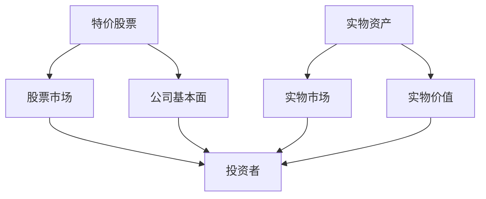
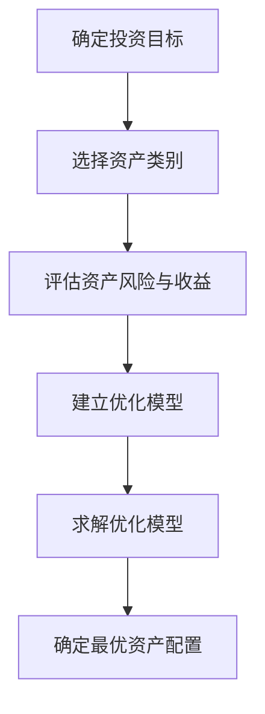
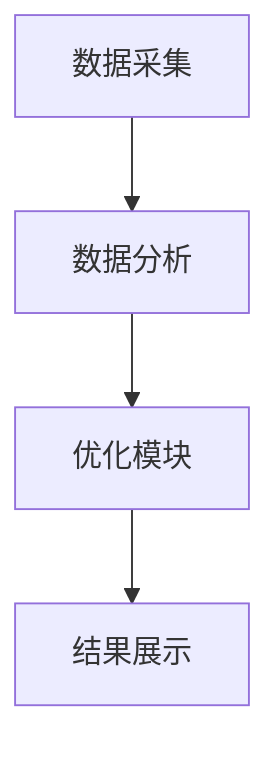

                 


# 如何将特价股票策略与实物资产投资结合

> 关键词：特价股票，实物资产，投资策略，资产配置，风险管理

> 摘要：本文探讨了如何将特价股票策略与实物资产投资相结合，以优化投资组合并分散风险。通过分析特价股票和实物资产的核心概念、数学模型、系统架构及实战案例，本文为投资者提供了一种创新的投资策略，帮助他们在复杂多变的市场环境中实现长期稳健的收益。

---

# 第一部分: 特价股票策略与实物资产投资结合概述

## 第1章: 特价股票策略与实物资产投资概述

### 1.1 特价股票策略的基本概念

#### 1.1.1 什么是特价股票
特价股票是指市场价格低于其内在价值的股票。这种股票通常被认为被市场低估，具有较大的上涨潜力。特价股票的投资逻辑基于“价值投资”理念，即寻找市场价格低于公司基本面价值的股票。

#### 1.1.2 特价股票的分类与特点
- **分类**：
  - 市盈率（P/E）低于行业平均水平的股票。
  - 市净率（P/B）低于行业平均水平的股票。
  - 股息率较高的股票。
- **特点**：
  - 价格低估，风险相对较低。
  - 具有较大的增值空间。
  - 对公司基本面分析有较高的要求。

#### 1.1.3 特价股票投资的基本原理
- **基本面分析**：分析公司的财务报表，评估公司的盈利能力、成长性和财务健康状况。
- **估值方法**：使用市盈率、市净率等指标，判断股票是否被市场低估。
- **长期持有**：投资于具有竞争优势的公司，耐心等待市场回归其内在价值。

### 1.2 实物资产投资的基本概念

#### 1.2.1 什么是实物资产
实物资产是指具有实际物理形态的资产，包括房地产、黄金、艺术品、收藏品等。实物资产的特性是其具有实际的使用价值和稀缺性，能够在市场中变现。

#### 1.2.2 实物资产的分类与特点
- **分类**：
  - 房地产：住宅、商铺、写字楼等。
  - 黄金及其他贵金属：黄金、白银等。
  - 艺术品和收藏品：绘画、雕塑、古董等。
- **特点**：
  - 具有较高的流动性，能够在市场中快速变现。
  - 抗通胀能力强，能够在通货膨胀期间保值或增值。
  - 需要较高的专业知识和市场判断力。

#### 1.2.3 实物资产投资的基本原理
- **市场分析**：研究市场趋势和经济周期，选择合适的市场时机。
- **价值评估**：通过市场分析和实物资产的特性，评估其潜在价值。
- **长期持有与分散投资**：通过长期持有和分散投资，降低市场波动带来的风险。

### 1.3 特价股票与实物资产投资结合的必要性

#### 1.3.1 投资组合多样化的重要性
- **分散风险**：将资金分配到不同类型的资产中，降低单一资产波动带来的风险。
- **风险与收益平衡**：通过结合股票和实物资产，实现风险与收益的最优平衡。

#### 1.3.2 风险分散与收益优化的平衡
- **股票市场的波动性**：股票价格受市场情绪和经济周期影响较大，具有较高的波动性。
- **实物资产的稳定性**：实物资产价格受经济周期影响较小，能够在市场低迷期间提供一定的稳定性。

#### 1.3.3 经济周期对投资策略的影响
- **经济繁荣期**：股票市场表现较好，实物资产价格也可能上涨。
- **经济衰退期**：股票市场可能下跌，实物资产价格可能保持稳定或上涨。

## 1.4 本章小结
本章介绍了特价股票和实物资产的基本概念、分类特点和投资原理，并分析了两者结合的必要性。通过结合股票和实物资产，投资者可以实现投资组合的多样化，分散风险，优化收益。

---

## 第2章: 特价股票与实物资产投资的核心概念与联系

### 2.1 特价股票投资的核心概念

#### 2.1.1 市净率与市盈率分析
- **市净率（P/B）**：股票价格与每股净资产的比率。P/B < 1时，股票可能被低估。
- **市盈率（P/E）**：股票价格与每股收益的比率。P/E < 行业平均时，股票可能被低估。

#### 2.1.2 股东权益与内在价值评估
- **股东权益**：公司资产负债表中所有者权益的总和，反映公司的净资产价值。
- **内在价值**：基于公司未来现金流的折现值，反映公司的真实价值。

#### 2.1.3 股票市场的周期性特征
- **市场周期**：股票市场通常经历牛市、熊市、震荡市等周期性变化。
- **周期性波动**：在市场低迷期，特价股票可能被市场低估，为投资者提供买入机会。

### 2.2 实物资产投资的核心概念

#### 2.2.1 实物资产的流动性与变现能力
- **流动性**：实物资产的变现能力取决于市场深度和交易活跃度。
- **变现能力**：实物资产需要通过市场交易才能变现，可能需要较长时间。

#### 2.2.2 实物资产的价值评估方法
- **市场法**：通过市场比较法评估资产价值。
- **成本法**：基于资产的重置成本进行评估。
- **收益法**：基于资产的未来收益进行评估。

#### 2.2.3 实物资产市场的波动性特征
- **市场波动**：实物资产价格受市场供需关系和宏观经济因素影响。
- **周期性变化**：在经济周期中，实物资产价格可能呈现周期性波动。

### 2.3 特价股票与实物资产投资的联系

#### 2.3.1 投资组合的多元化优势
- **分散风险**：通过将资金分配到股票和实物资产中，降低单一资产波动带来的风险。
- **资产配置**：根据市场环境和投资目标，动态调整股票和实物资产的比例。

#### 2.3.2 风险分散与收益优化的平衡
- **风险分散**：股票和实物资产的风险特性不同，结合两者可以降低整体投资组合的风险。
- **收益优化**：通过优化资产配置，实现收益的最大化。

#### 2.3.3 经济周期中的资产轮动效应
- **经济繁荣期**：股票市场表现较好，实物资产价格可能上涨。
- **经济衰退期**：股票市场可能下跌，实物资产价格可能保持稳定或上涨。

### 2.4 核心概念对比分析

#### 2.4.1 特价股票与实物资产的属性对比表格

| 特性          | 特价股票                   | 实物资产                   |
|---------------|----------------------------|----------------------------|
| 流动性         | 高                        | 中                        |
| 风险           | 高                        | 中                        |
| 投资门槛       | 低                        | 高                        |
| 市场波动性     | 高                        | 中                        |
| 投资周期       | 短                        | 长                        |
| 收益来源       | 股票价格增值、股息收益     | 资产升值、租金收益         |

#### 2.4.2 实体关系图（Mermaid流程图）



---

## 第3章: 特价股票与实物资产投资的数学模型与算法原理

### 3.1 特价股票投资的数学模型

#### 3.1.1 市净率与市盈率的计算公式

- **市净率（P/B）**：$$ P/B = \frac{\text{股票价格}}{\text{每股净资产}} $$
- **市盈率（P/E）**：$$ P/E = \frac{\text{股票价格}}{\text{每股收益}} $$

#### 3.1.2 内在价值的评估公式

- **内在价值**：$$ \text{内在价值} = \sum_{t=1}^{n} \frac{\text{现金流}_t}{(1 + r)^t} $$，其中$$ r $$为折现率。

#### 3.1.3 投资组合优化的数学模型

- **优化目标**：最大化收益，同时最小化风险。
- **约束条件**：$$ \sum_{i=1}^{n} w_i = 1 $$，其中$$ w_i $$为第$$ i $$种资产的权重。

### 3.2 实物资产投资的数学模型

#### 3.2.1 实物资产价值评估的公式

- **市场法**：$$ \text{评估价值} = \text{可比资产的平均价格} \times \text{调整系数} $$
- **成本法**：$$ \text{评估价值} = \text{重置成本} \times \text{调整系数} $$
- **收益法**：$$ \text{评估价值} = \frac{\text{年净收益}}{资本化率} $$

#### 3.2.2 投资组合风险的量化方法

- **方差-协方差矩阵**：$$ \Sigma = \begin{bmatrix} \sigma_1^2 & \sigma_{12} & \dots \\ \sigma_{21} & \sigma_2^2 & \dots \\ \dots & \dots & \dots \end{bmatrix} $$
- **投资组合风险**：$$ \text{组合风险} = \sqrt{w^T \Sigma w} $$，其中$$ w $$为权重向量。

#### 3.2.3 资产配置的数学模型

- **资产配置比例**：$$ w_i = \frac{\text{资产}_i \text{的目标权重}}{\sum_{j=1}^{n} \text{资产}_j \text{的目标权重}} $$

### 3.3 特价股票与实物资产投资的算法原理

#### 3.3.1 投资组合优化的算法流程（Mermaid流程图）



#### 3.3.2 算法实现的Python代码示例

```python
import numpy as np
from scipy.optimize import minimize

# 示例：优化投资组合（股票和实物资产）
def objective(weights, covariance_matrix, risk_aversion):
    return np.dot(weights.T, np.dot(covariance_matrix, weights)) * risk_aversion

# 约束条件
def constraint(weights):
    return np.sum(weights) - 1.0

# 求解优化问题
def optimize_portfolio(covariance_matrix, risk_aversion=1.0):
    n = covariance_matrix.shape[0]
    init_guess = np.array([1.0/n] * n)
    bounds = [(0.0, 1.0) for _ in range(n)]
    result = minimize(objective, init_guess, args=(covariance_matrix, risk_aversion), method='SLSQP', constraints={'type': 'eq', 'fun': constraint})
    return result.x

# 示例数据
# 假设我们有2种资产：股票和实物资产
covariance_matrix = np.array([[0.04, 0.02], [0.02, 0.09]])
risk_aversion = 1.0

# 优化投资组合
weights = optimize_portfolio(covariance_matrix, risk_aversion)

print("优化后的权重：", weights)
```

---

## 第4章: 投资组合优化的系统分析与架构设计

### 4.1 投资组合优化的系统架构

#### 4.1.1 系统功能模块划分

- **数据采集模块**：采集股票和实物资产的市场数据。
- **数据分析模块**：对市场数据进行分析，评估资产的风险与收益。
- **优化模块**：根据优化模型，计算最优资产配置。
- **结果展示模块**：将优化结果以可视化形式展示。

#### 4.1.2 系统架构图（Mermaid流程图）



---

## 第5章: 项目实战

### 5.1 环境安装与配置

- **Python环境**：安装Python 3.8及以上版本。
- **依赖库安装**：安装numpy、pandas、scipy、matplotlib等库。

### 5.2 系统核心实现源代码

#### 5.2.1 数据采集模块

```python
import pandas as pd
import requests

def get_stock_data(ticker):
    url = f"https://api.example.com/stock/{ticker}"
    response = requests.get(url)
    return pd.DataFrame(response.json()['data'])

def get_asset_data(asset_type):
    url = f"https://api.example.com/asset/{asset_type}"
    response = requests.get(url)
    return pd.DataFrame(response.json()['data'])
```

#### 5.2.2 数据分析模块

```python
def calculate_risk_return(data):
    returns = data.pct_change().dropna()
    mean_return = returns.mean()
    std_dev = returns.std()
    return mean_return, std_dev
```

#### 5.2.3 优化模块

```python
import numpy as np
from scipy.optimize import minimize

def optimize_portfolio(weights, covariance_matrix, risk_aversion):
    return np.dot(weights.T, np.dot(covariance_matrix, weights)) * risk_aversion

def constraint(weights):
    return np.sum(weights) - 1.0

def get_optimal_weights(covariance_matrix, risk_aversion=1.0):
    n = covariance_matrix.shape[0]
    init_guess = np.array([1.0/n] * n)
    bounds = [(0.0, 1.0) for _ in range(n)]
    result = minimize(optimize_portfolio, init_guess, args=(covariance_matrix, risk_aversion), method='SLSQP', constraints={'type': 'eq', 'fun': constraint})
    return result.x

# 示例数据
covariance_matrix = np.array([[0.04, 0.02], [0.02, 0.09]])
risk_aversion = 1.0

# 优化投资组合
weights = get_optimal_weights(covariance_matrix, risk_aversion)

print("优化后的权重：", weights)
```

---

## 第6章: 总结与展望

### 6.1 本章小结
通过本文的分析，我们可以看出，将特价股票策略与实物资产投资结合，可以在风险与收益之间找到一个最佳平衡点。投资者可以根据市场环境和自身风险偏好，动态调整资产配置比例，实现长期稳健的收益。

### 6.2 注意事项
- **市场风险**：市场波动可能导致投资组合的损失。
- **流动性风险**：实物资产的变现能力可能受到市场深度的限制。
- **操作风险**：投资策略的实施需要专业的知识和技能。

### 6.3 拓展阅读
- **相关书籍**：《投资学》、《价值投资实战》
- **在线资源**：投资论坛、金融博客、学术论文

---

# 结语

通过本文的系统分析和实战案例，读者可以深入了解如何将特价股票策略与实物资产投资结合，并在实际操作中灵活运用这些方法。希望本文能够为投资者提供有价值的参考和启示。

