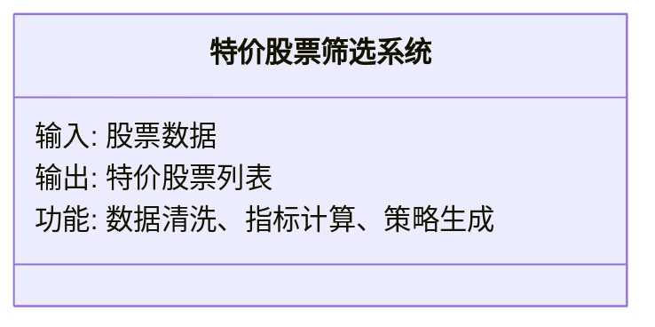
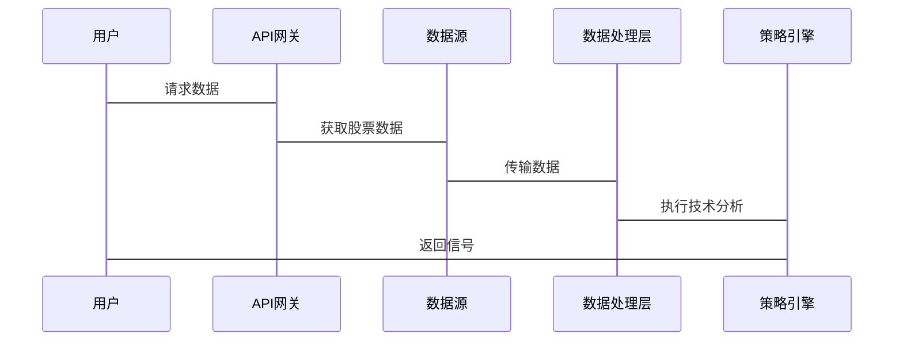

                 


# 如何将特价股票策略与技术分析相结合

> 关键词：特价股票策略，技术分析，股票投资，投资策略，技术指标

> 摘要：本文将详细介绍如何将特价股票策略与技术分析相结合，以优化投资决策。通过分析特价股票策略的核心概念、技术分析的主要方法，以及两者的结合方式，帮助投资者更好地理解如何利用技术指标来识别投资机会，降低投资风险。

---

## 第一部分: 特价股票策略与技术分析概述

### 第1章: 特价股票策略概述

#### 1.1 特价股票策略的定义与特点

##### 1.1.1 特价股票的定义
特价股票是指价格显著低于其内在价值或行业平均水平的股票。这些股票通常被认为是被市场低估的投资机会。

##### 1.1.2 特价股票策略的核心特点
- **低估性**：价格低于内在价值。
- **周期性**：通常在市场低迷或行业低谷时出现。
- **高回报潜力**：一旦市场恢复，价格可能回升，带来高回报。

##### 1.1.3 特价股票策略的应用场景
- 投资者在市场低迷时寻找低估股票。
- 长期投资者利用市场周期波动进行投资。

#### 1.2 技术分析的基本原理

##### 1.2.1 技术分析的定义
技术分析是一种通过分析历史价格和成交量数据，预测未来价格走势的方法。

##### 1.2.2 技术分析的核心假设
- 市场价格反映所有信息（有效市场假说）。
- 价格走势具有周期性。
- 历史模式会重复出现。

##### 1.2.3 技术分析的主要工具与方法
- **技术指标**：如移动平均线（MA）、相对强弱指数（RSI）等。
- **图表模式**：如头肩顶、双底等形态。

#### 1.3 特价股票策略与技术分析的结合意义

##### 1.3.1 结合的必要性
- 通过技术分析识别潜在的低估股票。
- 结合市场情绪和技术指标，降低投资风险。

##### 1.3.2 结合的优势
- 提高选股效率。
- 减少人为情绪干扰。

##### 1.3.3 结合的挑战
- 市场波动性大，策略需不断调整。
- 技术分析的有效性依赖于市场环境。

---

## 第二部分: 技术分析中的关键指标与方法

### 第2章: 技术分析中的关键指标

#### 2.1 移动平均线（MA）

##### 2.1.1 MA的定义与计算
移动平均线是将一定时期内的平均价格绘制出来的曲线，常用的是简单移动平均线（SMA）和指数移动平均线（EMA）。

##### 2.1.2 MA的应用方法
- 识别价格趋势。
- 作为买卖信号（如MA交叉）。

##### 2.1.3 MA的优缺点分析
- 优点：简单易懂，过滤市场噪声。
- 缺点：滞后性，无法预测价格反转。

#### 2.2 相对强弱指数（RSI）

##### 2.2.1 RSI的定义与计算
RSI衡量的是资产在一定时期内的超买或超卖状态，计算公式如下：
$$RSI = \frac{100}{1 + \frac{\text{平均上涨幅度}}{\text{平均下跌幅度}}}$$

##### 2.2.2 RSI的应用方法
- 当RSI > 70时，资产超买，可能回调。
- 当RSI < 30时，资产超卖，可能反弹。

#### 2.3 布林带（Bollinger Bands）

##### 2.3.1 布林带的定义与计算
布林带由三条线组成：中间线（MA）、上限（MA + 标准差）和下限（MA - 标准差）。

##### 2.3.2 布林带的应用方法
- 价格接近上限可能回调。
- 价格接近下限可能反弹。

---

## 第三部分: 特价股票策略中的技术分析方法

### 第3章: 特价股票策略中的技术分析应用

#### 3.1 基于技术指标的选股策略

##### 3.1.1 选择合适的指标组合
- 结合MA和RSI，避免单一指标的局限性。

##### 3.1.2 指标交叉的应用
- 金叉（短期MA上穿长期MA）：买入信号。
- 死叉（短期MA下穿长期MA）：卖出信号。

##### 3.1.3 超买超卖信号的应用
- 当RSI显示超卖时，寻找潜在的低估股票。

#### 3.2 基于形态学的技术分析策略

##### 3.2.1 头肩顶形态
头肩顶形态通常预示着价格即将下跌。

##### 3.2.2 双底形态
双底形态通常预示着价格即将上涨。

##### 3.2.3 其他常见形态分析
- 矩形形态：价格可能突破上行或下行。
- 三角形形态：价格可能突破上行或下行。

#### 3.3 基于成交量的技术分析策略

##### 3.3.1 成交量的基本概念
成交量是交易的总数量，反映市场参与者的情绪。

##### 3.3.2 成交量与价格的关系
- 价格上升，成交量增加：趋势可能持续。
- 价格下降，成交量减少：趋势可能反转。

---

## 第四部分: 系统分析与架构设计方案

### 第4章: 系统功能设计

#### 4.1 问题场景介绍
投资者需要一个系统来自动筛选特价股票，并结合技术分析生成投资信号。

#### 4.2 系统功能设计

##### 4.2.1 领域模型设计


##### 4.2.2 系统架构设计


#### 4.3 系统接口设计
- 数据接口：获取实时或历史数据。
- 策略接口：执行技术分析并生成信号。

#### 4.4 系统交互设计


---

## 第五部分: 项目实战

### 第5章: 项目实战

#### 5.1 环境安装
- 安装Python和必要的库（如pandas、matplotlib、ta-lib）。
- 安装Jupyter Notebook用于数据处理和可视化。

#### 5.2 核心实现源代码

##### 5.2.1 数据获取与清洗
```python
import pandas as pd
import requests
from ta import *
from datetime import datetime, timedelta

# 获取历史数据
def get_data(ticker, start_date, end_date):
    url = f"https://api.example.com/stock_data/{ticker}"
    response = requests.get(url)
    data = response.json()
    df = pd.DataFrame(data)
    df['Date'] = pd.to_datetime(df['Date'])
    df.set_index('Date', inplace=True)
    df = df.loc[start_date:end_date]
    return df

# 清洗数据
def clean_data(df):
    df.dropna(inplace=True)
    return df
```

##### 5.2.2 技术指标计算与可视化
```python
import matplotlib.pyplot as plt
import pandas as pd
from ta import *

# 计算移动平均线
df['MA_20'] = df['Close'].rolling(20).mean()
df['MA_50'] = df['Close'].rolling(50).mean()

# 计算RSI
df['RSI'] = rsi(df['Close'], window=14)

# 可视化
plt.figure(figsize=(12, 6))
plt.subplot(2, 1, 1)
plt.plot(df['Close'], label='Close')
plt.plot(df['MA_20'], label='MA_20')
plt.plot(df['MA_50'], label='MA_50')
plt.legend()

plt.subplot(2, 1, 2)
plt.plot(df['RSI'], label='RSI')
plt.axhline(y=70, color='red', linestyle='--')
plt.axhline(y=30, color='green', linestyle='--')
plt.legend()

plt.show()
```

##### 5.2.3 策略实现与回测
```python
from backtrader import Strategy

class MyStrategy(Strategy):
    def __init__(self):
        self.buy_price = None
        self.sell_price = None
        self.add_indicator(ma20, 'ma20')
        self.add_indicator(rsi, 'rsi')

    def next(self):
        if self.position:
            if self.data.rsi < 30:
                self.position.close()
        else:
            if self.data.rsi > 70 and self.data.ma20 > self.data.ma50:
                self.buy()
```

#### 5.3 案例分析与小结
通过实际案例分析，验证策略的有效性，并总结经验教训。

---

## 第六部分: 最佳实践

### 第6章: 最佳实践

#### 6.1 投资建议
- 定期回顾和优化策略。
- 结合基本面分析和技术分析。

#### 6.2 小结
通过结合特价股票策略和技术分析，投资者可以更有效地识别投资机会，降低风险。

#### 6.3 注意事项
- 确保数据源的可靠性和及时性。
- 理解市场的不确定性和策略的局限性。

#### 6.4 拓展阅读
推荐进一步阅读技术分析的经典书籍，如《股市技术分析精要》。

---

通过以上步骤，投资者可以系统地将特价股票策略与技术分析相结合，制定出更加科学和有效的投资策略。

