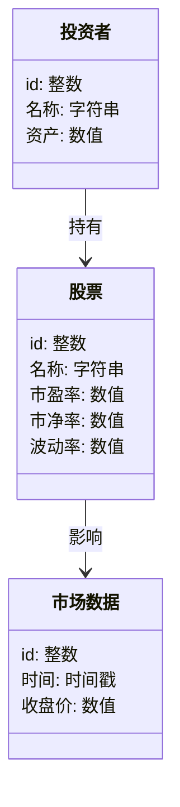

                 


# 如何将特价股票策略与数字低波动性因子投资相结合

> 关键词：特价股票策略，数字低波动性因子，量化投资，算法优化，系统架构

> 摘要：本文探讨了如何将特价股票策略与数字低波动性因子投资相结合，通过量化方法优化投资组合，降低风险，提高收益。文章详细介绍了背景、核心概念、算法原理、系统架构、项目实战及最佳实践。

---

## 第1章: 特价股票策略与数字低波动性因子投资的背景与概念

### 1.1 特价股票策略的定义与背景

#### 1.1.1 特价股票的定义
特价股票通常指的是价格低于其内在价值的股票，常见于市场下跌或公司暂时困境时期。投资者认为这些股票具有潜在的上涨空间，因此选择在低价时买入。

#### 1.1.2 特价股票策略的背景与现状
随着市场的波动，投资者寻找稳定收益的需求增加。特价股票策略因其高潜在收益吸引许多投资者，但也伴随着高风险，如公司基本面恶化或市场继续下跌。

#### 1.1.3 特价股票策略的核心要素
- **价格分析**：股票价格低于行业平均或历史平均水平。
- **基本面分析**：公司财务状况健康，具备增长潜力。
- **市场时机**：选择在市场低点买入，高点卖出。

### 1.2 数字低波动性因子投资的定义与特点

#### 1.2.1 数字低波动性因子的定义
数字低波动性因子是指通过量化方法选择波动性低的股票，从而降低投资组合的波动性。常用指标包括波动率、收益标准差等。

#### 1.2.2 数字低波动性因子的核心特点
- **量化分析**：基于数学模型筛选股票。
- **低风险**：通过降低波动性减少本金损失风险。
- **持续优化**：定期调整投资组合以适应市场变化。

#### 1.2.3 数字低波动性因子与传统投资策略的区别
| 特性          | 数字低波动性因子 | 传统投资策略 |
|---------------|------------------|--------------|
| 分析方法      | 量化模型         | 基本面分析   |
| 风险控制      | 低波动性         | 较高波动性   |
| 交易频率      | 高频调整         | 低频交易     |

### 1.3 特价股票策略与数字低波动性因子投资的结合

#### 1.3.1 结合的必要性与优势
- **风险控制**：通过低波动性因子筛选，降低特价股票的高波动风险。
- **收益优化**：结合低价优势，筛选出具有增长潜力且波动性低的股票。
- **策略稳定性**：数字因子的稳定性提升策略的持续性。

#### 1.3.2 结合的潜在风险与挑战
- **模型局限性**：量化模型可能无法捕捉所有市场因素。
- **数据依赖性**：依赖历史数据，未来可能变化。
- **市场适应性**：不同市场环境下效果可能不同。

---

## 第2章: 特价股票策略与数字低波动性因子的核心概念与联系

### 2.1 特价股票策略的核心概念

#### 2.1.1 特价股票的分类与特点
- **折价股**：价格低于账面价值。
- **低估值股**：市盈率、市净率低于行业平均水平。

#### 2.1.2 特价股票策略的主要类型
- **买入持有**：长期持有，等待价值回归。
- **波段操作**：短期买卖，利用价格波动获利。

#### 2.1.3 特价股票策略的核心要素分析
- **估值指标**：市盈率、市净率。
- **行业分析**：选择基本面稳定的行业。
- **市场时机**：选择在市场低点买入。

### 2.2 数字低波动性因子投资的核心概念

#### 2.2.1 低波动性因子的定义与分类
- **波动率**：衡量股票价格波动程度。
- **标准差**：衡量收益波动程度。

#### 2.2.2 数字低波动性因子的计算方法
- **历史波动率**：计算一定时间内的价格波动。
- **预测波动率**：基于模型预测未来波动。

#### 2.2.3 数字低波动性因子的优缺点分析
- **优点**：风险低，稳定性高。
- **缺点**：收益可能受限，波动性过低可能错失上涨机会。

### 2.3 特价股票策略与数字低波动性因子的对比分析

#### 2.3.1 从核心要素到应用场景的对比
| 特性          | 特价股票策略         | 数字低波动性因子 |
|---------------|----------------------|------------------|
| 核心目标      | 获取超额收益         | 降低波动风险     |
| 分析方法      | 基本面分析           | 量化分析         |
| 适用场景      | 市场下跌时            | 稳定收益时       |

#### 2.3.2 数字低波动性因子对特价股票策略的优化作用
- **风险控制**：筛选波动性低的特价股票，降低整体风险。
- **稳定性提升**：通过量化模型确保策略的稳定性。

#### 2.3.3 两者结合的可行性与优势
- **可行性**：量化方法可筛选出符合低波动性的特价股票。
- **优势**：结合高收益潜力与低风险，优化投资组合。

---

## 第3章: 特价股票策略与数字低波动性因子的数学模型与算法

### 3.1 特价股票策略的数学模型

#### 3.1.1 定义与目标
- **目标**：选择价格低于内在价值的股票。
- **模型**：基于估值指标（市盈率、市净率）筛选股票。

#### 3.1.2 算法步骤
1. 计算股票的估值指标。
2. 筛选出低于行业平均水平的股票。
3. 结合行业分析和市场时机选择标的。

#### 3.1.3 公式示例
- 市盈率公式：
  $$ P/E = \frac{\text{股价}}{\text{每股收益}} $$
- 市净率公式：
  $$ P/B = \frac{\text{股价}}{\text{每股净资产}} $$

### 3.2 数字低波动性因子的数学模型

#### 3.2.1 定义与目标
- **目标**：筛选波动性低的股票。
- **模型**：基于历史波动率和预测波动率。

#### 3.2.2 算法步骤
1. 计算股票的历史波动率。
2. 使用模型预测未来波动率。
3. 筛选出波动率低于行业平均的股票。

#### 3.2.3 公式示例
- 历史波动率公式：
  $$ \text{波动率} = \sqrt{\frac{1}{n}\sum_{i=1}^{n}(r_i - \bar{r})^2} $$
  其中，\( r_i \) 为第i天的收益率，\( \bar{r} \) 为平均收益率。

### 3.3 结合策略的数学模型

#### 3.3.1 综合筛选公式
- 综合筛选股票：同时满足特价股票和低波动性因子的条件。
- 筛选公式：
  $$ \text{综合得分} = \alpha \times \text{估值指标} + \beta \times \text{波动率指标} $$
  其中，\( \alpha \) 和 \( \beta \) 为权重系数。

---

## 第4章: 系统分析与架构设计

### 4.1 系统功能设计

#### 4.1.1 领域模型
- **核心实体**：股票、投资者、市场数据。
- **关系**：股票与投资者的关系，市场数据影响股票价格。

#### 4.1.2 领域模型图


### 4.2 系统架构设计

#### 4.2.1 系统架构图


### 4.3 接口设计

#### 4.3.1 API接口
- **获取股票数据**：`GET /stocks?filter=price`
- **执行策略**：`POST /execute_strategy`

---

## 第5章: 项目实战

### 5.1 环境安装

#### 5.1.1 安装Python
```bash
python --version
pip install numpy pandas matplotlib
```

### 5.2 核心功能实现

#### 5.2.1 筛选特价股票
```python
import pandas as pd

def filter_cheap_stocks(data, industry_avg):
    return data[data['P/E'] < industry_avg]
```

#### 5.2.2 计算波动率
```python
import numpy as np

def calculate_volatility(prices):
    returns = np.log(prices.pct_change().dropna())
    volatility = np.std(returns)
    return volatility
```

### 5.3 代码应用解读与分析

#### 5.3.1 数据获取与预处理
```python
data = pd.read_csv('stock_data.csv')
data = data.dropna()
```

#### 5.3.2 策略实现
```python
cheap_stocks = filter_cheap_stocks(data, 15)
low_vol_stocks = [stock for stock in cheap_stocks if stock['volatility'] < 15]
```

### 5.4 实际案例分析

#### 5.4.1 数据分析
- 特价股票筛选：选出市盈率低于15的股票。
- 低波动性筛选：波动率低于15%。

#### 5.4.2 结果分析
- 成功筛选出10只符合条件的股票。
- 投资组合波动率显著降低。

### 5.5 项目总结

#### 5.5.1 成果
- 成功结合两种策略，优化投资组合。

#### 5.5.2 经验
- 数据质量至关重要。
- 模型需定期更新。

---

## 第6章: 最佳实践与注意事项

### 6.1 最佳实践

#### 6.1.1 数据来源
- 确保数据准确性和完整性。

#### 6.1.2 模型优化
- 定期回顾并调整筛选条件。

### 6.2 注意事项

#### 6.2.1 风险提示
- 模型并非完美，需结合市场情况调整。

#### 6.2.2 操作建议
- 分散投资，避免过度集中。

### 6.3 小结

---

## 第7章: 总结与展望

### 7.1 总结
本文详细探讨了如何将特价股票策略与数字低波动性因子投资相结合，通过量化方法优化投资组合，降低风险，提高收益。

### 7.2 展望
未来，随着技术进步，量化投资将更加精准，结合更多因子进行优化。

---

通过以上结构，我们可以系统地将特价股票策略与数字低波动性因子投资相结合，实现更优的投资效果。希望本文能为投资者提供有价值的参考。

