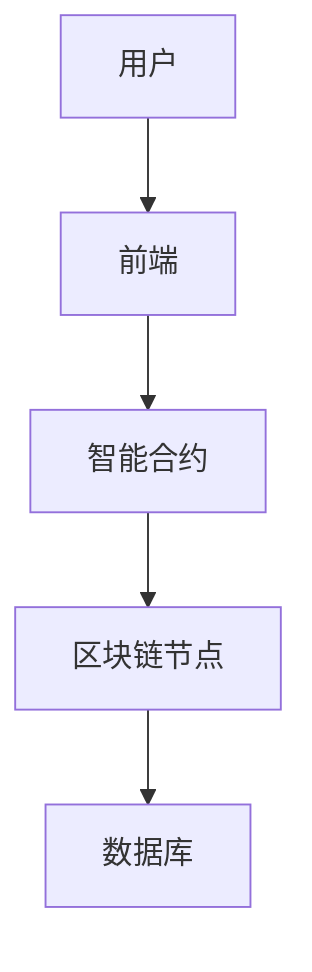

                 


# 如何将特价股票策略与数字资产代币化投资结合

> 关键词：特价股票策略，数字资产代币化，投资策略，区块链技术，量化交易

> 摘要：本文将详细探讨如何将特价股票策略与数字资产代币化投资相结合，通过区块链技术和量化交易的方法，优化投资策略，提升收益。我们将从背景、原理、算法、系统设计到项目实战，全面分析这一结合的方式和实现方法。

---

## 第一部分：特价股票策略与数字资产代币化的背景与基础

### 第1章：特价股票策略概述

#### 1.1 特价股票策略的基本概念
- **特价股票**：指价格被市场低估，具有潜在上涨空间的股票。投资者通过分析市场波动，寻找短期价格波动中的投资机会。
- **策略核心**：利用市场短期波动，低买高卖，快速获利。适用于对市场波动敏感的投资者。

#### 1.2 特价股票策略的核心思想
- 价格与价值的偏差：寻找价格低于内在价值的股票。
- 时间窗口：短期投资，抓住市场波动的机会。

#### 1.3 应用场景
- 短期市场调整：市场下跌后的反弹机会。
- 市场情绪波动：利用投资者情绪变化进行套利。

### 第2章：数字资产代币化的基础

#### 2.1 数字资产的基本概念
- **数字资产**：基于区块链技术的虚拟资产，具有去中心化、可分割、可追踪等特点。
- **代币化**：将传统资产转化为数字形式，提升流动性和透明度。

#### 2.2 代币化资产的特点与优势
- **流动性**：代币化资产易于分割和转让。
- **透明性**：区块链技术确保资产的透明和可追溯。
- **创新性**：通过智能合约实现自动化管理和交易。

#### 2.3 数字资产与传统金融资产的对比
| 特性         | 传统金融资产 | 数字资产 |
|--------------|--------------|----------|
| 流动性       | 较低         | 较高     |
| 透明性       | 较低         | 较高     |
| 交易效率     | 较低         | 较高     |
| 创新性       | 较低         | 较高     |

### 第3章：特价股票策略与数字资产代币化的结合背景

#### 3.1 当前金融市场的现状与挑战
- **传统股票交易的痛点**：低效、高成本、信息不对称。
- **数字资产市场的快速发展**：区块链技术推动金融创新，提升交易效率。

#### 3.2 数字化转型对金融行业的影响
- **交易效率提升**：区块链技术减少中间环节，降低成本。
- **投资方式革新**：代币化资产提供新的投资渠道，优化资产配置。

---

## 第二部分：特价股票策略与数字资产代币化的核心概念与联系

### 第4章：特价股票策略与数字资产代币化的核心概念

#### 4.1 特价股票策略的核心原理
- **市场分析**：利用技术分析预测价格波动。
- **交易时机选择**：通过算法寻找最佳买卖时机。

#### 4.2 数字资产代币化的核心机制
- **智能合约**：自动化执行交易，确保透明和可信。
- **代币发行**：将股票收益转化为代币形式，提升流动性。

#### 4.3 两者的结合方式
- **数据共享**：利用区块链技术记录股票价格数据，确保数据透明。
- **自动化交易**：通过智能合约实现自动化的特价股票交易。

---

## 第三部分：算法原理与数学模型

### 第5章：价格预测算法

#### 5.1 算法原理
- **模型选择**：使用LSTM（长短期记忆网络）进行时间序列预测。
- **数据预处理**：清洗和归一化股票价格数据。

#### 5.2 智能合约实现
- **以太坊平台**：使用Solidity语言编写智能合约，实现自动化的买卖交易。
- **交易逻辑**：当价格达到预设阈值时，自动执行买卖操作。

#### 5.3 代码示例
```python
import pandas as pd
import numpy as np
from sklearn.preprocessing import MinMaxScaler
from tensorflow.keras.models import Sequential
from tensorflow.keras.layers import LSTM, Dense

# 数据预处理
data = pd.read_csv('stock_prices.csv')
scaler = MinMaxScaler()
data_scaled = scaler.fit_transform(data)

# 模型构建
model = Sequential()
model.add(LSTM(128, return_sequences=True, input_shape=(1, 1)))
model.add(Dense(1))
model.compile(loss='mean_squared_error', optimizer='adam')

# 训练模型
model.fit(x_train, y_train, epochs=100, batch_size=32)
```

#### 5.4 数学模型
- **LSTM模型**：用于时间序列预测。
  $$ y_t = \sigma(W_{hh}h_{t-1} + W_{xh}x_t + b_h) $$
- **收益预测模型**：基于价格预测计算收益。
  $$ \text{收益} = \frac{\text{预测价格} - \text{当前价格}}{\text{当前价格}} \times 100\% $$

### 第6章：智能合约与量化交易

#### 6.1 智能合约实现
- **智能合约代码**（Solidity）
  ```solidity
  // SPDX-License-Identifier: MIT
  pragma solidity ^0.8.0;

  contract StockTrade {
      uint public price;
      address payable public owner;

      constructor() {
          owner = payable(msg.sender);
      }

      function setPrice(uint newPrice) public {
          price = newPrice;
      }

      function buy() payable {
          require(msg.sender != owner, "Already owned");
          owner.transfer(msg.value);
          price = msg.value;
      }

      function sell() public {
          require(msg.sender != owner, "Already owned");
          owner.transfer(address(this).balance);
      }
  }
  ```

#### 6.2 量化交易策略
- **算法逻辑**：根据LSTM模型预测的价格，触发智能合约的买卖操作。
- **代码示例**
  ```python
  def execute_trade(predicted_price, current_price):
      if predicted_price > current_price:
          buy()
      elif predicted_price < current_price:
          sell()
  ```

---

## 第四部分：系统分析与架构设计

### 第7章：系统架构设计

#### 7.1 项目背景
- **目标**：构建一个基于区块链的特价股票代币化投资平台。
- **用户角色**：投资者、交易员、系统管理员。

#### 7.2 系统功能设计
- **用户模块**：注册、登录、个人信息管理。
- **交易模块**：价格预测、智能合约交易、订单管理。
- **代币发行模块**：代币发行、转让、销毁。

#### 7.3 系统架构图


---

## 第五部分：项目实战

### 第8章：环境安装与核心实现

#### 8.1 环境安装
- **区块链平台**：安装以太坊钱包（如MetaMask）和Solidity编译器。
- **数据采集**：使用Yahoo Finance API获取股票数据。

#### 8.2 核心实现
- **数据采集**：编写Python脚本，定时抓取股票价格数据。
- **智能合约部署**：编译Solidity合约，部署到以太坊测试网。

#### 8.3 代码示例
```python
import ccxt

# 数据采集
def get_stock_price(symbol):
    exchange = ccxt.binance()
    return exchange.fetch_ticker(symbol)['bid']

# 智能合约部署
def deploy_contract():
    contract = w3.eth.contract(...)
    tx_hash = contract.functions.initialize().transact()
    receipt = w3.eth.waitForTransactionReceipt(tx_hash)
    return receipt.contractAddress
```

---

## 第六部分：总结与展望

### 第9章：总结与注意事项

#### 9.1 总结
- 通过区块链技术和量化交易，特价股票策略与数字资产代币化投资的结合，提升了交易效率和透明度。
- 智能合约的自动化交易，降低了人为干扰，优化了投资收益。

#### 9.2 注意事项
- **风险管理**：制定严格的止损策略，避免市场波动带来的损失。
- **合规性**：遵守相关法律法规，确保投资行为合法合规。

### 第10章：最佳实践与拓展阅读

#### 10.1 最佳实践
- 定期更新模型参数，适应市场变化。
- 结合多种数据源，提升预测准确性。

#### 10.2 拓展阅读
- 《区块链技术与金融创新》
- 《量化交易实战指南》

---

通过以上内容，我们详细探讨了如何将特价股票策略与数字资产代币化投资结合，从理论到实践，为投资者提供了全新的投资思路和方法。希望本文能够为读者在数字化转型中的投资决策提供有价值的参考和指导。

