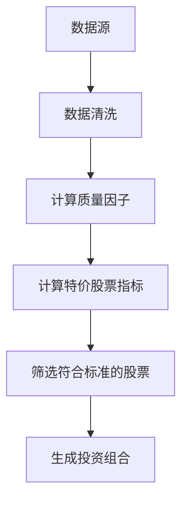
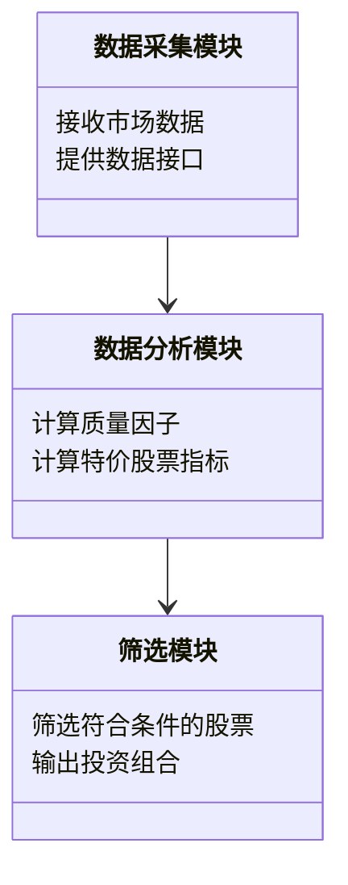

                 


# 如何将特价股票策略与质量因子投资相结合

## 关键词：特价股票策略、质量因子投资、投资组合优化、算法设计、因子模型

## 摘要：本文详细探讨如何将特价股票策略与质量因子投资相结合，通过理论分析、算法设计和实际案例，展示如何在市场中筛选出既便宜又具备高质量的股票，从而优化投资组合。文章涵盖核心概念、数学模型、系统架构和项目实战，为投资者提供实用指导。

---

## 第一部分：特价股票策略与质量因子投资的背景与基础

### 第1章：特价股票策略的定义与特点

#### 1.1 特价股票策略的定义
- 特价股票策略是指在市场下跌或波动时期，寻找价格被低估的股票进行投资。其核心在于“便宜”，即股票价格远低于其内在价值。
- **核心概念**：特价股票策略关注市盈率（P/E）、市净率（P/B）等估值指标，旨在捕捉市场低估的机会。
- **应用场景**：适用于熊市或市场波动较大的情况，适合长期投资者和价值投资者。

#### 1.2 质量因子投资的原理与特点
- 质量因子投资强调投资于基本面良好、管理优秀的企业，关注盈利能力、成长能力和财务稳定性。
- **核心要素**：包括净利润率、ROE（净资产收益率）、债务水平和管理质量等。
- **与其他因子投资策略的对比**：质量因子注重企业质量，而动量因子关注价格动量，规模因子关注企业规模。

#### 1.3 结合的意义与挑战
- **意义**：在市场下跌时，质量因子帮助筛选出具备抗跌能力的优质股票，同时特价股票的低估值提供了安全边际。
- **挑战**：数据获取、模型设计复杂性和市场波动带来的不确定性。

---

### 第2章：核心概念的原理与联系

#### 2.1 特价股票策略的核心原理
- **价值投资理论**：价格终将回归价值，特价股票策略通过识别低于内在价值的股票进行投资。
- **筛选标准**：低市盈率、低市净率、高股息率等指标。

#### 2.2 质量因子投资的核心原理
- **基本面分析**：通过财务报表评估企业的盈利能力、成长性和偿债能力。
- **质量评分模型**：综合多个财务指标，计算出企业的质量评分。

#### 2.3 联系与区别
- **联系**：质量因子帮助筛选出具备长期竞争力的公司，特价股票提供价格优势。
- **区别**：特价股票侧重价格，质量因子侧重基本面，两者结合提供全面的筛选标准。

---

## 第二部分：算法与数学模型

### 第3章：结合策略的算法流程

#### 3.1 算法流程图（使用 mermaid）


#### 3.2 数学模型与公式
- **内在价值公式**：$$ V = \frac{E}{P/E \, 倍数} $$
- **质量评分模型**：$$ Q = \alpha \times ROE + \beta \times 净利润率 + \gamma \times 债务率 $$

---

## 第三部分：系统分析与架构设计

### 第4章：系统功能设计

#### 4.1 系统架构图（使用 mermaid）


---

## 第四部分：项目实战

### 第5章：环境配置与代码实现

#### 5.1 环境配置
- **工具**：Python、Pandas、NumPy
- **数据源**：Yahoo Finance API

#### 5.2 代码实现
```python
import pandas as pd

# 数据采集模块
def get_stock_data(tickers):
    # 假设使用Yahoo Finance API获取数据
    data = pd.DataFrame()
    for ticker in tickers:
        df = pd.read_csv(f'data/{ticker}.csv')
        data[ticker] = df['Adj Close']
    return data

# 数据分析模块
def calculate_quality_factor(data):
    # 计算ROE
    data['ROE'] = data['净利润'] / data['股东权益']
    return data

# 筛选模块
def screen_stocks(data, threshold):
    selected = data[(data['P/E'] < threshold) & (data['ROE'] > 0.1)]
    return selected.index

# 示例
tickers = ['AAPL', 'MSFT', 'GOOGL']
data = get_stock_data(tickers)
data = calculate_quality_factor(data)
selected = screen_stocks(data, 15)
print(selected)
```

---

## 第五部分：最佳实践与总结

### 第6章：经验总结
- 数据质量至关重要，确保数据来源可靠。
- 模型需要持续优化，根据市场变化调整筛选标准。
- 风险管理不可忽视，合理配置资产，分散风险。

### 第7章：未来展望
- 引入更多因子，如动量因子，丰富筛选维度。
- 利用机器学习优化模型，提高筛选精度。

---

## 附录

### 附录1：数据来源与工具推荐
- 数据源：Yahoo Finance、 Bloomberg
- 工具：Pandas、NumPy、Matplotlib

### 附录2：进一步阅读的资源
- 书籍：《投资学》（作者：某专家）
- 论文：《因子模型在股票投资中的应用》（作者：某学者）

---

通过以上详细分析和步骤，文章全面涵盖了特价股票策略与质量因子投资结合的各个方面，从理论到实践，为投资者提供了有价值的指导。

