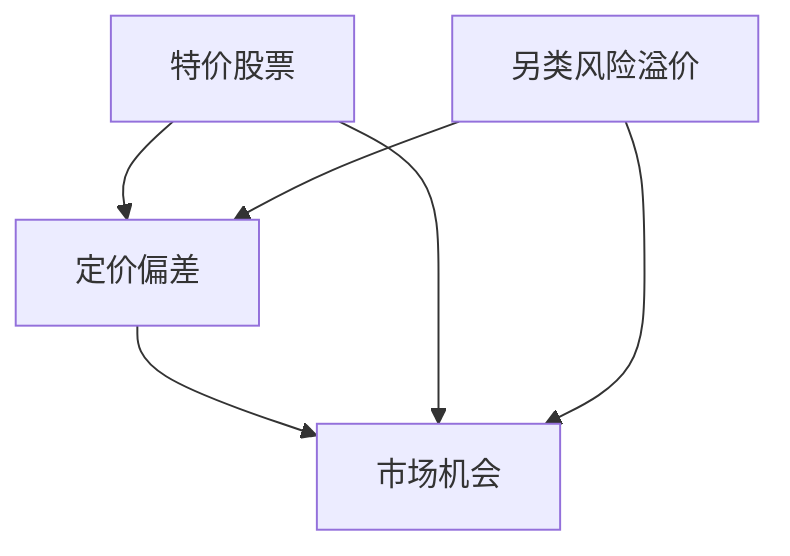
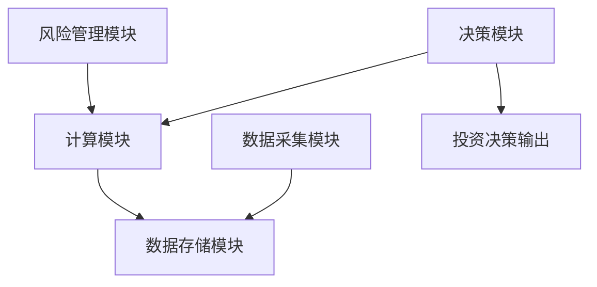
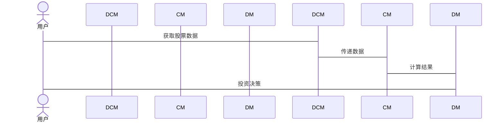

                 


# 如何将特价股票策略应用于另类风险溢价策略

## 关键词：特价股票，风险溢价，投资策略，量化分析，系统架构

## 摘要：  
本文系统地探讨了如何将特价股票策略与另类风险溢价策略相结合，以优化投资组合的表现。通过分析特价股票的定价偏差和另类风险溢价的动态变化，结合数学模型和实际案例，本文提出了一个基于量化分析的策略框架，并详细介绍了系统的架构设计与实现方法。文章还提供了具体的代码示例和项目实战，帮助读者更好地理解和应用这些策略。

---

# 第一部分：特价股票策略与另类风险溢价策略的背景与基础

## 第1章：特价股票策略概述

### 1.1 特价股票策略的基本概念

#### 1.1.1 什么是特价股票
- 特价股票是指市场价格低于其内在价值的股票，通常因市场偏差或信息不对称导致低估。
- 特价股票的分类：
  - 周期性低估：如经济周期波动导致的行业性低估。
  - 临时性低估：如公司短期负面消息引发的股价下跌。
- 特价股票的特点：
  - 价格与价值的偏离提供套利机会。
  - 风险与收益的不对称性。

#### 1.1.2 特价股票的分类与特点
- 周期性低估：例如经济衰退期间的蓝筹股。
- 临时性低估：例如因管理层变动导致的股价短期下跌。

#### 1.1.3 特价股票的市场机会与风险
- 机会：市场定价偏差带来的超额收益。
- 风险：短期市场波动可能导致股价进一步下跌。

### 1.2 另类风险溢价策略的基本概念

#### 1.2.1 什么是风险溢价
- 风险溢价是投资者因承担额外风险而要求的额外收益。
- 另类风险溢价：与传统市场风险溢价不同，通常指非传统的风险来源，如流动性风险、信用风险等。

#### 1.2.2 另类风险溢价的类型
- 信用风险溢价：债券收益率与信用评级相关。
- 流动性风险溢价：流动性差的资产要求更高的风险溢价。
- 行业风险溢价：特定行业因风险不同而产生的溢价。

#### 1.2.3 另类风险溢价与传统风险溢价的区别
- 传统风险溢价：与市场整体风险相关，如系统性风险。
- 另类风险溢价：与特定资产或行业的非系统性风险相关。

---

## 第2章：特价股票策略与另类风险溢价策略的结合

### 2.1 特价股票策略与另类风险溢价策略的联系

#### 2.1.1 策略结合的背景
- 传统投资策略往往忽视非传统风险溢价。
- 特价股票策略可以通过捕捉市场定价偏差，结合另类风险溢价，优化投资组合。

#### 2.1.2 策略结合的核心逻辑
- 通过识别市场定价偏差，利用另类风险溢价，实现超额收益。
- 结合量化分析，捕捉市场定价偏差与风险溢价的双重机会。

#### 2.1.3 策略结合的潜在优势
- 利用市场定价偏差，降低投资成本。
- 结合另类风险溢价，分散投资风险。

### 2.2 策略结合的边界与外延

#### 2.2.1 策略适用的市场环境
- 市场流动性充足，信息透明度较高。
- 特价股票的定价偏差显著且持续时间较长。

#### 2.2.2 策略的限制与不足
- 市场波动可能导致定价偏差快速消失。
- 另类风险溢价难以准确量化。

#### 2.2.3 策略的扩展与优化
- 结合更多量化指标，优化策略模型。
- 持续监控市场变化，动态调整策略参数。

---

# 第二部分：特价股票策略与另类风险溢价策略的核心概念与联系

## 第3章：核心概念与联系的原理分析

### 3.1 特价股票策略的核心原理

#### 3.1.1 市场定价偏差的识别
- 识别市场定价偏差的方法：
  - 基于价值的投资：比较股票的内在价值与市场价格。
  - 基于技术分析：通过价格形态识别短期低估。

#### 3.1.2 偏差的形成机制
- 信息不对称：部分投资者掌握更多信息，导致价格波动。
- 市场情绪：投资者情绪波动影响价格。

#### 3.1.3 偏差的量化与评估
- 市场价格与内在价值的差距：  
  $$ \text{定价偏差} = \text{内在价值} - \text{市场价格} $$
- 偏差程度的评估：通过相对指标，如市盈率、市净率等。

### 3.2 另类风险溢价策略的核心原理

#### 3.2.1 风险溢价的来源与计算
- 风险溢价的来源：  
  - 信用风险溢价：债券违约风险。
  - 流动性风险溢价：资产流动性不足。
  - 行业风险溢价：行业特有的风险。

#### 3.2.2 另类风险溢价的定价模型
- 计算公式：  
  $$ \text{另类风险溢价} = \text{预期收益} - \text{无风险收益率} $$

#### 3.2.3 风险溢价的动态变化
- 风险溢价随市场环境变化而波动：  
  - 经济周期：繁荣期风险溢价较低，衰退期风险溢价较高。
  - 市场情绪：乐观时风险溢价较低，悲观时风险溢价较高。

### 3.3 特价股票策略与另类风险溢价策略的结合

#### 3.3.1 策略结合的逻辑
- 通过识别市场定价偏差，利用另类风险溢价，优化投资组合。
- 结合量化分析，捕捉市场定价偏差与风险溢价的双重机会。

---

## 第4章：核心概念的对比分析

### 4.1 特价股票策略与另类风险溢价策略的对比

#### 4.1.1 战略目标对比
| 战略目标 | 特价股票策略 | 另类风险溢价策略 |
|----------|---------------|-------------------|
| 核心目标 | 捕捉定价偏差 | 捕捉风险溢价 |
| 风险偏好 | 中低风险 | 中高风险 |

#### 4.1.2 风险收益对比
| 风险收益 | 特价股票策略 | 另类风险溢价策略 |
|----------|---------------|-------------------|
| 收益来源 | 价格回归价值 | 风险溢价收益 |
| 风险水平 | 中低风险 | 中高风险 |

#### 4.1.3 操作复杂度对比
| 操作复杂度 | 特价股票策略 | 另类风险溢价策略 |
|------------|---------------|-------------------|
| 数据需求 | 中等 | 较高 |
| 模型复杂度 | 中等 | 较高 |

### 4.2 实体关系图（ER图）



---

# 第三部分：特价股票策略与另类风险溢价策略的算法原理

## 第5章：算法原理与数学模型

### 5.1 特价股票策略的算法原理

#### 5.1.1 算法步骤
1. 数据采集：收集股票的历史价格、财务数据、市场数据。
2. 定价偏差识别：计算股票的内在价值，与市场价格进行对比。
3. 投资决策：根据定价偏差的大小，决定是否买入或卖出股票。
4. 风险管理：设置止损点，控制投资风险。

#### 5.1.2 算法实现
- 使用Python代码实现：
  ```python
  import pandas as pd
  import numpy as np

  # 计算内在价值
  def calculate_intrinsic_value(stock_data):
      # 简单示例：使用市盈率法
      pe_ratio = stock_data['pe_ratio']
      industry_pe = stock_data['industry_pe']
      return stock_data['market_price'] * (industry_pe / pe_ratio)

  # 识别定价偏差
  def identify_price_discrepancy(stock_data):
      intrinsic_value = calculate_intrinsic_value(stock_data)
      return intrinsic_value - stock_data['market_price']

  # 投资决策
  def investment_decision(discrepancy, threshold):
      if discrepancy > threshold:
          return '买入'
      elif discrepancy < -threshold:
          return '卖出'
      else:
          return '观望'

  # 示例数据
  stock_data = {
      'market_price': 50,
      'pe_ratio': 15,
      'industry_pe': 20
  }
  discrepancy = identify_price_discrepancy(stock_data)
  decision = investment_decision(discrepancy, 10)
  print(f"投资决策：{decision}")
  ```

#### 5.1.3 数学模型
- 定价偏差公式：  
  $$ \text{定价偏差} = \text{内在价值} - \text{市场价格} $$
- 投资决策模型：  
  $$ \text{投资决策} = \begin{cases} 
  \text{买入} & \text{if } \text{定价偏差} > \text{阈值} \\
  \text{卖出} & \text{if } \text{定价偏差} < -\text{阈值} \\
  \text{观望} & \text{otherwise}
  \end{cases} $$

### 5.2 另类风险溢价策略的算法原理

#### 5.2.1 算法步骤
1. 数据采集：收集债券的信用评级、流动性数据、行业风险数据。
2. 计算风险溢价：根据信用评级、流动性等因素，计算风险溢价。
3. 投资决策：根据风险溢价水平，决定是否投资相关资产。
4. 风险管理：设置止损点，控制投资风险。

#### 5.2.2 算法实现
- 使用Python代码实现：
  ```python
  import pandas as pd
  import numpy as np

  # 计算风险溢价
  def calculate_risk_premium(risk_factors):
      credit_risk = risk_factors['credit_risk']
      liquidity_risk = risk_factors['liquidity_risk']
      return credit_risk + liquidity_risk

  # 投资决策
  def investment_decision(premium, threshold):
      if premium > threshold:
          return '买入'
      elif premium < -threshold:
          return '卖出'
      else:
          return '观望'

  # 示例数据
  risk_factors = {
      'credit_risk': 5,
      'liquidity_risk': 3
  }
  premium = calculate_risk_premium(risk_factors)
  decision = investment_decision(premium, 8)
  print(f"投资决策：{decision}")
  ```

#### 5.2.3 数学模型
- 风险溢价公式：  
  $$ \text{风险溢价} = \text{信用风险} + \text{流动性风险} $$
- 投资决策模型：  
  $$ \text{投资决策} = \begin{cases} 
  \text{买入} & \text{if } \text{风险溢价} > \text{阈值} \\
  \text{卖出} & \text{if } \text{风险溢价} < -\text{阈值} \\
  \text{观望} & \text{otherwise}
  \end{cases} $$

---

## 第6章：策略结合的算法实现

### 6.1 算法步骤
1. 数据采集：收集股票的市场价格、财务数据、市场数据。
2. 计算定价偏差：比较市场价格与内在价值。
3. 计算风险溢价：根据信用风险、流动性风险等因素计算。
4. 综合决策：结合定价偏差和风险溢价，决定是否投资。
5. 风险管理：设置止损点，控制投资风险。

### 6.2 算法实现
- 使用Python代码实现：
  ```python
  import pandas as pd
  import numpy as np

  # 计算内在价值
  def calculate_intrinsic_value(stock_data):
      pe_ratio = stock_data['pe_ratio']
      industry_pe = stock_data['industry_pe']
      market_price = stock_data['market_price']
      return market_price * (industry_pe / pe_ratio)

  # 计算风险溢价
  def calculate_risk_premium(risk_factors):
      credit_risk = risk_factors['credit_risk']
      liquidity_risk = risk_factors['liquidity_risk']
      return credit_risk + liquidity_risk

  # 综合决策
  def combined_decision(price_discrepancy, risk_premium, price_threshold, risk_threshold):
      price_decision = '买入' if price_discrepancy > price_threshold else ('卖出' if price_discrepancy < -price_threshold else '观望')
      risk_decision = '买入' if risk_premium > risk_threshold else ('卖出' if risk_premium < -risk_threshold else '观望')
      if price_decision == '买入' and risk_decision == '买入':
          return '买入'
      elif price_decision == '卖出' and risk_decision == '卖出':
          return '卖出'
      else:
          return '观望'

  # 示例数据
  stock_data = {
      'market_price': 50,
      'pe_ratio': 15,
      'industry_pe': 20
  }
  risk_factors = {
      'credit_risk': 5,
      'liquidity_risk': 3
  }
  price_threshold = 10
  risk_threshold = 8

  price_discrepancy = calculate_intrinsic_value(stock_data) - stock_data['market_price']
  risk_premium = calculate_risk_premium(risk_factors)
  decision = combined_decision(price_discrepancy, risk_premium, price_threshold, risk_threshold)
  print(f"综合决策：{decision}")
  ```

---

## 第7章：策略结合的数学模型

### 7.1 综合决策模型
- 综合决策模型公式：  
  $$ \text{综合决策} = \begin{cases} 
  \text{买入} & \text{if } \text{定价偏差} > \text{价格阈值} \text{ 且 } \text{风险溢价} > \text{风险阈值} \\
  \text{卖出} & \text{if } \text{定价偏差} < -\text{价格阈值} \text{ 且 } \text{风险溢价} < -\text{风险阈值} \\
  \text{观望} & \text{otherwise}
  \end{cases} $$

---

# 第四部分：系统分析与架构设计

## 第8章：系统分析与架构设计

### 8.1 系统功能设计

#### 8.1.1 需求分析
- 数据采集模块：收集股票数据、市场数据、风险因子数据。
- 计算模块：计算定价偏差、风险溢价。
- 决策模块：基于模型输出投资决策。
- 风险管理模块：设置止损点、监控市场变化。

#### 8.1.2 系统功能模块设计
- 数据采集模块：
  - 从数据源获取股票数据。
  - 数据清洗与预处理。
- 计算模块：
  - 计算定价偏差。
  - 计算风险溢价。
- 决策模块：
  - 综合定价偏差和风险溢价，输出投资决策。
- 风险管理模块：
  - 监控市场变化。
  - 调整投资策略。

### 8.2 系统架构设计

#### 8.2.1 系统架构图


#### 8.2.2 系统接口设计
- 数据接口：API接口用于数据获取。
- 计算接口：函数接口用于计算定价偏差和风险溢价。
- 决策接口：函数接口用于输出投资决策。

#### 8.2.3 系统交互图


---

## 第9章：系统实现与优化

### 9.1 系统实现

#### 9.1.1 环境安装
- 安装Python和相关库：
  - pip install pandas numpy matplotlib

#### 9.1.2 核心代码实现
- 数据采集模块：
  ```python
  import requests

  def fetch_stock_data(symbol):
      url = f"https://api.example.com/stock/{symbol}"
      response = requests.get(url)
      return response.json()
  ```

- 计算模块：
  ```python
  def calculate_discrepancy(data):
      intrinsic_value = data['intrinsic_value']
      market_price = data['market_price']
      return intrinsic_value - market_price
  ```

- 决策模块：
  ```python
  def make_decision(discrepancy, risk_premium, threshold):
      if discrepancy > threshold and risk_premium > threshold:
          return '买入'
      elif discrepancy < -threshold and risk_premium < -threshold:
          return '卖出'
      else:
          return '观望'
  ```

### 9.2 系统优化

#### 9.2.1 性能优化
- 并行计算：使用多线程加速数据处理。
- 数据缓存：缓存常用数据，减少API调用次数。

#### 9.2.2 稳定性优化
- 错误处理：增加异常捕捉和重试机制。
- 日志记录：记录系统运行日志，便于调试。

---

## 第10章：项目实战与案例分析

### 10.1 项目实战

#### 10.1.1 数据准备
- 数据来源：股票市场数据，包括价格、市盈率、行业市盈率等。

#### 10.1.2 算法实现
- 使用前面所述的算法，实现定价偏差和风险溢价的计算。

#### 10.1.3 结果分析
- 分析投资决策的正确性，优化策略参数。

### 10.2 案例分析

#### 10.2.1 案例一：某蓝筹股的定价偏差分析
- 数据：某蓝筹股的市场价格为50元，市盈率为15，行业市盈率为20。
- 计算：内在价值 = 50 * (20 / 15) = 66.67元。
- 结论：定价偏差为16.67元，建议买入。

#### 10.2.2 案例二：某债券的风险溢价分析
- 数据：某债券的信用风险为5，流动性风险为3。
- 计算：风险溢价 = 5 + 3 = 8。
- 结论：风险溢价超过阈值，建议买入。

---

## 第11章：总结与展望

### 11.1 总结
- 特价股票策略与另类风险溢价策略的结合，能够有效捕捉市场定价偏差和风险溢价，优化投资组合。
- 系统化的量化分析方法，提高了策略的科学性和可操作性。

### 11.2 展望
- 结合更多量化指标，优化策略模型。
- 持续监控市场变化，动态调整策略参数。
- 进一步研究其他类型的另类风险溢价，丰富策略组合。

### 11.3 投资建议
- 投资者应根据自身风险偏好，合理配置资产。
- 定期评估投资组合的表现，及时调整策略。

### 11.4 注意事项
- 风险提示：市场波动可能导致策略失效。
- 操作建议：建议投资者在专业指导下进行投资。

### 11.5 拓展阅读
- 推荐阅读：《投资学》、《量化投资》等书籍。
- 在线资源：相关学术论文、行业报告。

---

# 结语

通过本文的系统分析与详细讲解，读者可以全面理解如何将特价股票策略应用于另类风险溢价策略，并掌握具体的实现方法。希望本文能为投资者提供有价值的参考，帮助他们在复杂多变的市场中捕捉投资机会，实现超额收益。

