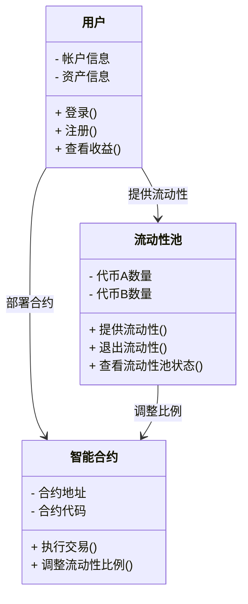

                 


# 如何将特价股票策略应用于数字资产流动性挖掘策略

> 关键词：特价股票策略，数字资产流动性挖掘，算法原理，系统架构设计，项目实战

> 摘要：本文详细探讨如何将传统的特价股票策略应用于数字资产的流动性挖掘中。通过对特价股票策略和数字资产流动性挖掘的背景介绍、核心概念、算法原理、系统架构设计以及项目实战的全面分析，帮助读者理解如何在数字资产领域中优化流动性挖掘策略，实现更高的收益。文章结合实际案例和数学模型，详细阐述了从理论到实践的每一个步骤，为读者提供了一套完整的解决方案。

---

# 第一部分: 特价股票策略与数字资产流动性挖掘的背景与基础

## 第1章: 特价股票策略与数字资产流动性挖掘概述

### 1.1 特价股票策略的定义与特点

#### 1.1.1 特价股票策略的定义
特价股票策略是一种基于市场波动性和股票价格偏离度的交易策略。投资者通过分析市场信息，寻找价格被低估的股票，以低于市场价的价格买入，期望在价格回升时卖出获利。

#### 1.1.2 特价股票策略的核心特点
- **短期性**：通常适用于短期内的价格波动，投资者在短时间内完成交易。
- **高风险**：依赖于市场的短期波动，风险较高。
- **技术驱动**：需要结合技术分析和市场数据进行决策。

#### 1.1.3 特价股票策略的优劣势分析
- **优势**：能够在短时间内获得较高的收益，适合短期投资者。
- **劣势**：风险较高，对市场敏感度要求高，需要频繁监控市场动态。

### 1.2 数字资产流动性挖掘的基本概念

#### 1.2.1 数字资产的定义与特点
数字资产是指以区块链技术为基础的虚拟货币，如比特币、以太坊等。数字资产的特点包括去中心化、匿名性、可分割性和全球性。

#### 1.2.2 流动性挖掘的定义与核心机制
流动性挖掘是指通过在去中心化交易所（DEX）提供流动性来赚取收益的过程。用户通过存入资金到流动性池中，成为交易对的提供者，从而获得交易手续费和流动性池的收益。

#### 1.2.3 数字资产流动性挖掘的常见模式
- **单边流动性挖掘**：只存入一种代币，成为流动性池中的单边流动性提供者。
- **双边流动性挖掘**：同时存入两种代币，成为流动性池中的双边流动性提供者。
- **自动做市商（AMM）模式**：通过智能合约自动调整流动性池中的代币比例，实现自动化的做市商功能。

### 1.3 特价股票策略与数字资产流动性挖掘的联系

#### 1.3.1 两者的共同点与差异点对比
| 特性                | 特价股票策略                     | 数字资产流动性挖掘             |
|---------------------|---------------------------------|-------------------------------|
| 核心目标            | 获取短期价格波动收益           | 通过提供流动性获取收益       |
| 风险特征            | 高风险，依赖市场短期波动       | 中低风险，依赖流动性池的稳定性 |
| 技术依赖            | 依赖技术分析和市场数据         | 依赖区块链技术和智能合约     |
| 适用场景            | 传统金融市场                   | 去中心化交易所（DEX）等数字资产平台 |

#### 1.3.2 数字资产流动性挖掘的独特优势
- **去中心化**：数字资产流动性挖掘基于区块链技术，去中心化的特性降低了平台被操控的风险。
- **自动化**：通过智能合约实现自动化的流动性调整，减少了人为干预的需求。
- **全球性**：数字资产流动性挖掘可以在全球范围内进行，不受地域限制。

#### 1.3.3 特价股票策略在数字资产领域的适用性分析
- **市场波动性**：数字资产市场波动性高，适合特价股票策略的应用。
- **技术实现**：数字资产的交易和流动性提供可以通过智能合约实现自动化，简化了策略的实施过程。

### 1.4 本章小结
本章通过对比特价股票策略和数字资产流动性挖掘的核心概念，分析了两者的联系与区别，为后续章节的策略优化奠定了基础。

---

## 第2章: 特价股票策略的核心原理

### 2.1 特价股票策略的数学模型

#### 2.1.1 特价股票策略的基本公式
特价股票策略的核心公式可以表示为：
$$
\text{收益} = \text{卖出价格} - \text{买入价格}
$$
其中，卖出价格和买入价格是基于市场波动和技术分析确定的。

#### 2.1.2 特价股票策略的收益计算公式
考虑市场波动和交易成本，收益计算公式可以进一步优化为：
$$
\text{净收益} = \text{卖出价格} - \text{买入价格} - \text{交易成本}
$$
其中，交易成本包括佣金、税费等。

#### 2.1.3 特价股票策略的风险评估模型
风险评估模型可以基于波动率和VaR（在险价值）进行评估：
$$
\text{VaR} = \mu + z \cdot \sigma
$$
其中，$\mu$ 是平均收益，$z$ 是标准正态分布的分位数，$\sigma$ 是收益的标准差。

### 2.2 数字资产流动性挖掘的数学模型

#### 2.2.1 数字资产流动性挖掘的基本公式
流动性挖掘的收益可以表示为：
$$
\text{收益} = \text{交易手续费} + \text{流动性池奖励}
$$
其中，交易手续费是基于交易量和流动性池中代币的比例计算得出的。

#### 2.2.2 数字资产流动性挖掘的收益计算公式
考虑流动性池的无常损失（Impermanent Loss），收益计算公式为：
$$
\text{净收益} = \text{收益} - \text{无常损失}
$$
无常损失的计算公式为：
$$
\text{无常损失} = \frac{\text{代币A数量} \cdot \text{代币B数量}}{\text{总流动性池中代币A数量} \cdot \text{总流动性池中代币B数量}}
$$

#### 2.2.3 数字资产流动性挖掘的风险评估模型
风险评估模型可以基于流动性池的波动率和无常损失进行评估，公式为：
$$
\text{风险} = \text{波动率} \times \text{无常损失}
$$

### 2.3 特价股票策略与数字资产流动性挖掘的数学模型对比

#### 2.3.1 对比分析表格
| 模型特性      | 特价股票策略                     | 数字资产流动性挖掘             |
|---------------|---------------------------------|-------------------------------|
| 收益公式       | $$\text{净收益} = \text{卖出价格} - \text{买入价格} - \text{交易成本}$$ | $$\text{净收益} = \text{收益} - \text{无常损失}$$ |
| 风险公式       | $$\text{风险} = z \cdot \sigma$$ | $$\text{风险} = \text{波动率} \times \text{无常损失}$$ |
| 参数           | 市场波动率、交易成本             | 波动率、无常损失               |

#### 2.3.2 实例分析
假设某数字资产的价格波动率为20%，无常损失为5%，则数字资产流动性挖掘的风险为：
$$
\text{风险} = 20\% \times 5\% = 1\%
$$
而特价股票策略的风险评估中，假设平均收益为10%，标准差为20%，则VaR为：
$$
\text{VaR} = 10\% + 1.28 \times 20\% = 35.6\%
$$

### 2.4 本章小结
本章通过数学模型对比，分析了特价股票策略和数字资产流动性挖掘的收益与风险差异，为后续策略优化提供了理论依据。

---

## 第3章: 数字资产流动性挖掘的算法原理

### 3.1 数字资产流动性挖掘的核心算法

#### 3.1.1 流动性挖掘算法的定义
流动性挖掘算法是基于智能合约实现的自动化交易算法，通过动态调整流动性池中的代币比例，以最大化收益并降低无常损失。

#### 3.1.2 流动性挖掘算法的核心步骤
1. 数据采集与处理：采集市场数据，包括代币价格、交易量等。
2. 算法选择：根据市场数据选择合适的流动性提供策略。
3. 智能合约部署：通过智能合约自动调整流动性池中的代币比例。
4. 收益计算与优化：根据实际收益动态调整算法参数。

#### 3.1.3 流动性挖掘算法的优化方法
- **参数优化**：通过历史数据回测，优化流动性池中代币比例。
- **动态调整**：根据市场波动实时调整流动性池的代币比例。
- **风险管理**：设置止损和止盈机制，降低无常损失。

### 3.2 数字资产流动性挖掘的实现流程

#### 3.2.1 数据采集与预处理
- 数据源：从交易所API获取实时市场数据。
- 数据清洗：去除异常数据，填补缺失值。

#### 3.2.2 算法选择与实现
- 算法选择：基于波动率和无常损失选择合适的流动性挖掘算法。
- 算法实现：通过Python编写算法代码，并部署到智能合约中。

#### 3.2.3 系统架构设计
- **前端界面**：用户可以通过Web界面查看流动性池的状态和收益。
- **后端逻辑**：通过Python编写数据处理和算法逻辑。
- **智能合约**：部署到区块链上，实现自动化的流动性调整。

### 3.3 本章小结
本章详细介绍了数字资产流动性挖掘的核心算法和实现流程，为后续的系统设计和项目实战奠定了基础。

---

## 第4章: 系统分析与架构设计方案

### 4.1 项目介绍
本项目旨在将特价股票策略应用于数字资产流动性挖掘中，通过优化算法和系统架构设计，提高流动性挖掘的收益和稳定性。

### 4.2 系统功能设计

#### 4.2.1 领域模型Mermaid类图


### 4.3 系统架构设计

#### 4.3.1 系统架构Mermaid图


### 4.4 系统接口设计

#### 4.4.1 API接口设计
- **用户接口**：
  - `POST /login`: 用户登录
  - `POST /register`: 用户注册
  - `GET /pool_status`: 获取流动性池状态
- **流动性池接口**：
  - `POST /add_liquidity`: 提供流动性
  - `POST /remove_liquidity`: 退出流动性
  - `GET /calculate_yield`: 计算收益

#### 4.4.2 系统交互流程
1. 用户登录系统，进入流动性池界面。
2. 用户选择代币对，输入流动性提供量。
3. 系统通过智能合约自动调整流动性池中的代币比例。
4. 用户可以通过界面查看收益和流动性池状态。

### 4.5 本章小结
本章通过系统架构设计和接口设计，展示了如何将特价股票策略应用于数字资产流动性挖掘的系统实现中。

---

## 第5章: 项目实战

### 5.1 环境安装
- **Python环境**：安装Python 3.8及以上版本。
- **区块链开发环境**：安装Solidity编译器和以太坊节点。
- **交易所API**：注册并获取API密钥。

### 5.2 系统核心实现源代码

#### 5.2.1 数据处理代码
```python
import requests
import pandas as pd

def get_market_data():
    response = requests.get('https://api.example.com/market_data')
    data = response.json()
    df = pd.DataFrame(data)
    return df
```

#### 5.2.2 算法实现代码
```python
def liquidity_mining_strategy(data):
    # 数据处理逻辑
    pass

def deploy_contract():
    # 智能合约部署逻辑
    pass
```

### 5.3 实际案例分析

#### 5.3.1 案例背景
假设用户选择在以太坊和比特币的流动性池中提供流动性，初始投入价值100万美元。

#### 5.3.2 算法实现与优化
- 数据采集：通过交易所API获取以太坊和比特币的实时价格和交易量。
- 算法选择：基于波动率和无常损失选择最优的流动性提供比例。
- 智能合约部署：通过Solidity编写智能合约，并部署到以太坊网络。

#### 5.3.3 收益与风险分析
- **收益**：假设流动性池的交易手续费和奖励合计为5%，无常损失为2%，则净收益为：
  $$
  \text{净收益} = 5\% - 2\% = 3\%
  $$
- **风险**：假设市场波动率为15%，则VaR为：
  $$
  \text{VaR} = 10\% + 1.28 \times 15\% = 34.2\%
  $$

### 5.4 本章小结
本章通过实际案例分析，展示了如何在数字资产流动性挖掘中应用特价股票策略，并通过数学模型和算法优化实现收益最大化和风险控制。

---

## 第6章: 最佳实践与总结

### 6.1 小结
通过本文的分析，我们了解了如何将特价股票策略应用于数字资产流动性挖掘中。通过数学模型和算法优化，可以在数字资产领域实现更高的收益和更低的风险。

### 6.2 注意事项
- **风险管理**：在实际应用中，需注意无常损失和市场波动带来的风险。
- **算法优化**：根据市场变化动态调整算法参数，以适应不同的市场环境。
- **合规性**：确保流动性挖掘活动符合相关法律法规和平台规定。

### 6.3 拓展阅读
- **相关书籍**：《加密货币交易策略与算法》
- **技术博客**：CoinMarketCap官方博客
- **在线课程**：Coursera上的《区块链与数字资产课程》

### 6.4 本章总结
本文通过理论分析和实际案例，展示了如何将特价股票策略应用于数字资产流动性挖掘中。通过数学模型和系统设计，帮助读者实现收益最大化和风险控制。

---

# 结语
通过本文的详细分析和步骤讲解，读者可以将特价股票策略成功应用于数字资产流动性挖掘中。希望本文的内容能为读者提供有价值的参考，帮助他们在数字资产领域实现更高的收益和更优的风险管理。

