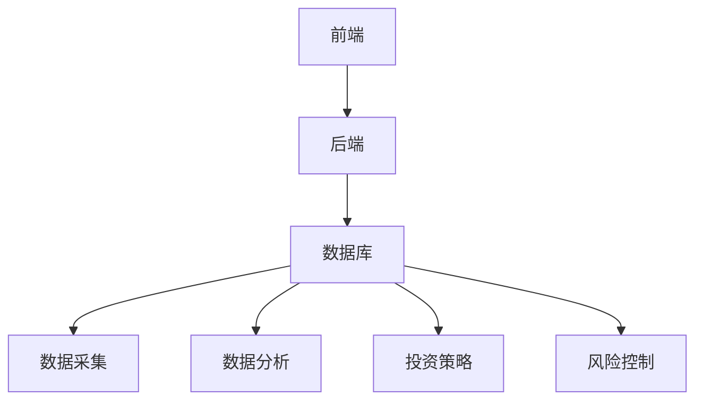

                 


# 如何将特价股票策略应用于跨元宇宙资产(CMA)投资

> 关键词：特价股票策略、跨元宇宙资产、投资策略、系统架构、算法原理

> 摘要：本文将详细探讨如何将传统的特价股票策略应用于跨元宇宙资产(CMA)投资中。通过分析特价股票策略的核心原理，结合跨元宇宙资产的特点，提出一套适用于CMA投资的策略，并通过系统架构设计、数学模型构建和实际案例分析，为投资者提供科学的指导。

---

# 第一部分: 特价股票策略与跨元宇宙资产投资基础

## 第1章: 特价股票策略概述

### 1.1 特价股票的定义与特点

#### 1.1.1 特价股票的定义
特价股票是指市场价格显著低于其内在价值的股票。这种股票通常被视为被市场低估的投资机会，适合长期投资者或价值投资者。

#### 1.1.2 特价股票的特点
- **低估性**：市场价格低于内在价值。
- **低流动性**：部分特价股票可能流动性较差，导致价格波动较大。
- **高风险性**：低估的股票可能隐藏着较高的风险，如公司基本面恶化。

#### 1.1.3 特价股票与普通股票的区别
| 属性         | 特价股票         | 普通股票         |
|--------------|------------------|------------------|
| 价格         | 低于内在价值     | 接近或高于内在价值 |
| 投资策略     | 价值投资为主     | 短期交易为主     |
| 风险         | 较高             | 较低             |

### 1.2 特价股票策略的制定与实施

#### 1.2.1 策略制定的基本原则
- **基本面分析**：研究公司的财务状况、盈利能力、行业地位等。
- **市场分析**：分析市场趋势、宏观经济环境等。
- **风险控制**：设定止损点和止盈点。

#### 1.2.2 策略实施的关键步骤
1. **识别低估股票**：通过市盈率（P/E）、市净率（P/B）等指标筛选。
2. **分析公司基本面**：评估公司的盈利能力、成长性等。
3. **制定交易计划**：确定买入和卖出时机。
4. **风险管理**：分散投资、设置止损。

#### 1.2.3 策略的优缺点分析
- **优点**：潜在高回报、适合长期投资。
- **缺点**：流动性差、风险较高。

---

## 第2章: 跨元宇宙资产(CMA)投资概述

### 2.1 跨元宇宙资产的定义与特点

#### 2.1.1 跨元宇宙资产的定义
跨元宇宙资产（CMA）指的是存在于多个虚拟世界或元宇宙平台中的数字资产，如虚拟货币、NFTs、虚拟土地等。

#### 2.1.2 跨元宇宙资产的特点
- **多样性**：涵盖多种类型，如虚拟货币、NFTs等。
- **跨平台性**：资产可以在多个元宇宙平台中流通。
- **高波动性**：价格波动较大，受市场情绪影响显著。

#### 2.1.3 跨元宇宙资产与传统资产的区别
| 属性         | 跨元宇宙资产       | 传统资产         |
|--------------|--------------------|------------------|
| 资产类型     | 数字资产           | 实物资产         |
| 流动性       | 高                 | 中低             |
| 风险         | 高                 | 中低             |

### 2.2 跨元宇宙资产投资的潜力与挑战

#### 2.2.1 跨元宇宙资产投资的潜力
- **高增长性**：元宇宙市场的快速发展带来了巨大的投资机会。
- **多样性**：投资者可以根据市场需求选择不同类型资产。

#### 2.2.2 跨元宇宙资产投资的挑战
- **高波动性**：价格波动较大，风险较高。
- **监管不确定性**：数字资产的监管政策尚不明确。

#### 2.2.3 跨元宇宙资产投资的未来发展趋势
- **技术驱动**：区块链技术的进步将推动CMA的发展。
- **机构化**：更多机构投资者进入CMA市场。

---

# 第二部分: 特价股票策略在跨元宇宙资产投资中的应用

## 第3章: 特价股票策略在跨元宇宙资产投资中的适应性

### 3.1 特价股票策略与跨元宇宙资产投资的契合点

#### 3.1.1 跨元宇宙资产市场的波动性与特价股票策略
- CMA市场的高波动性为特价股票策略提供了机会，投资者可以通过价格波动获利。

#### 3.1.2 跨元宇宙资产市场的信息不对称与特价股票策略
- 信息不对称可能导致部分CMA资产被市场低估，适合价值投资者。

#### 3.1.3 跨元宇宙资产市场的流动性与特价股票策略
- 部分CMA资产流动性较低，适合长期投资者。

### 3.2 特价股票策略在跨元宇宙资产投资中的具体应用

#### 3.2.1 跨元宇宙资产市场的特价股票识别方法
- **基本面分析**：评估公司的财务状况、盈利能力。
- **市场分析**：分析市场趋势、宏观经济环境。
- **技术分析**：通过K线图、成交量等技术指标判断买入时机。

#### 3.2.2 跨元宇宙资产市场的特价股票投资策略
- **价值投资**：寻找被低估的CMA资产。
- **趋势投资**：跟随市场趋势进行投资。
- **分散投资**：降低风险。

#### 3.2.3 跨元宇宙资产市场的特价股票风险管理
- **止损策略**：设定止损点，避免重大损失。
- **分散投资**：通过投资不同类型的CMA资产分散风险。

---

## 第4章: 跨元宇宙资产市场中的特价股票投资策略

### 4.1 跨元宇宙资产市场中的特价股票识别与选择

#### 4.1.1 跨元宇宙资产市场中的特价股票识别标准
- **市盈率（P/E）**：低于行业平均水平。
- **市净率（P/B）**：低于行业平均水平。
- **盈利能力**：净利润率较高。

#### 4.1.2 跨元宇宙资产市场中的特价股票选择方法
- **筛选法**：通过指标筛选出潜在的特价股票。
- **基本面分析**：进一步分析公司的财务状况。
- **市场分析**：评估市场趋势和公司前景。

#### 4.1.3 跨元宇宙资产市场中的特价股票评估指标
| 指标         | 公式             | 作用             |
|--------------|------------------|------------------|
| 市盈率       | P/E = 价格/每股收益 | 评估股票的估值     |
| 市净率       | P/B = 价格/每股净资产 | 评估股票的资产价值   |
| 净利润率     | 净利润/收入       | 评估公司的盈利能力   |

### 4.2 跨元宇宙资产市场中的特价股票投资策略

#### 4.2.1 跨元宇宙资产市场的特价股票买入时机选择
- **低估阶段**：当股票价格低于内在价值时买入。
- **市场下跌阶段**：在市场下跌时寻找被低估的股票。

#### 4.2.2 跨元宇宙资产市场的特价股票持有策略
- **长期持有**：等待股票价格回升至合理价值。
- **定期评估**：定期评估股票的价值，及时调整投资组合。

#### 4.2.3 跨元宇宙资产市场的特价股票卖出时机选择
- **价值恢复阶段**：当股票价格接近内在价值时卖出。
- **市场上涨阶段**：在市场上涨时卖出高价股票。

---

## 第5章: 跨元宇宙资产市场中的特价股票投资案例分析

### 5.1 案例一: 跨元宇宙资产市场中的特价股票投资成功案例

#### 5.1.1 案例背景
- **公司名称**：XYZ虚拟货币公司。
- **行业地位**：领先的虚拟货币发行商。
- **财务状况**：净利润率较高，市盈率低于行业平均水平。

#### 5.1.2 投资策略
- **买入时机**：公司发布新产品，市场预期较高，但股价未明显上涨。
- **卖出时机**：新产品推出后，股价上涨至合理价值。

#### 5.1.3 投资结果
- **收益率**：30%。

### 5.2 案例二: 跨元宇宙资产市场中的特价股票投资失败案例

#### 5.2.1 案例背景
- **公司名称**：ABC虚拟土地公司。
- **行业地位**：新兴的虚拟土地开发商。
- **财务状况**：净利润率较低，市盈率显著低于行业平均水平。

#### 5.2.2 投资策略
- **买入时机**：公司推出新项目，市场预期较高。
- **卖出时机**：市场对新项目反应冷淡，股价持续下跌。

#### 5.2.3 投资结果
- **收益率**：-20%。

---

## 第6章: 跨元宇宙资产市场中的特价股票投资实战

### 6.1 系统架构设计

#### 6.1.1 项目介绍
- **项目名称**：跨元宇宙资产投资系统。
- **项目目标**：实现跨元宇宙资产的实时监控、数据分析、投资策略制定等功能。

#### 6.1.2 系统功能设计
- **功能模块**：
  1. 数据采集模块：采集CMA市场的实时数据。
  2. 数据分析模块：分析数据并识别潜在的特价股票。
  3. 投资策略模块：制定并执行投资策略。
  4. 风险控制模块：实时监控并调整投资组合。

#### 6.1.3 系统架构设计


### 6.2 算法原理

#### 6.2.1 算法原理
- **算法名称**：基于低估指标的CMA资产识别算法。
- **算法步骤**：
  1. 数据采集：采集CMA市场的实时数据。
  2. 数据筛选：通过市盈率、市净率等指标筛选出潜在的特价股票。
  3. 数据分析：分析公司基本面、市场趋势等。
  4. 投资策略制定：根据分析结果制定买入和卖出策略。

#### 6.2.2 算法实现
```python
import pandas as pd

# 数据采集
data = pd.read_csv('cma_data.csv')

# 数据筛选
data['P/E'] = data['价格'] / data['每股收益']
data['P/B'] = data['价格'] / data['每股净资产']
selected = data[(data['P/E'] < data['P/E'].mean()) & (data['P/B'] < data['P/B'].mean())]

# 数据分析
selected.to_csv('selected_stocks.csv', index=False)
```

---

## 第7章: 总结与展望

### 7.1 总结
本文详细探讨了如何将特价股票策略应用于跨元宇宙资产投资中，提出了适用于CMA市场的投资策略，并通过案例分析和系统设计为投资者提供了科学的指导。

### 7.2 注意事项
- **风险提示**：CMA市场的高波动性可能导致重大损失。
- **投资建议**：投资者应根据自身风险承受能力制定投资策略。

### 7.3 未来研究方向
- **技术驱动**：研究区块链技术对CMA市场的进一步影响。
- **机构化**：探索机构投资者在CMA市场的角色和作用。

---

通过本文的分析，投资者可以更好地理解如何在跨元宇宙资产市场中应用特价股票策略，抓住投资机会，实现财富增长。

