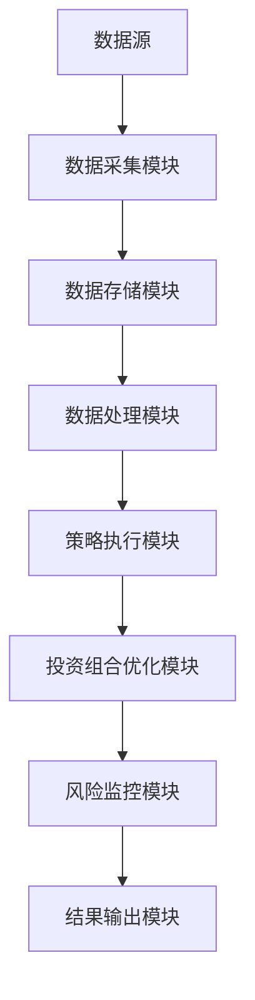

                 


# 如何将特价股票策略融入多元化数字资产对冲组合

> 关键词：特价股票策略，数字资产对冲，风险管理，投资组合优化，数学模型，算法设计，Python实现

> 摘要：本文将详细介绍如何将特价股票策略融入多元化数字资产对冲组合。通过分析特价股票策略的核心原理、数字资产对冲组合的构建逻辑以及两者结合的数学模型，本文将深入探讨如何利用技术手段优化投资组合，降低风险，提高收益。文章还将通过实际案例分析和Python代码实现，帮助读者更好地理解和应用相关策略。

---

## 第1章: 特价股票策略概述

### 1.1 特价股票策略的定义与特点

#### 1.1.1 特价股票的定义
特价股票是指在特定市场条件下，以低于市场公允价值的价格买入的股票。这种策略通常基于市场波动、公司基本面变化或短期市场情绪等因素。

#### 1.1.2 特价股票的核心特点
- **低买高卖**：特价股票策略的核心在于以低于市场价买入，待价格上涨后卖出获利。
- **高风险高收益**：由于依赖市场短期波动，特价股票策略的风险较高，但潜在收益也较大。
- **短期交易**：特价股票策略通常适用于短期交易，投资者需要快速捕捉市场机会。

#### 1.1.3 特价股票与普通股票的区别
| 特性 | 特价股票 | 普通股票 |
|------|----------|----------|
| 买入价 | 低于市场价 | 市场价或接近市场价 | 
| 交易周期 | 短期 | 中长期 |
| 风险 | 高 | 中低 |
| 收益 | 高 | 稳定 |

### 1.2 数字资产对冲组合的原理

#### 1.2.1 数字资产的定义与分类
数字资产是指以数字形式存在的资产，包括比特币、以太坊等加密货币，以及一些区块链代币。数字资产具有去中心化、匿名性和高波动性的特点。

#### 1.2.2 对冲组合的基本原理
对冲组合是指通过组合不同资产，利用它们之间的负相关性或低相关性，降低整体投资组合的风险。数字资产对冲组合的核心在于分散风险，通过配置不同类型的数字资产来抵消市场波动带来的影响。

#### 1.2.3 数字资产对冲组合的优势
- **分散风险**：通过配置不同类型数字资产，降低单一资产波动带来的风险。
- **捕捉市场机会**：利用数字资产的高波动性，捕捉市场上涨机会。
- **对冲市场下跌**：通过配置负相关的资产，对冲整体市场下跌的风险。

### 1.3 特价股票策略与数字资产对冲的结合意义

#### 1.3.1 特价股票策略在投资组合中的作用
- **提高收益**：通过捕捉市场低估的机会，提升整体投资组合的收益。
- **降低风险**：通过短期交易，避免长期持有的市场下跌风险。

#### 1.3.2 数字资产对冲组合的风险管理
- **波动性对冲**：利用数字资产的高波动性，对冲股票市场的波动。
- **资产配置优化**：通过配置不同类型的数字资产，优化投资组合的风险收益比。

---

## 第2章: 特价股票策略与数字资产对冲的核心概念与联系

### 2.1 特价股票策略的核心概念

#### 2.1.1 特价股票的市场定位
特价股票通常出现在市场下跌或公司基本面恶化的情况下，投资者可以通过技术分析或基本面分析找到潜在的特价股票。

#### 2.1.2 特价股票的市场参与者
- **机构投资者**：大型机构通过大宗交易买入特价股票。
- **散户投资者**：普通投资者通过股票交易平台参与特价股票交易。

#### 2.1.3 特价股票的市场周期
- **市场下跌周期**：特价股票策略的机会较多。
- **市场上涨周期**：特价股票策略的机会较少，但可以通过短期回调捕捉机会。

### 2.2 数字资产对冲组合的核心概念

#### 2.2.1 数字资产的分类与特征
数字资产可以分为以下几类：
- **加密货币**：如比特币、以太坊。
- **实用代币**：用于特定应用场景的代币。
- **安全代币**：代表传统资产的数字凭证。

#### 2.2.2 对冲组合的构建逻辑
对冲组合的核心在于利用不同资产之间的相关性，通过数学优化模型构建最优投资组合。以下是数字资产对冲组合的构建步骤：

1. **数据收集**：收集数字资产的历史价格数据。
2. **相关性分析**：分析不同数字资产之间的相关性。
3. **优化模型构建**：使用数学优化模型（如均值-方差模型）构建最优投资组合。
4. **风险对冲**：通过配置负相关的资产，降低整体投资组合的风险。

### 2.3 特价股票与数字资产对冲的联系

#### 2.3.1 投资组合的分散化
通过将特价股票与数字资产结合起来，投资者可以利用股票市场的低估机会和数字资产的高波动性，实现投资组合的分散化。

#### 2.3.2 风险对冲
数字资产的高波动性可以对冲股票市场的系统性风险，同时特价股票的短期交易可以对冲数字资产的高波动性。

---

## 第3章: 特价股票策略与数字资产对冲的数学模型与算法

### 3.1 特价股票策略的数学模型

#### 3.1.1 特价股票的定价模型
特价股票的定价可以通过以下公式计算：
$$ P = \text{市场价} \times (1 - \alpha) $$
其中，$\alpha$ 是折扣率，通常在0到1之间。

#### 3.1.2 特价股票的风险评估模型
风险评估可以通过波动率和相关性分析来衡量。波动率越高，风险越大；相关性越高，风险分散效果越差。

#### 3.1.3 特价股票的收益预测模型
收益预测可以通过历史数据分析和回归分析来实现。

### 3.2 数字资产对冲组合的优化算法

#### 3.2.1 均值-方差优化模型
均值-方差优化模型是构建最优投资组合的经典模型，其目标是最小化投资组合的波动率，同时最大化预期收益。数学表达式如下：
$$ \min_{w} w^T \Sigma w $$
$$ \text{subject to} \quad w^T \mu = \text{target return} $$
其中，$w$ 是投资权重向量，$\Sigma$ 是协方差矩阵，$\mu$ 是收益向量。

#### 3.2.2 马科维茨优化算法
马科维茨优化算法是均值-方差优化模型的具体实现，可以通过以下步骤完成：
1. **数据收集**：收集数字资产的历史价格数据。
2. **计算均值和协方差**：计算数字资产的预期收益和协方差矩阵。
3. **优化求解**：使用优化算法求解最优投资权重。
4. **风险对冲**：通过调整投资权重，对冲整体投资组合的风险。

---

## 第4章: 特价股票策略与数字资产对冲的系统分析与架构设计方案

### 4.1 问题场景介绍

#### 4.1.1 投资者需求
投资者希望通过特价股票策略和数字资产对冲组合，实现投资收益的最大化，同时降低投资风险。

#### 4.1.2 问题描述
如何将特价股票策略与数字资产对冲组合相结合，构建一个高效的投资组合优化系统。

### 4.2 项目介绍

#### 4.2.1 系统目标
- 优化投资组合的风险收益比。
- 提高投资收益。
- 降低市场波动带来的风险。

#### 4.2.2 系统功能设计
- 数据采集模块：收集股票和数字资产的历史价格数据。
- 策略执行模块：根据优化算法生成投资策略。
- 风险监控模块：实时监控投资组合的风险指标。

### 4.3 系统架构设计

#### 4.3.1 系统架构图


#### 4.3.2 接口设计
- 数据采集模块接口：提供数据导入和数据清洗功能。
- 策略执行模块接口：提供策略生成和策略执行功能。
- 风险监控模块接口：提供实时风险监控和风险预警功能。

---

## 第5章: 特价股票策略与数字资产对冲的项目实战

### 5.1 环境安装

#### 5.1.1 Python环境安装
- 安装Python 3.x。
- 安装必要的库：numpy、pandas、scipy、matplotlib。

#### 5.1.2 数据源获取
- 通过Yahoo Finance获取股票数据。
- 通过CoinMarketCap获取数字资产数据。

### 5.2 系统核心实现

#### 5.2.1 数据处理模块
```python
import pandas as pd
import numpy as np

# 获取股票数据
def get_stock_data(ticker):
    df = pd.DataFrame(ticker.data)
    return df

# 获取数字资产数据
def get_asset_data(asset):
    df = pd.DataFrame(asset.data)
    return df
```

#### 5.2.2 优化模型实现
```python
import scipy.optimize as optimize

def optimize_portfolio(returns, cov_matrix):
    n = len(returns)
    # 约束条件：投资权重之和为1
    constraints = {'type': 'eq', 'fun': lambda x: np.sum(x) - 1}
    # 目标函数：最小化波动率
    def objective(x):
        return np.dot(x.T, np.dot(cov_matrix, x))
    # 使用SLSQP算法求解
    result = optimize.minimize(objective, np.ones(n)/n, method='SLSQP', constraints=constraints)
    return result.x
```

### 5.3 实际案例分析

#### 5.3.1 案例介绍
假设我们有两只股票和一只数字资产（比特币），目标是通过优化算法构建一个最优的投资组合。

#### 5.3.2 数据分析与优化
通过历史数据分析，计算出三者的协方差矩阵和预期收益，然后使用优化算法求解最优投资权重。

### 5.4 项目小结

#### 5.4.1 项目成果
通过优化算法，构建了一个高效的投资组合，实现了风险与收益的最优平衡。

#### 5.4.2 经验总结
- 数据质量对优化结果影响较大。
- 算法选择和参数设置需要根据实际情况调整。
- 风险监控是投资组合管理的重要环节。

---

## 第6章: 特价股票策略与数字资产对冲的最佳实践

### 6.1 小结

#### 6.1.1 核心要点回顾
- 特价股票策略的核心在于捕捉市场低估机会。
- 数字资产对冲组合的核心在于分散风险。
- 两者的结合可以通过数学优化模型实现。

### 6.2 注意事项

#### 6.2.1 投资者需注意的风险
- 市场波动风险。
- 投资组合的流动性风险。
- 数字资产的监管风险。

#### 6.2.2 操作建议
- 选择合适的数字资产。
- 定期调整投资组合。
- 加强风险监控。

### 6.3 拓展阅读

#### 6.3.1 推荐书籍
- 《投资学》（经典教材）
- 《数字资产投资指南》

#### 6.3.2 推荐工具
- Python的量化交易框架（如Zipline、Backtrader）。
- 数字资产数据分析工具（如Pandas、NumPy）。

---

## 第7章: 总结

通过本文的详细介绍，我们了解了如何将特价股票策略融入多元化数字资产对冲组合。从理论分析到实际操作，从数学模型到系统实现，我们展示了如何利用技术手段优化投资组合，降低风险，提高收益。希望本文能为投资者提供有价值的参考和启发。

