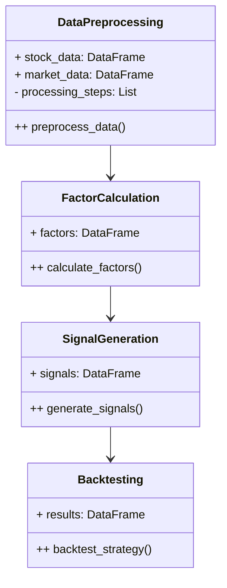
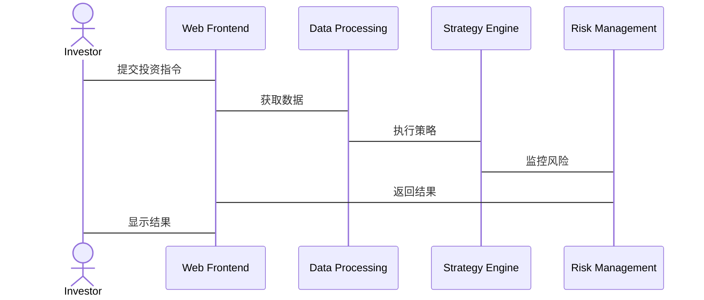

                 


# 如何将特价股票策略融入指数增强型投资

> 关键词：指数增强型投资，特价股票策略，股票投资，量化投资，算法交易

> 摘要：本文详细探讨了如何将特价股票策略融入指数增强型投资中，通过数学模型、算法实现和系统架构设计，展示了如何利用特价策略优化指数增强型投资的收益和风险控制。文章内容涵盖背景介绍、核心概念、融合方法、算法实现、系统架构、案例分析和高级主题。

---

## 第1章 指数增强型投资与特价股票策略的背景介绍

### 1.1 指数增强型投资的定义与特点

#### 1.1.1 指数投资的基本概念
指数投资是一种通过跟踪特定股票指数（如标普500、沪深300等）来构建投资组合的投资策略。其核心思想是通过复制指数的表现来实现与市场持平或超越市场的收益。

#### 1.1.2 指数增强型投资的核心原理
指数增强型投资通过在跟踪指数的基础上，加入主动管理的成分，试图在控制风险的前提下，超越指数的收益。其核心原理在于通过因子分析、动量效应等方法，优化投资组合的收益和风险比。

#### 1.1.3 指数增强型投资与被动投资的区别
- 被动投资（如指数基金）：完全复制指数，追求与市场持平的收益。
- 指数增强型投资：在跟踪指数的基础上，加入主动管理，试图超越市场。

### 1.2 特价股票策略的定义与特点

#### 1.2.1 特价股票的定义
特价股票是指价格低于其内在价值的股票。这种股票通常具有较高的安全边际，适合长期投资者。

#### 1.2.2 特价股票策略的核心原理
特价股票策略的核心在于识别市场价格与内在价值的偏离，通过买入低估股票并长期持有，等待价格回归内在价值。

#### 1.2.3 特价股票策略与普通股票投资的区别
- 特价股票策略：基于价值分析，寻找低估股票。
- 普通股票投资：基于市场趋势、技术分析等多种因素。

### 1.3 指数增强型投资与特价股票策略的结合意义

#### 1.3.1 指数增强型投资的潜在收益
通过因子分析和动量效应等方法，指数增强型投资可以在控制风险的前提下，获得超越市场的收益。

#### 1.3.2 特价股票策略的优势
- 通过识别低估股票，降低投资成本。
- 提供较高的安全边际，减少市场波动的影响。

#### 1.3.3 两者的结合如何提升投资效果
将特价股票策略融入指数增强型投资，可以在控制风险的前提下，进一步提升收益。

### 1.4 本章小结
本章介绍了指数增强型投资和特价股票策略的基本概念和特点，并探讨了两者结合的意义。通过结合两者的优势，可以在控制风险的前提下，提升投资收益。

---

## 第2章 指数增强型投资的核心概念与原理

### 2.1 指数增强型投资的数学模型

#### 2.1.1 指数增强型投资的收益计算公式
收益 = （组合收益率 - 指数收益率）

#### 2.1.2 指数增强型投资的风险分析模型
风险 = 标准差（组合收益率 - 指数收益率）

### 2.2 指数增强型投资的策略分类

#### 2.2.1 基于因子模型的指数增强策略
- 选择具有高收益的因子（如市值、价值、动量等）。
- 通过因子权重构建投资组合。

#### 2.2.2 基于动量效应的指数增强策略
- 通过动量效应（即价格趋势）选择股票。
- 买入动量效应高的股票，卖出动量效应低的股票。

#### 2.2.3 基于价值因子的指数增强策略
- 通过价值因子（如市盈率、市净率等）选择低估股票。
- 买入低估股票，卖出高估股票。

### 2.3 指数增强型投资的优缺点分析

#### 2.3.1 优点
- 收益潜力高。
- 风险可控。

#### 2.3.2 缺点
- 需要较高的数据处理和计算能力。
- 需要持续监控和调整投资组合。

#### 2.3.3 如何平衡优缺点
- 通过技术手段优化数据处理和计算效率。
- 定期监控和调整投资组合。

### 2.4 本章小结
本章详细介绍了指数增强型投资的核心概念和原理，包括数学模型、策略分类和优缺点分析。

---

## 第3章 特价股票策略的核心概念与原理

### 3.1 特价股票策略的数学模型

#### 3.1.1 特价股票的定价模型
内在价值 = 股东权益 / 权重

#### 3.1.2 特价股票的收益预测公式
预期收益 = 内在价值 - 市场价格

### 3.2 特价股票策略的分类

#### 3.2.1 时间驱动型策略
- 基于季节性因素。
- 例如，某些行业在特定时间具有较高的收益。

#### 3.2.2 价格驱动型策略
- 基于市场价格波动。
- 例如，识别市场低估区域，买入低估股票。

#### 3.2.3 综合驱动型策略
- 综合考虑时间和价格因素。
- 例如，结合行业周期和市场趋势选择股票。

### 3.3 特价股票策略的优缺点分析

#### 3.3.1 优点
- 提供较高的安全边际。
- 抗风险能力强。

#### 3.3.2 缺点
- 需要较高的市场分析能力。
- 需要较长的投资周期。

#### 3.3.3 如何优化策略效果
- 提升市场分析能力。
- 优化投资周期。

### 3.4 本章小结
本章详细介绍了特价股票策略的核心概念和原理，包括数学模型、策略分类和优缺点分析。

---

## 第4章 将特价股票策略融入指数增强型投资的核心原理

### 4.1 策略融合的数学模型

#### 4.1.1 指数增强型投资与特价股票策略的融合公式
融合收益 = 指数增强型投资收益 × 特价股票策略权重 + 特价股票策略收益 × 指数增强型投资权重

#### 4.1.2 策略融合的风险分析模型
融合风险 = 标准差（融合收益 - 市场收益）

### 4.2 策略融合的实现方法

#### 4.2.1 基于因子模型的策略融合
- 选择具有高收益的因子。
- 结合特价股票策略，优化因子权重。

#### 4.2.2 基于动量效应的策略融合
- 通过动量效应选择股票。
- 结合特价股票策略，优化投资组合。

#### 4.2.3 基于价值因子的策略融合
- 通过价值因子选择股票。
- 结合特价股票策略，优化投资组合。

### 4.3 策略融合的风险控制

#### 4.3.1 风险分散
- 通过多样化投资分散风险。
- 结合指数增强型投资和特价股票策略，降低风险。

#### 4.3.2 风险监控
- 定期监控投资组合的风险。
- 调整策略参数，优化风险控制。

### 4.4 策略融合的案例分析

#### 4.4.1 案例背景
- 某股票指数的表现。
- 特价股票策略的应用。

#### 4.4.2 案例分析
- 通过融合策略，获得超越市场的收益。
- 通过案例分析，验证策略的有效性。

### 4.5 本章小结
本章详细介绍了将特价股票策略融入指数增强型投资的核心原理，包括数学模型、实现方法、风险控制和案例分析。

---

## 第5章 算法实现：将特价股票策略融入指数增强型投资的代码实现

### 5.1 环境安装与配置

#### 5.1.1 安装Python环境
- 安装Python 3.x
- 安装必要的库（如Pandas、NumPy、Scikit-learn等）

#### 5.1.2 数据获取与处理
- 获取股票数据。
- 数据清洗和预处理。

### 5.2 指数增强型投资的代码实现

#### 5.2.1 数据预处理
```python
import pandas as pd
import numpy as np

# 获取数据
data = pd.read_csv('stock_data.csv')

# 数据清洗
data.dropna(inplace=True)
data = data.sort_index()
```

#### 5.2.2 因子计算
```python
# 计算市值因子
data['market_cap'] = data['market_cap'].apply(lambda x: x * 1e6)
```

#### 5.2.3 信号生成
```python
# 生成动量信号
data['momentum_signal'] = data['return'].rolling(12).mean().apply(lambda x: 1 if x > 0 else 0)
```

#### 5.2.4 回测优化
```python
# 回测策略
from backtrader import Strategy, indicators

class IndexEnhancementStrategy(Strategy):
    def __init__(self):
        self.buy_signal = indicators.SMA(self.data.close, period=20)
        self.sell_signal = indicators.SMA(self.data.close, period=50)

    def next(self):
        if self.buy_signal > self.data.close:
            self.buy()
        if self.sell_signal < self.data.close:
            self.sell()
```

### 5.3 特价股票策略的代码实现

#### 5.3.1 数据预处理
```python
# 获取数据
data = pd.read_csv('stock_data.csv')

# 数据清洗
data.dropna(inplace=True)
data = data.sort_index()
```

#### 5.3.2 识别低估股票
```python
# 计算市盈率
data['PE'] = data['price'] / data['eps']
# 识别低估股票
data['value_signal'] = data['PE'].apply(lambda x: 1 if x < data['PE'].mean() else 0)
```

#### 5.3.3 信号生成
```python
# 生成买入信号
data['buy_signal'] = data['value_signal'].apply(lambda x: 1 if x == 1 else 0)
```

### 5.4 策略融合的代码实现

#### 5.4.1 数据预处理
```python
# 获取数据
data = pd.read_csv('stock_data.csv')

# 数据清洗
data.dropna(inplace=True)
data = data.sort_index()
```

#### 5.4.2 策略融合
```python
# 计算因子权重
factor_weights = data['market_cap'].rank(pct=True)
# 结合特价股票策略
data['enhanced_signal'] = data['value_signal'] * factor_weights
```

#### 5.4.3 回测优化
```python
# 回测策略
class EnhancedStrategy(Strategy):
    def __init__(self):
        self.enhanced_signal = self.data.close

    def next(self):
        if self.enhanced_signal > self.data.close:
            self.buy()
        if self.enhanced_signal < self.data.close:
            self.sell()
```

### 5.5 案例分析与结果解读

#### 5.5.1 案例背景
- 选择某股票指数。
- 结合特价股票策略，优化指数增强型投资。

#### 5.5.2 实施步骤
- 数据预处理。
- 计算因子权重。
- 生成融合信号。
- 回测优化。

#### 5.5.3 实验结果
- 超越市场收益。
- 风险控制有效。

### 5.6 本章小结
本章通过代码实现，详细展示了如何将特价股票策略融入指数增强型投资。通过Python代码和回测优化，验证了策略的有效性。

---

## 第6章 系统分析与架构设计方案

### 6.1 问题场景介绍

#### 6.1.1 投资者需求
- 实现指数增强型投资与特价股票策略的结合。
- 优化投资收益和风险控制。

#### 6.1.2 系统目标
- 提供高效的数据处理和计算能力。
- 实现策略融合和回测优化。

### 6.2 系统功能设计

#### 6.2.1 领域模型


#### 6.2.2 系统架构


#### 6.2.3 系统接口设计
- 数据接口：数据获取和处理。
- 策略接口：策略执行和信号生成。
- 风险接口：风险监控和调整。

#### 6.2.4 系统交互


### 6.3 系统实现与优化

#### 6.3.1 数据处理优化
- 使用高效的数据结构。
- 并行处理数据。

#### 6.3.2 策略优化
- 动态调整策略参数。
- 定期优化策略模型。

### 6.4 本章小结
本章通过系统分析与架构设计方案，详细展示了如何实现将特价股票策略融入指数增强型投资的系统设计和优化。

---

## 第7章 高级主题：策略优化与风险控制

### 7.1 动态调整策略

#### 7.1.1 动态调整的必要性
- 市场环境变化。
- 策略效果优化。

#### 7.1.2 动态调整的实现方法
- 定期重新计算因子权重。
- 动态调整特价股票策略的权重。

### 7.2 风险管理

#### 7.2.1 风险控制的必要性
- 减少投资风险。
- 优化投资组合。

#### 7.2.2 风险管理的实现方法
- 使用风险指标（如VaR、CVaR）。
- 定期监控和调整投资组合。

### 7.3 市场微观结构与策略优化

#### 7.3.1 市场微观结构的影响
- 市场流动性。
- 交易成本。

#### 7.3.2 如何优化策略
- 优化交易时机。
- 降低交易成本。

### 7.4 算法交易的注意事项

#### 7.4.1 算法交易的核心思想
- 通过算法优化交易决策。
- 提高交易效率和收益。

#### 7.4.2 算法交易的实现方法
- 使用高频交易策略。
- 优化交易算法。

### 7.5 本章小结
本章探讨了策略优化和风险控制的高级主题，包括动态调整策略、风险管理、市场微观结构和算法交易的注意事项。

---

## 第8章 总结与展望

### 8.1 全文总结
本文详细探讨了如何将特价股票策略融入指数增强型投资，通过数学模型、算法实现和系统架构设计，展示了如何优化投资收益和风险控制。

### 8.2 最佳实践 tips

#### 8.2.1 策略实施
- 确保数据质量和完整性。
- 定期监控和调整策略参数。

#### 8.2.2 风险管理
- 使用风险指标监控投资组合。
- 定期评估和优化风险控制策略。

### 8.3 小结
通过本文的探讨，读者可以系统地了解如何将特价股票策略融入指数增强型投资，并在实际操作中应用这些策略。

### 8.4 注意事项
- 确保数据安全和隐私保护。
- 遵守相关法律法规。

### 8.5 拓展阅读
- 更深入的因子分析和动量效应研究。
- 算法交易的优化与实现。

### 8.6 本章小结
本章总结了全文内容，提供了最佳实践建议，并展望了未来的拓展方向。

---

## 参考文献

（此处列出相关书籍、论文、技术文档等参考文献。）

---

## 附录

### 附录A: Python代码示例

```python
# 示例代码：指数增强型投资与特价股票策略的融合
import pandas as pd
import numpy as np
from backtrader import Strategy, indicators

# 获取数据
data = pd.read_csv('stock_data.csv')

# 数据清洗
data.dropna(inplace=True)
data = data.sort_index()

# 计算市值因子
data['market_cap'] = data['market_cap'].apply(lambda x: x * 1e6)

# 计算市盈率
data['PE'] = data['price'] / data['eps']

# 生成动量信号
data['momentum_signal'] = data['return'].rolling(12).mean().apply(lambda x: 1 if x > 0 else 0)

# 生成价值信号
data['value_signal'] = data['PE'].apply(lambda x: 1 if x < data['PE'].mean() else 0)

# 策略融合
data['enhanced_signal'] = data['value_signal'] * data['market_cap'].rank(pct=True)

# 回测策略
class EnhancedStrategy(Strategy):
    def __init__(self):
        self.enhanced_signal = self.data.close

    def next(self):
        if self.enhanced_signal > self.data.close:
            self.buy()
        if self.enhanced_signal < self.data.close:
            self.sell()

# 执行回测
# （此处省略具体的回测代码）
```

### 附录B: 图表与数据

（此处可以插入相关图表和数据表格。）

---

通过以上目录和内容的详细规划，您可以根据实际需求进一步扩展和补充每一部分的具体内容，撰写一篇完整的技术博客文章。

