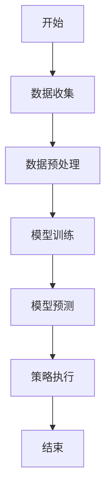
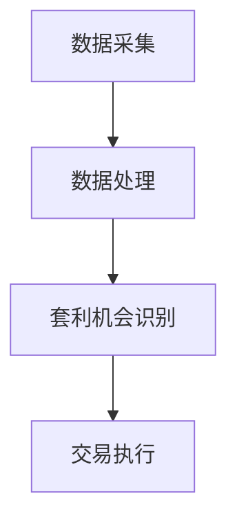

                 


# 如何构建基于特价股票的跨维度套利系统

> 关键词：特价股票，跨维度套利，算法，系统架构，技术博客

> 摘要：本文详细探讨了如何构建基于特价股票的跨维度套利系统。通过分析特价股票的定义、跨维度套利的原理，结合数学模型和算法，展示了如何利用技术手段在股票市场中寻找套利机会。文章内容涵盖背景介绍、核心概念、算法原理、系统架构设计以及实际项目实现，帮助读者全面理解并掌握构建跨维度套利系统的方法。

---

# 第一部分：背景介绍

# 第1章：特价股票与跨维度套利概述

## 1.1 特价股票的定义与特点
### 1.1.1 特价股票的定义
特价股票是指在特定市场条件下，价格显著低于市场公允价值的股票。这种价格差异通常由于市场信息不对称、交易策略差异或短期市场波动导致。

### 1.1.2 特价股票的特点
- **低价格**：特价股票的价格通常低于市场平均价格。
- **高波动性**：特价股票的价格波动较大，存在短期套利机会。
- **市场机会**：特价股票往往出现在市场低迷或特定事件驱动下。

### 1.1.3 特价股票的分类
- **行业特价股票**：特定行业内的股票价格低于市场平均水平。
- **事件驱动特价股票**：因公司公告、市场传闻等事件导致的临时性低价股票。
- **技术特价股票**：基于技术分析指标显示的低价股票。

## 1.2 跨维度套利的基本概念
### 1.2.1 套利的定义
套利是指利用不同市场或资产之间的价格差异，以低买高卖的方式获利。套利的本质是利用价格差异，通过无风险或低风险的操作实现收益。

### 1.2.2 跨维度套利的定义
跨维度套利是指在不同市场、资产类别或时间维度上，利用价格差异进行套利。跨维度套利突破了单一市场的限制，利用多维度的价格差异获取收益。

### 1.2.3 跨维度套利的原理
跨维度套利的原理是通过分析不同市场或资产之间的价格差异，寻找套利机会。这种套利方式通常涉及多个市场的价格比较，利用市场间的价格差异进行操作。

## 1.3 特价股票跨维度套利的必要性
### 1.3.1 特价股票的市场机会
特价股票的出现为投资者提供了短期套利机会。通过跨市场或跨资产的套利策略，投资者可以在特价股票中获取超额收益。

### 1.3.2 跨维度套利的优势
- **分散风险**：跨市场套利可以分散单一市场的风险。
- **捕捉价格差异**：跨维度套利能够捕捉不同市场或资产之间的价格差异。
- **提高收益**：通过跨维度操作，投资者可以利用多个市场的价格差异，提高套利收益。

### 1.3.3 特价股票套利的风险与挑战
- **市场风险**：市场波动可能导致套利失败。
- **信息不对称**：市场信息的不对称可能导致套利机会的不确定性。
- **操作复杂性**：跨市场套利需要复杂的交易系统和操作流程。

## 1.4 本章小结
本章通过介绍特价股票的定义、特点及分类，阐述了跨维度套利的基本概念和原理。同时，分析了特价股票跨维度套利的必要性及其面临的挑战。这些内容为后续章节的算法和系统设计奠定了基础。

---

# 第2章：特价股票跨维度套利的核心概念与联系

## 2.1 核心概念原理
### 2.1.1 特价股票的价格波动模型
特价股票的价格波动通常遵循随机游走模型或均值回归模型。通过分析这些模型，可以预测股票价格的变化趋势。

### 2.1.2 跨维度套利的数学模型
跨维度套利的数学模型通常基于资产定价模型（如CAPM）和套利定价理论（APT）。这些模型为套利策略提供了理论依据。

## 2.2 核心概念属性特征对比表
| 特性 | 特价股票 | 跨维度套利 |
|------|----------|------------|
| 定义 | 价格低于市场价的股票 | 在不同市场或资产间的套利机会 |
| 优势 | 低价买入 | 利用价格差异获利 |
| 风险 | 市场波动风险 | 操作复杂性风险 |

## 2.3 ER实体关系图
```mermaid
er
  actor 投资者
  actor 市场
  actor 系统
  entity 特价股票
  entity 跨维度套利机会
  entity 交易记录
  relation -[拥有]-> 投资者 -> 特价股票
  relation -[提供]-> 系统 -> 跨维度套利机会
  relation -[记录]-> 交易 -> 交易记录
```

## 2.4 本章小结
本章通过对比分析特价股票和跨维度套利的核心概念，阐述了两者的内在联系。通过ER实体关系图，展示了系统中各实体之间的关联关系，为后续的系统设计提供了数据模型参考。

---

# 第3章：特价股票跨维度套利的算法原理

## 3.1 算法原理概述
### 3.1.1 基于特价股票的价格波动预测
通过历史价格数据，利用时间序列分析方法预测股票价格的变化趋势。

### 3.1.2 跨维度套利的数学模型
跨维度套利的数学模型通常基于资产定价模型和套利定价理论。例如，利用CAPM模型计算股票的预期收益，并通过比较不同市场的预期收益差异，寻找套利机会。

## 3.2 算法流程图


## 3.3 算法实现代码
```python
import numpy as np
import pandas as pd

def predict_price(data):
    # 数据预处理
    data = data.dropna()
    # 模型训练
    model = np.polyfit(data.index, data['price'], 2)
    # 模型预测
    predicted_prices = np.polyval(model, data.index)
    return predicted_prices
```

## 3.4 数学模型与公式
### 3.4.1 价格波动模型
$$ P(t) = a t^2 + b t + c $$

### 3.4.2 套利定价理论公式
$$ E(r_i) = \beta_i E(r_m) + \alpha_i $$

## 3.5 本章小结
本章通过算法流程图和数学公式，详细介绍了特价股票跨维度套利的算法原理。通过Python代码的实现，展示了如何利用技术手段预测股票价格，并制定套利策略。

---

# 第4章：系统分析与架构设计

## 4.1 系统分析
### 4.1.1 问题场景
跨市场套利需要解决的问题包括数据获取、价格比较、套利机会识别和交易执行。

### 4.1.2 项目介绍
本项目旨在构建一个基于特价股票的跨维度套利系统，通过技术手段实现自动化的套利机会识别和交易执行。

## 4.2 系统功能设计
### 4.2.1 系统功能模块
- 数据采集模块：从多个市场获取股票数据。
- 数据处理模块：对数据进行清洗和预处理。
- 套利机会识别模块：基于算法模型识别套利机会。
- 交易执行模块：根据识别的套利机会执行交易。

### 4.2.2 系统功能流程图


## 4.3 系统架构设计
### 4.3.1 系统架构图


### 4.3.2 接口设计
- 数据接口：与多个市场数据源对接，获取实时股票数据。
- 交易接口：与交易系统对接，执行交易指令。

## 4.4 本章小结
本章通过系统分析和架构设计，展示了如何构建一个基于特价股票的跨维度套利系统。通过功能模块和架构图的绘制，明确了系统的各个组成部分及其相互关系。

---

# 第5章：项目实战

## 5.1 环境安装
### 5.1.1 安装Python
```bash
pip install python
```

### 5.1.2 安装相关库
```bash
pip install numpy pandas matplotlib
```

## 5.2 核心代码实现
### 5.2.1 数据采集
```python
import pandas as pd

def get_stock_data(tickers):
    data = pd.DataFrame()
    for ticker in tickers:
        data[ticker] = pd.read_csv(f'data/{ticker}.csv')['price']
    return data
```

### 5.2.2 套利机会识别
```python
def identify_arbitrage_opportunity(data):
    # 计算价格差异
    price_diff = data.iloc[:,0] - data.iloc[:,1]
    # 寻找套利机会
    if price_diff.min() < 0:
        return True
    else:
        return False
```

## 5.3 案例分析
### 5.3.1 案例背景
假设我们有两个市场的股票价格数据，市场A和市场B。市场A中某股票的价格为$10，市场B中同一股票的价格为$8。存在套利机会。

### 5.3.2 操作步骤
1. 数据采集：从市场A和市场B获取股票价格数据。
2. 数据处理：清洗数据，计算价格差异。
3. 套利机会识别：确认是否存在套利机会。
4. 交易执行：在市场B买入股票，在市场A卖出股票，获利$2。

## 5.4 本章小结
本章通过实际案例分析，展示了如何利用技术手段构建基于特价股票的跨维度套利系统。通过代码实现和案例分析，帮助读者理解系统的实际应用。

---

# 第6章：最佳实践、小结、注意事项和拓展阅读

## 6.1 最佳实践
- **数据来源**：选择可靠的市场数据源，确保数据的准确性和实时性。
- **风险管理**：制定合理的风险管理策略，控制套利操作的风险。
- **系统维护**：定期维护和更新系统，确保系统的稳定性和高效性。

## 6.2 小结
本文详细介绍了如何构建基于特价股票的跨维度套利系统，从背景介绍到系统设计，再到项目实战，全面覆盖了套利系统的各个方面。通过技术手段，投资者可以在特价股票中寻找套利机会，实现收益最大化。

## 6.3 注意事项
- **市场风险**：套利操作存在市场风险，需谨慎操作。
- **法律风险**：遵守相关法律法规，避免违法操作。
- **操作风险**：套利系统需要严格的测试和验证，确保系统的稳定性和可靠性。

## 6.4 拓展阅读
- 《算法交易：数学建模与实践》
- 《量化投资：基于Python的策略开发与实战》
- 《套利理论与实践》

---

# 结语

通过本文的详细讲解，读者可以全面了解如何构建基于特价股票的跨维度套利系统。从理论到实践，从系统设计到代码实现，每一步都经过精心设计和详细说明。希望本文能够为读者提供有价值的参考和启示，帮助他们在股票市场中捕捉套利机会，实现投资收益。

--- 

*Note: 以上内容为完整的技术博客文章目录和部分内容示例，具体内容可根据实际需求进行扩展和补充。*

