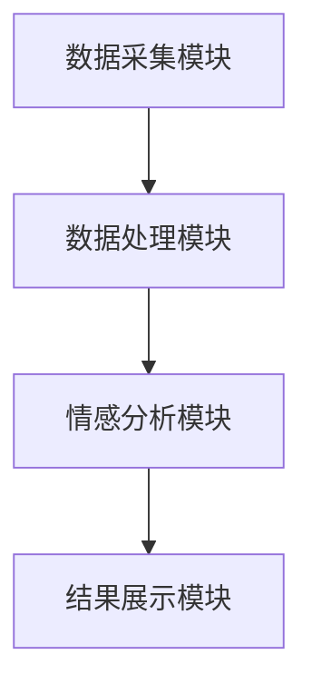
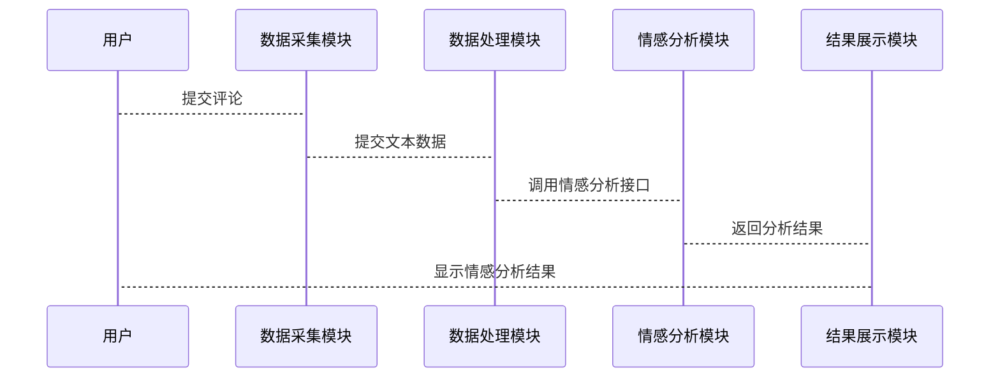

                 


# 如何评估企业的AI驱动的情感计算技术

> 关键词：情感计算，AI驱动，情感分析，机器学习，深度学习

> 摘要：本文将详细探讨如何评估企业中AI驱动的情感计算技术。通过分析情感计算的核心原理、系统架构设计、算法实现以及项目实战案例，结合实际企业应用场景，提供全面的评估方法和建议，帮助企业更好地理解和应用情感计算技术。

---

# 第1章: 情感计算技术的基本概念

## 1.1 情感计算的定义与背景

### 1.1.1 情感计算的定义
情感计算（Affective Computing）是指通过计算机技术来识别、分析和理解人类情感，进而做出相应的反应和决策的领域。它是人工智能（AI）的一个重要分支，旨在将人类的情感因素融入到技术系统中。

### 1.1.2 情感计算的应用背景
随着企业数字化转型的推进，情感计算在多个领域展现出广泛的应用潜力，例如客户关系管理、市场分析、品牌声誉监测等。通过分析用户的情感倾向，企业可以更好地理解客户需求，优化产品和服务体验。

### 1.1.3 情感计算与企业AI的关系
情感计算作为企业AI的重要组成部分，主要用于处理与人类情感相关的数据。通过结合自然语言处理（NLP）和机器学习技术，情感计算能够帮助企业从海量文本数据中提取情感信息，从而支持更精准的业务决策。

---

## 1.2 情感计算的核心技术

### 1.2.1 自然语言处理技术
自然语言处理（NLP）是情感计算的基础，主要用于理解和处理人类语言。关键的NLP技术包括文本分词、词性标注、句法分析等。

### 1.2.2 机器学习与深度学习
机器学习（ML）和深度学习（DL）是情感计算的核心算法。通过训练模型，系统能够从数据中学习情感特征，并进行分类和预测。

### 1.2.3 情感分析算法
情感分析算法是情感计算的关键，主要用于判断文本的情感倾向（如正面、负面、中性）。常用的算法包括基于规则的分类和基于模型的分类。

---

## 1.3 情感计算的主要应用领域

### 1.3.1 客户情感分析
通过分析客户评论、反馈等文本数据，帮助企业了解客户的真实需求和满意度。

### 1.3.2 品牌声誉管理
企业可以通过情感计算技术实时监测品牌声誉，及时发现和处理负面舆情。

### 1.3.3 个性化推荐系统
通过分析用户的情感倾向，推荐系统可以为用户提供更符合其喜好的产品和服务。

---

## 1.4 本章小结
本章介绍了情感计算的基本概念、核心技术以及主要应用领域。情感计算作为AI驱动的重要技术，正在为企业智能化转型提供强有力的支持。

---

# 第2章: 情感计算的核心原理与算法

## 2.1 情感分类算法概述

### 2.1.1 传统机器学习算法
传统的机器学习算法包括朴素贝叶斯（Naive Bayes）、支持向量机（SVM）等，这些算法在情感分类任务中表现良好，但其性能受限于特征工程。

### 2.1.2 深度学习算法
深度学习算法，如卷积神经网络（CNN）和循环神经网络（RNN），通过自动提取特征，能够更好地处理复杂的文本数据。

### 2.1.3 情感分析的特征提取
特征提取是情感分类的关键步骤，常用的特征包括词袋模型（Bag of Words）和词嵌入（Word Embedding）。

---

## 2.2 情感分析的数学模型

### 2.2.1 朴素贝叶斯模型
朴素贝叶斯模型是一种基于概率论的分类算法，假设特征之间相互独立，公式如下：
$$ P(y|x) = \frac{P(x|y)P(y)}{P(x)} $$
其中，$y$表示情感类别，$x$表示输入文本。

### 2.2.2 支持向量机模型
支持向量机（SVM）是一种监督学习算法，通过构建超平面将数据分为不同类别。其优化目标为：
$$ \min_{w,b} \frac{1}{2}||w||^2 $$
约束条件为：
$$ y_i(w \cdot x_i + b) \geq 1, i=1,2,...,n $$

### 2.2.3 循环神经网络模型
循环神经网络（RNN）通过处理序列数据，能够捕捉文本中的语义信息。其前向传播公式为：
$$ h_t = \tanh(W_h h_{t-1} + W_x x_t) $$

---

## 2.3 情感分析的算法实现

### 2.3.1 数据预处理
数据预处理包括文本清洗、分词、去停用词等步骤。例如，将文本转换为小写并去除标点符号。

### 2.3.2 模型训练
通过训练数据，模型学习情感特征并进行分类。训练过程通常采用梯度下降优化算法。

### 2.3.3 模型评估
模型评估采用准确率、召回率和F1值等指标。例如，准确率公式为：
$$ \text{准确率} = \frac{\text{正确分类数}}{\text{总分类数}} $$

---

## 2.4 本章小结
本章详细介绍了情感分类算法的核心原理和数学模型，包括传统机器学习算法和深度学习算法，并探讨了情感分析的实现过程。

---

# 第3章: 企业AI情感计算系统的架构设计

## 3.1 系统功能模块划分

### 3.1.1 数据采集模块
数据采集模块负责从企业内外部数据源获取文本数据，例如社交媒体评论、客户反馈等。

### 3.1.2 数据处理模块
数据处理模块对采集到的文本数据进行清洗、分词和特征提取等预处理操作。

### 3.1.3 情感分析模块
情感分析模块采用训练好的模型对文本进行情感分类，输出情感倾向和置信度。

### 3.1.4 结果展示模块
结果展示模块将分析结果以可视化形式呈现，例如生成情感趋势图和关键词云。

---

## 3.2 系统架构设计

### 3.2.1 分层架构设计
分层架构将系统划分为数据层、业务逻辑层和表现层，每层之间通过接口进行交互。

### 3.2.2 微服务架构设计
微服务架构将系统功能模块化，每个模块独立运行，便于扩展和维护。

### 3.2.3 可扩展性设计
通过分布式计算和弹性扩展技术，系统能够处理大规模数据和高并发请求。

---

## 3.3 系统接口设计

### 3.3.1 数据接口
数据接口用于与外部数据源进行交互，例如通过API获取社交媒体评论。

### 3.3.2 模型接口
模型接口用于与训练好的情感分析模型进行交互，例如调用模型进行情感分类。

### 3.3.3 用户接口
用户接口是系统的前端界面，供用户输入文本并查看分析结果。

---

## 3.4 本章小结
本章详细介绍了企业AI情感计算系统的架构设计，包括功能模块划分、系统架构设计和接口设计。

---

# 第4章: 情感计算技术的项目实战

## 4.1 项目背景与目标

### 4.1.1 项目背景
某电商平台希望通过情感计算技术分析客户评论，优化客户服务和产品推荐。

### 4.1.2 项目目标
实现客户评论的情感分析，识别客户满意度和情感倾向，支持个性化推荐。

---

## 4.2 系统功能设计

### 4.2.1 领域模型设计
领域模型设计包括用户、评论、情感倾向等核心实体及其关系。

### 4.2.2 功能模块设计
功能模块包括数据采集、数据处理、情感分析和结果展示。

### 4.2.3 用户角色设计
用户角色包括普通用户和系统管理员，分别负责数据输入和系统维护。

---

## 4.3 系统架构实现

### 4.3.1 系统架构图


### 4.3.2 模块交互设计


### 4.3.3 代码实现
以下是一个情感分析模块的Python代码示例：
```python
import numpy as np
from sklearn.feature_extraction.text import TfidfVectorizer
from sklearn.svm import SVC

# 数据预处理
def preprocess(text):
    return text.lower().strip()

# 模型训练
def train_model(X, y):
    vectorizer = TfidfVectorizer()
    X_vec = vectorizer.fit_transform(X)
    model = SVC()
    model.fit(X_vec, y)
    return model, vectorizer

# 模型预测
def predict(model, vectorizer, text):
    text_preprocessed = preprocess(text)
    text_vec = vectorizer.transform([text_preprocessed])
    return model.predict(text_vec)[0]

# 示例
X = ["这是一个很棒的产品", "服务非常差"]
y = ["positive", "negative"]
model, vectorizer = train_model(X, y)
print(predict(model, vectorizer, "这是一个很棒的产品"))  # 输出: positive
print(predict(model, vectorizer, "服务非常差"))  # 输出: negative
```

---

## 4.4 项目案例分析

### 4.4.1 案例背景
某电商平台希望通过分析客户评论，了解客户对产品的满意度。

### 4.4.2 案例实施
通过训练情感分析模型，系统能够自动分类客户评论的情感倾向，并生成情感趋势报告。

### 4.4.3 案例效果
实施后，企业能够快速识别负面评论并及时处理，客户满意度显著提高。

---

## 4.5 本章小结
本章通过一个实际项目案例，详细讲解了情感计算技术的项目实战，包括系统设计、功能实现和案例分析。

---

# 第5章: 情感计算技术的评估与优化

## 5.1 情感计算技术的评估指标

### 5.1.1 准确率
准确率是模型正确分类的样本数与总样本数的比值，公式为：
$$ \text{准确率} = \frac{\text{正确分类数}}{\text{总分类数}} $$

### 5.1.2 召回率
召回率是模型正确识别的正类样本数与实际正类样本数的比值，公式为：
$$ \text{召回率} = \frac{\text{真阳性}}{\text{真阳性 + 假阴性}} $$

### 5.1.3 F1值
F1值是准确率和召回率的调和平均数，公式为：
$$ F1 = \frac{2 \times \text{准确率} \times \text{召回率}}{\text{准确率} + \text{召回率}} $$

---

## 5.2 情感计算技术的优化策略

### 5.2.1 数据增强
通过数据增强技术，增加训练数据的多样性和平衡性，例如使用同义词替换和数据翻倍。

### 5.2.2 模型优化
采用更复杂的深度学习模型，如双向循环神经网络（Bi-RNN）和变换器（Transformer）模型，提高情感分类的准确性。

### 5.2.3 业务结合
结合企业具体业务需求，优化情感分析模型，例如针对特定行业术语进行特征增强。

---

## 5.3 本章小结
本章探讨了情感计算技术的评估指标和优化策略，帮助企业更好地评估和优化情感计算系统。

---

# 第6章: 结论与展望

## 6.1 本章总结
本文详细探讨了如何评估企业中的AI情感计算技术，从核心原理、系统架构到项目实战，为企业提供了全面的评估方法和建议。

## 6.2 未来展望
随着深度学习和自然语言处理技术的不断发展，情感计算技术将在企业中发挥越来越重要的作用。未来，情感计算将更加智能化和个性化，为企业创造更大的价值。

---

# 附录

## 附录A: 相关工具与资源

### 1. Python库
- `NLTK`：自然语言处理库
- `Scikit-learn`：机器学习库
- `Keras`：深度学习库

### 2. 开发框架
- `Flask`：轻量级Web框架
- `Django`：全栈Web框架

### 3. 数据源
- Twitter API
- Yelp API
- Amazon Product Advertising API

---

## 附录B: 常用算法与模型

### 1. 传统机器学习算法
- 朴素贝叶斯
- 支持向量机
- 决策树

### 2. 深度学习算法
- RNN
- LSTM
- Transformer

---

## 附录C: 参考文献

### 1. 经典论文
- 罗森布鲁特等，情感计算综述
- 余勤等，基于深度学习的情感分析研究

### 2. 技术博客
- Towards Data Science: 情感计算入门
- Medium: 深度学习与情感分析

---

## 附录D: 拓展阅读

### 1. 技术书籍
- 《自然语言处理实战：基于Python的机器学习与深度学习》
- 《深度学习入门：基于Python的卷积神经网络和循环神经网络实战》

### 2. 在线课程
- Coursera：自然语言处理专项课程
- edX：深度学习专项课程

---

以上是完整的文章目录和内容概要，具体内容需要根据实际需求进一步扩展和完善。

