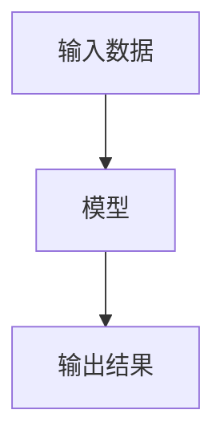
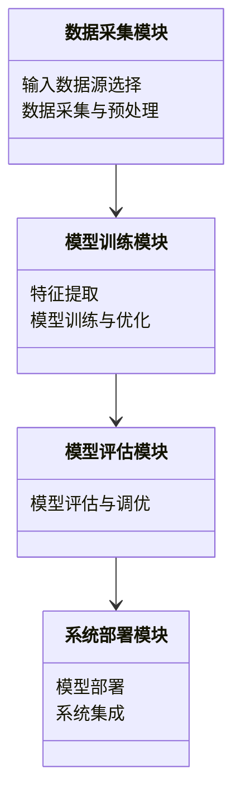

                 


# 如何评估企业的AI驱动的情感识别技术

## 关键词：情感识别，AI驱动，自然语言处理，评估指标，企业应用

## 摘要：  
在当今数字化转型的浪潮中，情感识别技术作为一种新兴的人工智能技术，正在企业中发挥越来越重要的作用。然而，如何科学地评估企业中的AI驱动的情感识别技术，是企业在应用该技术时面临的关键挑战。本文将从情感识别技术的背景、核心概念、算法原理、系统架构与设计、项目实战、评估指标与方法论、最佳实践与未来展望等多个维度，深入分析如何全面、系统地评估企业的AI驱动的情感识别技术。通过本文的阐述，读者将能够掌握评估情感识别技术的核心方法和实践技巧。

---

## 第1章：背景与概念

### 1.1 情感识别技术概述

#### 1.1.1 情感识别的定义  
情感识别（Emotion Recognition）是一种基于自然语言处理（NLP）和人工智能技术，通过分析文本、语音或图像等输入数据，识别出其中隐含的情感倾向（如正面、负面、中性）或更细粒度的情感类别（如高兴、悲伤、愤怒等）的技术。

#### 1.1.2 情感识别的核心要素  
情感识别的核心要素包括：  
1. **输入数据**：文本、语音或图像等多模态数据。  
2. **情感类别**：预先定义的情感标签（如正面、负面、中性）或细粒度的情感类别（如高兴、悲伤、愤怒）。  
3. **模型与算法**：基于规则、机器学习或深度学习的情感分析模型。  
4. **评估指标**：准确率、召回率、F1值等性能指标。  

#### 1.1.3 情感识别的分类与应用场景  
情感识别可以分为以下几类：  
1. **文本情感分析**：基于文本内容进行情感分类，广泛应用于社交媒体分析、舆情监测等领域。  
2. **语音情感分析**：基于语音特征（如音调、语速、停顿）识别说话人的情感状态。  
3. **图像情感分析**：基于面部表情、肢体语言识别情感状态。  

### 1.2 情感识别技术的背景与发展趋势

#### 1.2.1 情感识别技术的历史演变  
情感识别技术的发展经历了以下几个阶段：  
1. **基于规则的方法**：通过预定义的词典和规则，手动标注情感关键词，计算文本中的情感倾向。  
2. **基于机器学习的方法**：利用特征工程和传统机器学习算法（如SVM、随机森林）进行情感分类。  
3. **基于深度学习的方法**：采用深度神经网络（如LSTM、BERT）模型，自动提取文本特征并进行情感分类。  

#### 1.2.2 当前技术发展的主要方向  
当前，情感识别技术的主要发展方向包括：  
1. **细粒度情感分析**：从粗粒度的情感分类（如正面、负面）细化到更具体的情感类别（如高兴、悲伤）。  
2. **多模态情感分析**：结合文本、语音、图像等多种模态数据，提升情感识别的准确性和鲁棒性。  
3. **实时情感分析**：在实时流数据上进行情感识别，应用于直播、客服等领域。  

#### 1.2.3 企业级应用中的关键挑战  
企业在应用情感识别技术时，面临以下关键挑战：  
1. **数据质量**：企业数据可能存在噪声、不完整或标注不准确的问题。  
2. **模型泛化能力**：模型在不同场景下的泛化能力不足，导致情感识别效果不稳定。  
3. **计算资源**：深度学习模型对计算资源的需求较高，企业在资源有限的情况下难以高效部署。  

---

## 第2章：情感识别的核心概念与联系

### 2.1 情感识别的核心原理

#### 2.1.1 基于词典的规则方法  
基于词典的规则方法是一种简单的情感识别方法，通过预定义的情感词汇表，对文本中的关键词进行匹配，计算情感倾向。  

**步骤：**  
1. 构建情感词典：包含正面词汇、负面词汇和中性词汇。  
2. 对文本进行分词和词性标注。  
3. 统计文本中正面词汇和负面词汇的数量，计算情感倾向（如正面词汇数量 > 负面词汇数量，则情感倾向为正面）。  

**示例代码：**  
```python
# 情感词典示例
positive_words = {"happy", "joyful", "excited"}
negative_words = {"sad", "angry", "frustrated"}

text = "I am so happy today!"
tokens = text.split()  # 分词

positive_count = 0
negative_count = 0

for token in tokens:
    if token in positive_words:
        positive_count += 1
    elif token in negative_words:
        negative_count += 1

if positive_count > negative_count:
    print("Positive")
elif positive_count < negative_count:
    print("Negative")
else:
    print("Neutral")
```

#### 2.1.2 基于机器学习的方法  
基于机器学习的情感识别方法通过特征工程提取文本特征，训练分类器进行情感分类。  

**步骤：**  
1. **特征提取**：将文本转换为数值特征（如TF-IDF向量）。  
2. **训练分类器**：使用SVM、随机森林等算法训练情感分类器。  
3. **模型评估**：通过交叉验证评估模型的准确率、召回率等指标。  

#### 2.1.3 基于深度学习的方法  
基于深度学习的情感识别方法利用神经网络模型（如LSTM、BERT）自动提取文本特征，进行情感分类。  

**步骤：**  
1. **数据预处理**：将文本分词并转换为数值向量（如词嵌入）。  
2. **模型训练**：使用深度学习模型（如LSTM）训练情感分类器。  
3. **模型评估**：通过验证集评估模型性能。  

**示例代码：**  
```python
from tensorflow.keras import layers
from tensorflow.keras import Model

# 定义LSTM情感分类模型
def build_model(max_length, vocab_size):
    inputs = layers.Input(shape=(max_length,))
    x = layers.Embedding(vocab_size, 100)(inputs)
    x = layers.LSTM(64)(x)
    x = layers.Dense(3, activation="softmax")(x)
    model = Model(inputs=inputs, outputs=x)
    return model
```

### 2.2 情感识别的核心概念对比

#### 2.2.1 情感识别与文本分类的对比  
| 对比维度 | 情感识别 | 文本分类 |
|----------|----------|----------|
| 目标      | 分析文本中的情感倾向 | 对文本进行分类（如新闻分类） |
| 数据      | 文本、语音、图像 | 文本 |
| 模型      | 深度学习模型（如BERT） | 传统机器学习模型（如SVM） |

#### 2.2.2 情感强度分析与情感方向分析的对比  
| 对比维度 | 情感强度分析 | 情感方向分析 |
|----------|--------------|-------------|
| 目标      | 分析情感的强度（如非常正面、稍微正面） | 分析情感的方向（如正面、负面） |
| 方法      | 基于情感词典的情感强度加权 | 基于分类的情感方向判断 |

#### 2.2.3 情感识别与其他NLP任务的联系  
| 任务      | 描述 |
|-----------|------|
| 实体识别   | 识别文本中的实体（如人名、地名），与情感识别无直接联系。 |
| 语义理解   | 通过理解语义进行情感识别。 |
| 机器翻译   | 不直接相关，但情感识别可以用于机器翻译的情感语气分析。 |

### 2.3 情感识别的实体关系图

#### 2.3.1 实体关系图的定义  
情感识别的实体关系图展示了情感识别系统中各实体之间的关系，包括输入数据、模型、输出结果等。  

#### 2.3.2 实体关系图的构建过程  
1. **定义实体**：输入数据、模型、输出结果。  
2. **定义关系**：模型接收输入数据，输出情感识别结果。  

#### 2.3.3 实体关系图的应用场景  
实体关系图可以帮助我们理解情感识别系统的整体架构，为后续的系统设计和优化提供参考。  

**Mermaid图示：**  


---

## 第3章：情感识别的算法原理

### 3.1 基于词典的规则方法

#### 3.1.1 算法原理  
基于词典的规则方法通过预定义的情感词汇表，对文本中的关键词进行匹配，计算情感倾向。  

**公式：**  
$$ \text{情感倾向} = \frac{\text{正面词汇数量} - \text{负面词汇数量}}{\text{总词汇数量}} $$  

#### 3.1.2 优缺点分析  
- **优点**：简单易实现，适用于小型项目或数据量较小的企业场景。  
- **缺点**：依赖于词典的质量，对复杂情感表达的识别能力有限。  

### 3.2 基于机器学习的方法

#### 3.2.1 算法原理  
基于机器学习的方法通过特征工程提取文本特征，训练分类器进行情感分类。  

**公式：**  
$$ \text{预测概率} = \sigma(w_1x_1 + w_2x_2 + \cdots + w_nx_n) $$  
其中，$\sigma$为sigmoid函数，$w_i$为特征权重，$x_i$为特征值。  

#### 3.2.2 优缺点分析  
- **优点**：特征工程可以提取文本中的深层信息，模型性能较好。  
- **缺点**：特征工程需要大量人工干预，且模型对数据分布的变化敏感。  

### 3.3 基于深度学习的方法

#### 3.3.1 算法原理  
基于深度学习的方法利用神经网络模型自动提取文本特征，进行情感分类。  

**公式：**  
$$ \text{输出} = \text{LSTM}(\text{输入}) $$  

#### 3.3.2 优缺点分析  
- **优点**：能够自动提取文本特征，模型性能优异。  
- **缺点**：计算资源消耗较高，训练时间较长。  

---

## 第4章：情感识别的系统架构与设计

### 4.1 问题场景介绍

#### 4.1.1 问题背景  
企业需要通过情感识别技术分析客户反馈、社交媒体评论等数据，了解客户情感倾向，优化产品和服务。  

#### 4.1.2 问题描述  
企业在应用情感识别技术时，需要解决以下问题：  
1. 如何选择合适的情感识别模型？  
2. 如何确保模型在企业场景下的准确性和鲁棒性？  
3. 如何高效部署和管理情感识别系统？  

### 4.2 项目介绍

#### 4.2.1 项目目标  
通过构建企业级情感识别系统，实现对客户反馈的情感分析，优化客户服务流程。  

#### 4.2.2 项目范围  
项目范围包括：  
1. 数据采集与预处理。  
2. 模型训练与优化。  
3. 系统部署与集成。  

### 4.3 系统功能设计

#### 4.3.1 领域模型设计  
领域模型是系统功能设计的基础，定义了系统的核心功能模块及其交互关系。  

**Mermaid图示：**  


#### 4.3.2 系统架构设计  
系统架构设计需要考虑系统的可扩展性、可维护性和性能优化。  

**Mermaid图示：**  


### 4.4 系统接口设计

#### 4.4.1 API接口设计  
系统需要提供以下API接口：  
1. `/api/v1/emotion/analyze`：接收文本数据，返回情感倾向。  
2. `/api/v1/emotion/batch_analyze`：批量处理多条文本数据。  

#### 4.4.2 接口交互图  
**Mermaid图示：**  
```mermaid
sequenceDiagram
    client ->+> api_gateway: POST /api/v1/emotion/analyze
    api_gateway ->+> load_balancer: 请求分发
    load_balancer ->+> 服务节点1: 处理请求
    服务节点1 ->+> 数据存储: 获取模型
    服务节点1 ->+> 模型服务: 分析情感
    服务节点1 --> client: 返回结果
```

---

## 第5章：项目实战

### 5.1 环境安装

#### 5.1.1 安装Python环境  
建议使用Anaconda或virtualenv管理Python环境。  

**命令示例：**  
```bash
conda create -n emotion_analysis python=3.8
conda activate emotion_analysis
```

#### 5.1.2 安装依赖库  
安装常用依赖库，如`numpy`、`pandas`、`scikit-learn`、`tensorflow`等。  

**命令示例：**  
```bash
pip install numpy pandas scikit-learn tensorflow
```

### 5.2 系统核心实现

#### 5.2.1 数据采集与预处理  
**步骤：**  
1. 采集文本数据。  
2. 分词处理。  
3. 转换为数值向量（如TF-IDF向量）。  

**代码示例：**  
```python
from sklearn.feature_extraction.text import TfidfVectorizer

text = "I love this product!"
vectorizer = TfidfVectorizer()
X = vectorizer.fit_transform([text])
```

#### 5.2.2 模型训练与优化  
**步骤：**  
1. 选择模型（如SVM、随机森林、LSTM）。  
2. 训练模型。  
3. 调优超参数（如网格搜索）。  

**代码示例：**  
```python
from sklearn.svm import SVC
from sklearn.model_selection import GridSearchCV

model = SVC()
param_grid = {"C": [1, 10], "kernel": ["linear", "rbf"]}
grid_search = GridSearchCV(model, param_grid, cv=5)
grid_search.fit(X, y)
best_model = grid_search.best_estimator_
```

#### 5.2.3 模型评估与部署  
**步骤：**  
1. 评估模型性能（如准确率、召回率、F1值）。  
2. 部署模型为API服务。  

**代码示例：**  
```python
from flask import Flask, request, jsonify

app = Flask(__name__)
model = best_model

@app.route('/api/v1/emotion/analyze', methods=['POST'])
def analyze_emotion():
    data = request.json
    text = data['text']
    X = vectorizer.transform([text])
    prediction = model.predict(X)[0]
    return jsonify({'emotion': prediction})

if __name__ == '__main__':
    app.run()
```

### 5.3 实际案例分析

#### 5.3.1 案例背景  
某电商平台希望通过情感识别技术分析客户评论，优化客户服务流程。  

#### 5.3.2 数据预处理  
对客户评论进行分词和向量化处理。  

**代码示例：**  
```python
import jieba

text = "这个产品很好用，但价格有点贵!"
tokens = jieba.lcut(text)
```

#### 5.3.3 模型训练与评估  
选择SVM模型进行训练和评估。  

**代码示例：**  
```python
from sklearn.metrics import accuracy_score, recall_score, f1_score

y_true = [1, 0, 1]
y_pred = [1, 1, 0]

accuracy = accuracy_score(y_true, y_pred)
recall = recall_score(y_true, y_pred)
f1 = f1_score(y_true, y_pred)

print(f"Accuracy: {accuracy}")
print(f"Recall: {recall}")
print(f"F1: {f1}")
```

---

## 第6章：评估指标与方法论

### 6.1 情感识别的评估指标

#### 6.1.1 准确率（Accuracy）  
准确率是分类正确的样本数占总样本数的比例。  

**公式：**  
$$ \text{准确率} = \frac{\text{正确分类数}}{\text{总样本数}} $$  

#### 6.1.2 召回率（Recall）  
召回率是正类样本中被正确分类的比例。  

**公式：**  
$$ \text{召回率} = \frac{\text{真阳性}}{\text{真阳性 + 假阴性}} $$  

#### 6.1.3 F1值（F1 Score）  
F1值是准确率和召回率的调和平均数。  

**公式：**  
$$ \text{F1} = \frac{2 \times \text{准确率} \times \text{召回率}}{\text{准确率} + \text{召回率}} $$  

### 6.2 评估方法与实验设计

#### 6.2.1 数据集选择  
选择合适的情感识别数据集（如公开数据集、企业自有数据）。  

#### 6.2.2 模型对比  
对比不同模型（如基于规则的方法、机器学习模型、深度学习模型）的性能。  

#### 6.2.3 实验结果分析  
分析模型在不同数据集、不同情感类别上的表现。  

---

## 第7章：最佳实践与未来展望

### 7.1 最佳实践

#### 7.1.1 数据预处理  
确保数据的清洗、分词和向量化处理。  

#### 7.1.2 模型选择  
根据企业需求选择合适的情感识别模型。  

#### 7.1.3 系统部署  
采用微服务架构，确保系统的可扩展性和可维护性。  

### 7.2 小结与注意事项

#### 7.2.1 小结  
情感识别技术在企业中的应用前景广阔，但需要企业在数据、模型和系统架构方面进行全面考虑。  

#### 7.2.2 注意事项  
- 数据质量直接影响模型性能，需高度重视数据预处理。  
- 模型选择应结合企业需求和资源情况。  
- 系统设计需考虑可扩展性和性能优化。  

### 7.3 未来展望

#### 7.3.1 技术发展  
未来，情感识别技术将朝着多模态、实时性和高准确性的方向发展。  

#### 7.3.2 应用场景扩展  
情感识别技术将在客服、教育、医疗等领域发挥更大的作用。  

---

## 总结

通过本文的详细阐述，读者可以全面了解如何评估企业的AI驱动的情感识别技术。从情感识别的基本概念到算法原理，从系统架构设计到项目实战，再到评估指标与方法论，本文为读者提供了系统性的指导。希望本文能够帮助企业更好地应用情感识别技术，优化产品和服务，提升客户满意度和企业竞争力。

