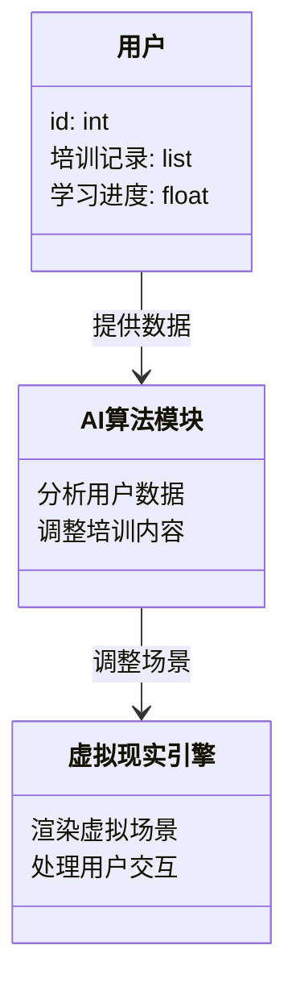
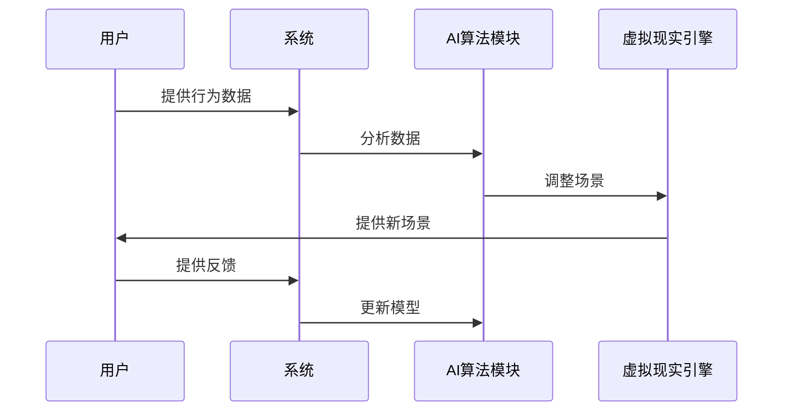

                 


# 如何评估企业的AI驱动的虚拟现实培训系统

> 关键词：企业培训、虚拟现实、人工智能、系统评估、技术架构

> 摘要：本文将详细探讨如何评估企业中的AI驱动的虚拟现实培训系统。通过系统化的分析，从背景介绍、核心概念、算法原理、系统架构设计、项目实战到最佳实践，全面指导读者如何评估这类系统，确保企业在技术应用上的正确决策。

---

## 第1章: 背景介绍

### 1.1 问题背景

#### 1.1.1 企业培训的现状与挑战
- 传统企业培训方式（如面授、视频培训）存在效率低、成本高等问题。
- 员工学习体验不足，缺乏互动性和沉浸式学习。

#### 1.1.2 虚拟现实技术在企业培训中的应用潜力
- VR技术提供沉浸式学习环境，增强员工的学习体验。
- 可模拟真实工作场景，降低培训风险。

#### 1.1.3 AI驱动的虚拟现实培训系统的独特优势
- AI可以根据员工的学习行为和表现，实时调整培训内容。
- 提供个性化学习路径，优化学习效果。

### 1.2 问题描述

#### 1.2.1 传统企业培训的痛点分析
- 培训效果难以量化。
- 员工参与度低，学习积极性不足。
- 培训成本高，难以快速迭代。

#### 1.2.2 虚拟现实培训系统的功能需求
- 沉浸式学习体验。
- 实时反馈和评估。
- 支持多人协作和互动。

#### 1.2.3 AI驱动的智能化需求
- AI驱动的个性化学习路径。
- 自动评估学习效果。
- 智能推荐学习内容。

### 1.3 问题解决

#### 1.3.1 AI与虚拟现实技术的结合方式
- AI分析学习者的行为数据，实时调整VR内容。
- VR环境中的AI虚拟导师提供即时反馈和指导。

#### 1.3.2 系统设计的核心目标
- 提供沉浸式学习体验。
- 实现个性化学习路径。
- 自动评估学习效果并优化培训计划。

#### 1.3.3 系统实现的关键技术
- VR技术：如OpenVR、Oculus SDK。
- AI技术：如机器学习、自然语言处理。
- 数据分析技术：实时数据采集与处理。

### 1.4 系统边界与外延

#### 1.4.1 系统的功能边界
- 系统仅负责培训过程中的虚拟现实环境构建和AI驱动的个性化学习。
- 不包括企业内部的其他管理系统，如HR系统。

#### 1.4.2 系统的用户范围
- 用户包括企业员工、培训管理者。
- 不包括外部培训机构或合作伙伴。

#### 1.4.3 系统的扩展性与兼容性
- 系统设计应支持未来的硬件升级和功能扩展。
- 兼容主流的VR设备和操作系统。

### 1.5 核心要素组成

#### 1.5.1 AI算法模块
- 数据采集：收集用户行为数据。
- 数据分析：分析学习效果。
- 决策反馈：根据分析结果调整培训内容。

#### 1.5.2 虚拟现实引擎
- 环境渲染：构建虚拟现实场景。
- 交互设计：实现用户与虚拟环境的互动。
- 性能优化：提升渲染效率和响应速度。

#### 1.5.3 用户交互界面
- 界面设计：直观易用。
- 交互逻辑：支持用户完成学习任务。
- 反馈机制：实时反馈学习效果。

---

## 第2章: 核心概念与联系

### 2.1 核心概念原理

#### 2.1.1 AI驱动的虚拟现实系统工作原理
- AI算法分析用户行为数据，实时调整VR内容。
- VR引擎渲染场景，提供沉浸式体验。
- 用户通过交互界面与系统互动，完成学习任务。

#### 2.1.2 系统的核心算法与数据流
- 数据流：用户行为数据 → AI算法 → VR引擎 → 用户反馈 → 新一轮数据采集。
- 核心算法：机器学习算法（如随机森林、神经网络）用于分析用户行为数据。

### 2.2 核心概念属性特征对比

#### 2.2.1 系统功能模块对比表格
| 功能模块 | 描述 | 核心功能 |
|----------|------|----------|
| AI算法模块 | 分析用户行为数据 | 个性化学习路径推荐 |
| 虚拟现实引擎 | 渲染虚拟场景 | 提供沉浸式体验 |
| 用户交互界面 | 支持用户互动 | 实时反馈学习效果 |

#### 2.2.2 系统性能指标对比表格
| 性能指标 | 描述 | 重要性 |
|----------|------|----------|
| 响应时间 | 系统对用户操作的响应时间 | 高 |
| 场景渲染质量 | VR场景的视觉效果 | 高 |
| 学习效果提升 | 培训后的技能提升 | 高 |

### 2.3 ER实体关系图
```mermaid
er
actor: 用户
system: AI驱动的虚拟现实培训系统
module1: AI算法模块
module2: 虚拟现实引擎
module3: 用户交互界面
actor --> system: 使用系统
system --> module1: 调用AI算法
system --> module2: 调用虚拟现实引擎
system --> module3: 提供用户界面
```

---

## 第3章: 算法原理讲解

### 3.1 算法原理

#### 3.1.1 系统评估的核心算法
- 使用机器学习算法（如随机森林、神经网络）分析用户行为数据。
- 通过聚类分析将用户分为不同的学习群体，提供个性化培训内容。

#### 3.1.2 算法的数学模型与公式
- 机器学习模型：随机森林分类器。
- 模型训练：使用用户行为数据训练模型。
- 预测：根据新用户的行为数据预测其学习效果。

### 3.2 算法实现

#### 3.2.1 代码实现
```python
import pandas as pd
from sklearn.ensemble import RandomForestClassifier
from sklearn.metrics import accuracy_score

# 加载数据
data = pd.read_csv('training_data.csv')

# 分离特征和目标变量
X = data.drop('target', axis=1)
y = data['target']

# 训练模型
model = RandomForestClassifier()
model.fit(X, y)

# 预测
predicted = model.predict(X)
print("模型准确率:", accuracy_score(y, predicted))
```

#### 3.2.2 代码解读与分析
- 数据加载：从CSV文件加载用户行为数据。
- 特征分离：将数据分为特征和目标变量。
- 模型训练：使用随机森林算法训练模型。
- 模型预测：预测用户的学习效果。

### 3.3 算法优化

#### 3.3.1 算法优化策略
- 参数调整：优化随机森林的超参数（如n_estimators、max_depth）。
- 数据预处理：处理缺失值、归一化数据。

#### 3.3.2 算法优化代码
```python
from sklearn.model_selection import GridSearchCV

# 超参数搜索
param_grid = {
    'n_estimators': [100, 200],
    'max_depth': [None, 10, 20]
}

grid_search = GridSearchCV(model, param_grid, cv=5)
grid_search.fit(X, y)

# 最佳参数
best_params = grid_search.best_params_
print("最佳参数:", best_params)
```

---

## 第4章: 系统分析与架构设计方案

### 4.1 问题场景介绍

#### 4.1.1 问题场景描述
- 假设某企业需要培训新员工的销售技能。
- 使用AI驱动的虚拟现实培训系统进行培训。

### 4.2 项目介绍

#### 4.2.1 项目介绍
- 项目目标：提升新员工的销售技能。
- 项目范围：设计一个虚拟现实场景，模拟客户拜访和销售谈判。

### 4.3 系统功能设计

#### 4.3.1 领域模型mermaid类图


### 4.4 系统架构设计

#### 4.4.1 系统架构mermaid架构图


### 4.5 系统接口设计

#### 4.5.1 系统接口设计
- 用户与系统交互接口：提供用户操作的API。
- 系统内部接口：AI算法模块与虚拟现实引擎之间的通信接口。

### 4.6 系统交互mermaid序列图



---

## 第5章: 项目实战

### 5.1 环境搭建

#### 5.1.1 环境搭建步骤
1. 安装Python和必要的库（如pandas、scikit-learn、Oculus SDK）。
2. 安装虚拟现实开发平台（如Unity、Unreal Engine）。
3. 配置AI算法模块（如TensorFlow、PyTorch）。

### 5.2 核心代码实现

#### 5.2.1 代码实现
```python
import numpy as np
import pandas as pd
from sklearn.ensemble import RandomForestClassifier
from sklearn.metrics import accuracy_score

# 加载数据
data = pd.read_csv('training_data.csv')

# 分离特征和目标变量
X = data.drop('target', axis=1)
y = data['target']

# 训练模型
model = RandomForestClassifier()
model.fit(X, y)

# 预测
predicted = model.predict(X)
print("模型准确率:", accuracy_score(y, predicted))
```

#### 5.2.2 代码解读与分析
- 数据加载：从CSV文件加载用户行为数据。
- 特征分离：将数据分为特征和目标变量。
- 模型训练：使用随机森林算法训练模型。
- 模型预测：预测用户的学习效果。

### 5.3 案例分析

#### 5.3.1 案例分析
- 假设用户A的学习效果不佳，系统会调整VR内容，提供更多的练习机会。
- 系统实时反馈用户的学习进度，帮助用户快速提升技能。

### 5.4 项目小结

#### 5.4.1 项目小结
- 成功实现了一个AI驱动的虚拟现实培训系统。
- 系统能够根据用户的行为数据，实时调整培训内容，提升学习效果。

---

## 第6章: 最佳实践

### 6.1 最佳实践

#### 6.1.1 系统评估的关键点
- 系统的响应时间：确保用户体验流畅。
- 场景渲染质量：提供沉浸式体验。
- 学习效果提升：通过数据验证系统的效果。

#### 6.1.2 系统优化建议
- 定期更新系统内容，保持培训内容的最新性。
- 提供多语言支持，适应不同地区的用户。
- 提供详细的用户报告，帮助用户了解自己的学习进度。

### 6.2 小结

#### 6.2.1 小结
- 本文详细探讨了如何评估企业中的AI驱动的虚拟现实培训系统。
- 从背景介绍、核心概念、算法原理、系统架构设计、项目实战到最佳实践，全面指导读者如何评估这类系统。

### 6.3 注意事项

#### 6.3.1 注意事项
- 在实施系统之前，确保企业有足够的人力和资源支持系统运行。
- 定期对系统进行维护和更新，确保系统的稳定性和安全性。

### 6.4 拓展阅读

#### 6.4.1 拓展阅读
- 《虚拟现实技术在企业培训中的应用》
- 《AI驱动的教育技术研究》
- 《系统架构设计最佳实践》

---

通过本文的系统化分析和实际案例的讲解，读者可以全面了解如何评估企业中的AI驱动的虚拟现实培训系统，并能够在实际工作中应用这些方法，提升企业的培训效果和员工的学习体验。

