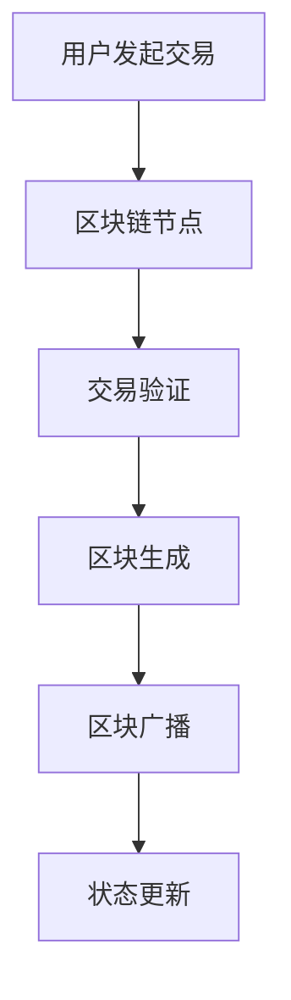
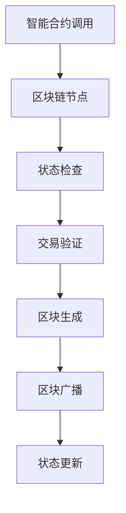
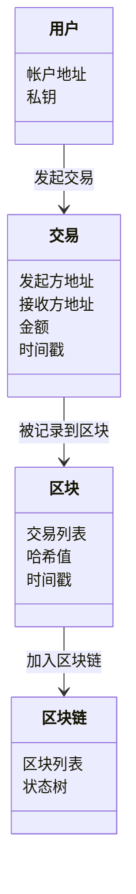

                 


# 如何评估企业的分布式账本技术应用

> **关键词**：分布式账本技术、区块链、企业应用、技术评估、共识机制、智能合约、系统架构

> **摘要**：本文将从背景介绍、核心概念、算法原理、系统架构、项目实战和最佳实践等多个维度，全面解析如何对企业中的分布式账本技术应用进行系统性评估。通过对比传统系统与分布式账本技术的优劣，结合实际案例分析，深入探讨分布式账本技术在企业中的应用场景、技术实现和评估方法。本文旨在为企业技术决策者和开发人员提供一套完整的评估框架和实践指南，帮助企业在数字化转型中更好地应用和优化分布式账本技术。

---

# 第一部分：分布式账本技术应用评估背景与核心概念

## 第1章：分布式账本技术的起源与发展

### 1.1 分布式账本技术的起源

#### 1.1.1 从中心化到去中心化的演变
- **中心化系统的问题**：传统企业系统依赖中心化的数据库，存在单点故障、数据孤岛和信任依赖等问题。
- **去中心化的起源**：分布式账本技术的起源可以追溯到比特币的诞生，其核心理念是通过去中心化的方式实现数据的安全存储和信任传递。
- **技术驱动的变革**：随着区块链技术的兴起，分布式账本技术逐渐从加密货币领域扩展到企业级应用。

#### 1.1.2 区块链技术的诞生与核心理念
- **区块链的定义**：区块链是一种去中心化的分布式账本技术，通过密码学和共识机制确保数据的安全性和不可篡改性。
- **核心理念**：区块链的核心理念是通过去中心化的方式实现数据的透明性、不可篡改性和可追溯性。
- **比特币的启示**：比特币的成功证明了分布式账本技术在金融领域的可行性，为后续的企业级应用奠定了基础。

#### 1.1.3 分布式账本技术的多领域应用
- **金融领域**：区块链在支付、清算、结算等领域的应用。
- **供应链管理**：通过区块链实现供应链数据的透明化和可追溯性。
- **医疗健康**：分布式账本技术在医疗数据共享和隐私保护中的应用。
- **物联网**：区块链在物联网设备身份认证和数据安全中的应用。

### 1.2 分布式账本技术的核心概念

#### 1.2.1 分布式账本的定义与特征
- **定义**：分布式账本是指一种通过多节点协作存储和验证数据的账本技术。
- **特征**：分布式账本具有去中心化、不可篡改、透明性、可追溯性和抗审查性等特征。
- **与传统数据库的对比**：
  | 特性       | 分布式账本技术 | 传统数据库 |
  |------------|----------------|-------------|
  | 数据存储   | 去中心化存储   | 中心化存储 |
  | 数据修改   | 需要共识机制   | 单点控制   |
  | 数据访问   | 受限且透明     | 宽松且集中 |

#### 1.2.2 区块链与分布式账本的关系
- **区块链是分布式账本的一种实现方式**：区块链通过链式结构和共识机制实现了分布式账本的核心功能。
- **分布式账本的范围更广**：除了区块链，还包括其他去中心化的账本技术，如联盟链、侧链等。

#### 1.2.3 分布式账本技术的分类与应用场景
- **公有链**：如比特币、以太坊等，适用于去中心化程度要求高的场景。
- **联盟链**：适用于企业内部或特定机构之间的协作，如供应链金融、医疗数据共享等。
- **私有链**：适用于企业内部数据管理，如内部财务系统、物流管理等。

### 1.3 分布式账本技术在企业中的应用现状

#### 1.3.1 企业级分布式账本技术的现状
- **技术成熟度**：分布式账本技术在金融、供应链、医疗等领域已进入商业化应用阶段。
- **企业采用的主要驱动因素**：
  - 数据安全与隐私保护
  - 提高业务流程的透明度和效率
  - 降低信任成本
  - 实现跨机构协作

#### 1.3.2 当前应用中的主要问题与挑战
- **技术挑战**：
  - 性能瓶颈：区块链的交易处理速度较慢，难以满足高并发场景的需求。
  - 能耗问题：公有链的共识机制（如PoW）消耗大量能源。
  - 可扩展性：区块链的可扩展性问题限制了其在大规模企业应用中的使用。
- **法律与合规挑战**：
  - 数据隐私与合规性问题
  - 区块链的不可篡改性与数据修改需求的冲突
  - 跨境支付与监管问题

### 1.4 本章小结
本章通过分析分布式账本技术的起源与发展，明确了其核心概念和特征，并对比了传统数据库与分布式账本技术的优劣。同时，结合企业应用场景，指出了当前技术应用中的主要问题与挑战，为后续的技术评估奠定了基础。

---

## 第2章：分布式账本技术的核心概念与联系

### 2.1 分布式账本技术的核心原理

#### 2.1.1 分布式账本的技术原理
- **数据存储**：分布式账本通过多节点存储数据副本，确保数据的冗余性和可靠性。
- **共识机制**：通过共识算法（如PoW、PoS、PBFT等）确保所有节点对数据状态达成一致。
- **数据一致性**：通过共识机制和数据同步确保各节点的数据一致性。

#### 2.1.2 区块链的共识机制
- **工作量证明（PoW）**：通过计算哈希值来验证区块的有效性，确保网络安全。
- **权益证明（PoS）**：通过持有代币的多少来决定记账权，降低能耗。
- **拜占庭容错（BFT）**：通过选举的方式选择记账节点，适用于联盟链场景。

#### 2.1.3 智能合约的执行机制
- **智能合约的定义**：智能合约是基于区块链的自动执行程序，用于自动执行预设的业务逻辑。
- **智能合约的执行流程**：
  1. 用户发起合约调用请求。
  2. 合约节点接收请求并验证合法性。
  3. 合约执行结果被记录在区块链上。
  4. 合约状态更新并广播到所有节点。

#### 2.1.4 分布式账本的交易流程


### 2.2 核心概念对比与特征分析

#### 2.2.1 分布式账本与传统数据库的对比
- **数据存储方式**：
  | 特性       | 分布式账本 | 传统数据库 |
  |------------|------------|-------------|
  | 数据存储   | 分散存储   | 集中存储   |
  | 数据一致性 | � 强一致性   | 强一致性   |
  | 冗余性      | 高         | 中         |

- **数据访问控制**：
  | 特性       | 分布式账本 | 传统数据库 |
  |------------|------------|-------------|
  | 访问权限   | 基于智能合约 | 基于RBAC   |
  | 数据修改   | 需要共识机制 | 单点控制   |

#### 2.2.2 共识机制的分类与特征
| 机制类型 | 特点             | 适用场景               |
|----------|------------------|------------------------|
| PoW      | 安全性高，能耗高 | 公有链（如比特币）     |
| PoS      | 能耗低，依赖质押 | 私有链/联盟链          |
| PBFT      | 高效，适用于联盟链 | 联盟链场景             |

#### 2.2.3 智能合约的属性与功能
- **属性**：
  - **自动性**：智能合约自动执行，无需人工干预。
  - **不可篡改性**：智能合约代码一旦部署，无法被修改。
  - **透明性**：合约代码对所有参与者透明。
- **功能**：
  - **状态管理**：智能合约管理数据状态。
  - **事件触发**：根据特定条件触发业务逻辑。
  - **跨机构协作**：智能合约支持不同机构之间的协作。

#### 2.2.4 ER实体关系图
```mermaid
erd
    用户 --> 交易：发起
    交易 --> 区块：记录
    区块 --> 区块链：存储
    区块链 --> 节点：验证和传播
```

### 2.3 本章小结
本章详细分析了分布式账本技术的核心原理，对比了传统数据库与分布式账本技术的优劣，并通过ER实体关系图展示了分布式账本技术的主要组件及其关系。同时，介绍了共识机制的分类与特征，以及智能合约的属性与功能，为后续的技术评估提供了理论基础。

---

## 第3章：分布式账本技术的算法原理

### 3.1 共识机制的核心算法

#### 3.1.1 工作量证明机制（PoW）
- **算法流程**：
  1. 每个节点尝试计算区块头的哈希值，使其满足特定的难度要求。
  2. 计算成功后，节点将区块广播到全网。
  3. 其他节点验证区块的有效性，并将其加入区块链中。
- **优缺点**：
  - **优点**：安全性高，抗女婿攻击能力强。
  - **缺点**：能耗高，效率低。

#### 3.1.2 权益证明机制（PoS）
- **算法流程**：
  1. 节点根据持有的代币数量和时间随机选举出一个记账节点。
  2. 该节点生成区块并广播到全网。
  3. 其他节点验证区块的有效性，并将其加入区块链中。
- **优缺点**：
  - **优点**：能耗低，效率高。
  - **缺点**：存在“富者愈富”的风险，安全性较低。

#### 3.1.3 其他共识算法（DPOS、PBFT等）
- **DPOS（ delegated Proof of Stake）**：
  - **特点**：通过选举的方式选择记账节点，适用于联盟链场景。
- **PBFT（Practical Byzantine Fault Tolerance）**：
  - **特点**：在拜占庭容错模型下，通过多轮投票达成一致。

#### 3.1.4 共识机制的性能对比
| 机制类型 | 延迟（秒） | 吞吐量（TPS） | 能耗（W） |
|----------|------------|---------------|-----------|
| PoW      | 10-60      | 3-7            | 高         |
| PoS      | 1-5         | 20-50          | 低         |
| PBFT      | 0.5-2       | 100-300        | 中         |

### 3.2 智能合约的执行流程

#### 3.2.1 智能合约的执行流程


#### 3.2.2 智能合约的数学模型
- **智能合约的状态表示**：
  - 状态可以用布尔变量或数值变量表示，例如：
  $$ \text{balance} = \text{balance} + \text{amount} $$
- **智能合约的事件触发条件**：
  - 根据特定的触发条件执行相应的操作，例如：
  $$ \text{if} \ (x > y) \ \text{then} \ z = z + 1 $$

### 3.3 算法实现的Python代码示例

#### 3.3.1 工作量证明机制（PoW）的实现
```python
def compute_pow(last_block_hash):
    prefix = '0000'
    for n in range(1, 1000000):
        candidate = last_block_hash + str(n)
        if hashlib.sha256(candidate.encode()).hexdigest().startswith(prefix):
            return candidate
    return None
```

#### 3.3.2 权益证明机制（PoS）的实现
```python
import random

def pos_consensus(nodes, staking_time):
    eligible_nodes = [node for node in nodes if node.staking_time >= staking_time]
    if not eligible_nodes:
        return None
    return random.choice(eligible_nodes)
```

### 3.4 本章小结
本章通过详细分析共识机制的核心算法，对比了不同共识机制的优缺点和性能指标，并给出了Python代码实现示例。同时，通过mermaid流程图和数学公式，详细讲解了智能合约的执行流程和数学模型，为后续的技术评估提供了理论依据。

---

## 第4章：分布式账本技术的系统分析与架构设计

### 4.1 问题场景介绍

#### 4.1.1 企业分布式账本应用的常见问题
- **数据一致性问题**：如何保证多节点之间的数据一致性。
- **性能瓶颈问题**：如何提高区块链的交易处理速度。
- **安全性问题**：如何防范恶意节点的攻击。

#### 4.1.2 分布式账本系统的功能需求
- **数据存储**：支持多节点存储和数据同步。
- **共识机制**：实现高效的共识算法。
- **智能合约**：支持智能合约的部署和执行。
- **数据查询**：支持高效的查询功能。

### 4.2 系统功能设计

#### 4.2.1 领域模型设计


#### 4.2.2 系统架构设计


### 4.3 项目实战

#### 4.3.1 环境安装
- **安装Python环境**：使用Anaconda或virtualenv。
- **安装区块链框架**：例如Hyperledger Fabric、Ethereum等。
- **安装依赖库**：例如Pyethernet、Web3.py等。

#### 4.3.2 系统核心实现源代码
```python
from web3 import Web3

def deploy_smart_contract(w3, abi, bytecode):
    contract = w3.eth.contract(address=contract_address, abi=abi)
    transaction = contract.deploy(bytecode)
    w3.eth.send_raw_transaction(transaction.rawTransaction)
```

#### 4.3.3 代码应用解读与分析
- **代码功能**：上述代码展示了如何使用Web3.py框架部署智能合约。
- **关键点**：
  - **ABI**：智能合约的接口定义。
  - **Bytecode**：智能合约的编译代码。
  - **部署过程**：通过调用智能合约的deploy方法，将合约部署到区块链上。

#### 4.3.4 案例分析
- **案例背景**：某企业采用区块链技术实现供应链金融系统的智能合约部署。
- **技术实现**：
  1. 供应链上的各个企业节点通过智能合约自动执行订单、物流和支付流程。
  2. 通过区块链的不可篡改性确保数据的安全性和可追溯性。

#### 4.3.5 项目小结
本小节通过实际案例展示了分布式账本技术在企业中的应用，详细讲解了系统核心代码的实现和应用，帮助读者更好地理解分布式账本技术的实际应用过程。

### 4.4 最佳实践

#### 4.4.1 系统设计中的注意事项
- **性能优化**：通过选择合适的共识机制和优化网络通信降低延迟。
- **数据隐私保护**：通过零知识证明等技术实现数据隐私保护。
- **合规性**：确保分布式账本技术的应用符合相关法律法规。

#### 4.4.2 项目实施中的关键点
- **需求分析**：明确业务需求，选择合适的分布式账本技术方案。
- **系统设计**：设计合理的系统架构，确保系统的可扩展性和可维护性。
- **测试与优化**：通过充分的测试和优化，提高系统的性能和安全性。

#### 4.4.3 小结
本章通过系统分析和架构设计，帮助企业更好地实施分布式账本技术。通过实际案例分析和最佳实践，为读者提供了完整的项目实施指南。

---

## 第5章：分布式账本技术的最佳实践与小结

### 5.1 最佳实践

#### 5.1.1 技术选型
- **选择适合的共识机制**：根据企业的实际需求选择合适的共识机制。
- **选择适合的智能合约框架**：根据业务需求选择合适的智能合约开发框架。

#### 5.1.2 数据隐私保护
- **数据加密**：通过加密技术保护数据隐私。
- **隐私计算**：通过隐私计算技术实现数据的隐私保护。

#### 5.1.3 性能优化
- **优化共识机制**：通过优化共识算法提高系统的吞吐量。
- **优化网络通信**：通过优化网络通信协议降低延迟。

#### 5.1.4 合规性
- **遵守相关法律法规**：确保分布式账本技术的应用符合相关法律法规。
- **数据跨境传输**：确保数据跨境传输的合规性。

### 5.2 小结
本文从背景介绍、核心概念、算法原理、系统架构、项目实战和最佳实践等多个维度，全面解析了如何对企业中的分布式账本技术应用进行系统性评估。通过对比传统系统与分布式账本技术的优劣，结合实际案例分析，深入探讨了分布式账本技术在企业中的应用场景、技术实现和评估方法。本文旨在为企业技术决策者和开发人员提供一套完整的评估框架和实践指南，帮助企业在数字化转型中更好地应用和优化分布式账本技术。

---

**End of Document**

