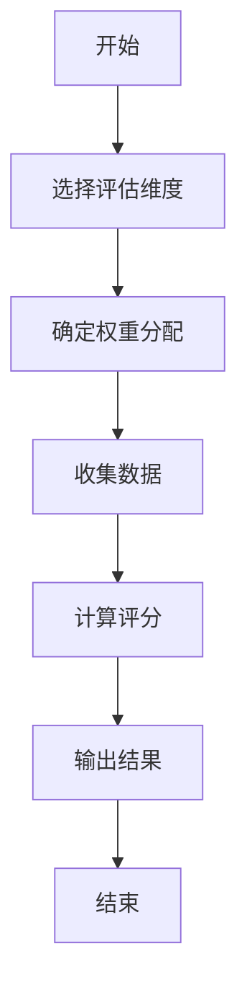

                 


好的，我将按照您的要求，逐步展开《如何评估企业的创新文化》的详细内容。由于篇幅限制，我将分批次完成这一任务。以下是第一部分：企业创新文化评估背景与核心概念。

---

# 如何评估企业的创新文化

> **关键词**：企业创新文化、创新评估、创新管理、企业文化、创新战略

> **摘要**：  
> 本文系统地探讨了如何评估企业的创新文化，从定义、维度到评估方法，再到实际应用，提供了全面的分析与解决方案。通过背景分析、核心概念、评估模型、方法论和实际案例的结合，本文旨在为企业管理者提供一套科学的创新文化评估框架，帮助企业在竞争激烈的市场环境中持续保持创新活力。

---

## 第一部分: 企业创新文化评估背景与核心概念

### 第1章: 企业创新文化评估的背景与问题背景

#### 1.1 什么是企业创新文化

创新文化是指企业在组织内部营造的一种支持创新、鼓励冒险、包容失败的文化氛围。它不仅仅是员工的个体行为，更是一种集体价值观和行为准则的体现。

- **1.1.1 创新文化的定义**  
  创新文化是企业在经营活动中，通过制度、流程、激励机制和价值观的共同作用，激发员工创造力和主动性的文化体系。它强调开放性、协作性和探索精神，旨在为企业创造持续的竞争优势。

- **1.1.2 创新文化的维度与特征**  
  创新文化可以从多个维度进行分析，包括创新意识、创新能力、创新行为和创新成果。其核心特征包括：  
  - **开放性**：鼓励员工提出新想法，允许失败并从中学习。  
  - **协作性**：强调跨部门合作，促进知识共享。  
  - **激励性**：通过奖励机制激励员工创新。  
  - **可持续性**：创新文化不是一时的风潮，而是企业的长期战略。

- **1.1.3 创新文化的核心要素**  
  创新文化的构建需要多方面的支持，包括：  
  - **领导支持**：高层管理者对创新的重视和投入。  
  - **资源支持**：资金、时间和人才的投入。  
  - **制度保障**：创新相关的制度和流程。  
  - **文化氛围**：员工对创新的态度和价值观。

#### 1.2 企业创新文化的重要性

在当前全球化和数字化的背景下，创新已成为企业生存和发展的关键。创新文化的重要性体现在以下几个方面：

- **1.2.1 创新对企业发展的意义**  
  创新是企业保持竞争力的核心动力。通过创新，企业可以不断推出新产品、优化流程、降低成本，并在市场中占据领先地位。

- **1.2.2 创新文化与企业竞争力的关系**  
  创新文化是企业竞争力的源泉。拥有强大创新文化的组织能够更快地适应市场变化，抓住新兴机会，并在竞争中立于不败之地。

- **1.2.3 创新文化对企业长期发展的价值**  
  创新文化不仅关注短期目标，更注重企业的长期可持续发展。它能够激发员工的潜力，培养企业的内生动力，并为企业的未来布局奠定基础。

#### 1.3 企业创新文化评估的必要性

为了更好地推动企业的创新，科学评估创新文化是必不可少的。

- **1.3.1 创新文化评估的目的**  
  创新文化评估的目的是帮助企业识别现有创新文化的优缺点，发现潜在问题，并制定改进策略。

- **1.3.2 评估创新文化对企业管理的价值**  
  通过评估，企业可以了解当前创新文化的健康状况，优化管理流程，提升员工的创新意识和能力。

- **1.3.3 评估创新文化的边界与外延**  
  创新文化评估需要明确范围，既要避免过于狭隘，又要防止过度扩展。其边界通常包括创新行为、创新能力和创新成果。

---

### 第2章: 企业创新文化的核心概念与联系

#### 2.1 创新文化的核心概念

创新文化涉及多个方面，需要从多个角度进行分析。

- **2.1.1 创新文化与企业战略的关系**  
  创新文化是企业战略的重要组成部分。企业战略需要通过创新文化来实现，而创新文化又需要企业战略的指导和支持。

- **2.1.2 创新文化与组织结构的关联**  
  组织结构直接影响创新文化的形成。扁平化、灵活的组织结构更有利于创新文化的培养，而传统的层级制可能限制创新。

- **2.1.3 创新文化与员工行为的互动**  
  创新文化影响员工的行为方式。在积极的创新文化下，员工更愿意尝试新事物，勇于承担责任。

#### 2.2 创新文化的核心要素对比

为了更好地理解创新文化，我们需要将其与其他相关概念进行对比。

- **2.2.1 创新文化与传统管理的对比**  
  | 维度         | 创新文化                | 传统管理                |
  |--------------|-------------------------|-------------------------|
  | 目标         | 鼓励创新                | 保证稳定                |
  | 重点         | 创新行为与成果          | 制度与流程              |
  | 管理方式     | 强调灵活性               | 强调规范性               |

- **2.2.2 不同行业创新文化的特征分析**  
  不同行业的创新文化存在显著差异。例如，科技行业强调快速迭代和技术创新，而传统制造业更注重流程优化和成本控制。

- **2.2.3 创新文化与企业绩效的关系**  
  创新文化与企业绩效呈正相关。研究表明，创新文化较强的企业，其市场表现和利润率往往优于同行业竞争对手。

#### 2.3 创新文化的ER实体关系图

以下是一个简单的创新文化实体关系图：

```mermaid
er
    企业创新文化 <--- 关联关系 ---> 创新行为
    创新行为 <--- 属性 ---> 创新成果
    创新文化 <--- 属性 ---> 创新资源
```

---

### 第3章: 企业创新文化评估的核心模型

#### 3.1 创新文化评估的理论模型

创新文化评估需要建立科学的理论框架。

- **3.1.1 创新文化评估的基本框架**  
  创新文化评估可以从以下几个方面入手：  
  - 创新意识：员工是否具备创新思维。  
  - 创新能力：员工是否具备创新技能。  
  - 创新行为：员工是否愿意尝试新事物。  
  - 创新成果：创新行为是否带来了实际价值。

- **3.1.2 创新文化评估的关键维度**  
  创新文化评估通常包括以下维度：  
  - 创新意识：员工对创新的态度和认知。  
  - 创新能力：员工的技术能力和创新技能。  
  - 创新行为：员工的实际创新行为。  
  - 创新成果：创新行为带来的实际成果。

- **3.1.3 创新文化评估的指标体系**  
  常见的创新文化评估指标包括：  
  - 创新项目的数量与质量。  
  - 员工的创新提案数量。  
  - 创新成果的市场表现。  
  - 员工的创新满意度。

#### 3.2 创新文化评估的数学模型

为了量化创新文化，我们可以建立一个创新文化指数模型。

- **3.2.1 创新文化指数计算公式**  
  创新文化指数（CCI）可以通过以下公式计算：

  $$ CCI = \sum_{i=1}^{n} (w_i \cdot S_i) $$

  其中，$w_i$ 是第 $i$ 个维度的权重，$S_i$ 是第 $i$ 个维度的评分（1-10分）。

- **3.2.2 示例计算**  
  假设我们有三个维度：创新意识（权重 0.3）、创新行为（权重 0.4）、创新成果（权重 0.3）。某企业的评分分别为 8、7、9。则：

  $$ CCI = 0.3 \times 8 + 0.4 \times 7 + 0.3 \times 9 = 2.4 + 2.8 + 2.7 = 7.9 $$

  该企业的创新文化指数为 7.9，属于中等偏上水平。

#### 3.3 创新文化评估的算法流程

以下是一个创新文化评估的算法流程图：



---

## 第四部分: 企业创新文化评估的方法与工具

### 第4章: 企业创新文化评估的定性方法

#### 4.1 定性评估的核心方法

定性评估主要通过观察和分析来了解创新文化的现状。

- **4.1.1 文化分析法**  
  通过分析企业的规章制度、组织结构和沟通方式，了解创新文化的内在逻辑。

- **4.1.2 行为观察法**  
  观察员工的实际行为，判断其是否符合创新文化的特征。

- **4.1.3 面向员工的访谈法**  
  通过深度访谈，了解员工对创新文化的认知和感受。

#### 4.2 定性评估的步骤与流程

定性评估通常包括以下几个步骤：

- **4.2.1 确定评估目标**  
  明确评估的核心问题，例如“员工是否具备创新意识”。

- **4.2.2 设计评估方案**  
  制定详细的评估计划，包括评估方法、样本选择和时间安排。

- **4.2.3 收集与分析数据**  
  通过访谈、观察等方式收集数据，并进行分类整理。

- **4.2.4 提出改进建议**  
  根据评估结果，提出具体的改进措施。

---

由于篇幅限制，接下来的内容将在后续更新中完成。如果您对某一部分有具体需求，可以告诉我，我会优先完成相关内容。

