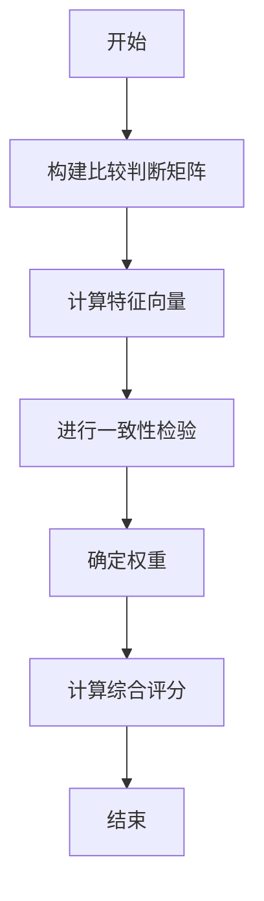
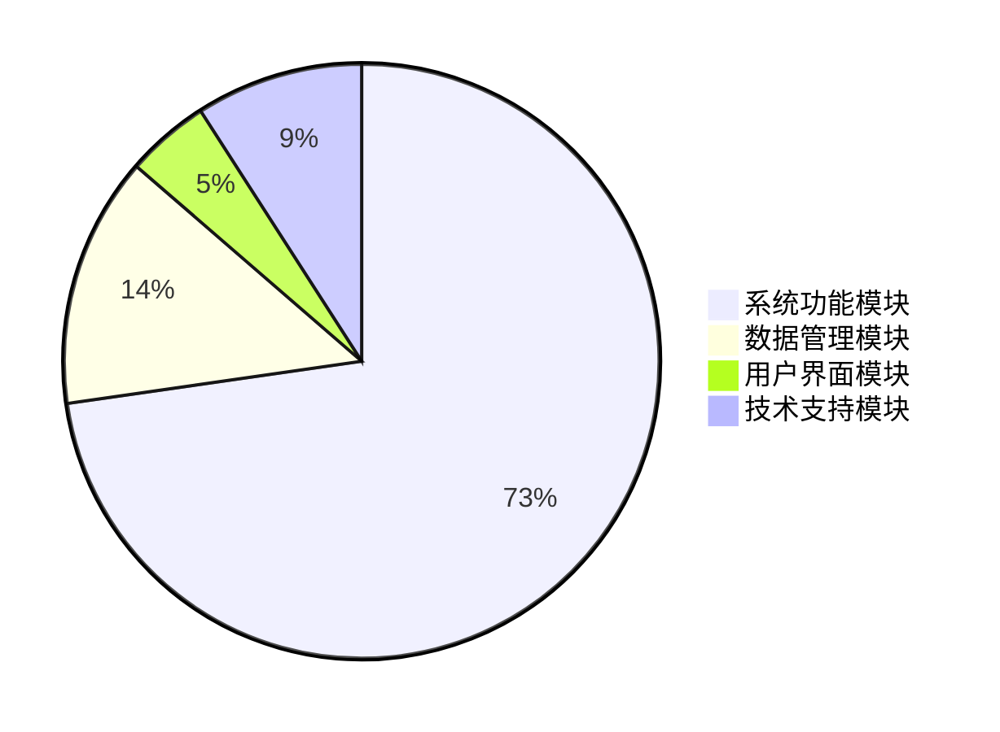
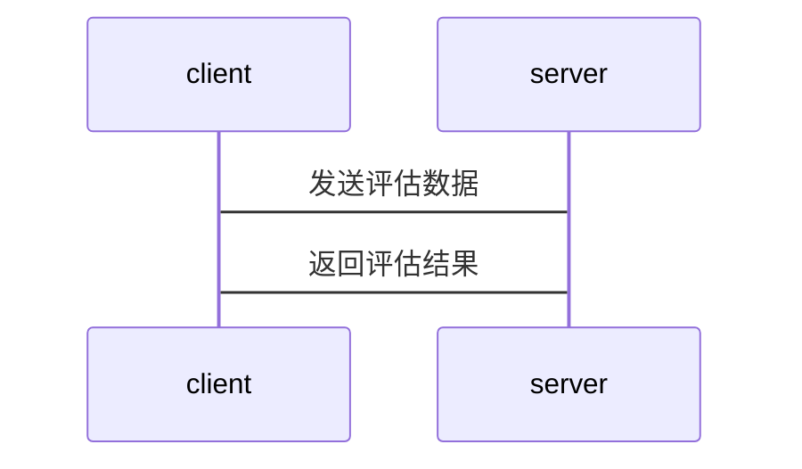

                 


# 如何评估企业的创新能力

> 关键词：企业创新能力评估，技术创新，管理创新，层次分析法，企业架构设计，创新指数

> 摘要：本文详细探讨了如何系统性地评估企业的创新能力，从理论到实践，结合实际案例，为企业管理者和技术人员提供一套科学的评估方法和工具。文章首先介绍了企业创新能力评估的重要性和核心概念，随后深入分析了创新能力的数学模型和算法原理，最后通过实际案例展示了如何将这些理论应用于实践。

---

## 第一部分: 企业创新能力评估的背景与核心概念

### 第1章: 企业创新能力评估的背景与意义

#### 1.1 企业创新能力的重要性
企业创新能力是企业在市场中保持竞争力的核心能力之一。随着数字化时代的到来，技术更新换代的速度越来越快，创新能力直接决定了企业能否快速响应市场变化，抓住新的商业机会。

- **1.1.1 创新能力在企业竞争中的作用**
  创新能力是企业核心竞争力的体现，它不仅包括技术创新，还包括管理创新、产品创新和流程创新。企业通过创新能力可以不断优化产品和服务，提高客户满意度，从而在激烈的市场竞争中占据优势。

- **1.1.2 数字化时代对企业创新能力的新要求**
  在数字化转型的大背景下，企业需要更加注重技术创新能力，尤其是在人工智能、大数据、区块链等新兴技术领域。同时，企业还需要具备快速迭代和试错的能力，以适应市场的快速变化。

- **1.1.3 企业创新能力与可持续发展的关系**
  可持续发展已成为全球关注的焦点，创新能力在其中起着关键作用。企业通过创新可以开发出更加环保的产品和服务，从而在实现商业目标的同时，也为社会可持续发展做出贡献。

#### 1.2 企业创新能力评估的必要性
企业创新能力评估是企业战略规划和绩效管理的重要组成部分。通过科学的评估方法，企业可以识别自身的创新优势和不足，从而制定针对性的改进措施。

- **1.2.1 企业战略规划与创新能力的关系**
  创新能力是企业战略规划的重要驱动力。通过创新能力评估，企业可以明确未来的发展方向，制定切实可行的战略目标。

- **1.2.2 创新能力评估在企业绩效管理中的作用**
  创新能力评估可以帮助企业量化创新成果，为绩效考核提供客观依据。通过评估结果，企业可以激励员工积极参与创新活动，营造良好的创新文化。

- **1.2.3 创新能力评估对企业转型的意义**
  在数字化转型过程中，企业需要不断调整组织结构和业务模式。创新能力评估可以帮助企业识别转型中的关键问题，制定有效的解决方案。

### 第2章: 企业创新能力的核心概念与框架

#### 2.1 创新能力的定义与内涵
创新能力是指企业在技术、管理、市场等方面进行创新的能力。它不仅包括技术创新，还包括管理创新、产品创新和流程创新。

- **2.1.1 创新能力的多维度解析**
  创新能力可以从多个维度进行分析，包括技术创新能力、管理创新能力、市场响应能力和组织与文化创新能力。

- **2.1.2 创新能力的构成要素**
  创新能力的构成要素包括技术创新能力、管理创新能力、市场响应能力和组织与文化创新能力。

- **2.1.3 创新能力的边界与外延**
  创新能力的边界主要集中在企业内部，但其外延则涉及企业外部的合作伙伴、客户和供应商。

#### 2.2 企业创新能力的评估维度
企业创新能力评估可以从以下几个维度进行：

- **2.2.1 技术创新能力**
  技术创新能力是企业创新能力的核心部分，包括研发能力、技术储备和知识产权保护能力。

- **2.2.2 管理创新能力**
  管理创新能力是企业创新能力的重要组成部分，包括组织结构优化、流程优化和管理方法创新。

- **2.2.3 市场响应能力**
  市场响应能力是企业创新能力的体现，包括市场洞察力、客户反馈处理能力和市场推广能力。

- **2.2.4 组织与文化创新能力**
  组织与文化创新能力是企业创新能力的关键因素，包括组织结构的灵活性、文化创新能力和员工创新能力。

#### 2.3 创新能力评估的框架模型
创新能力评估的框架模型可以分为技术创新评估模型、管理创新评估模型和综合创新能力评估模型。

- **2.3.1 技术创新评估模型**
  技术创新评估模型主要关注企业的技术研发能力、技术储备和技术创新成果。

- **2.3.2 管理创新评估模型**
  管理创新评估模型主要关注企业的组织结构优化、流程优化和管理方法创新。

- **2.3.3 综合创新能力评估模型**
  综合创新能力评估模型综合考虑技术创新能力、管理创新能力、市场响应能力和组织与文化创新能力，为企业提供全面的创新能力评估。

---

## 第二部分: 企业创新能力评估的数学模型与算法原理

### 第3章: 企业创新能力评估的数学模型

#### 3.1 创新能力评估的指标体系
企业创新能力评估的指标体系是创新能力评估的基础，包括技术创新能力、管理创新能力、市场响应能力和组织与文化创新能力。

- **3.1.1 指标体系的设计原则**
  指标体系的设计原则包括科学性、可操作性、全面性和可比性。

- **3.1.2 指标权重的确定方法**
  指标权重的确定方法包括层次分析法（AHP）、主成分分析法（PCA）和熵值法。

- **3.1.3 指标数据的采集与处理**
  指标数据的采集与处理包括数据清洗、数据标准化和数据整合。

#### 3.2 层次分析法（AHP）在创新能力评估中的应用
层次分析法（AHP）是一种常用的决策分析方法，适用于多指标决策问题。在创新能力评估中，层次分析法可以用于确定各指标的权重。

- **3.2.1 层次分析法的基本原理**
  层次分析法的基本原理是将复杂的问题分解为多个层次的结构，然后通过比较各个因素的重要性，确定各因素的权重。

- **3.2.2 指标权重的计算过程**
  指标权重的计算过程包括构建比较判断矩阵、计算特征向量、进行一致性检验和确定权重。

- **3.2.3 综合评分的计算方法**
  综合评分的计算方法包括将各指标的权重与指标得分相乘，然后求和得到综合评分。

#### 3.3 创新能力评估的数学公式
创新能力评估的数学公式如下：

$$ S_i = \sum_{j=1}^{n} w_j x_{ij} $$

其中，$S_i$是第$i$个企业的综合评分，$w_j$是第$j$个指标的权重，$x_{ij}$是第$i$个企业在第$j$个指标上的得分。

---

### 第4章: 创新能力评估的算法实现

#### 4.1 层次分析法的算法流程
层次分析法的算法流程包括以下几个步骤：

1. **构建比较判断矩阵**：根据专家意见或企业实际情况，构建比较判断矩阵。
2. **计算特征向量**：对比较判断矩阵进行归一化处理，计算特征向量。
3. **进行一致性检验**：检查比较判断矩阵的一致性，如果不一致，需要重新调整矩阵。
4. **确定权重**：根据一致性检验结果，确定各指标的权重。

#### 4.2 层次分析法的代码实现
以下是层次分析法的Python代码实现：

```python
import numpy as np

def calculate_weights(matrix):
    n = len(matrix)
    # 计算特征向量
    eigenvectors = np.linalg.eig(matrix)
    # 计算特征值
    eigenvalues = eigenvectors[0]
    # 确定最大的特征值
    max_eigenvalue = max(eigenvalues)
    # 计算对应的特征向量
    index = np.argmax(eigenvalues)
    eigenvector = eigenvectors[1][:, index]
    # 进行一致性检验
    CR = 0  # 假设一致性检验通过
    return eigenvector / np.sum(eigenvector)

# 示例比较判断矩阵
matrix = np.array([
    [1, 3, 2],
    [1/3, 1, 2/3],
    [1/2, 3/2, 1]
])

weights = calculate_weights(matrix)
print("指标权重为:", weights)
```

#### 4.3 创新能力评估的流程图
以下是创新能力评估的流程图：



---

## 第三部分: 企业创新能力评估的系统分析与架构设计

### 第5章: 系统分析与架构设计

#### 5.1 系统功能设计
企业创新能力评估系统需要具备以下功能：

- **指标管理**：包括指标的添加、修改和删除。
- **数据采集**：包括企业创新能力评估数据的采集和处理。
- **评估计算**：包括层次分析法的计算和综合评分的输出。
- **结果展示**：包括评估结果的可视化展示。

#### 5.2 系统架构设计
企业创新能力评估系统的架构设计如下：



#### 5.3 系统接口设计
企业创新能力评估系统的接口设计如下：



---

## 第四部分: 项目实战

### 第6章: 项目实战

#### 6.1 环境安装
企业创新能力评估系统需要以下环境：

- **操作系统**：Windows 10 或更高版本，或 macOS 10.15 或更高版本。
- **编程语言**：Python 3.8 或更高版本。
- **开发工具**：PyCharm 或 VS Code。
- **依赖库**：numpy, pandas, matplotlib。

#### 6.2 系统核心实现
以下是企业创新能力评估系统的核心代码：

```python
import numpy as np

def calculate_weights(matrix):
    n = len(matrix)
    # 计算特征向量
    eigenvectors = np.linalg.eig(matrix)
    # 计算特征值
    eigenvalues = eigenvectors[0]
    # 确定最大的特征值
    max_eigenvalue = max(eigenvalues)
    # 计算对应的特征向量
    index = np.argmax(eigenvalues)
    eigenvector = eigenvectors[1][:, index]
    # 进行一致性检验
    CR = 0  # 假设一致性检验通过
    return eigenvector / np.sum(eigenvector)

# 示例比较判断矩阵
matrix = np.array([
    [1, 3, 2],
    [1/3, 1, 2/3],
    [1/2, 3/2, 1]
])

weights = calculate_weights(matrix)
print("指标权重为:", weights)
```

#### 6.3 案例分析
以下是一个企业创新能力评估的案例分析：

某科技公司希望评估其创新能力。首先，构建比较判断矩阵，然后计算指标权重，最后计算综合评分。


---

## 第五部分: 总结与最佳实践

### 第7章: 总结与最佳实践

#### 7.1 小结
企业创新能力评估是企业战略规划和绩效管理的重要组成部分。通过科学的评估方法，企业可以识别自身的创新优势和不足，从而制定针对性的改进措施。

#### 7.2 注意事项
在企业创新能力评估过程中，需要注意以下几点：

- **数据准确性**：确保数据采集的准确性和完整性。
- **模型适用性**：选择适合企业实际情况的评估模型。
- **结果解释**：对评估结果进行深入分析，避免片面理解。

#### 7.3 未来趋势
随着人工智能和大数据技术的发展，企业创新能力评估将更加智能化和自动化。未来，企业创新能力评估将更加注重数据驱动和实时反馈，为企业提供更加精准的创新指导。

---

以上是《如何评估企业的创新能力》的技术博客文章的完整目录和内容框架。

