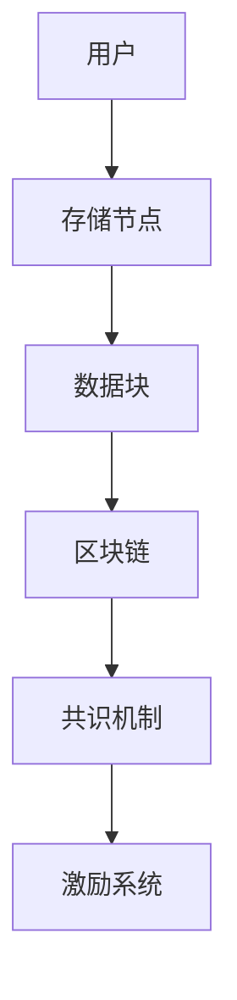
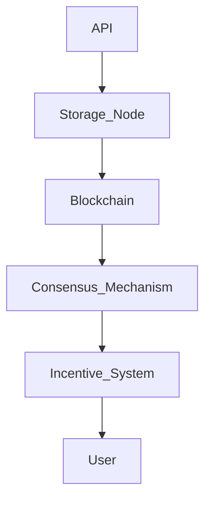
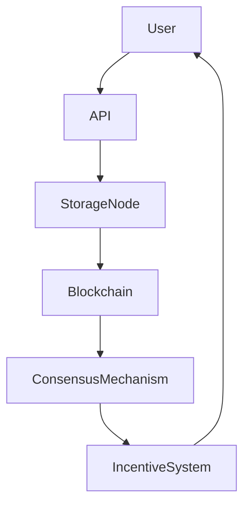

                 


# 如何评估企业的区块链去中心化云存储平台

> 关键词：区块链、去中心化、云存储、评估指标、系统架构、安全性、激励机制

> 摘要：随着区块链技术的快速发展，区块链去中心化云存储平台逐渐成为企业存储数据的重要选择。本文将从核心概念、技术原理、系统架构、评估指标等多个方面详细分析如何评估企业区块链去中心化云存储平台的优劣，帮助企业做出明智的决策。

---

# 第一部分：区块链去中心化云存储平台的背景与核心概念

## 第1章：区块链去中心化云存储平台的背景介绍

### 1.1 问题背景与描述
- **传统云存储的局限性**：数据存储在中心化服务器上，存在单点故障、数据被篡改或泄露的风险。
- **区块链技术的兴起与应用**：区块链以其去中心化、不可篡改和透明性特点，广泛应用于金融、供应链等领域。
- **去中心化云存储的必要性**：通过区块链技术实现数据的分布式存储，确保数据的安全性和隐私性。

### 1.2 问题解决与边界
- **区块链如何解决云存储问题**：利用区块链的去中心化特性，确保数据存储的可靠性和安全性。
- **去中心化云存储的边界与外延**：明确去中心化云存储的适用场景和限制，如数据访问权限、存储成本等。
- **核心要素与概念结构**：数据分片存储、区块链共识机制、激励机制、访问控制等。

### 1.3 本章小结
本章通过对比传统云存储与区块链去中心化云存储的特点，阐述了区块链技术如何解决传统云存储的痛点，并明确了去中心化云存储的核心概念和边界。

---

## 第2章：区块链去中心化云存储的核心概念与联系

### 2.1 核心概念原理
- **区块链的基本原理**：通过分布式账本和共识机制实现数据的不可篡改性和分布式存储。
- **去中心化存储的实现机制**：数据通过分片技术分散存储在多个节点上，确保数据的冗余性和可用性。
- **区块链与去中心化存储的结合**：利用区块链作为信任机制，确保数据存储的透明性和不可篡改性。

### 2.2 核心概念对比分析
| 对比维度       | 传统云存储               | 区块链去中心化云存储 |
|----------------|--------------------------|----------------------|
| 数据所有权     | 云服务提供商拥有           | 数据所有权归用户     |
| 数据安全性     | 单点故障，易受攻击         | 分布式存储，抗攻击性强 |
| 数据访问权限   | 由云服务提供商控制         | 用户自主控制         |
| 数据存储成本   | 可能存在高存储费用         | 成本透明，按需付费     |

### 2.3 ER实体关系图


### 2.4 本章小结
本章通过对比分析和ER实体关系图，详细阐述了区块链去中心化云存储的核心概念及其与其他技术的联系，为后续评估奠定了基础。

---

## 第3章：区块链去中心化云存储的算法原理

### 3.1 算法原理概述
- **分布式存储算法**：数据分片存储在多个节点上，确保数据的冗余性和可用性。
- **区块链共识算法**：如PoW、PoS、RAFT等，确保数据的一致性和不可篡改性。
- **加密算法**：如AES、RSA等，保障数据的安全性和隐私性。

### 3.2 算法实现流程
```mermaid
graph TD
    Start --> Check Availability
    Check Availability --> Store Data
    Store Data --> Encrypt Data
    Encrypt Data --> Add to Blockchain
    Add to Blockchain --> Verify Consensus
    Verify Consensus --> Retrieve Data
    Retrieve Data --> Decrypt Data
    Decrypt Data --> End
```

### 3.3 核心算法代码示例
```python
def blockchain_consensus(data):
    # 简化共识算法实现
    import hashlib
    hash_value = hashlib.sha256(data.encode()).hexdigest()
    return hash_value
```

### 3.4 本章小结
本章通过算法流程图和代码示例，详细讲解了区块链去中心化云存储的实现原理，帮助读者理解其技术基础。

---

## 第4章：区块链去中心化云存储的系统架构与设计

### 4.1 系统架构设计
- **分层架构**：分为数据存储层、区块链层、应用层和用户层。
- **模块划分**：数据分片模块、区块链共识模块、激励机制模块、访问控制模块。
- **架构图**


### 4.2 系统功能设计
- **数据存储**：用户上传数据，系统将其分片存储在多个节点上。
- **数据检索**：用户通过密钥或哈希值检索数据，系统根据区块链记录的存储位置进行数据重建。
- **数据安全**：通过加密算法和访问控制机制保障数据隐私。
- **激励机制**：通过代币奖励机制激励存储节点提供存储资源。

### 4.3 本章小结
本章通过系统架构图和功能设计，详细阐述了区块链去中心化云存储的系统设计，为后续评估提供了系统化的视角。

---

## 第5章：区块链去中心化云存储的评估指标与方法

### 5.1 评估指标
- **安全性**：数据存储的安全性、隐私性。
- **可扩展性**：平台的存储容量和性能扩展能力。
- **激励机制**：存储节点的激励效果和可持续性。
- **数据完整性**：数据存储的准确性和一致性。
- **可用性**：数据的可访问性和可靠性。

### 5.2 评估方法
- **技术评估**：通过技术指标（如存储效率、共识算法性能）评估平台的技术可行性。
- **经济评估**：通过经济模型（如激励机制、存储成本）评估平台的经济可持续性。
- **安全性评估**：通过安全审计和漏洞测试评估平台的安全性。

### 5.3 评估流程
1. **需求分析**：明确企业的存储需求和目标。
2. **技术评估**：对比多个平台的技术指标。
3. **经济评估**：分析平台的经济模型和成本效益。
4. **安全性评估**：进行安全审计和漏洞测试。
5. **实施监控**：监控平台的运行状态和性能。

### 5.4 本章小结
本章通过评估指标和方法，为企业提供了一套系统化的评估框架，帮助企业在选择区块链去中心化云存储平台时做出明智决策。

---

## 第6章：项目实战——如何评估一个区块链去中心化云存储平台

### 6.1 项目背景
- 某企业需要选择一个区块链去中心化云存储平台，用于存储重要业务数据。

### 6.2 评估流程
1. **技术评估**：对比多个平台的技术实现和性能。
2. **经济评估**：分析平台的经济模型和存储成本。
3. **安全性评估**：进行安全审计和漏洞测试。
4. **实施监控**：监控平台的运行状态和性能。

### 6.3 实战代码示例
```python
import requests

def assess_platform(url, api_key):
    try:
        response = requests.get(url, headers={'Authorization': api_key})
        return response.json()
    except requests.exceptions.RequestException:
        return None

# 示例调用
result = assess_platform('https://api.mypcstorage.com/assess', 'my_api_key')
print(result)
```

### 6.4 实战小结
本章通过实际案例，详细讲解了如何评估一个区块链去中心化云存储平台，并提供了具体的代码示例，帮助读者理解实际操作流程。

---

## 第7章：总结与最佳实践

### 7.1 总结
- 区块链去中心化云存储平台通过分布式存储和区块链技术，解决了传统云存储的安全性和隐私性问题。
- 企业需要从技术、经济和安全性等多个方面综合评估平台的优劣。

### 7.2 最佳实践
- **选择合适的平台**：根据企业的实际需求选择适合的平台。
- **关注监管问题**：确保平台符合相关法律法规。
- **持续监控**：定期监控平台的运行状态和性能。

### 7.3 未来展望
- **隐私保护**：随着数据隐私的重要性增加，未来的平台将更加注重隐私保护技术。
- **跨链技术**：支持多链的去中心化云存储平台将成为趋势。

### 7.4 本章小结
本章总结了全文的核心内容，并提出了实际应用中的最佳实践和未来发展方向。

---

## 第8章：注意事项与拓展阅读

### 8.1 注意事项
- **数据备份**：确保数据的备份和冗余存储。
- **性能优化**：关注平台的性能优化和扩展能力。
- **安全性保障**：定期进行安全审计和漏洞修复。

### 8.2 拓展阅读
- 推荐阅读相关书籍和论文，深入理解区块链和去中心化存储的技术细节。
- 关注行业动态，了解最新的技术发展和应用案例。

### 8.3 本章小结
本章提供了实际应用中的注意事项和拓展阅读建议，帮助读者进一步深入学习和实践。

---

# 第二部分：系统架构设计与实现

## 第9章：系统架构设计与实现

### 9.1 系统功能设计
- **数据存储**：用户上传数据，系统将其分片存储在多个节点上。
- **数据检索**：用户通过密钥或哈希值检索数据，系统根据区块链记录的存储位置进行数据重建。
- **数据安全**：通过加密算法和访问控制机制保障数据隐私。
- **激励机制**：通过代币奖励机制激励存储节点提供存储资源。

### 9.2 系统架构图


### 9.3 系统接口设计
- **数据存储接口**：`POST /api/store`
- **数据检索接口**：`GET /api/retrieve`
- **数据删除接口**：`DELETE /api/delete`

### 9.4 系统交互流程
```mermaid
sequenceDiagram
    用户 -> API: 上传数据
    API -> 存储节点: 分片存储数据
    存储节点 -> 区块链: 记录存储位置
    区块链 -> 共识机制: 确认数据一致性
    共识机制 -> 激励系统: 分配代币奖励
    用户 <- API: 确认存储成功
```

### 9.5 本章小结
本章通过系统架构图和交互流程图，详细阐述了区块链去中心化云存储的系统设计与实现过程。

---

## 第10章：项目实战——系统实现与优化

### 10.1 项目实现
- **环境搭建**：安装必要的软件和依赖项。
- **代码实现**：实现数据分片、区块链共识、激励机制等功能。
- **测试验证**：通过单元测试和集成测试验证系统功能。

### 10.2 代码实现
```python
import hashlib

def data_sharding(data):
    # 数据分片逻辑
    chunk_size = 1024
    chunks = []
    for i in range(0, len(data), chunk_size):
        chunk = data[i:i+chunk_size]
        chunks.append(chunk)
    return chunks

def blockchain_storage(chunks):
    # 区块链存储逻辑
    for chunk in chunks:
        hash_value = hashlib.sha256(chunk.encode()).hexdigest()
        # 将哈希值记录在区块链中
        pass
```

### 10.3 优化建议
- **性能优化**：优化数据分片算法和区块链共识机制，提升系统性能。
- **安全性增强**：引入更复杂的加密算法和访问控制机制，提升数据安全性。
- **可扩展性优化**：通过增加存储节点和优化分布式算法，提升平台的扩展能力。

### 10.4 本章小结
本章通过具体的代码实现和优化建议，详细讲解了区块链去中心化云存储系统的实现过程，并提出了优化建议。

---

## 第11章：总结与展望

### 11.1 总结
- 区块链去中心化云存储平台通过分布式存储和区块链技术，解决了传统云存储的安全性和隐私性问题。
- 企业需要从技术、经济和安全性等多个方面综合评估平台的优劣。

### 11.2 未来展望
- **隐私保护**：随着数据隐私的重要性增加，未来的平台将更加注重隐私保护技术。
- **跨链技术**：支持多链的去中心化云存储平台将成为趋势。

### 11.3 本章小结
本章总结了全文的核心内容，并提出了实际应用中的最佳实践和未来发展方向。

---

## 第12章：注意事项与拓展阅读

### 12.1 注意事项
- **数据备份**：确保数据的备份和冗余存储。
- **性能优化**：关注平台的性能优化和扩展能力。
- **安全性保障**：定期进行安全审计和漏洞修复。

### 12.2 拓展阅读
- 推荐阅读相关书籍和论文，深入理解区块链和去中心化存储的技术细节。
- 关注行业动态，了解最新的技术发展和应用案例。

### 12.3 本章小结
本章提供了实际应用中的注意事项和拓展阅读建议，帮助读者进一步深入学习和实践。

---

# 第三部分：数学公式与算法分析

## 第13章：数学公式与算法分析

### 13.1 区块链共识算法
- **工作量证明（PoW）**：通过计算哈希值来验证区块的有效性。
- **权益证明（PoS）**：根据持有的代币数量来验证区块的有效性。

### 13.2 数据分片算法
- **均匀分片**：将数据均匀分片存储在多个节点上。
- **基于哈希的分片**：根据数据哈希值将数据分片存储在特定的节点上。

### 13.3 激励机制模型
$$ \text{激励奖励} = \text{存储容量} \times \text{存储时间} \times \text{激励系数} $$

### 13.4 本章小结
本章通过数学公式和算法分析，详细阐述了区块链去中心化云存储的核心算法和技术。

---

## 第14章：结论与致谢

### 14.1 结论
- 区块链去中心化云存储平台通过分布式存储和区块链技术，解决了传统云存储的安全性和隐私性问题。
- 企业需要从技术、经济和安全性等多个方面综合评估平台的优劣。

### 14.2 致谢
感谢读者的关注和支持，感谢同行的建议和指导。

### 14.3 本章小结
本章总结了全文的核心内容，并对读者表示感谢。

---

通过以上详细的内容结构，您可以开始撰写完整的博客文章。每个章节都涵盖了从背景介绍到系统实现的各个方面，确保内容全面且易于理解。

