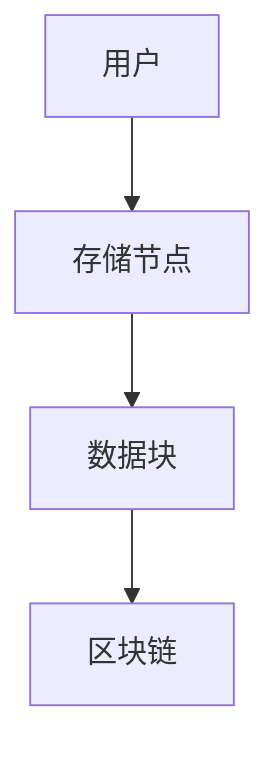
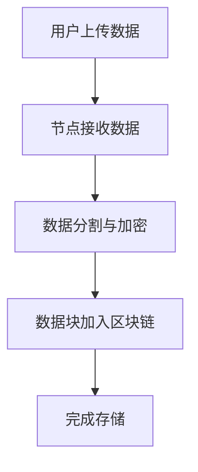
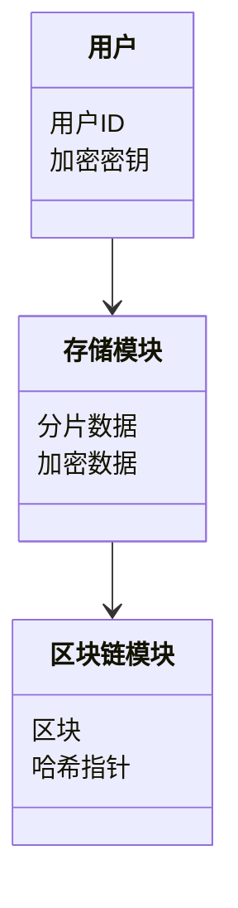
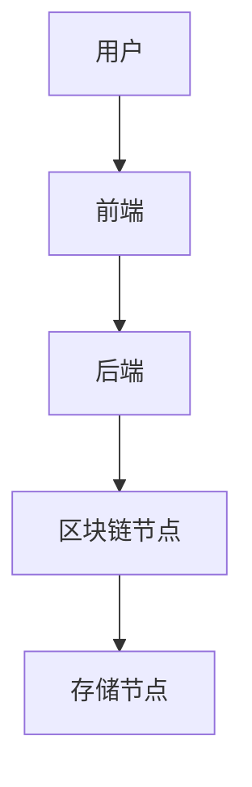
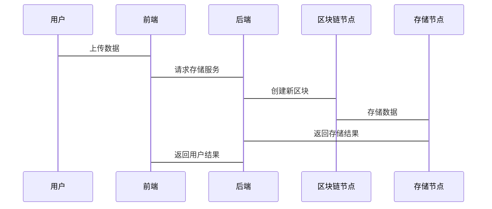

                 


# 如何评估企业的区块链去中心化存储平台

**关键词**：区块链、去中心化存储、评估指标、安全性、共识机制、加密算法、系统架构

**摘要**：  
区块链去中心化存储平台为企业提供了高效、安全、抗审查的数据存储解决方案。本文从技术、安全、性能等多维度详细分析了如何评估企业区块链去中心化存储平台，并通过实际案例展示了评估过程。文章涵盖核心概念、评估指标、技术实现、系统架构等内容，为企业选择和优化区块链存储平台提供全面指导。

---

## 第一部分: 区块链去中心化存储平台概述

### 第1章: 区块链与去中心化存储概述

#### 1.1 区块链技术的基本概念
- **区块链的定义与核心原理**  
  区块链是一种去中心化的分布式账本技术，通过链式数据结构和密码学算法确保数据不可篡改。区块链的核心特性包括去中心化、不可篡改、可追溯性和抗审查性。

- **去中心化存储的定义与特点**  
  去中心化存储是将数据分散存储在多个节点上的存储方式，与传统的中心化存储相比，去中心化存储具有更高的安全性和抗攻击性。

- **区块链与去中心化存储的关系**  
  区块链为去中心化存储提供了信任机制和数据一致性保障，而去中心化存储则是区块链技术的重要应用场景之一。

#### 1.2 区块链去中心化存储的背景与现状
- **区块链技术的发展历程**  
  从比特币的诞生到以太坊的智能合约，区块链技术逐步成熟，应用场景不断扩展。

- **去中心化存储的市场需求与应用场景**  
  去中心化存储在金融、医疗、法律等领域具有广泛需求，尤其适用于数据隐私保护和抗审查性要求较高的场景。

- **当前市场中的主流平台分析**  
  当前主流的去中心化存储平台包括IPFS、Filecoin、Arweave等，每个平台都有其独特的优势和劣势。

#### 1.3 区块链去中心化存储的优势与挑战
- **优势：数据安全、抗审查、去信任化**  
  去中心化存储通过分布式的存储方式，确保数据的安全性和可用性。

- **挑战：性能瓶颈、成本问题、法律合规**  
  区块链去中心化存储在性能和成本方面仍面临挑战，同时法律合规问题也需要企业重点关注。

### 第2章: 区块链去中心化存储的核心概念与联系

#### 2.1 区块链的核心概念原理
- **区块链的基本数据结构（区块、链）**  
  区块链由区块和链组成，每个区块包含交易数据和哈希指针，确保数据的完整性和不可篡改性。

- **共识机制（PoW、PoS、Dpos等）**  
  共识机制是区块链的核心，确保所有节点达成一致。常见的共识机制包括工作量证明（PoW）、权益证明（PoS）和 delegated proof of stake（Dpos）。

- **加密算法（哈希函数、数字签名）**  
  哈希函数用于数据完整性验证，数字签名用于身份验证和数据加密。

#### 2.2 去中心化存储的核心属性特征对比
- **分布式存储 vs. 中心化存储**  
  分布式存储将数据分散在多个节点，中心化存储依赖单个中心节点。

- **数据冗余度与存储效率**  
  去中心化存储通过数据分片和冗余存储提高数据可靠性，但可能增加存储成本。

- **数据一致性与可用性**  
  区块链通过共识机制确保数据一致性，去中心化存储通过分布式网络提高数据可用性。

#### 2.3 ER实体关系图与流程图
- **ER实体关系图**  

- **流程图**  


### 第3章: 区块链去中心化存储的评估指标与方法

#### 3.1 评估指标
- **安全性评估（抗攻击性、抗审查性）**  
  评估平台的安全性，包括抵御恶意攻击和审查的能力。

- **去中心化程度（节点分布、治理机制）**  
  评估平台的去中心化程度，包括节点分布和治理机制的民主化程度。

- **性能指标（存储速度、响应时间）**  
  评估平台的性能，包括存储速度和响应时间。

- **成本效益分析（存储成本、交易费用）**  
  评估平台的经济性，包括存储成本和交易费用。

#### 3.2 评估方法
- **技术评估（共识机制、加密算法）**  
  评估平台的技术实现，包括共识机制和加密算法的选择。

- **安全性测试（漏洞扫描、渗透测试）**  
  通过漏洞扫描和渗透测试评估平台的安全性。

- **性能测试（负载测试、压力测试）**  
  通过负载测试和压力测试评估平台的性能。

- **经济模型分析（激励机制、成本结构）**  
  分析平台的经济模型，包括激励机制和成本结构。

### 第4章: 区块链去中心化存储的技术评估与实现

#### 4.1 共识机制的选择与实现
- **共识机制的选择**  
  根据平台的需求选择合适的共识机制，如PoW、PoS或Dpos。

- **共识机制的实现**  
  通过代码实现共识机制，确保数据一致性。

#### 4.2 加密算法的选择与实现
- **哈希函数的实现**  
  使用SHA-256等哈希函数实现数据完整性验证。

- **数字签名的实现**  
  使用椭圆曲线加密算法实现数字签名。

#### 4.3 区块链存储系统的实现
- **数据存储流程**  
  用户上传数据后，系统将其分割、加密，并存储在区块链上。

- **数据检索流程**  
  用户通过区块链地址检索数据，系统解密并返回数据。

---

## 第二部分: 区块链去中心化存储系统的架构与实现

### 第5章: 系统架构设计与实现

#### 5.1 系统功能设计
- **领域模型设计**  
  通过类图展示系统功能模块，包括用户模块、存储模块、区块链模块等。



- **系统架构设计**  
  采用分层架构，包括前端、后端、区块链节点和存储节点。



- **系统接口设计**  
  定义系统接口，包括数据上传、数据检索、数据删除等接口。

- **系统交互设计**  
  通过序列图展示系统交互流程。



### 第6章: 项目实战与代码实现

#### 6.1 环境安装
- **安装区块链框架**  
  安装以太坊Solidity和Golang等开发环境。

- **安装存储库**  
  安装IPFS或其他分布式存储工具。

#### 6.2 核心代码实现
- **数据分片代码**  
  ```python
  def shard_data(data):
      # 将数据分成多个片段
      return [data[i:i+100] for i in range(0, len(data), 100)]
  ```

- **加密算法实现**  
  ```python
  import hashlib
  def hash_data(data):
      return hashlib.sha256(data.encode()).hexdigest()
  ```

- **区块链交互代码**  
  ```python
  from web3 import Web3
  w3 = Web3(Web3.HTTPProvider("http://localhost:8545"))
  def send_transaction(account, recipient, amount):
      transaction = {
          'from': account,
          'to': recipient,
          'value': amount,
          'gas': 100000,
          'gasPrice': w3.toWei(20, 'gwei'),
          'chainId': 1337
      }
      signed_transaction = w3.eth.account.signTransaction(transaction, account.private_key)
      tx_hash = w3.eth.sendRawTransaction(signed_transaction.rawTransaction)
      return tx_hash
  ```

#### 6.3 实际案例分析
- **案例背景**  
  企业需要存储大量敏感数据，选择Filecoin进行去中心化存储。

- **案例分析**  
  通过Filecoin的激励机制和IPFS的分布式存储技术，实现数据的安全存储和高效访问。

- **代码实现解读**  
  解释代码的功能和实现原理，展示如何通过代码实现数据存储和检索。

---

## 第三部分: 总结与最佳实践

### 第7章: 总结与最佳实践

#### 7.1 总结
- **核心总结**  
  区块链去中心化存储平台具有高效、安全、抗审查等优势，但也面临性能和成本等挑战。

#### 7.2 最佳实践 tips
- **选择合适的平台**  
  根据企业需求选择合适的去中心化存储平台，如Filecoin、IPFS等。

- **关注经济模型**  
  评估平台的经济模型，确保成本可控。

- **确保法律合规**  
  确保平台符合当地法律法规，避免法律风险。

#### 7.3 未来展望
- **技术发展**  
  区块链和去中心化存储技术将持续发展，应用场景将更加广泛。

---

通过以上结构，企业可以全面了解如何评估区块链去中心化存储平台，并在实际应用中做出明智决策。

