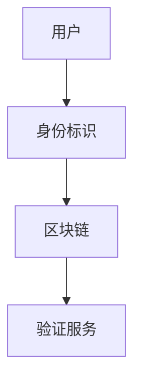

                 


# 如何评估企业的区块链去中心化身份验证平台

> 关键词：区块链, 去中心化身份验证, DID, 身份验证, 区块链技术, 评估标准

> 摘要：本文旨在详细探讨如何评估企业区块链去中心化身份验证平台。文章首先介绍了区块链技术和去中心化身份验证的基本概念与背景，随后深入分析了去中心化身份验证平台的核心概念与原理，包括DID（Decentralized Identity）和区块链在身份验证中的应用价值。接着，文章详细阐述了评估区块链去中心化身份验证平台的标准与方法，涵盖了技术评估、安全评估和性能评估等多个维度，并提供了具体的评估流程与操作指南。最后，文章结合实际案例，探讨了系统分析与架构设计，以及项目实战中的环境安装、代码实现和案例分析等内容，为读者提供了全面的评估方法和实践指南。

---

# 第1章: 区块链去中心化身份验证平台的背景与概念

## 1.1 区块链技术概述
### 1.1.1 区块链的基本概念与特点
区块链是一种分布式账本技术，通过去中心化的共识机制、数据加密和智能合约等技术，实现数据的安全存储和价值传递。其核心特点包括去中心化、不可篡改、透明性和抗审查性。

### 1.1.2 区块链的核心技术原理
区块链通过链式结构存储数据，每个区块包含数据和哈希指针，确保数据的完整性和一致性。共识机制（如PoW、PoS）用于验证交易的有效性，智能合约则实现了自动化的业务逻辑。

### 1.1.3 区块链的分类与应用场景
区块链主要分为公有链、联盟链和私有链。公有链如比特币和以太坊，适用于去中心化金融（DeFi）和数字资产交易；联盟链如Hyperledger，适用于企业内部或特定机构的协作场景；私有链则用于特定组织的内部数据管理。

## 1.2 去中心化身份验证的定义与特点
### 1.2.1 去中心化身份验证的定义
去中心化身份验证（Decentralized Identity Verification，DIV）是指利用区块链技术，通过去中心化的身份标识（DID）实现用户身份的验证与管理。用户无需依赖中心化机构，即可通过区块链上的数据完成身份验证。

### 1.2.2 去中心化身份验证的核心特点
- **去中心化**：数据存储在分布式节点中，避免单点故障和数据垄断。
- **安全性**：通过加密技术和区块链特性，确保数据的完整性和不可篡改性。
- **隐私性**：用户可以自主控制自己的身份信息，选择性地分享数据。
- **可扩展性**：基于区块链的技术特性，支持大规模用户和场景的应用。

### 1.2.3 去中心化身份验证与传统身份验证的区别
| **属性**             | **传统身份验证**                | **去中心化身份验证**              |
|----------------------|-------------------------------|----------------------------------|
| 中心化程度           | 高                            | 低                                |
| 数据存储方式         | 中心化机构存储                  | 去中心化存储                      |
| 数据控制权           | 由中心机构控制                  | 用户自主控制                      |
| 安全性                 | 中等，依赖中心机构的安全性      | 高，依赖区块链的安全性和加密技术  |
| 扩展性               | 有限，受中心机构限制            | 较高，支持大规模扩展              |

## 1.3 区块链去中心化身份验证平台的背景与意义
### 1.3.1 当前身份验证领域的痛点与挑战
- **数据泄露风险**：中心化机构存储的大量用户数据容易成为黑客攻击的目标。
- **信任问题**：用户对中心化机构的信任不足，数据滥用问题频发。
- **效率低下**：复杂的验证流程和跨机构协作导致身份验证效率低下。

### 1.3.2 区块链技术在身份验证中的应用价值
- **提升安全性**：通过区块链的不可篡改性和加密技术，保障身份信息的安全。
- **增强隐私性**：用户可以自主选择分享哪些信息，保护个人隐私。
- **降低信任成本**：去中心化的特性减少了对中心化机构的信任依赖，降低信任成本。

### 1.3.3 去中心化身份验证平台的行业发展趋势
随着区块链技术的成熟和隐私保护意识的增强，去中心化身份验证在金融、医疗、教育等领域的需求日益增长。企业通过部署去中心化身份验证平台，可以提升用户体验、降低运营成本，并增强数据安全性和隐私保护。

## 1.4 本章小结
本章主要介绍了区块链技术和去中心化身份验证的基本概念、特点以及两者的区别。同时，分析了当前身份验证领域的痛点和区块链技术的应用价值，为后续的评估工作奠定了理论基础。

---

# 第2章: 区块链去中心化身份验证平台的核心概念与原理

## 2.1 去中心化身份标识（DID）的概念与特点
### 2.1.1 去中心化身份标识的定义
去中心化身份标识（Decentralized Identity，DID）是一种基于区块链的技术，允许用户自主控制自己的身份信息，并通过去中心化的方式完成身份验证。

### 2.1.2 DID的核心属性与特征
- **自主性**：用户可以自主管理自己的身份信息，无需依赖中心化机构。
- **去中心化**：数据存储在区块链上，通过分布式节点实现数据的安全性和可靠性。
- **可验证性**：通过区块链上的智能合约和加密技术，实现身份信息的可验证性。

### 2.1.3 DID与传统身份标识的对比
| **属性**       | **传统身份标识**      | **DID**               |
|----------------|-----------------------|-----------------------|
| 控制权         | 中心化机构控制        | 用户自主控制          |
| 存储方式       | 中心化存储            | 去中心化存储          |
| 可验证性       | 依赖中心化机构验证    | 基于区块链技术验证    |

## 2.2 区块链在身份验证中的关键角色
### 2.2.1 区块链的去中心化特性在身份验证中的应用
区块链的去中心化特性使得身份验证不再依赖于单一机构，用户可以在多个场景中自主验证自己的身份信息。

### 2.2.2 区块链的不可篡改性对身份验证的信任保障
区块链的不可篡改性确保了身份信息的真实性和完整性，避免了数据被篡改或伪造的风险。

### 2.2.3 区块链的智能合约在身份验证中的自动化作用
智能合约可以自动执行身份验证的规则和流程，例如自动验证用户的身份信息或触发验证成功的事件。

## 2.3 去中心化身份验证平台的系统架构
### 2.3.1 基于区块链的身份验证系统架构
一个典型的去中心化身份验证平台通常包括以下几个部分：
- **用户端**：用户通过客户端提交身份验证请求。
- **区块链网络**：存储用户的身份信息和验证记录。
- **智能合约**：自动执行身份验证的规则和流程。
- **验证服务端**：负责接收验证请求并返回验证结果。

### 2.3.2 去中心化身份验证平台的组成部分
1. **用户身份标识**：通过DID技术生成用户的唯一标识。
2. **身份信息存储**：将用户的身份信息存储在区块链上。
3. **智能合约**：实现身份验证的自动化流程。
4. **验证服务**：负责接收验证请求并返回结果。

### 2.3.3 平台的用户、服务提供者和验证者角色分析
- **用户**：拥有自己的身份标识，可以在不同场景中进行身份验证。
- **服务提供者**：提供基于区块链的去中心化身份验证服务。
- **验证者**：负责验证用户的身份信息，并返回验证结果。

## 2.4 核心概念属性特征对比表
| **属性**       | **传统身份验证** | **去中心化身份验证** |
|----------------|------------------|-----------------------|
| 中心化程度     | 高               | 低                     |
| 安全性         | 中等             | 高                     |
| 可扩展性       | 有限             | 高                     |
| 数据控制权     | 中心机构控制     | 用户自主控制           |

## 2.5 ER实体关系图


## 2.6 本章小结
本章深入探讨了区块链去中心化身份验证平台的核心概念与原理，重点介绍了DID的概念、区块链在身份验证中的角色以及平台的系统架构。通过对比分析，读者可以清晰地理解去中心化身份验证与传统身份验证的区别和优势。

---

# 第3章: 评估区块链去中心化身份验证平台的标准与方法

## 3.1 技术评估标准
### 3.1.1 区块链技术的成熟度
评估区块链平台的技术成熟度，包括区块链的性能、安全性、可扩展性和稳定性。

### 3.1.2 智能合约的安全性
检查智能合约的代码是否存在漏洞，评估其安全性和可靠性。

### 3.1.3 网络性能与扩展性
评估区块链网络的处理速度、延迟和吞吐量，确保其能够支持大规模用户和交易。

## 3.2 安全评估标准
### 3.2.1 身份验证的安全性
评估身份验证流程的安全性，包括防止身份 theft、数据泄露和恶意攻击的能力。

### 3.2.2 数据隐私保护
检查平台对用户数据的隐私保护措施，确保用户信息不会被滥用或泄露。

### 3.2.3 抵赖性与抗篡改性
评估平台是否具备抗抵赖性和抗篡改性，确保数据的真实性和完整性。

## 3.3 性能评估标准
### 3.3.1 处理速度与吞吐量
评估平台每秒可以处理的交易数量和响应时间，确保其能够满足实际应用的需求。

### 3.3.2 网络延迟
检查区块链网络的延迟情况，确保其不会影响用户体验。

### 3.3.3 资源消耗效率
评估平台的资源消耗效率，包括计算资源、存储资源和带宽利用率。

## 3.4 本章小结
本章详细阐述了评估区块链去中心化身份验证平台的标准与方法，包括技术、安全和性能三个方面的评估指标。通过这些评估标准，读者可以全面了解平台的技术能力和安全性，为后续的系统分析与架构设计提供依据。

---

# 第4章: 评估方法与流程

## 4.1 评估流程概述
### 4.1.1 明确评估目标
根据实际需求确定评估的目标和范围，例如评估平台的安全性、性能或功能性。

### 4.1.2 收集评估数据
通过问卷调查、技术文档分析和实际测试等方式，收集与评估目标相关的数据。

### 4.1.3 评估数据的分析与处理
对收集到的数据进行整理和分析，识别出关键问题和改进方向。

### 4.1.4 评估结果的呈现
将评估结果以报告或图表的形式呈现，确保结果清晰易懂。

## 4.2 评估工具与技术
### 4.2.1 区块链性能测试工具
使用如JMeter、Postman等工具测试区块链网络的性能。

### 4.2.2 智能合约审计工具
通过静态分析和动态测试工具，检查智能合约的安全性。

### 4.2.3 数据隐私保护评估工具
使用隐私保护评估框架，检查平台的数据隐私保护措施。

## 4.3 本章小结
本章介绍了评估区块链去中心化身份验证平台的具体方法与流程，包括评估目标的确定、数据的收集与分析，以及评估工具的使用。这些方法和流程为读者提供了实际操作的指南。

---

# 第5章: 系统分析与架构设计

## 5.1 系统功能设计
### 5.1.1 用户身份标识管理
用户可以在平台上生成和管理自己的DID，实现身份信息的自主控制。

### 5.1.2 身份验证流程
用户可以通过提交DID和相关证明材料，完成身份验证。

### 5.1.3 智能合约实现
智能合约用于自动执行身份验证的规则和流程，确保验证过程的自动化和透明化。

## 5.2 系统架构设计
### 5.2.1 总体架构设计
平台的总体架构包括用户端、区块链网络、智能合约和验证服务端。

### 5.2.2 关键模块设计
- **用户端**：负责用户身份标识的生成和提交。
- **区块链网络**：存储用户身份信息和验证记录。
- **智能合约**：自动执行身份验证规则。
- **验证服务端**：接收验证请求并返回结果。

## 5.3 系统接口设计
### 5.3.1 用户身份标识接口
- `POST /api/did/create`：用户创建DID。
- `POST /api/did/verify`：用户提交DID进行验证。

### 5.3.2 区块链接口
- `POST /api/blockchain/submit`：提交智能合约到区块链。
- `GET /api/blockchain/verify`：查询验证结果。

## 5.4 本章小结
本章通过系统功能设计和架构设计，展示了区块链去中心化身份验证平台的整体结构和关键模块。通过明确各部分的功能和接口设计，为后续的项目实施提供了清晰的指导。

---

# 第6章: 项目实战

## 6.1 环境安装
### 6.1.1 安装区块链平台
选择合适的区块链平台（如以太坊、Hyperledger Fabric）并完成安装和配置。

### 6.1.2 安装智能合约开发工具
安装Solidity编译器、以太坊钱包等开发工具，为后续的智能合约开发做好准备。

## 6.2 系统核心实现源代码
### 6.2.1 智能合约实现
```solidity
// SPDX-License-Identifier: MIT
pragma solidity ^0.8.0;

contract IdentityVerifier {
    mapping(address => bytes32) private userDIDs;

    function createUserDID(address user, bytes32 did) public {
        userDIDs[user] = did;
    }

    function verifyDID(address user, bytes32 did) public view returns (bool) {
        return userDIDs[user] == did;
    }
}
```

### 6.2.2 用户身份验证接口
```python
import requests

def create_did(user_address):
    response = requests.post('http://localhost:5000/api/did/create', json={'address': user_address})
    return response.json()

def verify_did(user_address, did):
    response = requests.post('http://localhost:5000/api/did/verify', json={'address': user_address, 'did': did})
    return response.json()
```

## 6.3 代码应用解读与分析
### 6.3.1 智能合约分析
上述智能合约实现了用户身份标识的创建和验证功能。`createUserDID`函数将用户的地址与DID关联起来，`verifyDID`函数用于验证用户的DID是否正确。

### 6.3.2 用户身份验证接口分析
Python代码通过HTTP请求与区块链平台进行交互，实现用户的DID创建和验证功能。`create_did`函数向后端发送创建DID的请求，`verify_did`函数向后端发送验证请求。

## 6.4 实际案例分析和详细讲解剖析
### 6.4.1 案例背景
某企业希望部署一个基于区块链的去中心化身份验证平台，用于员工的身份验证和权限管理。

### 6.4.2 案例实施步骤
1. 安装并配置区块链平台。
2. 编写并部署智能合约。
3. 开发用户身份验证接口。
4. 进行测试和优化。

## 6.5 项目小结
本章通过实际案例分析，展示了如何在企业中部署和实施区块链去中心化身份验证平台。通过环境安装、代码实现和案例分析，读者可以深入了解项目的实施过程和关键点。

---

# 第7章: 最佳实践与注意事项

## 7.1 最佳实践
### 7.1.1 确保智能合约的安全性
在部署智能合约前，必须进行严格的代码审计和漏洞测试，确保合约的安全性。

### 7.1.2 选择合适的区块链平台
根据实际需求选择合适的区块链平台，例如选择公有链、联盟链或私有链。

### 7.1.3 优化系统性能
通过优化区块链网络的性能和智能合约的执行效率，提升系统的整体性能。

## 7.2 注意事项
### 7.2.1 数据隐私保护
在设计和实施过程中，必须重视用户数据的隐私保护，避免数据泄露和滥用。

### 7.2.2 系统安全性
确保系统的安全性，防止恶意攻击和数据篡改，保障用户身份信息的安全。

### 7.2.3 系统可扩展性
在设计系统时，应充分考虑系统的可扩展性，确保其能够支持未来业务的发展需求。

## 7.3 本章小结
本章总结了在评估和实施区块链去中心化身份验证平台过程中的最佳实践和注意事项，为读者提供了实用的指导和建议。

---

# 第8章: 小结与展望

## 8.1 本书小结
本文详细探讨了如何评估企业区块链去中心化身份验证平台，从背景与概念、核心概念与原理、评估标准与方法、评估流程与工具、系统分析与架构设计，到项目实战与最佳实践，为读者提供了全面的评估方法和实践指南。

## 8.2 未来展望
随着区块链技术的不断发展和隐私保护需求的增加，去中心化身份验证平台将在更多领域得到广泛应用。未来的研究可以进一步探索如何提升平台的性能、优化智能合约的安全性，并推动DID技术的标准化和普及。

---

# 附录

## 附录A: 术语表
- **区块链**：分布式账本技术，通过去中心化的共识机制实现数据的安全存储和价值传递。
- **DID（Decentralized Identity）**：去中心化身份标识，用户自主控制的身份信息。
- **智能合约**：自动执行特定规则和流程的代码，运行在区块链上。

## 附录B: 工具与资源
- **Solidity**：以太坊智能合约编程语言。
- **Web3.js**：用于与以太坊区块链交互的JavaScript库。
- **Truffle Suite**：智能合约开发和部署工具。

## 附录C: 进一步阅读
- 《Blockchain Basics: A Hands-On Approach to Distributed Ledger Technology》
- 《Decentralized Identity: A Primer》
- 《Smart Contracts: The Promise, Challenges, and Future of Legal Agreements in the Digital Age》

---

通过以上目录结构，您可以逐步深入理解如何评估企业区块链去中心化身份验证平台。每章内容都结合理论与实践，帮助读者全面掌握评估方法和实际应用。

