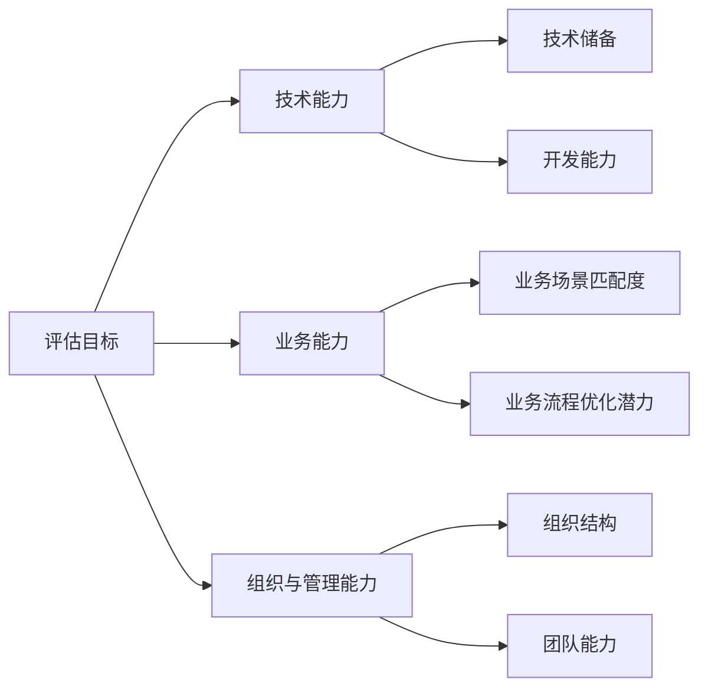
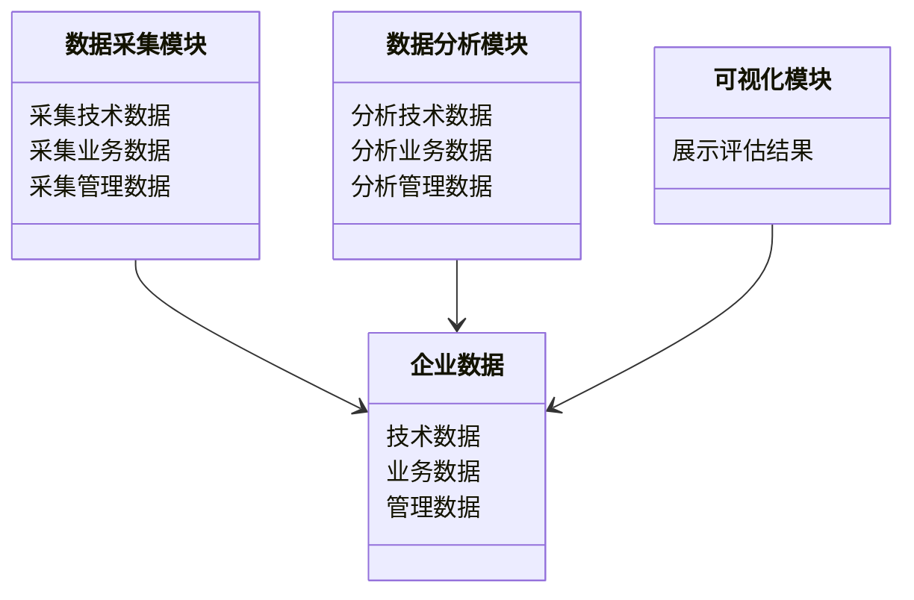
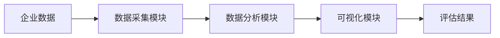

                 


# 如何评估企业的区块链应用能力

---

## 关键词：区块链，企业应用，评估指标，应用场景，技术能力

---

## 摘要：  
随着区块链技术的快速发展，企业对其应用能力的评估变得至关重要。本文从区块链的核心概念、技术原理、企业应用场景出发，构建了一套系统的评估模型，涵盖技术、业务和组织管理能力的多维度分析。通过实际案例分析和系统架构设计，本文为读者提供了如何在企业中有效评估区块链应用能力的方法，帮助企业优化资源配置，提升业务效率和创新能力。

---

## 第一部分：企业区块链应用能力评估概述

---

### 第1章：区块链技术与企业应用概述

#### 1.1 区块链技术的核心概念

##### 1.1.1 区块链的定义与基本原理  
区块链是一种去中心化的分布式账本技术，通过密码学和共识机制确保数据的安全性和不可篡改性。其核心原理包括：

- **分布式账本**：数据分布在多个节点上，每个节点都有完整的账本副本。
- **共识机制**：通过算法（如比特币的PoW、以太坊的PoS）达成全网一致的账本状态。
- **智能合约**：自动执行的代码，根据预设条件触发操作。

##### 1.1.2 区块链的核心特点  
与传统信息技术相比，区块链具有以下独特特点：

| 特性       | 描述                                                                 |
|------------|----------------------------------------------------------------------|
| 去中心化   | 无须依赖中心机构，节点共同维护数据一致性。                           |
| 不可篡改性  | 数据一旦写入，无法被修改，确保了数据的可信性。                     |
| 可追溯性   | 每个交易都可以追溯来源，便于追踪和审计。                           |
| 自动化执行  | 通过智能合约实现业务逻辑的自动化处理。                             |

##### 1.1.3 区块链与传统信息技术的对比  
以下是区块链与传统信息技术的关键对比：

| 对比维度         | 区块链                  | 传统信息技术             |
|------------------|-------------------------|--------------------------|
| 中心化程度       | 去中心化                | 高度中心化               |
| 数据安全性       | 高，通过密码学保护       | 较低，依赖中心机构的安全性|
| 可扩展性         | 受限于共识机制，扩展性有限 | 较高，可以根据需求扩展    |

---

#### 1.2 区块链在企业中的应用背景

##### 1.2.1 企业数字化转型的现状  
当前，企业正面临数字化转型的压力，区块链技术为企业提供了新的解决方案。通过区块链，企业可以实现数据共享、流程优化和信任机制的构建。

##### 1.2.2 区块链技术对企业价值的提升  
区块链技术可以帮助企业：

- **提升效率**：通过自动化流程减少人工干预。
- **降低成本**：去中心化的账本减少了中间环节。
- **增强信任**：数据的透明性和不可篡改性增加了各方的信任。

##### 1.2.3 企业区块链应用的典型场景  
以下是区块链在企业中的典型应用场景：

1. **供应链管理**：通过区块链记录产品流转信息，实现全程可追溯。
2. **资产数字化**：将实物资产转化为数字资产，便于交易和管理。
3. **金融支付与结算**：通过区块链实现快速、低成本的跨境支付。
4. **数据共享与隐私保护**：在保护隐私的前提下实现数据共享。

---

#### 1.3 企业区块链应用能力评估的重要性

##### 1.3.1 评估能力的必要性  
企业在引入区块链技术前，需要明确自身的技术储备和业务需求。通过评估能力，企业可以避免盲目投入，确保技术与业务的匹配。

##### 1.3.2 评估能力的目标与意义  
评估目标包括：

- 确定企业区块链技术的应用潜力。
- 识别技术瓶颈和业务痛点。
- 制定合理的实施计划和资源分配。

##### 1.3.3 评估能力的边界与外延  
区块链应用能力评估不仅关注技术本身，还涉及业务流程、组织结构和合规性等多个方面。评估的外延包括技术实现、业务价值和长期发展。

---

## 第2章：区块链技术的核心原理与企业应用

#### 2.1 区块链的核心技术原理

##### 2.1.1 分布式账本  
分布式账本是区块链的核心数据结构，每个节点都维护一份完整的账本副本。通过共识机制确保账本的一致性。

##### 2.1.2 共识机制  
共识机制是区块链的核心算法，确保所有节点达成一致。常见的共识机制包括：

- **PoW（工作量证明）**：通过计算哈希函数来验证交易。
- **PoS（权益证明）**：根据节点持有的代币数量分配记账权。
- **BFT（拜占庭容错）**：适用于高性能场景。

##### 2.1.3 智能合约  
智能合约是区块链上的自动执行程序，用于实现复杂的业务逻辑。例如，当某个条件满足时，自动执行相应的操作。

##### 2.1.4 加密技术  
区块链使用公钥加密技术确保数据的安全性，每个节点都有唯一的公私钥对，用于签名和验证交易。

---

#### 2.2 区块链在企业中的应用场景

##### 2.2.1 供应链管理  
区块链可以实现供应链的全流程追溯，从原材料采购到最终产品的交付，确保每一步的信息真实可靠。

##### 2.2.2 资产数字化  
通过区块链技术，企业可以将实物资产转化为数字资产，提升资产的流动性和透明度。

##### 2.2.3 金融支付与结算  
区块链技术可以实现快速、低成本的跨境支付和结算，减少传统金融体系中的中间环节。

##### 2.2.4 数据共享与隐私保护  
在保护隐私的前提下，区块链可以实现数据的共享与协作，避免数据泄露风险。

---

#### 2.3 区块链技术对企业业务的影响

##### 2.3.1 提升业务效率  
通过自动化流程和去中心化的特点，区块链可以显著提升企业的业务效率。

##### 2.3.2 降低运营成本  
区块链技术减少了中间环节和人工干预，从而降低了企业的运营成本。

##### 2.3.3 增强信任与透明度  
区块链的透明性和不可篡改性增强了企业与合作伙伴之间的信任。

---

## 第三部分：企业区块链应用能力评估模型与框架

---

### 第3章：企业区块链应用能力评估模型

#### 3.1 评估模型的构建逻辑

##### 3.1.1 评估目标的确定  
评估目标是帮助企业明确区块链技术的应用潜力和实施路径。

##### 3.1.2 评估维度的划分  
评估维度包括技术能力、业务能力、组织与管理能力三个主要方面。

##### 3.1.3 评估指标的设计  
评估指标应具体、可量化，例如技术能力指标包括技术储备、开发能力等。

---

#### 3.2 企业区块链应用能力评估框架

##### 3.2.1 技术能力评估  
技术能力评估包括以下指标：

- **技术储备**：企业是否具备区块链相关的技术储备。
- **开发与集成能力**：企业是否能够开发和集成区块链系统。
- **运维与管理能力**：企业是否具备区块链系统的运维能力。

##### 3.2.2 业务能力评估  
业务能力评估包括以下指标：

- **业务场景匹配度**：区块链技术是否适用于企业的业务场景。
- **业务流程优化潜力**：区块链技术是否能够优化企业的业务流程。
- **业务价值实现能力**：区块链技术是否能够为企业创造价值。

##### 3.2.3 组织与管理能力评估  
组织与管理能力评估包括以下指标：

- **组织结构**：企业是否具备支持区块链技术的组织结构。
- **团队能力**：企业是否具备区块链技术相关的专业团队。
- **管理能力**：企业是否具备区块链技术的管理能力。

---

#### 3.3 评估模型的可视化表示

##### 3.3.1 鱼骨图分析  
以下是鱼骨图分析的示意图：



##### 3.3.2 矩阵图分析  
以下是矩阵图分析的示意图：

```mermaid
matrix title 区块链应用能力评估矩阵
| 评估维度 | 技术能力 | 业务能力 | 组织与管理能力 |
|----------|----------|----------|----------------|
| 重要性   | 高       | 中       | 高              |
| 难度     | 中       | 高       | 中              |
```

---

### 第4章：企业区块链应用能力评估维度与指标

#### 4.1 技术能力评估维度

##### 4.1.1 区块链技术储备  
企业是否具备区块链相关的技术储备，例如是否拥有区块链开发人员或相关工具。

##### 4.1.2 开发与集成能力  
企业是否能够开发和集成区块链系统，例如是否具备智能合约开发能力。

##### 4.1.3 运维与管理能力  
企业是否具备区块链系统的运维能力，例如是否能够监控和维护区块链节点。

#### 4.2 业务能力评估维度

##### 4.2.1 业务场景匹配度  
区块链技术是否适用于企业的具体业务场景，例如供应链管理。

##### 4.2.2 业务流程优化潜力  
区块链技术是否能够优化企业的业务流程，例如减少中间环节。

##### 4.2.3 业务价值实现能力  
区块链技术是否能够为企业创造价值，例如提升效率和降低成本。

#### 4.3 组织与管理能力评估维度

##### 4.3.1 组织结构  
企业是否具备支持区块链技术的组织结构，例如是否设有专门的区块链团队。

##### 4.3.2 团队能力  
企业是否具备区块链技术相关的专业团队，例如是否拥有区块链开发人员。

##### 4.3.3 管理能力  
企业是否具备区块链技术的管理能力，例如是否能够制定合理的实施计划。

---

## 第四部分：企业区块链应用能力评估系统分析与架构设计

---

### 第5章：企业区块链应用能力评估系统分析与架构设计

#### 5.1 系统需求分析

##### 5.1.1 业务目标  
系统的目的是帮助企业评估区块链应用能力，优化资源配置。

##### 5.1.2 技术需求  
系统需要具备数据采集、分析和可视化的功能。

##### 5.1.3 用户需求  
用户包括企业技术负责人、业务负责人和管理层。

#### 5.2 系统功能设计

##### 5.2.1 核心功能模块  
- 数据采集模块：采集企业的技术、业务和管理数据。
- 数据分析模块：对数据进行分析，生成评估结果。
- 可视化模块：将评估结果以图表形式展示。

##### 5.2.2 数据结构设计  
以下是系统数据结构的类图：



##### 5.2.3 系统架构设计  
以下是系统的架构图：



---

### 第6章：企业区块链应用能力评估项目实战

#### 6.1 项目背景与目标

##### 6.1.1 项目背景  
某企业计划引入区块链技术，优化其供应链管理流程。

##### 6.1.2 项目目标  
评估企业区块链应用能力，制定合理的实施计划。

#### 6.2 项目实施步骤

##### 6.2.1 环境安装  
安装必要的工具，例如Geth、Solidity等。

##### 6.2.2 系统核心实现  
编写智能合约代码，部署区块链节点。

##### 6.2.3 功能测试  
测试系统的各项功能，确保正常运行。

##### 6.2.4 评估与优化  
根据测试结果，优化系统的各项指标。

#### 6.3 项目小结

##### 6.3.1 项目成果  
完成了企业区块链应用能力的评估，明确了实施路径。

##### 6.3.2 经验总结  
区块链技术的应用需要企业的技术、业务和管理能力的全面配合。

---

## 第五部分：企业区块链应用能力评估的最佳实践与未来展望

---

### 第7章：企业区块链应用能力评估的最佳实践

#### 7.1 技术能力提升建议

##### 7.1.1 加强技术储备  
企业应加强区块链技术的储备，例如通过培训和招聘等方式。

##### 7.1.2 提升开发能力  
企业应提升区块链系统的开发能力，例如学习Solidity编程语言。

##### 7.1.3 健全运维体系  
企业应健全区块链系统的运维体系，例如制定监控和维护计划。

#### 7.2 业务能力优化建议

##### 7.2.1 明确业务场景  
企业应明确区块链技术的适用场景，例如供应链管理。

##### 7.2.2 优化业务流程  
企业应优化业务流程，例如通过区块链实现自动化的订单处理。

##### 7.2.3 提升业务价值  
企业应通过区块链技术提升业务价值，例如通过智能合约实现自动化支付。

#### 7.3 组织与管理能力优化建议

##### 7.3.1 完善组织结构  
企业应完善支持区块链技术的组织结构，例如设立专门的区块链团队。

##### 7.3.2 建设专业团队  
企业应建设专业的区块链技术团队，例如招聘区块链开发人员。

##### 7.3.3 加强管理能力  
企业应加强区块链技术的管理能力，例如制定合理的实施计划。

---

### 第8章：企业区块链应用能力评估的未来展望

#### 8.1 区块链技术的发展趋势  
未来，区块链技术将更加成熟，应用场景将更加广泛。

#### 8.2 企业区块链应用能力评估的拓展  
企业区块链应用能力评估将更加注重技术与业务的深度融合。

#### 8.3 未来挑战与机遇  
区块链技术的发展将带来新的挑战和机遇，企业需要提前布局，抓住机遇。

---

## 第六部分：结论与展望

---

### 结论  
企业区块链应用能力评估是企业在数字化转型中不可或缺的重要环节。通过系统的评估模型和框架，企业可以明确自身的技术储备和业务需求，制定合理的实施计划，确保区块链技术的成功应用。

---

### 展望  
随着区块链技术的不断发展，企业区块链应用能力评估将更加注重技术与业务的深度融合。未来，企业需要加强技术储备和管理能力，抓住区块链技术带来的新机遇。

---

## 参考文献  
（此处可以列出相关的参考文献和进一步阅读的资料）

---

**感谢您的阅读！希望本文能够为企业在区块链应用能力评估方面提供有价值的参考和指导。**

