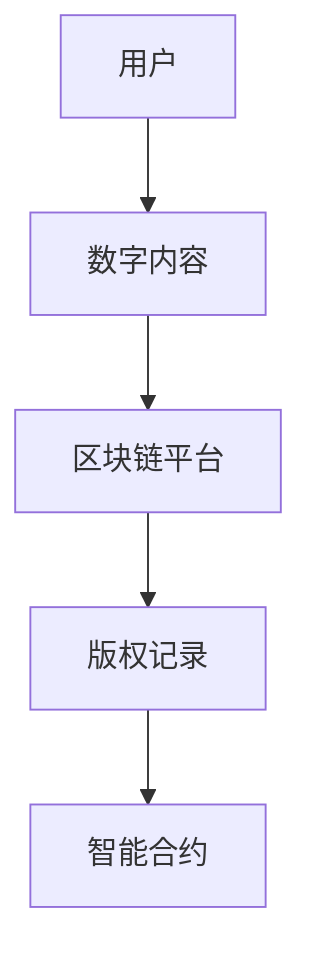
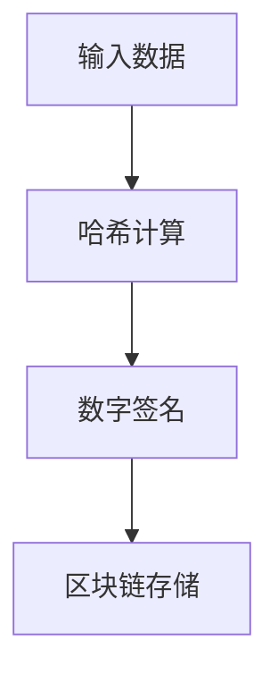
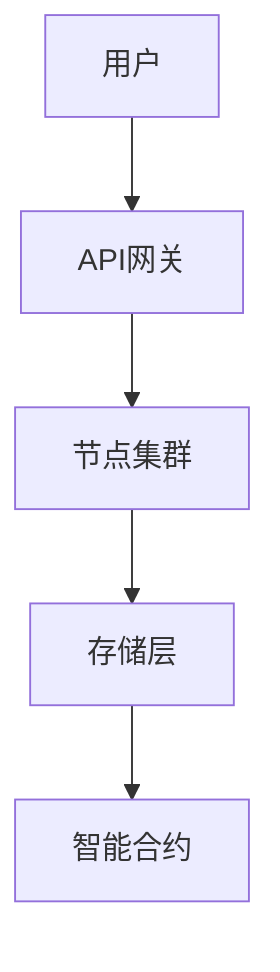
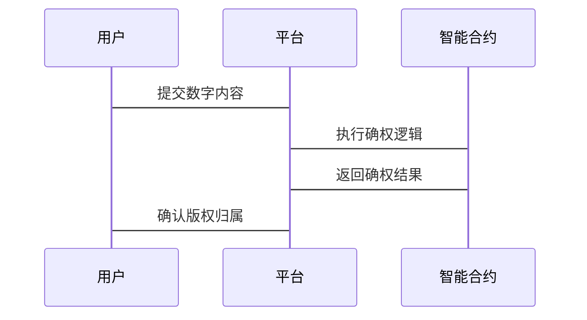

                 


# 如何评估企业的区块链数字版权保护平台

## 关键词：
区块链技术、数字版权保护、平台评估、技术架构、法律合规、项目实战

## 摘要：
在数字经济迅速发展的今天，数字版权保护已成为企业面临的重大挑战。区块链技术以其独特的优势，为数字版权保护提供了新的解决方案。本书从技术原理、系统架构、法律合规等多维度，详细解析区块链数字版权保护平台的关键要素，并结合实际案例，为企业评估和选择合适的平台提供系统化的指导。通过深入的技术分析和实战经验分享，本书旨在帮助读者掌握区块链数字版权保护的核心要点，实现高效、安全的版权管理。

---

# 正文目录

## 第一部分：区块链数字版权保护平台的背景与概念

### 第1章：数字版权保护的背景与问题背景

#### 1.1 数字版权保护的历史发展
- 从传统版权保护到数字版权保护的演变
- 数字化时代对版权保护的新要求

#### 1.2 当前数字版权保护的主要问题
- 数字内容的易复制性和传播性
- 版权确权和追溯的困难
- 中心化平台的局限性与信任问题

#### 1.3 区块链技术如何解决数字版权保护问题
- 区块链的去中心化特性
- 不可篡改性和透明性在版权保护中的应用

### 第2章：区块链技术的核心概念

#### 2.1 区块链的定义与基本原理
- 区块链的定义
- 区块链的基本组成：区块、链、节点
- 区块链的核心机制：分布式账本、共识算法、智能合约

#### 2.2 区块链的主要特点与优势
- 去中心化：避免单点故障，增强信任
- 不可篡改性：确保数据的真实性和完整性
- 透明性：可追溯，便于监管和审计

#### 2.3 区块链在数字版权保护中的应用潜力
- 数字内容的唯一标识与确权
- 版权交易的透明化与自动化
- 使用授权的可追踪性

### 第3章：区块链数字版权保护平台的定义与特点

#### 3.1 平台的定义
- 区块链数字版权保护平台的功能定义
- 平台的目标用户和应用场景

#### 3.2 平台的核心功能与特点
- 内容上链：数字内容的哈希值存储
- 版权确权：基于区块链的时间戳和身份认证
- 权益管理：智能合约实现版权授权和收益分配

#### 3.3 平台的边界与外延
- 平台的功能边界
- 平台与其他系统的接口关系
- 平台的扩展性和兼容性

#### 3.4 ER实体关系图（Mermaid）


---

## 第二部分：区块链数字版权保护的核心概念与技术原理

### 第4章：区块链与数字版权保护的核心概念

#### 4.1 区块链技术的核心原理
- 区块链的基本结构与工作流程
- 共识机制（PoW、PoS、Dpos）的原理与作用
- 智能合约的定义与执行流程

#### 4.2 数字版权保护的核心要素
- 数字内容的唯一标识与确权
- 版权的转移与授权机制
- 版权的使用与收益分配

#### 4.3 区块链在数字版权保护中的核心属性对比
- 去中心化与中心化对比
- 不可篡改性与可篡改性对比
- 透明性与隐私性对比

### 第5章：区块链数字版权保护的核心算法原理

#### 5.1 区块链共识机制的算法原理
- 工作量证明机制（PoW）：数学模型与流程
- 权益证明机制（PoS）：数学模型与流程
- 其他共识机制（如Dpos、Raft）的对比与分析

#### 5.2 智能合约的执行流程
- 合约编译与部署：代码编译与区块链部署
- 合约调用与执行：用户调用与链上执行
- 合约状态管理：状态存储与更新

#### 5.3 数字签名与哈希函数的数学模型
- 数字签名的数学模型
$$ \text{签名} = \text{PrivateKey} \times \text{内容摘要} $$
- 哈希函数的数学模型
$$ \text{哈希值} = H(\text{输入数据}) $$

#### 5.4 算法流程图（Mermaid）


---

## 第三部分：区块链数字版权保护的法律与合规

### 第6章：数字版权保护的法律框架

#### 6.1 数字版权保护的法律基础
- 知识产权法的基本原则
- 数字内容的法律地位与权利归属

#### 6.2 区块链证据存固定的法律效力
- 电子证据的法律认可
- 区块链证据在司法中的应用与挑战

#### 6.3 平台的合规性评估
- 数据隐私的合规性
- 合同条款的合法性
- 税收合规性

---

## 第四部分：区块链数字版权保护平台的技术评估与选择

### 第7章：平台技术选型与评估指标

#### 7.1 技术选型的关键因素
- 区块链平台的性能：TPS、延迟
- 平台的可扩展性：支持的用户和交易量
- 平台的安全性：抗攻击能力、漏洞修复

#### 7.2 平台评估的核心指标
- 技术指标：性能、安全性、可扩展性
- 功能指标：支持的版权类型、智能合约功能
- 用户体验：易用性、界面友好度

#### 7.3 平台选型的案例分析
- 某企业案例：选择以太坊公链的原因
- 另一案例：选择私有链的原因

---

## 第五部分：区块链数字版权保护平台的系统架构与设计

### 第8章：平台系统架构设计

#### 8.1 系统架构概述
- 平台的整体架构图（Mermaid）


#### 8.2 系统功能模块设计
- 内容上链模块：文件哈希计算与区块链存储
- 版权确权模块：时间戳记录与身份认证
- 权益管理模块：智能合约执行与收益分配

#### 8.3 系统接口设计
- API接口定义：RESTful API
- 智能合约接口：ABI规范

#### 8.4 系统交互设计
- 用户与平台的交互流程（Mermaid序列图）


---

## 第六部分：区块链数字版权保护平台的项目实战

### 第9章：项目实战与案例分析

#### 9.1 环境安装与配置
- 操作系统与工具：Ubuntu、Golang、Node.js
- 区块链平台的搭建：以太坊、Hyperledger Fabric

#### 9.2 核心代码实现
- 数字内容上链的代码示例：
```python
def hash_content(content):
    import hashlib
    return hashlib.sha256(content.encode()).hexdigest()
```
- 智能合约实现：
```solidity
contract CopyrightContract {
    function registerContent(string memory contentHash, address owner) public {
        // 实现版权登记逻辑
    }
}
```

#### 9.3 项目案例分析
- 某企业案例：平台搭建与功能实现
- 项目小结：经验与教训

---

## 第七部分：结论与展望

### 第10章：总结与未来展望

#### 10.1 全文总结
- 区块链数字版权保护平台的核心价值
- 平台评估的关键点：技术、法律、用户体验

#### 10.2 未来展望
- 新型共识机制的应用潜力
- 跨链技术的发展与融合
- AI与区块链的结合：智能合约的自动化执行与数据分析

---

## 参考文献与拓展阅读

- 区块链技术相关书籍
- 数字版权保护领域的最新研究
- 相关法律法规与政策文件

---

## 致谢

感谢读者的支持与关注，感谢在编写过程中提供帮助的团队成员。

---

通过以上目录，读者可以系统地学习如何评估企业的区块链数字版权保护平台，从技术、法律、系统架构等多个维度深入理解该领域的核心要点，并结合实际案例进行实践操作。

