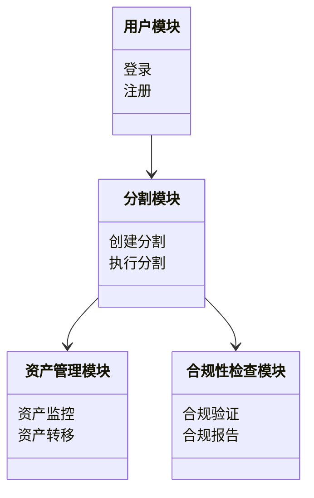
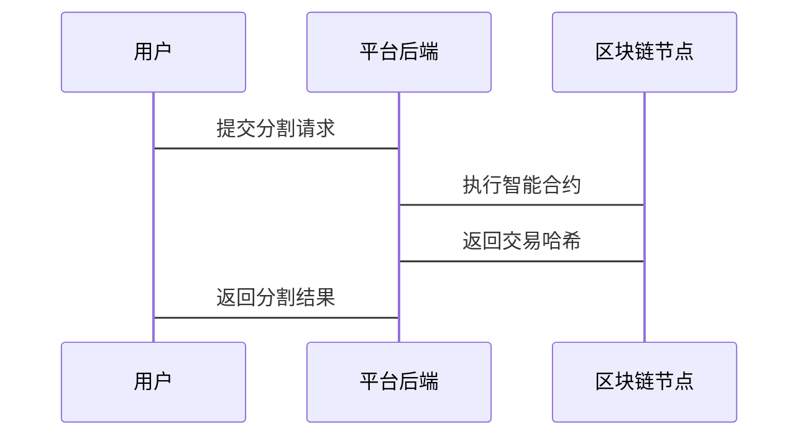

                 

# 如何评估企业的区块链数字资产分割平台

> **关键词：** 区块链、数字资产、分割平台、智能合约、合规性

> **摘要：**  
> 本文将详细介绍如何评估企业的区块链数字资产分割平台。从区块链技术的基本概念到数字资产的分割实现，从系统的架构设计到实际项目的实战案例，本文将全面解析区块链数字资产分割平台的评估方法。通过分析平台的核心要素、算法原理和系统架构，结合实际案例，帮助读者全面了解如何构建和评估一个高效的区块链数字资产分割平台。

---

# 第一部分: 区块链数字资产分割平台概述

## 第1章: 区块链数字资产分割平台的背景与概念

### 1.1 区块链技术的基本概念

#### 1.1.1 区块链的定义与核心特点
区块链是一种分布式账本技术，通过去中心化的结构存储数据，确保数据的安全性和一致性。其核心特点包括：
- **去中心化**：数据不由单个中心控制，而是分布在多个节点上。
- **不可篡改性**：通过链式结构和哈希值，确保数据无法被篡改。
- **透明性**：所有交易记录在区块链上公开透明，任何人都可以查看。

#### 1.1.2 数字资产的定义与分类
数字资产是指以数字形式存在的资产，包括加密货币、代币、NFT（非同质化代币）等。数字资产的分类如下：
- **加密货币**：如比特币（BTC）、以太坊（ETH），用于价值存储和交换。
- **代币**：基于特定区块链的通证，如ERC-20（以太坊上的代币）。
- **NFT**：唯一标识的数字资产，如数字艺术品、虚拟土地等。

#### 1.1.3 区块链在数字资产分割中的作用
区块链为数字资产的分割提供了技术支持，确保分割过程的透明、公正和不可篡改。通过智能合约，区块链可以自动执行分割逻辑，确保分割后的资产按需分配。

### 1.2 数字资产分割平台的背景

#### 1.2.1 数字资产分割的需求背景
随着数字资产的普及，个人和企业对数字资产的分割需求日益增加。例如，遗产规划、公司股权分配等场景都需要将数字资产分割给多个受益人。

#### 1.2.2 区块链技术如何解决分割问题
区块链技术通过智能合约实现了数字资产的自动分割，确保分割过程的公正性和透明性。智能合约可以在预设的条件下自动执行分割逻辑，减少人为干预。

#### 1.2.3 数字资产分割平台的市场现状
目前，市场上已经出现了一些数字资产分割平台，但大多数平台仍处于初级阶段，缺乏统一的标准和规范。企业需要结合自身需求，选择合适的平台或自行开发。

---

## 第2章: 区块链数字资产分割的核心概念

### 2.1 区块链技术原理

#### 2.1.1 区块链的基本结构
区块链由多个区块组成，每个区块包含一组交易数据和一个时间戳。区块通过哈希值连接，形成链式结构，确保数据的安全性和一致性。

#### 2.1.2 去中心化与共识机制
- **去中心化**：区块链通过分布式账本实现去中心化，避免了单点故障。
- **共识机制**：如PoW（工作量证明）、PoS（权益证明）、DPoS（ delegated proof of stake）等，确保所有节点达成一致。

#### 2.1.3 智能合约的工作原理
智能合约是区块链上的自动执行程序，当满足特定条件时，自动执行预定义的操作。例如，当某个分割条件满足时，智能合约会自动将数字资产分配给受益人。

### 2.2 数字资产分割的实现原理

#### 2.2.1 数字资产的分割方式
数字资产的分割方式包括：
- **等额分割**：将资产平均分配给多个受益人。
- **指定分割**：根据遗嘱或协议进行定制分配。

#### 2.2.2 区块链中的分割记录
每次分割都会记录在区块链上，确保可追溯性。分割记录包括分割比例、受益人地址等信息。

#### 2.2.3 分割后的资产流转机制
分割后的资产可以自由流转，但需遵循区块链的规则。受益人可以使用分割后的资产进行交易或其他操作。

#### 2.2.4 平台的核心要素
- **用户模块**：包括用户注册、登录、权限管理等。
- **分割模块**：包括分割请求的创建、验证和执行。
- **资产管理模块**：包括资产监控、转移和历史记录查询。
- **合规性检查模块**：确保分割过程符合相关法律法规。

---

# 第二部分: 区块链数字资产分割的算法原理

## 第3章: 分割算法的数学模型与实现

### 3.1 分割算法的数学模型

#### 3.1.1 数字资产分割的数学表达
设资产总值为 \( A \)，分割比例为 \( p_1, p_2, \dots, p_n \)。受益人 \( i \) 将获得 \( A \times p_i \) 的资产。

#### 3.1.2 分割比例的计算公式
分割比例的总和应等于1，即：
$$ p_1 + p_2 + \dots + p_n = 1 $$

#### 3.1.3 分割后的资产验证
通过区块链上的哈希值验证分割后的资产是否正确。智能合约自动验证分割逻辑，确保分割过程的公正性。

### 3.2 分割算法的实现步骤

#### 3.2.1 输入参数的定义
- 资产地址
- 分割比例
- 受益人地址

#### 3.2.2 分割过程的详细步骤
1. 用户提交分割请求。
2. 平台验证分割比例是否合法。
3. 执行智能合约进行资产分割。

#### 3.2.3 输出结果的验证
- 确保分割后的资产分配正确。
- 通过区块链查询分割记录，确保不可篡改。

---

## 第4章: 分割算法的优化与改进

### 4.1 分割算法的优化策略

#### 4.1.1 提高分割效率的方法
- 优化智能合约的执行流程，减少不必要的计算。
- 使用更高效的共识机制，如PoS，减少能源消耗。

#### 4.1.2 减少计算复杂度的技巧
- 预计算部分结果，减少实时计算负担。
- 并行处理分割请求，提高处理速度。

#### 4.1.3 分割算法的并行化
- 将分割请求分散到不同的节点处理，提高吞吐量。
- 使用分布式计算技术，提升整体效率。

### 4.2 分割算法的改进方案

#### 4.2.1 基于智能合约的优化
- 编写高效的智能合约，减少交易费用。
- 使用分片技术，提高合约执行速度。

#### 4.2.2 基于侧链的优化
- 在侧链上进行分割，降低主链的负担。
- 提高侧链的交易速度，降低整体延迟。

#### 4.2.3 基于零知识证明的优化
- 使用零知识证明隐藏分割细节，保护隐私。
- 提高系统的隐私性和安全性。

---

# 第三部分: 区块链数字资产分割平台的系统分析与架构设计

## 第5章: 系统分析与功能设计

### 5.1 系统功能模块划分

#### 5.1.1 用户模块
- 登录：用户通过私钥登录平台。
- 注册：用户创建账户，设置密钥。

#### 5.1.2 分割模块
- 创建分割：用户定义分割比例和受益人。
- 分割执行：平台执行智能合约，完成资产分割。

#### 5.1.3 资产管理模块
- 资产监控：实时查看资产价值和变动。
- 资产转移：将分割后的资产转移到其他地址。

#### 5.1.4 合规性检查模块
- 合规验证：检查分割是否符合法规要求。
- 合规报告：生成合规报告供审计。

### 5.2 系统功能设计的领域模型

---

## 第6章: 系统架构设计与实现

### 6.1 系统架构设计

#### 6.1.1 系统架构概述
- **分层架构**：分为前端、后端、区块链层。
- **模块划分与交互流程**：前端接收用户请求，传递给后端；后端处理请求，与区块链交互。

#### 6.1.2 接口设计与交互流程
- **API接口设计**：提供RESTful API，如POST /api/create-split。
- **接口交互流程**：用户通过API提交分割请求，平台验证并执行智能合约。

### 6.2 系统交互设计

---

## 第7章: 系统实现与测试

### 7.1 系统实现

#### 7.1.1 环境搭建
- 安装以太坊钱包，如MetaMask。
- 部署智能合约到以太坊测试网络。

#### 7.1.2 核心代码实现
- **智能合约**：使用Solidity编写分割逻辑。
- **后端代码**：用Node.js处理用户请求，与区块链交互。

### 7.2 系统测试

#### 7.2.1 测试用例设计
- 测试分割比例总和是否为1。
- 测试受益人是否正确接收资产。

#### 7.2.2 测试结果分析
- 确保分割过程正确，无错误发生。
- 记录测试日志，便于后续优化。

---

# 第四部分: 最佳实践与总结

## 第8章: 项目实战与案例分析

### 8.1 项目实战

#### 8.1.1 环境安装
- 安装以太坊钱包、Ganache测试环境。
- 部署智能合约到本地测试网络。

#### 8.1.2 核心代码实现
- 智能合约实现分割逻辑。
- 后端代码实现用户交互和请求处理。

### 8.2 案例分析

#### 8.2.1 案例背景
某公司需要将数字资产分割给多个股东，使用区块链平台进行分割，确保公正性。

#### 8.2.2 分割过程
- 定义分割比例，智能合约自动执行。
- 分割记录在区块链上，可追溯且不可篡改。

#### 8.2.3 项目小结
- 成功完成分割，提高了公司的透明度和信任度。
- 证明了区块链技术在数字资产分割中的有效性。

---

## 第9章: 最佳实践与小结

### 9.1 最佳实践
- 确保平台的合规性和安全性。
- 选择合适的区块链技术架构。
- 定期进行安全审计和性能优化。

### 9.2 小结
区块链技术为数字资产分割提供了可靠的技术支持。平台的设计和实现需要综合考虑技术、法律和经济因素。未来，随着技术的发展，数字资产分割将更加智能化和便捷。

---

## 第10章: 注意事项与拓展阅读

### 10.1 注意事项
- **合规性问题**：确保平台合法运营，避免涉及洗钱等非法活动。
- **安全风险**：注意私钥的安全，定期进行安全审计。
- **技术风险**：选择合适的技术架构，确保系统的扩展性和可维护性。

### 10.2 拓展阅读
- **相关技术**：学习Solidity智能合约开发，研究不同的共识机制。
- **行业动态**：关注区块链行业的最新发展，学习其他成功的数字资产分割平台案例。
- **法律法规**：了解数字资产相关的法律法规，关注政策变化。

---

通过以上详细的章节划分和内容安排，我们可以全面了解如何评估企业的区块链数字资产分割平台。每个部分都详细阐述了核心概念、算法原理、系统设计和实际案例，确保读者能够全面理解如何构建和评估一个高效的区块链数字资产分割平台。

