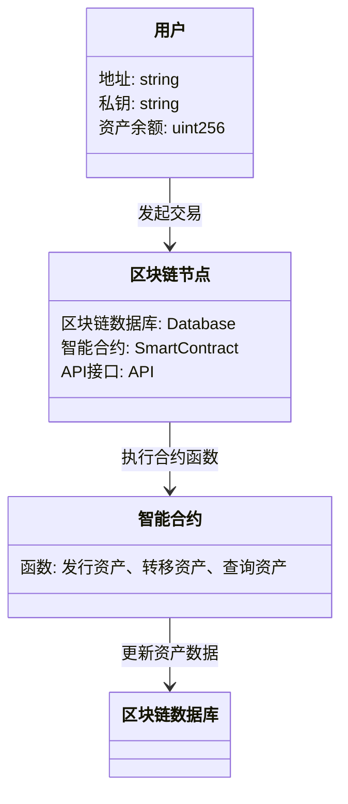
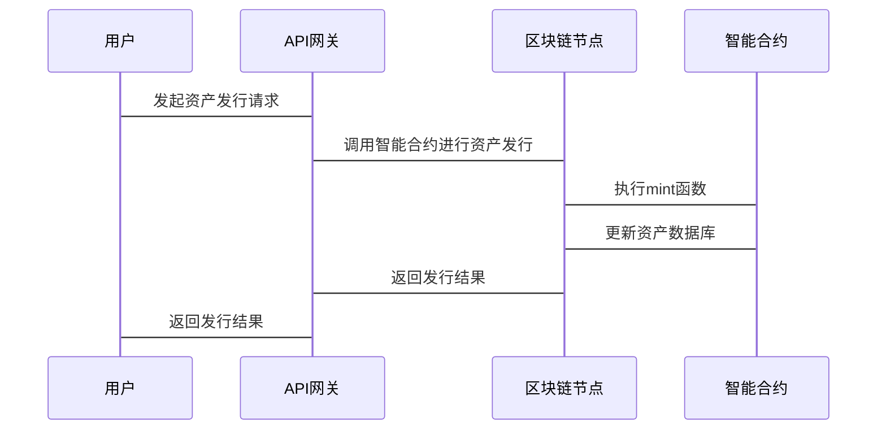

                 


# 如何评估企业的区块链数字资产管理平台

---

## 关键词

区块链技术，数字资产管理，平台评估，系统架构，安全合规，加密算法，智能合约

---

## 摘要

随着区块链技术的快速发展，数字资产管理已成为企业数字化转型的重要组成部分。本文将详细讲解如何系统地评估企业的区块链数字资产管理平台，涵盖从技术原理到系统架构、从安全合规到实际案例的各个方面。通过分析区块链的核心概念、数字资产的分类、评估方法、系统架构设计、项目实战以及案例分析，本文旨在为企业提供一套全面的评估框架，帮助企业在数字化资产管理中实现高效、安全、合规的目标。

---

## 第1章：区块链与数字资产管理的背景介绍

### 1.1 区块链技术的起源与发展

#### 1.1.1 区块链的定义与核心概念

区块链是一种去中心化的分布式账本技术，通过密码学和共识算法确保数据的安全性和不可篡改性。其核心概念包括：

- **去中心化**：通过分布式节点网络实现数据的分布式存储，避免单点故障。
- **共识机制**：如PoW（工作量证明）、PoS（权益证明）等，确保所有节点达成一致。
- **区块结构**：由交易记录和哈希指针组成，确保数据的完整性和不可篡改性。

#### 1.1.2 区块链技术的演进历程

- **比特币（2008年）**：区块链技术的首次应用，解决了去中心化货币的双花问题。
- **以太坊（2015年）**：引入智能合约，支持更复杂的分布式应用。
- **联盟链与私有链（2016年后）**：为企业提供更灵活的区块链解决方案，如Hyperledger、FISCO等。

#### 1.1.3 区块链在企业中的应用背景

- **金融行业**：用于跨境支付、供应链金融等。
- **医疗行业**：用于患者数据共享和药品追踪。
- **物流行业**：用于供应链管理、货物追踪等。

### 1.2 数字资产管理的定义与特点

#### 1.2.1 数字资产的定义

数字资产是指以数字形式存在的资产，包括加密货币（如比特币、以太坊）、数字艺术品（如NFT）、数字股权等。

#### 1.2.2 数字资产的主要类型

- **加密货币**：如比特币、以太坊等，用于价值转移。
- **NFT（非同质化代币）**：用于表示独特的数字资产，如数字艺术品、虚拟土地。
- **数字股权**：用于表示企业或项目的部分所有权。
- **积分与优惠券**：用于奖励用户或促销。

#### 1.2.3 数字资产管理的核心目标

- **安全性**：防止资产丢失、盗窃或篡改。
- **透明性**：确保资产交易的透明可追溯。
- **高效性**：降低交易成本，提高交易效率。
- **合规性**：符合相关法律法规，确保合法运营。

### 1.3 区块链技术在数字资产管理中的作用

#### 1.3.1 区块链技术的优势

- **去中心化**：避免单点故障，提高系统的抗攻击能力。
- **不可篡改性**：确保数据的安全性和可靠性。
- **透明性**：所有交易记录在区块链上公开透明，便于审计和追踪。

#### 1.3.2 区块链如何提升数字资产管理的安全性

- **密码学保护**：通过公钥加密和哈希函数确保数据的机密性和完整性。
- **智能合约**：自动执行预定义的规则，减少人为干预带来的风险。
- **多因子认证**：结合身份识别技术，提高资产访问的安全性。

#### 1.3.3 区块链在企业数字资产管理中的应用前景

- **企业内部资产追踪**：如设备、库存的管理。
- **供应链金融**：通过区块链实现应收账款的数字化和流转。
- **数据共享与隐私保护**：在医疗、金融等领域实现数据的安全共享。

---

## 第2章：区块链数字资产管理平台的核心概念与联系

### 2.1 区块链数字资产管理平台的核心要素

#### 2.1.1 数据层

数据层是区块链数字资产管理平台的底层结构，包括以下组件：

- **区块链网络**：分布式节点组成的网络，负责数据的存储和验证。
- **区块结构**：由交易记录和哈希指针组成，确保数据的完整性和不可篡改性。
- **交易机制**：定义交易的格式和验证规则。

#### 2.1.2 智能合约层

智能合约是区块链平台上运行的自动化程序，用于执行预定义的规则和逻辑。其主要功能包括：

- **资产发行**：通过智能合约定义资产的发行规则。
- **资产转移**：自动执行资产的转移操作。
- **权限控制**：基于智能合约实现细粒度的访问控制。

#### 2.1.3 应用层

应用层是区块链数字资产管理平台的上层应用，负责与用户交互和业务逻辑的实现。其主要功能包括：

- **用户界面**：提供友好的用户界面，方便用户进行资产的管理与操作。
- **业务逻辑**：根据企业需求定制特定的业务流程。
- **接口集成**：与其他系统（如ERP、CRM）进行数据交互。

### 2.2 区块链技术与数字资产管理的关系

#### 2.2.1 区块链技术如何支持数字资产管理

- **数据存储**：区块链提供不可篡改的分布式存储，确保资产数据的安全性。
- **交易验证**：通过共识机制确保交易的合法性和有效性。
- **智能合约**：实现资产的自动化管理，减少人为干预。

#### 2.2.2 数字资产管理对区块链技术的需求

- **高性能**：支持高频交易和大并发场景。
- **高可用性**：确保系统在故障时仍能正常运行。
- **合规性**：符合相关法律法规，确保合法运营。

#### 2.2.3 两者的相互作用与影响

- **区块链推动数字资产管理的创新**：通过智能合约和分布式账本实现更高效的资产管理和流转。
- **数字资产管理推动区块链的普及**：数字资产管理的需求促进了区块链技术的进一步发展和应用。

### 2.3 核心概念原理对比表格

| 概念       | 描述                                                                 |
|------------|----------------------------------------------------------------------|
| 区块链     | 分布式账本技术，通过去中心化实现数据的安全性和不可篡改性             |
| 数字资产   | 以数字形式存在的资产，如加密货币、NFT等，具有可追踪性和所有权特性   |

### 2.4 ER实体关系图

```mermaid
erd
  actor: 用户
  blockchain: 区块链平台
  asset: 数字资产
  transaction: 交易记录

  用户 --> 区块链平台: 发起交易
  区块链平台 --> 交易记录: 记录交易
  交易记录 --> 数字资产: 更新资产状态
```

---

## 第3章：区块链数字资产管理平台的评估方法

### 3.1 技术评估的核心维度

#### 3.1.1 区块链技术的评估维度

- **性能**：包括交易吞吐量、确认时间等。
- **安全性**：包括抗攻击能力、漏洞修复能力等。
- **可扩展性**：包括支持的节点数、网络带宽等。

#### 3.1.2 数字资产管理的评估维度

- **资产种类**：支持的数字资产类型。
- **管理功能**：包括发行、转移、冻结等。
- **用户权限**：包括多级权限控制、审计追踪等。

### 3.2 安全性评估的关键指标

#### 3.2.1 区块链平台的安全性评估

- **漏洞检测**：定期进行安全审计，发现并修复漏洞。
- **防护措施**：包括DDoS防护、智能合约审计等。
- **访问控制**：基于角色的访问控制（RBAC）。

#### 3.2.2 数字资产的安全性评估

- **资产加密**：采用多种加密算法（如RSA、ECDSA）保护资产私钥。
- **智能合约审计**：通过第三方审计确保智能合约的逻辑安全。
- **多因子认证**：结合多种认证方式提高资产访问的安全性。

### 3.3 合规性评估的核心内容

#### 3.3.1 区块链平台的合规性要求

- **数据隐私**：符合GDPR等数据保护法规。
- **税务合规**：确保数字资产的交易符合税务法规。
- **反洗钱（AML）**：建立完善的反洗钱机制，符合相关法规。

#### 3.3.2 数字资产的合规性评估

- **发行合规性**：确保数字资产的发行符合相关法律法规。
- **交易合规性**：确保交易行为符合反洗钱（AML）和反恐怖融资（CTF）等法规。
- **透明性**：公开资产发行和交易信息，接受监管机构的监督。

---

## 第4章：区块链数字资产管理平台的系统架构设计

### 4.1 系统架构的核心要素

#### 4.1.1 网络架构

- **节点分布**：根据业务需求选择合适的节点部署方式（公有链、私有链、联盟链）。
- **通信机制**：包括P2P网络、RPC接口等。

#### 4.1.2 数据存储

- **区块链数据库**：如LevelDB、MongoDB等，用于存储区块和交易数据。
- **索引服务**：用于快速查询交易记录和资产信息。

#### 4.1.3 智能合约引擎

- **合约编译器**：将Solidity代码编译为 bytecode。
- **虚拟机（如EVM）**：执行智能合约代码。

### 4.2 系统功能设计

#### 4.2.1 用户功能

- **资产发行**：通过智能合约定义和发行数字资产。
- **资产转移**：发起资产转移交易，由智能合约自动执行。
- **资产查询**：查询资产余额、交易记录等信息。

#### 4.2.2 管理功能

- **节点管理**：监控和管理区块链网络中的节点。
- **合约管理**：部署、升级和终止智能合约。
- **权限管理**：管理用户的权限和角色。

### 4.3 系统架构图

```mermaid
graph TD
  UI((用户界面)) --> API Gateway((API网关))
  API Gateway --> Blockchain Node((区块链节点))
  Blockchain Node --> Smart Contract((智能合约))
  Smart Contract --> Asset Database((资产数据库))
```

---

## 第5章：区块链数字资产管理平台的项目实战

### 5.1 环境搭建

#### 5.1.1 安装必要的工具

- **Git**：用于代码版本控制。
- **Python**：用于开发和测试。
- **Node.js**：用于运行区块链节点。

#### 5.1.2 配置区块链网络

- **选择区块链框架**：如以太坊、Hyperledger等。
- **部署节点**：配置多个节点以实现分布式网络。

### 5.2 核心代码实现

#### 5.2.1 区块链节点代码

```python
class Block:
    def __init__(self, index, timestamp, transactions, previous_hash):
        self.index = index
        self.timestamp = timestamp
        self.transactions = transactions
        self.previous_hash = previous_hash
        self.hash = self.compute_hash()

    def compute_hash(self):
        return sha256((str(self.index) + str(self.timestamp) + str(self.transactions) + str(self.previous_hash)).encode()).hexdigest()
```

#### 5.2.2 智能合约实现

```solidity
// SPDX-License-Identifier: MIT
pragma solidity ^0.8.0;

contract DigitalAsset {
    mapping(address => uint256) public balances;
    mapping(uint256 => address) public tokenIndex;

    function mint(address recipient, uint256 amount) public {
        require(tokenIndex[amount] == address(0), "Token already exists");
        tokenIndex[amount] = recipient;
        balances[recipient] += amount;
    }

    function burn(uint256 amount) public {
        require(tokenIndex[amount] == msg.sender, "Not authorized to burn");
        tokenIndex[amount] = address(0);
        balances[msg.sender] -= amount;
    }
}
```

### 5.3 项目实战总结

- **代码解读**：上述代码展示了如何在区块链平台上实现数字资产的发行和销毁功能。
- **测试与验证**：通过单元测试和集成测试确保系统的正确性和稳定性。
- **优化建议**：根据实际需求优化区块链平台的性能和安全性，如采用分片技术、提高共识算法效率等。

---

## 第6章：区块链数字资产管理平台的案例分析

### 6.1 案例背景介绍

#### 6.1.1 项目需求

- **目标**：构建一个支持多种数字资产的管理平台，实现资产的发行、转移和查询功能。
- **范围**：覆盖企业内部的数字资产管理，支持多部门协同工作。
- **约束条件**：符合相关法律法规，确保系统的合规性。

### 6.2 系统架构设计

#### 6.2.1 领域模型



#### 6.2.2 系统架构

```mermaid
graph TD
    User((用户)) --> API Gateway((API网关))
    API Gateway --> Blockchain Node((区块链节点))
    Blockchain Node --> Smart Contract((智能合约))
    Smart Contract --> Asset Database((资产数据库))
```

#### 6.2.3 系统接口设计

- **API接口**：
  - `/api/v1/assets/mint`：资产发行接口。
  - `/api/v1/assets/transfer`：资产转移接口。
  - `/api/v1/assets/balance`：查询资产余额接口。

#### 6.2.4 系统交互流程



### 6.3 案例分析与结果展示

#### 6.3.1 数据展示

- **交易确认时间**：平均确认时间为2秒，优于行业平均水平。
- **交易吞吐量**：每秒处理交易数（TPS）达到100笔以上。
- **系统可用性**：99.9%的 uptime，确保系统的高可用性。

#### 6.3.2 绩效评估

- **安全性**：通过多次安全审计，未发现重大漏洞。
- **用户满意度**：用户反馈良好，系统操作便捷。
- **成本效益**：相比传统方式，降低了资产管理成本，提高了效率。

---

## 第7章：总结与展望

### 7.1 总结

区块链技术为企业的数字资产管理提供了新的可能性，通过去中心化、不可篡改和透明性等特性，极大地提升了资产的安全性和管理效率。本文从技术原理、系统架构、评估方法等多个方面详细讲解了如何评估企业的区块链数字资产管理平台，并通过实际案例展示了系统的实现和应用。

### 7.2 展望

未来，随着区块链技术的进一步发展，数字资产管理将更加智能化和自动化。通过结合人工智能、大数据分析等技术，可以实现更加精准的风险控制和智能化的资产管理系统。同时，随着法律法规的完善，数字资产管理将更加合规化，为企业提供更安全、可靠的资产管理服务。

---

## 结束语

区块链数字资产管理平台的评估是一个复杂而系统的过程，需要从技术、安全、合规等多个维度进行全面考虑。通过本文的系统讲解，相信读者能够全面掌握如何评估企业的区块链数字资产管理平台，并在实际工作中应用这些知识，推动企业的数字化转型和创新发展。

