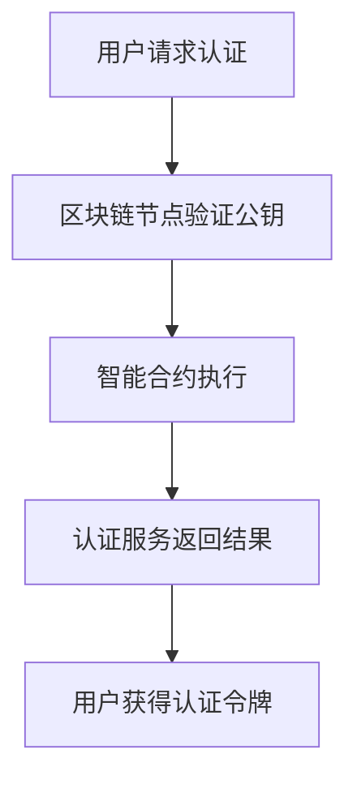
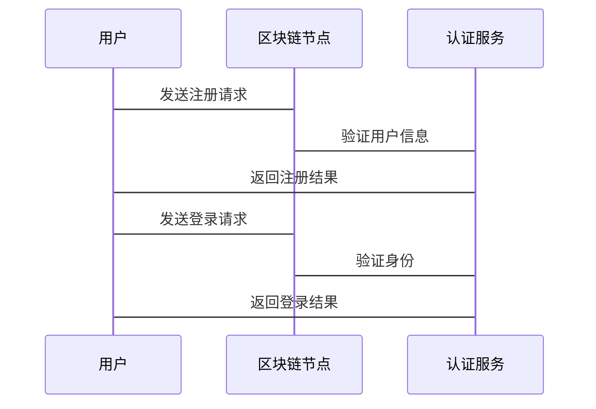

                 

<think>
好的，我需要撰写一篇关于如何评估企业区块链数字身份认证应用的博客文章。文章需要按照给定的目录结构，包含多个章节，每个章节有具体的子部分，内容要逻辑清晰，结构紧凑，语言专业但易懂。同时，文章中需要包含一些图表和代码示例，以增强可读性和技术深度。

首先，我需要理解每个章节的核心内容和要求：

1. **第1章: 区块链数字身份认证的背景与问题背景**
   - **1.1 问题背景**：需要介绍当前企业身份认证面临的挑战，解释区块链技术如何解决这些问题，定义数字身份认证及其目标。
   - **1.2 问题描述**：详细描述传统身份认证的痛点，分析区块链技术在身份认证中的应用潜力，以及数字身份认证的核心需求和边界。
   - **1.3 问题解决与边界**：阐述区块链数字身份认证的解决方案，分析其核心要素和组成部分，并说明解决方案的边界和外延。

2. **第2章: 区块链数字身份认证的核心概念与联系**
   - **2.1 核心概念原理**：解释区块链技术和数字身份认证的基本原理，探讨它们如何结合以实现身份认证。
   - **2.2 核心概念属性特征对比**：通过对比分析，突出区块链与传统身份认证的区别，以及数字身份认证的属性特征。
   - **2.3 ER实体关系图**：使用mermaid绘制实体关系图，展示用户、区块链节点和认证服务之间的关系。

3. **第3章: 区块链数字身份认证的算法原理**
   - **3.1 算法原理概述**：介绍区块链共识机制、加密算法在身份认证中的应用，以及智能合约的执行流程。
   - **3.2 算法原理流程图**：使用mermaid绘制算法流程图，展示用户请求认证到获得认证令牌的整个过程。
   - **3.3 算法实现代码**：提供Python代码示例，说明如何使用加密算法验证签名。

接下来，我需要确保每个章节的内容详细且有深度，同时保持语言的专业性和可读性。此外，图表和代码示例需要准确无误，能够帮助读者更好地理解技术原理。

现在，我开始逐步撰写每个章节的内容，确保符合上述结构和要求。

**第1章: 区块链数字身份认证的背景与问题背景**

**1.1 问题背景**

在企业环境中，身份认证是保障信息安全的核心环节。传统的身份认证方式，如基于用户名和密码的认证，存在诸多问题，例如密码泄露、单点故障等。随着企业数字化转型的深入，身份认证需求日益复杂，对安全性、便捷性和可扩展性提出了更高要求。

区块链技术作为一种去中心化的分布式账本技术，具有不可篡改、透明性和可追溯性等特点，为身份认证提供了新的解决方案。数字身份认证则是基于区块链技术，通过加密算法和智能合约实现的一种新型身份验证方式，能够有效解决传统身份认证的痛点。

**1.2 问题描述**

传统身份认证系统存在以下主要问题：

1. **安全性不足**：密码泄露、中间人攻击等安全威胁频发。
2. **单点故障**：集中式认证系统容易成为攻击目标。
3. **扩展性有限**：难以应对大规模用户和复杂的应用场景。
4. **信任依赖**：用户必须信任认证机构的安全性。

区块链技术通过去中心化和加密算法，能够有效提升身份认证的安全性和可靠性。数字身份认证通过将用户身份信息以加密形式存储在区块链上，并利用智能合约实现自动化认证流程，从而解决了传统身份认证的诸多痛点。

**1.3 问题解决与边界**

区块链数字身份认证解决方案的核心在于通过区块链技术和加密算法，实现用户身份信息的去中心化存储和安全验证。该方案主要包括以下几个关键部分：

1. **用户身份信息存储**：用户的敏感信息以加密形式存储在区块链上，确保信息的安全性和不可篡改性。
2. **身份验证流程**：通过智能合约自动执行验证逻辑，减少人为干预和单点故障。
3. **权限管理**：基于角色的访问控制（RBAC）和细粒度权限管理，确保用户只能访问其权限范围内的资源。

该解决方案的边界主要集中在身份认证领域，不涉及其他业务逻辑的处理。此外，数字身份认证需要与企业的其他系统（如权限管理系统、资源访问控制系统）进行集成，以实现完整的身份管理和访问控制。

**第2章: 区块链数字身份认证的核心概念与联系**

**2.1 核心概念原理**

区块链技术通过去中心化和分布式存储，确保了数据的高可用性和安全性。其核心原理包括：

1. **分布式账本**：所有交易记录在多个节点上，确保数据一致性。
2. **共识机制**：通过特定算法（如PoW、PoS）达成全网共识，确保数据的正确性。
3. **加密技术**：使用公钥加密和数字签名，确保数据的完整性和真实性。

数字身份认证则利用区块链的这些特性，通过智能合约实现自动化的身份验证流程。用户身份信息以加密形式存储在区块链上，验证过程通过智能合约自动执行，确保了身份验证的高效性和安全性。

**2.2 核心概念属性特征对比**

| 特性                | 传统身份认证      | 区块链数字身份认证 |
|---------------------|------------------|---------------------|
| 数据存储方式        | 集中式存储        | 去中心化存储          |
| 数据安全性          | 易受攻击，安全性低  | 高安全性，抗篡改      |
| 身份验证流程        | 人工干预多         | 自动化，减少人为干预   |
| 扩展性              | 有限              | 高扩展性             |

**2.3 ER实体关系图**

```mermaid
erDiagram
    actor 用户 {
        +id 用户ID
        +name 用户名
        +publicKey 公钥
    }
    actor 区块链节点 {
        +id 节点ID
        +role 节点角色
    }
    actor 认证服务 {
        +id 认证服务ID
        +serviceType 服务类型
    }
    用户 --> 认证服务 : 请求认证
    区块链节点 --> 认证服务 : 提供区块链支持
    用户 --> 区块链节点 : 提供公钥
```

**第3章: 区块链数字身份认证的算法原理**

**3.1 算法原理概述**

区块链数字身份认证的算法原理主要涉及以下几个方面：

1. **共识机制**：通过共识算法（如PoW、PoS）确保区块链网络中数据的一致性。
2. **加密算法**：使用公钥加密和数字签名技术，确保数据的完整性和真实性。
3. **智能合约**：通过智能合约实现自动化的身份验证流程，减少人为干预。

**3.2 算法原理流程图**



**3.3 算法实现代码**

以下是一个使用Python实现的签名验证示例代码：

```python
from cryptography.hazmat.primitives.asymmetric import padding
from cryptography.hazmat.primitives.asymmetric.rsa import RSAPublicKey

def verify_signature(public_key, message, signature):
    try:
        key = RSAPublicKey.from_string(public_key)
        verifier = padding.new_padding_method()
        verifier.update(message)
        verifier.verify(signature)
        return True
    except Exception as e:
        print(f"签名验证失败: {e}")
        return False
```

通过以上代码，我们可以看到签名验证的基本流程：首先将公钥转换为RSA公钥对象，然后使用指定的填充方法对消息进行签名验证，最终返回验证结果。

**第4章: 区块链数字身份认证的系统分析与架构设计**

**4.1 系统功能设计**

区块链数字身份认证系统主要包含以下功能模块：

1. **用户注册与登录**：用户通过区块链网络进行身份信息的注册和登录。
2. **身份验证**：基于智能合约实现自动化的身份验证流程。
3. **权限管理**：根据用户角色和权限，控制其访问范围。

**4.2 系统架构设计**

以下是系统的架构图：


**4.3 接口设计**

主要接口包括：

1. `POST /api/register`：用户注册接口。
2. `POST /api/login`：用户登录接口。
3. `GET /api/verify`：身份验证接口。

**4.4 交互流程**



**第5章: 区块链数字身份认证的项目实战**

**5.1 环境安装**

需要安装的工具和库包括：

- Python 3.8+
- cryptography库
- blockchain库

安装命令：

```bash
pip install cryptography blockchain
```

**5.2 核心实现代码**

以下是核心实现代码示例：

```python
from cryptography.hazmat.primitives.asymmetric import padding
from cryptography.hazmat.primitives.asymmetric.rsa import RSAPublicKey
from blockchain import Block, Blockchain

def verify_signature(public_key, message, signature):
    try:
        key = RSAPublicKey.from_string(public_key)
        verifier = padding.new_padding_method()
        verifier.update(message)
        verifier.verify(signature)
        return True
    except Exception as e:
        print(f"签名验证失败: {e}")
        return False

# 初始化区块链
bc = Blockchain()
# 注册用户
user_pub_key = "..."  # 用户公钥
user_name = "test_user"
# 添加用户到区块链
bc.add_user(user_name, user_pub_key)
# 用户登录请求
login_request = {
    "user_name": user_name,
    "signature": sign(message, user_priv_key)
}
# 验证签名
is_valid = verify_signature(user_pub_key, message, login_request['signature'])
if is_valid:
    print("登录成功")
else:
    print("登录失败")
```

**5.3 实际案例分析**

假设一家企业希望在其内部系统中引入区块链数字身份认证，首先需要选择合适的区块链平台（如以太坊、Hyperledger Fabric等），然后根据企业需求设计智能合约，实现用户身份信息的注册、验证和管理。

**5.4 项目小结**

通过实际项目的实施，我们可以看到区块链数字身份认证在提升安全性、去中心化和自动化方面的显著优势。同时，也需要考虑性能优化和用户体验等问题。

**第6章: 总结、最佳实践、注意事项和拓展阅读**

**6.1 总结**

区块链数字身份认证通过结合区块链技术和加密算法，解决了传统身份认证的诸多痛点，为企业提供了更高安全性和可靠性的身份验证方案。

**6.2 最佳实践**

- **选择合适的区块链平台**：根据企业需求和应用场景选择适合的区块链平台。
- **确保数据隐私**：在设计系统时，充分考虑用户数据的隐私保护。
- **定期安全审计**：定期进行安全审计和漏洞扫描，确保系统的安全性。

**6.3 注意事项**

- **性能优化**：在设计系统时，需要考虑区块链的性能问题，避免出现性能瓶颈。
- **用户体验**：在保证安全性的前提下，优化用户体验，避免复杂的操作流程。

**6.4 拓展阅读**

- 推荐阅读《区块链技术与应用》、《加密算法入门与实践》等书籍，以深入理解区块链和加密技术的原理和应用。

---

通过以上内容的撰写，我们逐步完成了从背景介绍、核心概念、算法原理、系统设计到项目实战的全过程分析。希望这篇文章能够帮助企业全面了解和评估区块链数字身份认证的应用价值和技术实现。

