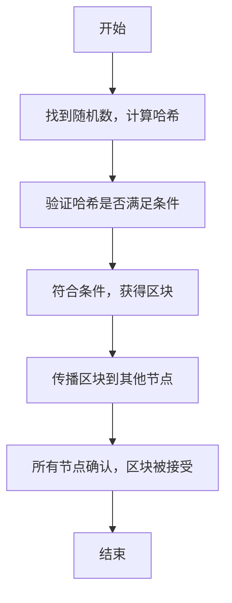
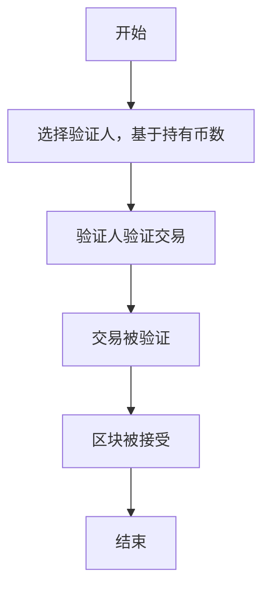
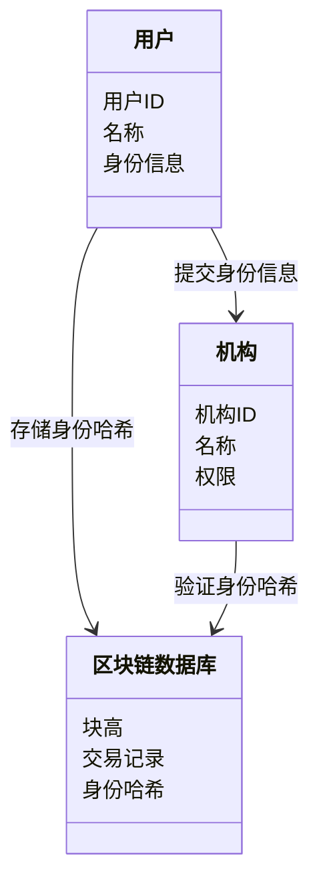
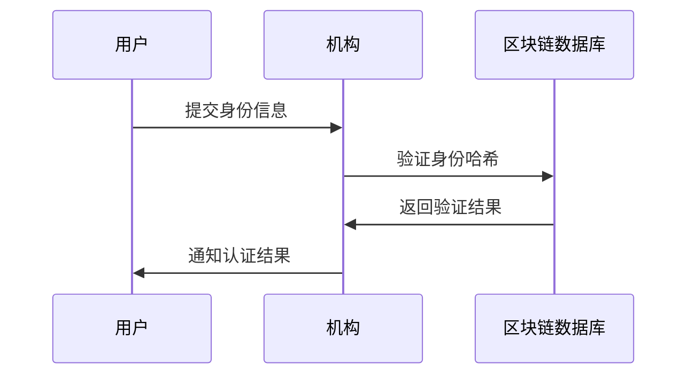

                 


# 如何评估企业的区块链数字身份跨境认证应用

## 关键词：区块链、数字身份、跨境认证、共识机制、椭圆曲线加密、系统架构、数学模型

## 摘要：本文详细探讨了如何评估企业区块链数字身份跨境认证应用，从背景介绍、核心概念、算法原理、数学模型、系统架构到项目实战，全面分析了该技术的应用价值和实现方法，提供了丰富的技术细节和实际案例。

---

# 如何评估企业的区块链数字身份跨境认证应用

## 第1章 背景介绍

### 1.1 问题背景

数字身份认证在现代社会中扮演着至关重要的角色。随着全球化的推进，企业和个人需要在跨境环境中进行身份认证的需求日益增长。传统的身份认证系统存在中心化、安全性差、跨机构协作困难等问题，导致身份认证效率低下、成本高昂且容易受到攻击。特别是在跨境场景中，不同国家和机构之间的身份认证标准不一，数据孤岛现象严重，难以实现无缝对接。

### 1.2 问题描述

区块链技术的出现为数字身份认证带来了新的可能性。通过区块链的去中心化特性，可以实现身份信息的安全存储和跨机构共享。然而，区块链数字身份跨境认证的应用涉及多个技术难点，如如何确保身份信息的唯一性和安全性、如何实现多机构之间的信任协作、如何设计高效的共识机制等。

### 1.3 问题解决与边界

区块链技术通过去中心化、不可篡改和加密算法等特性，为数字身份认证提供了一种新的解决方案。通过区块链，身份信息可以被加密存储，并通过智能合约实现自动化的身份验证和权限管理。跨境认证的边界包括跨国界的数字身份认证、多机构协作、数据隐私保护等。

---

## 第2章 核心概念与联系

### 2.1 核心概念原理

区块链技术的核心在于去中心化、数据不可篡改和透明性。数字身份认证则需要确保每个用户身份的唯一性和安全性。跨境认证需要在不同国家和机构之间建立信任机制，确保身份信息的准确性和合法性。

### 2.2 概念属性特征对比

| 概念       | 特性               | 描述                                                                 |
|------------|--------------------|----------------------------------------------------------------------|
| 区块链     | 去中心化           | 数据存储在多个节点，无单一控制中心                                   |
| 数字身份   | 唯一性             | 每个用户拥有唯一的数字标识符                                         |
| 跨境认证   | 多机构协作         | 需要不同机构之间的信任和协作                                         |

### 2.3 ER实体关系图

```mermaid
erDiagram
    actor 用户 "User" {
        用户ID
        名称
        身份信息
    }
    actor 机构 "Organization" {
        机构ID
        名称
        权限
    }
    database 区块链数据库 "Blockchain Database" {
        块高
        交易记录
        身份哈希
    }
    用户 -->> 机构 : 提交身份信息
    用户 -->> 区块链数据库 : 存储身份哈希
    机构 -->> 区块链数据库 : 验证身份哈希
```

---

## 第3章 区块链共识机制与身份认证算法

### 3.1 共识机制原理

共识机制是区块链的核心，确保所有节点达成一致。常见的共识机制包括：

#### 工作量证明（PoW）



#### 权益证明（PoS）



### 3.2 身份认证算法

基于椭圆曲线加密的身份认证算法：

```python
def elliptic_curve_encrypt(public_key, message):
    # 生成随机数k
    k = random.randint(1, curve.order)
    # 计算点P = k * G（G为生成点）
    P = curve.g * k
    # 计算签名参数r和s
    r = (P.x) % curve.order
    s = ( (message + r * public_key.y) * k ) % curve.order
    return (r, s)

def elliptic_curve_decrypt(private_key, r, s):
    # 计算P = s^{-1} * (Q + r * G)
    P = s * (Q + r * curve.g)
    # 验证P是否等于k * G
    if P.x != (k * curve.g).x:
        return False
    return True
```

### 3.3 数学模型与公式

椭圆曲线加密的数学模型：

$$ y^2 = x^3 + ax + b $$

哈希函数的计算过程：

$$ H(m) = \text{hash}(m) $$

---

## 第4章 区块链数字身份认证的数学模型

### 4.1 哈希函数与加密

哈希函数用于将明文转换为哈希值：

$$ H(m) = \text{hash}(m) $$

椭圆曲线加密的验证过程：

$$ P = k \cdot G $$

$$ r = P.x \mod n $$

$$ s = (m + r \cdot a) \cdot k^{-1} \mod n $$

---

## 第5章 系统分析与架构设计

### 5.1 问题场景介绍

设计一个跨国企业间的数字身份认证系统，实现用户在不同国家的机构间无缝认证。

### 5.2 系统功能设计

使用Mermaid类图：



### 5.3 系统架构设计

使用Mermaid架构图：


### 5.4 系统接口设计

主要接口包括：

- 用户提交身份信息接口
- 机构验证身份哈希接口
- 区块链数据库存储和查询接口

### 5.5 系统交互流程

使用Mermaid序列图：



---

## 第6章 项目实战

### 6.1 环境安装

需要安装以下工具：

- Python 3.8+
- Mermaid CLI
- Solidity编译器

### 6.2 核心代码实现

身份认证智能合约：

```solidity
contract IdentityContract {
    mapping(address => bytes32) private userHashes;

    function register(address user, bytes32 hash) public {
        userHashes[user] = hash;
    }

    function verify(address user, bytes32 hash) public view returns (bool) {
        return userHashes[user] == hash;
    }
}
```

### 6.3 案例分析

假设一个用户需要在跨国机构中进行认证，智能合约会自动验证用户的哈希值，确保身份信息的唯一性和安全性。

---

## 第7章 最佳实践与总结

### 7.1 最佳实践 tips

- 确保区块链网络的安全性和去中心化特性
- 使用高效的共识机制以降低延迟
- 保护用户隐私，避免身份信息泄露

### 7.2 小结

通过区块链技术，企业可以实现高效、安全的数字身份跨境认证。本文详细探讨了相关技术原理和实现方法，并通过实际案例展示了其应用价值。

### 7.3 注意事项

- 确保合规性，遵守各国法律法规
- 定期进行系统维护和安全审计
- 建立完善的应急响应机制

### 7.4 拓展阅读

- 区块链智能合约开发指南
- 分布式身份认证系统设计

---

# 结语

区块链数字身份跨境认证的应用前景广阔，随着技术的不断进步，其在企业级应用中的潜力将得到进一步释放。希望本文能为相关从业者提供有价值的参考和启发。

