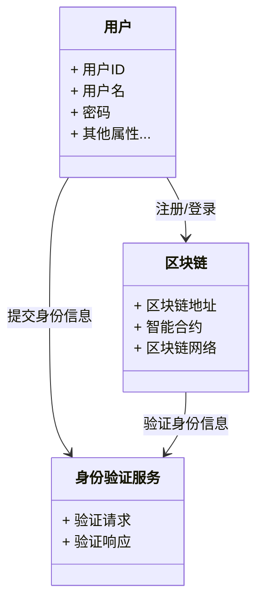
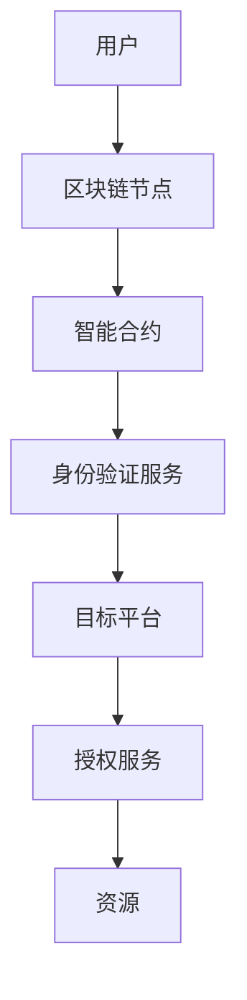

                 


# 如何评估企业的区块链数字身份跨平台认证应用

> 关键词：区块链，数字身份，跨平台认证，安全性，分布式身份验证，身份管理

> 摘要：随着区块链技术的快速发展，数字身份的管理和认证方式也在不断演变。本文深入探讨了企业在实施区块链数字身份跨平台认证应用时的关键评估因素。通过分析区块链技术的核心原理、数字身份的定义与特性、跨平台认证的实现机制，以及实际应用中的系统架构和项目实战，本文为企业提供了全面的评估框架和实践指南。结合具体案例和最佳实践，本文旨在帮助企业理解如何有效利用区块链技术来提升数字身份管理的安全性和效率。

---

## 第1章: 区块链数字身份的背景与概念

### 1.1 区块链技术的背景与现状

区块链技术作为一种分布式账本技术，起源于比特币的诞生。其核心特点是去中心化、不可篡改和透明性，这些特性使其在多个领域展现出巨大的应用潜力。数字身份管理正是其中之一。

#### 1.1.1 区块链技术的起源与发展

区块链的起源可以追溯到2008年，中本聪（Satoshi Nakamoto）在比特币白皮书中首次提出了区块链的概念。随后，区块链技术逐渐从金融领域扩展到供应链管理、医疗健康、知识产权保护等多个领域。其分布式、去中心化的特性为数字身份管理提供了新的解决方案。

#### 1.1.2 区块链技术的核心特点

区块链的核心特点包括：

- **去中心化**：数据不依赖于单一中心，而是分布在多个节点上。
- **不可篡改**：通过密码学和共识机制确保数据的安全性和完整性。
- **透明性**：所有交易记录公开可查，但用户身份可以匿名或部分匿名。
- **可追溯性**：每一条数据都可以追溯到原始来源。

#### 1.1.3 区块链在数字身份领域的应用潜力

区块链技术在数字身份管理中的应用潜力主要体现在以下几个方面：

- **去中心化身份验证**：用户可以自主控制自己的身份信息，不再依赖于第三方机构。
- **跨平台认证**：通过区块链技术，可以在不同平台之间实现无缝的身份认证。
- **增强安全性**：区块链的不可篡改性可以有效防止身份信息的伪造和篡改。

### 1.2 数字身份的定义与特征

数字身份是指在数字空间中，用户、设备或组织的唯一标识。它可以通过多种方式表示，例如用户名、密码、数字证书等。

#### 1.2.1 数字身份的定义

数字身份是用户在数字系统中的唯一标识，通常由一组属性和凭证组成。这些属性可以包括姓名、电子邮件地址、手机号码等，而凭证则包括密码、数字证书等。

#### 1.2.2 数字身份的核心属性

数字身份的核心属性包括：

- **唯一性**：每个数字身份都是唯一的。
- **完整性**：数字身份应包含所有必要的属性和凭证。
- **安全性**：数字身份必须能够防止未经授权的访问和篡改。

#### 1.2.3 数字身份与传统身份的区别

数字身份与传统身份的主要区别在于其表示形式和管理方式。传统身份通常依赖于物理证件或中心化机构，而数字身份则可以通过区块链等技术实现去中心化管理。

### 1.3 跨平台认证的定义与挑战

#### 1.3.1 跨平台认证的定义

跨平台认证是指在不同平台之间实现身份验证的过程。例如，用户可以在一个平台上注册，然后在另一个平台上使用相同的账号登录。

#### 1.3.2 跨平台认证的核心问题

跨平台认证的核心问题是不同平台之间的身份信息不一致或不兼容。解决这一问题需要通过统一的认证协议和标准。

#### 1.3.3 跨平台认证的主要挑战

跨平台认证的主要挑战包括：

- **安全性**：如何确保跨平台认证过程中的数据安全。
- **兼容性**：如何实现不同平台之间的身份信息互认。
- **用户体验**：如何提升用户的跨平台认证体验。

### 1.4 区块链与数字身份的结合

#### 1.4.1 区块链在数字身份中的作用

区块链技术可以为数字身份管理提供以下优势：

- **去中心化**：用户可以自主控制自己的身份信息。
- **不可篡改**：区块链的特性确保身份信息的安全性。
- **可扩展性**：区块链可以支持大规模的数字身份管理。

#### 1.4.2 区块链如何支持跨平台认证

区块链可以通过智能合约实现跨平台认证。智能合约可以自动执行预定义的规则，确保不同平台之间的身份信息一致性和互认性。

#### 1.4.3 区块链数字身份的未来趋势

未来，区块链数字身份将朝着更加智能化、自动化和安全化的方向发展。通过区块链技术，数字身份管理将更加高效和便捷。

### 1.5 本章小结

本章介绍了区块链技术的背景与发展，定义了数字身份和跨平台认证的概念，并探讨了区块链技术在数字身份管理中的作用和应用潜力。通过本章的学习，读者可以理解区块链技术如何为数字身份管理提供新的解决方案。

---

## 第2章: 区块链数字身份的核心概念与技术原理

### 2.1 区块链的核心概念

#### 2.1.1 区块链的基本结构

区块链的基本结构包括以下几个部分：

- **区块**：存储数据的容器，每个区块包含一批交易记录。
- **链式结构**：区块通过哈希指针连接成链式结构，确保数据不可篡改。
- **区块头**：包含区块的元数据，如时间戳、交易哈希等。

#### 2.1.2 区块链的共识机制

共识机制是区块链的核心机制，用于确保所有节点对区块链状态的一致性。常见的共识机制包括：

- **工作量证明（PoW）**：比特币采用的共识机制，通过计算哈希值来验证交易。
- **权益证明（PoS）**：通过持有代币的数量来决定验证权力。
- **拜占庭容错（BFT）**：适用于小规模网络的共识机制。

#### 2.1.3 区块链的智能合约

智能合约是区块链上的自动执行程序，用于实现预定义的规则和逻辑。它们可以用于验证、执行和管理数字身份信息。

### 2.2 数字身份的核心概念

#### 2.2.1 数字身份的表示方法

数字身份可以通过多种方式表示，例如：

- **加密证书**：如X.509证书，用于身份验证。
- **区块链地址**：用户在区块链上的唯一标识。
- **用户标识符**：如用户名、邮箱地址等。

#### 2.2.2 数字身份的验证机制

数字身份的验证机制包括：

- **哈希验证**：通过哈希函数验证数据完整性。
- **数字签名**：通过公钥和私钥进行身份验证。
- **多因素认证**：结合多种验证方式提高安全性。

#### 2.2.3 数字身份的安全性保障

数字身份的安全性保障包括：

- **加密技术**：使用加密算法保护身份信息。
- **访问控制**：限制未经授权的访问。
- **审计日志**：记录所有身份验证操作，便于审计和追溯。

### 2.3 跨平台认证的核心概念

#### 2.3.1 跨平台认证的流程

跨平台认证的流程通常包括以下几个步骤：

1. **发起请求**：用户在目标平台发起登录请求。
2. **身份验证**：目标平台验证用户身份。
3. **信任传递**：目标平台验证用户在其他平台的身份信息。
4. **授权访问**：用户获得目标平台的访问权限。

#### 2.3.2 跨平台认证的协议

跨平台认证的主要协议包括：

- **OAuth**：授权访问标准，用于用户在第三方平台登录。
- **OpenID Connect**：基于OAuth的开放身份认证协议。
- **SAML**：安全断言标记语言，用于跨域身份验证。

#### 2.3.3 跨平台认证的标准化

跨平台认证的标准化需要统一的认证协议和数据格式，例如：

- **JSON Web Token (JWT)**：用于传递用户身份信息的JSON对象。
- **X.509证书**：用于身份验证的数字证书。

### 2.4 区块链与数字身份的结合模型

#### 2.4.1 模型的结构

区块链数字身份的结合模型通常包括以下几个部分：

- **用户身份信息**：存储在区块链上的用户身份信息。
- **智能合约**：用于验证和管理身份信息。
- **跨平台协议**：实现不同平台之间的身份互认。

#### 2.4.2 模型的核心要素

模型的核心要素包括：

- **区块链网络**：提供去中心化的身份信息存储和验证。
- **智能合约**：实现身份验证逻辑。
- **跨平台协议**：实现不同平台之间的身份互认。

#### 2.4.3 模型的实现方式

模型的实现方式包括：

- **区块链平台选择**：选择合适的区块链平台，如以太坊、Fabric等。
- **智能合约开发**：编写和部署智能合约，实现身份验证逻辑。
- **跨平台协议集成**：将跨平台认证协议集成到区块链系统中。

### 2.5 本章小结

本章深入探讨了区块链数字身份的核心概念和技术原理，包括区块链的基本结构、共识机制、智能合约，以及数字身份的表示方法、验证机制和安全性保障。同时，还介绍了跨平台认证的核心概念和实现方式。通过本章的学习，读者可以理解区块链技术如何为数字身份管理提供技术支持。

---

## 第3章: 区块链数字身份跨平台认证的技术实现

### 3.1 区块链数字身份的认证流程

#### 3.1.1 认证流程的总体框架

跨平台认证的总体框架包括以下几个步骤：

1. **用户发起请求**：用户在目标平台发起登录请求。
2. **身份验证**：目标平台验证用户身份信息。
3. **信任传递**：目标平台验证用户在其他平台的身份信息。
4. **授权访问**：用户获得目标平台的访问权限。

#### 3.1.2 认证流程的关键步骤

认证流程的关键步骤包括：

- **身份信息验证**：验证用户的身份信息是否有效。
- **信任传递**：通过区块链智能合约实现跨平台的身份互认。
- **授权访问**：根据验证结果授予用户相应的访问权限。

#### 3.1.3 认证流程的终点

认证流程的终点是用户获得目标平台的访问权限。

### 3.2 区块链数字身份的验证机制

#### 3.2.1 哈希函数的应用

哈希函数用于验证数据的完整性和一致性。例如，可以使用SHA-256算法对用户的身份信息进行哈希计算，确保数据未被篡改。

#### 3.2.2 数字签名的实现

数字签名通过公钥和私钥对数据进行签名和验证，确保数据的真实性和完整性。例如，用户使用私钥对身份信息进行签名，目标平台使用公钥验证签名的有效性。

#### 3.2.3 身份验证的流程

身份验证的流程包括：

1. **用户提交身份信息**：用户向目标平台提交身份信息。
2. **哈希计算**：目标平台对身份信息进行哈希计算。
3. **数字签名验证**：目标平台验证数字签名的有效性。
4. **信任传递**：目标平台验证用户在其他平台的身份信息。
5. **授权访问**：用户获得目标平台的访问权限。

### 3.3 跨平台认证的技术细节

#### 3.3.1 跨平台认证的协议设计

跨平台认证的协议设计需要考虑以下几个方面：

- **认证协议的选择**：选择合适的认证协议，如OAuth、OpenID Connect等。
- **数据格式的统一**：统一身份信息的表示格式，如JWT。
- **通信机制的设计**：设计跨平台之间的通信机制，确保数据的安全传输。

#### 3.3.2 跨平台认证的实现步骤

跨平台认证的实现步骤包括：

1. **选择认证协议**：选择适合的认证协议，如OpenID Connect。
2. **设计数据格式**：统一身份信息的表示格式，如JWT。
3. **实现智能合约**：编写智能合约，实现身份验证逻辑。
4. **集成跨平台协议**：将跨平台认证协议集成到区块链系统中。

#### 3.3.3 跨平台认证的安全性保障

跨平台认证的安全性保障包括：

- **数据加密**：对敏感数据进行加密处理。
- **访问控制**：限制未经授权的访问。
- **审计日志**：记录所有身份验证操作，便于审计和追溯。

### 3.4 区块链技术在跨平台认证中的应用

#### 3.4.1 区块链在身份验证中的作用

区块链在身份验证中的作用包括：

- **去中心化存储**：用户身份信息存储在区块链上，避免中心化机构的依赖。
- **不可篡改性**：区块链的特性确保身份信息的安全性和完整性。
- **跨平台互认**：通过智能合约实现不同平台之间的身份互认。

#### 3.4.2 区块链技术实现跨平台认证的优势

区块链技术实现跨平台认证的优势包括：

- **安全性**：区块链的不可篡改性确保身份信息的安全。
- **去中心化**：用户可以自主控制自己的身份信息。
- **可扩展性**：区块链可以支持大规模的数字身份管理。

#### 3.4.3 区块链技术在跨平台认证中的挑战

区块链技术在跨平台认证中的挑战包括：

- **性能问题**：区块链的交易速度可能无法满足大规模应用的需求。
- **兼容性问题**：不同平台之间的区块链系统可能存在兼容性问题。
- **用户隐私**：如何在保证安全性的同时保护用户的隐私。

### 3.5 本章小结

本章详细探讨了区块链数字身份跨平台认证的技术实现，包括认证流程的总体框架、验证机制的技术细节，以及区块链技术在跨平台认证中的应用。通过本章的学习，读者可以理解如何利用区块链技术实现跨平台身份认证，并掌握相关技术细节。

---

## 第4章: 区块链数字身份跨平台认证的系统分析与架构设计

### 4.1 系统分析

#### 4.1.1 问题场景介绍

跨平台认证的主要问题是不同平台之间的身份信息不一致或不兼容，导致用户在不同平台之间登录时需要重复注册和验证身份信息。

#### 4.1.2 项目介绍

本项目旨在通过区块链技术实现跨平台身份认证，用户可以在不同平台之间使用同一身份信息进行登录，提升用户体验和安全性。

#### 4.1.3 系统功能设计

系统功能设计包括以下几个方面：

- **用户注册**：用户可以在系统中注册，并存储身份信息在区块链上。
- **身份验证**：用户可以在目标平台进行身份验证，验证用户身份信息的有效性。
- **信任传递**：目标平台验证用户在其他平台的身份信息。
- **授权访问**：用户获得目标平台的访问权限。

#### 4.1.4 领域模型类图

以下是系统功能的领域模型类图：



### 4.2 系统架构设计

#### 4.2.1 系统架构图

以下是系统的总体架构图：



#### 4.2.2 系统交互设计

系统交互设计包括以下几个步骤：

1. **用户发起请求**：用户在目标平台发起登录请求。
2. **身份验证**：目标平台验证用户身份信息。
3. **信任传递**：目标平台验证用户在其他平台的身份信息。
4. **授权访问**：用户获得目标平台的访问权限。

### 4.3 系统接口设计

系统接口设计包括以下几个方面：

- **区块链接口**：用户与区块链节点之间的接口，用于注册和登录。
- **身份验证接口**：用户与身份验证服务之间的接口，用于提交身份信息。
- **目标平台接口**：目标平台与身份验证服务之间的接口，用于验证用户身份信息。

### 4.4 系统实现

#### 4.4.1 环境安装

要实现区块链数字身份跨平台认证，需要以下环境：

- **区块链平台**：选择合适的区块链平台，如以太坊、Fabric等。
- **智能合约开发工具**：如Remix、VS Code等。
- **身份验证服务**：如Auth0、Firebase等。

#### 4.4.2 核心代码实现

以下是核心代码实现示例：

```python
# 智能合约示例代码
def verify_identity(user_info):
    # 用户信息验证
    hashed_info = hash(user_info)
    if hashed_info == blockchain.get_hashed_info():
        return True
    else:
        return False

# 身份验证服务示例代码
def authenticate_user(user_info):
    # 提交身份信息到区块链进行验证
    contract = Contract(blockchain_address)
    result = contract.verify_identity(user_info)
    if result:
        return "认证成功"
    else:
        return "认证失败"
```

#### 4.4.3 系统功能实现

系统功能实现包括以下几个方面：

- **用户注册**：用户可以在系统中注册，并存储身份信息在区块链上。
- **身份验证**：用户可以在目标平台进行身份验证，验证用户身份信息的有效性。
- **信任传递**：目标平台验证用户在其他平台的身份信息。
- **授权访问**：用户获得目标平台的访问权限。

### 4.5 本章小结

本章详细探讨了区块链数字身份跨平台认证的系统分析与架构设计，包括系统功能设计、系统架构图、系统交互设计和系统实现。通过本章的学习，读者可以理解如何通过区块链技术实现跨平台身份认证，并掌握相关系统设计和实现的细节。

---

## 第5章: 区块链数字身份跨平台认证的项目实战

### 5.1 环境安装

#### 5.1.1 安装区块链平台

以以太坊为例，安装步骤如下：

1. 安装以太坊钱包：如MetaMask。
2. 配置以太坊节点：使用Geth或其他以太坊节点客户端。
3. 配置智能合约开发环境：安装Remix、Solidity编译器等。

#### 5.1.2 安装身份验证服务

选择一个身份验证服务，如Auth0，按照其文档进行安装和配置。

### 5.2 核心代码实现

#### 5.2.1 智能合约开发

以下是智能合约开发示例：

```solidity
// SPDX-License-Identifier: MIT
pragma solidity ^0.8.0;

contract IdentityVerifier {
    mapping(address => bytes32) private hashedInfos;

    function register(address userAddress, bytes32 userInfoHash) public {
        hashedInfos[userAddress] = userInfoHash;
    }

    function verify(address userAddress, bytes32 userInfoHash) public view returns (bool) {
        return hashedInfos[userAddress] == userInfoHash;
    }
}
```

#### 5.2.2 身份验证服务开发

以下是身份验证服务开发示例：

```python
import json
import requests

def authenticate_user(user_info):
    # 提交身份信息到区块链进行验证
    contract_address = "0x123456789..."
    abi = json.load(open("identity_verifier_abi.json"))
    web3 = Web3(HTTPProvider("http://localhost:8545"))
    contract = web3.eth.contract(contract_address, abi=abi)
    hashed_info = hash(user_info)
    result = contract.functions.verify(web3.eth.accounts[0], hashed_info).call()
    return result
```

### 5.3 项目实现步骤

#### 5.3.1 环境配置

1. 安装以太坊钱包和节点。
2. 配置智能合约开发环境。
3. 安装身份验证服务。

#### 5.3.2 智能合约部署

1. 编写智能合约代码。
2. 编译智能合约。
3. 部署智能合约到区块链。

#### 5.3.3 身份验证服务集成

1. 实现身份验证接口。
2. 集成智能合约到身份验证服务。
3. 测试跨平台认证功能。

### 5.4 实际案例分析

#### 5.4.1 案例背景

假设我们有一个电商网站和一个社交媒体平台，用户希望在电商网站上使用社交媒体平台的账号进行登录。

#### 5.4.2 实现步骤

1. 用户在社交媒体平台注册，并将身份信息存储在区块链上。
2. 用户在电商网站上发起登录请求。
3. 电商网站调用身份验证服务验证用户身份信息。
4. 身份验证服务调用智能合约验证用户身份信息。
5. 验证通过后，电商网站授予用户访问权限。

#### 5.4.3 代码实现

以下是具体的代码实现示例：

```python
# 身份验证服务代码
def authenticate_user(user_info):
    # 提交身份信息到区块链进行验证
    contract_address = "0x123456789..."
    abi = json.load(open("identity_verifier_abi.json"))
    web3 = Web3(HTTPProvider("http://localhost:8545"))
    contract = web3.eth.contract(contract_address, abi=abi)
    hashed_info = hash(user_info)
    result = contract.functions.verify(web3.eth.accounts[0], hashed_info).call()
    return result

# 跨平台认证实现代码
def cross_platform_authenticate(user_info):
    # 调用身份验证服务
    auth_service = AuthService()
    result = auth_service.authenticate(user_info)
    if result:
        return "认证成功"
    else:
        return "认证失败"
```

### 5.5 项目小结

本章通过实际案例分析和代码实现，详细展示了如何利用区块链技术实现跨平台身份认证。通过本章的学习，读者可以掌握区块链数字身份跨平台认证的实际应用和开发技巧。

---

## 第6章: 区块链数字身份跨平台认证的最佳实践

### 6.1 系统安全性

#### 6.1.1 安全性保障措施

- **数据加密**：对敏感数据进行加密处理。
- **访问控制**：限制未经授权的访问。
- **审计日志**：记录所有身份验证操作，便于审计和追溯。

#### 6.1.2 安全性测试

- **渗透测试**：模拟攻击者尝试入侵系统，发现潜在的安全漏洞。
- **代码审计**：检查代码中是否存在安全漏洞。

### 6.2 系统兼容性

#### 6.2.1 跨平台认证的兼容性

- **协议兼容性**：确保不同平台之间的认证协议兼容。
- **数据格式统一**：统一身份信息的表示格式，如JWT。

#### 6.2.2 系统扩展性

- **模块化设计**：将系统设计为模块化结构，便于扩展和维护。
- **接口标准化**：确保系统接口遵循标准化设计，便于与其他系统集成。

### 6.3 系统性能优化

#### 6.3.1 性能优化措施

- **优化区块链网络**：选择适合的区块链平台和参数设置，提升交易速度和网络性能。
- **缓存机制**：引入缓存机制，减少重复计算和网络通信。

#### 6.3.2 性能测试

- **负载测试**：测试系统在高负载下的性能表现。
- **压力测试**：测试系统在极端条件下的表现，如大量并发请求。

### 6.4 系统维护与监控

#### 6.4.1 系统维护

- **定期更新**：定期更新系统和智能合约，修复漏洞和优化性能。
- **日志管理**：管理审计日志，确保日志的完整性和可追溯性。

#### 6.4.2 系统监控

- **实时监控**：实时监控系统运行状态，及时发现和处理异常情况。
- **性能监控**：监控系统性能指标，如交易速度、网络延迟等。

### 6.5 本章小结

本章总结了区块链数字身份跨平台认证系统在实际应用中的最佳实践，包括安全性保障、系统兼容性、性能优化和系统维护等方面。通过这些措施，可以有效提升系统的安全性和性能，确保系统的稳定运行。

---

## 附录: 区块链数字身份跨平台认证相关术语表

- **区块链**：分布式账本技术，具有去中心化、不可篡改等特点。
- **数字身份**：用户在数字系统中的唯一标识，通常由一组属性和凭证组成。
- **跨平台认证**：在不同平台之间实现身份验证的过程。
- **智能合约**：区块链上的自动执行程序，用于实现预定义的规则和逻辑。
- **哈希函数**：用于验证数据完整性和一致性的数学函数。
- **数字签名**：通过公钥和私钥对数据进行签名和验证的过程。

---

## 参考文献

1. 中本聪. Bitcoin: A Peer-to-Peer Electronic Cash System. 2008.
2. Ethereum Foundation. Ethereum Yellow Paper. 2015.
3. OpenID Foundation. OpenID Connect Core 1.0. 2014.
4. OAuth Working Group. OAuth 2.0 Authorization Framework. 2012.
5. Solidity. Solidity: The Python-like Smart Contract Language. 2023.

---

通过以上目录大纲和具体内容，您可以开始撰写一篇完整的博客文章，详细探讨如何评估企业的区块链数字身份跨平台认证应用。

