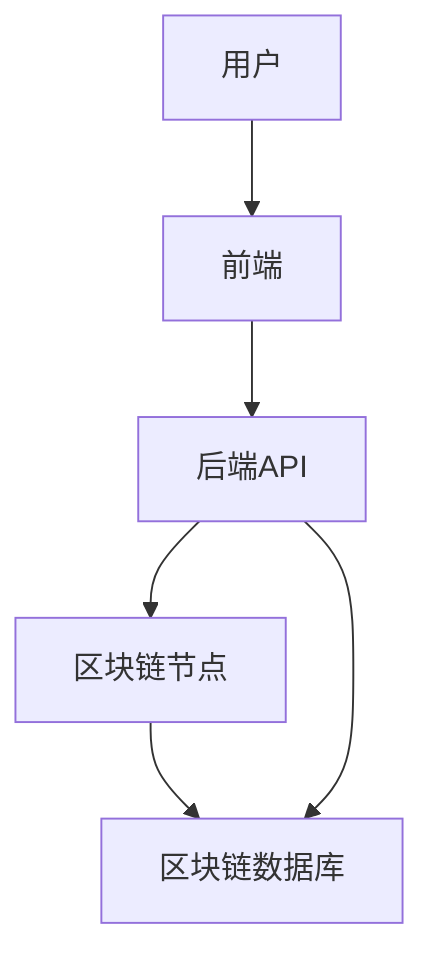
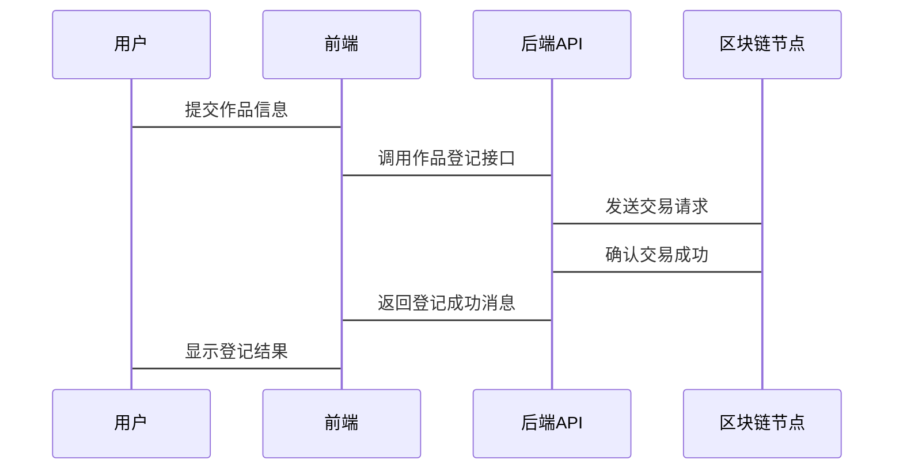

                 


# 如何评估企业的区块链版权保护平台

> 关键词：区块链，版权保护，智能合约，分布式账本，去中心化

> 摘要：本文详细介绍了如何评估企业区块链版权保护平台，从技术原理、系统架构到实际项目实施，结合具体案例分析，帮助读者全面理解区块链在版权保护中的应用价值和实现方法。

---

## 第1章: 区块链与版权保护平台背景介绍

### 1.1 区块链技术的核心概念

#### 1.1.1 区块链的基本定义

区块链是一种去中心化的分布式账本技术，通过加密算法和共识机制确保数据的安全性和不可篡改性。每个区块包含数据和哈希指针，用于验证数据的完整性和链式结构的连通性。

$$
\text{区块链 = 数据结构（区块） + 共识机制 + 加密算法}
$$

#### 1.1.2 区块链的核心特性

- **去中心化**：无须中心服务器，数据存储在多个节点上。
- **不可篡改性**：通过哈希值和链式结构保证数据无法被篡改。
- **透明性**：所有交易记录公开可查，但数据加密保护隐私。
- **智能合约**：自动执行预设的合同条款，减少信任成本。

#### 1.1.3 区块链在版权保护中的应用潜力

区块链技术可以为版权保护提供以下解决方案：

- **身份认证**：通过公私钥对确保版权作品的归属权。
- **时间戳**：记录作品的创作时间和状态，防止事后篡改。
- **版权分发**：智能合约自动分配版税，确保创作者权益。

---

### 1.2 版权保护的现状与挑战

#### 1.2.1 当前版权保护的主要问题

- **侵权问题**：盗版和非法复制难以追查。
- **维权成本高**：取证和诉讼过程繁琐且费用高昂。
- **信任缺失**：传统中心化机构可能被篡改或滥用。

#### 1.2.2 区块链技术如何解决版权保护的痛点

- **去中心化存储**：避免单点故障，防止数据被篡改。
- **智能合约**：自动执行版权许可和费用分配。
- **可追溯性**：通过区块链记录作品的全生命周期，便于追踪侵权行为。

#### 1.2.3 企业区块链版权保护平台的定义与目标

企业区块链版权保护平台通过区块链技术，实现作品的登记、确权、授权和分发，目标是为创作者和企业提供安全、透明的版权管理解决方案。

---

## 第2章: 区块链与版权保护的核心概念

### 2.1 区块链在版权保护中的核心原理

#### 2.1.1 区块链的去中心化特性

通过分布式网络存储数据，避免单点故障，确保数据的高可用性和安全性。

#### 2.1.2 智能合约在版权保护中的应用

智能合约可以自动执行版权许可、费用分配等操作，减少人为干预和信任成本。

$$
\text{智能合约 = 程序 + 执行环境}
$$

#### 2.1.3 分布式账本的技术优势

分布式账本确保数据的一致性和不可篡改性，通过去中心化的方式实现数据的安全存储。

---

### 2.2 版权保护平台的系统架构

#### 2.2.1 用户角色与权限分配

- **创作者**：提交作品并获得版权认证。
- **消费者**：购买或使用作品。
- **平台管理员**：维护系统和处理纠纷。

#### 2.2.2 数据流与信息交互

- 创作者提交作品信息。
- 平台记录作品的哈希值和时间戳。
- 消费者购买作品，智能合约自动分配版税。

#### 2.2.3 平台的功能模块划分

- **作品登记**：创作者提交作品并获得唯一标识。
- **版权确权**：通过区块链技术记录作品的归属权。
- **授权管理**：智能合约自动处理授权和费用分配。

---

## 第3章: 区块链版权保护的算法原理

### 3.1 共识算法在版权保护中的应用

#### 3.1.1 工作量证明机制（PoW）

- **特点**：通过计算哈希值证明工作量，确保数据的有效性。
- **缺点**：能耗高，效率低。

#### 3.1.2 权益证明机制（PoS）

- **特点**：根据持币量分配记账权，降低能耗。
- **缺点**：存在“富者愈富”的风险。

#### 3.1.3 拜占庭容错共识算法

- **特点**：适用于 Byzantine Fault 耐用性较高的场景。
- **缺点**：实现复杂，对网络要求高。

### 3.2 智能合约的实现原理

#### 3.2.1 智能合约的定义与特点

- 智能合约是一种运行在区块链上的自动执行程序。
- 具备不可篡改性和自动执行的特点。

#### 3.2.2 智能合约的编译与部署

- 使用 Solidity 等编程语言编写智能合约。
- 通过编译器将源代码转换为字节码，并部署到区块链上。

#### 3.2.3 智能合约的安全性与可靠性

- 智能合约的安全性依赖于代码的正确性和运行环境的可靠性。
- 需要通过严格的测试和审计确保合约的安全性。

### 3.3 区块链哈希函数的数学模型

#### 3.3.1 哈希函数的基本原理

- 哈希函数将任意长度的输入映射为固定长度的输出。
- 常见哈希函数：MD5、SHA-1、SHA-256。

#### 3.3.2 SHA-256算法的数学公式

$$
\text{SHA-256}(x) = H(x)
$$

其中，\( H(x) \) 表示输入 \( x \) 的 SHA-256 哈希值。

#### 3.3.3 哈希碰撞的概率与影响

- 哈希碰撞是指不同的输入生成相同的哈希值。
- 理论上，哈希碰撞的概率与哈希值的长度有关，长度越长，概率越小。

---

## 第4章: 区块链版权保护平台的系统架构与设计

### 4.1 项目背景与目标

#### 4.1.1 项目需求分析

- 企业需要一个安全、透明的版权保护平台。
- 平台需要支持作品登记、确权、授权和分发功能。

#### 4.1.2 项目目标设定

- 实现作品的区块链确权。
- 提供智能合约自动管理授权和费用分配。
- 确保平台的高可用性和安全性。

### 4.2 系统功能设计

#### 4.2.1 作品登记模块

- 创作者提交作品信息。
- 平台生成作品的哈希值和时间戳。
- 存储作品信息到区块链上。

#### 4.2.2 版权确权模块

- 通过区块链记录作品的归属权。
- 提供作品的唯一标识和法律效力。

#### 4.2.3 授权管理模块

- 智能合约自动处理授权请求。
- 自动分配版税和许可费用。

### 4.3 系统架构设计

#### 4.3.1 系统架构图



#### 4.3.2 系统接口设计

- 用户通过前端提交作品信息。
- 后端API调用智能合约，将作品信息存储到区块链上。
- 区块链节点验证并记录交易。

#### 4.3.3 系统交互流程图



---

## 第5章: 项目实战

### 5.1 环境搭建

- 安装 Python 和区块链框架（如 Flask 或 Django）。
- 配置区块链环境，如 Ethereum 或 Fabric。

### 5.2 核心代码实现

#### 5.2.1 区块链节点的搭建

```python
# 初始化区块链
from blockchain import Blockchain

bc = Blockchain()
```

#### 5.2.2 智能合约的编写

```solidity
// SPDX-License-Identifier: MIT
pragma solidity ^0.8.0;

contract CopyrightProtection {
    event WorkRegistered(address indexed creator, string hash, uint timestamp);

    function registerWork(address creator, string memory hash, uint timestamp) external {
        emit WorkRegistered(creator, hash, timestamp);
    }
}
```

#### 5.2.3 作品登记的实现

```python
# 登记作品
def register_work(creator, hash, timestamp):
    # 调用智能合约
    contract.registerWork(creator, hash, timestamp)
    return "作品登记成功"
```

### 5.3 项目小结

通过实际案例分析，我们可以看到区块链技术在版权保护中的巨大潜力。通过智能合约和分布式账本，我们可以实现作品的自动确权和版税分配，大大降低了传统版权保护的复杂性和成本。

---

## 第6章: 最佳实践与注意事项

### 6.1 最佳实践

- **选择合适的区块链平台**：根据需求选择公有链或联盟链。
- **确保数据隐私**：通过加密技术保护用户隐私。
- **定期审计智能合约**：确保合约的安全性和正确性。

### 6.2 总结

区块链技术为版权保护提供了全新的解决方案。通过智能合约和分布式账本，我们可以实现作品的自动确权、授权和分发，构建一个安全、透明、高效的版权保护平台。

### 6.3 注意事项

- **法律合规性**：确保平台符合相关法律法规。
- **用户体验**：简化操作流程，提高用户体验。
- **性能优化**：优化区块链节点的性能，提高处理效率。

### 6.4 拓展阅读

- 《Mastering Blockchain》
- 《Smart Contracts: The Next Great Legal Innovation》
- 《Blockchain for Dummies》

---

通过本文的详细讲解，读者可以全面了解如何评估和实施企业区块链版权保护平台，为企业的数字化转型提供有力的技术支持。

