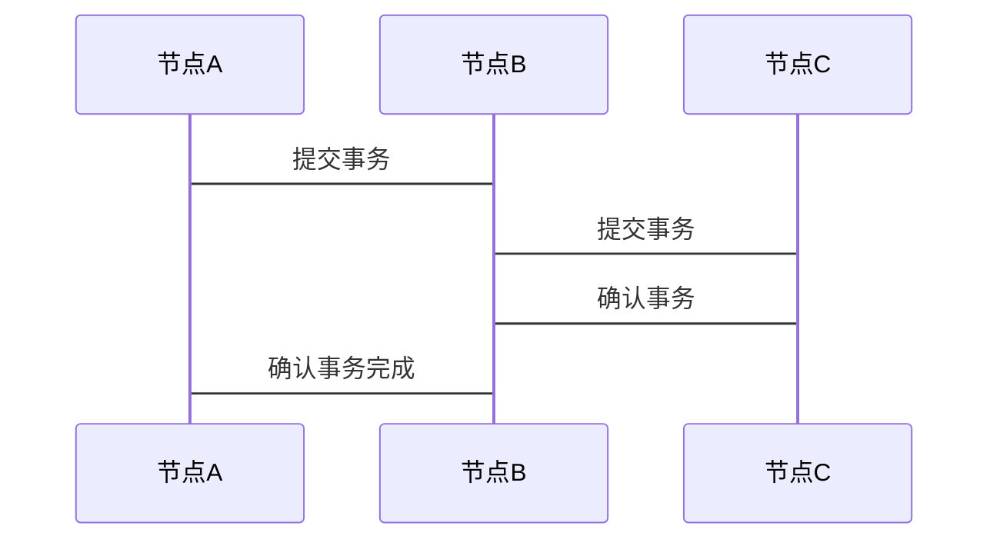
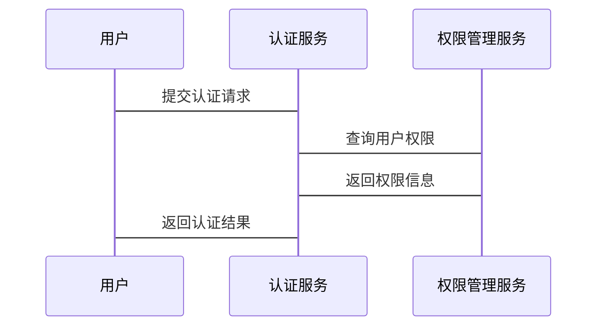

                 


```markdown
# 如何评估企业的区块链身份验证应用

> 关键词：区块链身份验证，企业应用，技术评估，系统架构，安全性

> 摘要：本文详细探讨了如何评估企业中的区块链身份验证应用，从核心概念到算法原理，再到系统架构和实际项目案例，全面分析了评估的关键点和实施方法。文章内容丰富，逻辑清晰，适合技术工程师和企业管理人员阅读。

---

## 第一部分: 区块链身份验证应用概述

### 第1章: 区块链身份验证的核心概念

#### 1.1 区块链身份验证的背景与问题背景

##### 1.1.1 当前身份验证面临的挑战
传统的身份验证方法存在以下问题：
- **安全性不足**：密码容易被破解，且单点故障风险高。
- **数据孤岛**：各个系统之间的身份信息无法共享，导致重复认证。
- **隐私泄露**：集中式存储容易被攻击，导致用户隐私泄露。

##### 1.1.2 区块链技术如何解决身份验证问题
区块链的去中心化、不可篡改和透明性特点，为身份验证提供了新的解决方案：
- **去中心化存储**：用户身份信息分散在多个节点，降低数据被篡改的风险。
- **智能合约**：自动执行权限控制和验证，减少人为干预。
- **隐私保护**：通过零知识证明等技术，验证身份而不暴露详细信息。

##### 1.1.3 区块链身份验证的边界与外延
- **边界**：仅关注身份验证过程，不涉及数据存储之外的业务逻辑。
- **外延**：结合物联网、人工智能等技术，扩展身份验证的应用场景。

#### 1.2 区块链身份验证的核心要素

##### 1.2.1 身份标识
- **定义**：唯一标识用户身份的字符串或标识符。
- **特点**：唯一性、持久性、可验证性。

##### 1.2.2 认证机制
- **定义**：验证用户身份合法性的过程。
- **类型**：基于密码、基于令牌、基于生物特征。

##### 1.2.3 权限管理
- **定义**：根据用户身份授予或限制访问权限。
- **策略**：基于角色的访问控制（RBAC）和基于属性的访问控制（ABAC）。

##### 1.2.4 数据完整性与隐私保护
- **数据完整性**：确保数据在传输和存储过程中不被篡改。
- **隐私保护**：通过加密和匿名化技术，保护用户隐私。

---

### 第2章: 区块链身份验证的核心概念与联系

#### 2.1 区块链身份验证的核心原理

##### 2.1.1 身份标识的区块链化
- **概念**：将身份标识存储在区块链上，确保其不可篡改。
- **流程**：用户生成身份标识，通过智能合约进行验证。

##### 2.1.2 哈希函数与数字签名
- **哈希函数**：将输入数据转换为固定长度的哈希值，用于验证数据完整性。
- **数字签名**：通过私钥签名和公钥验证，确保数据来源和完整性。

##### 2.1.3 共识算法在身份验证中的应用
- **共识算法**：如PoW、PoS、RAFT等，用于确保区块链网络中的数据一致性。

#### 2.2 核心概念对比表

| **对比项** | **传统身份验证** | **区块链身份验证** |
|------------|------------------|---------------------|
| **数据存储** | 集中式数据库     | 分布式区块链节点   |
| **安全性** | 易受攻击         | 高安全性，难以篡改 |
| **效率** | 可能较低         | 取决于共识算法     |
| **隐私性** | 易泄露           | 可通过零知识证明保护 |

#### 2.3 ER实体关系图

```mermaid
erDiagram
    actor 用户 : 用户
    actor 身份验证系统 : 身份验证系统
    actor 区块链节点 : 区块链节点
    actor 权限管理模块 : 权限管理模块
    boundary 身份标识 : 身份标识
    boundary 认证请求 : 认证请求
    boundary 权限请求 : 权限请求
    boundary 区块链交易 : 区块链交易
    用户 --> 身份验证系统 : 提交认证请求
    身份验证系统 --> 区块链节点 : 发送区块链交易
    区块链节点 --> 身份验证系统 : 返回交易确认
    身份验证系统 --> 权限管理模块 : 发送权限请求
    权限管理模块 --> 身份验证系统 : 返回权限确认
```

---

## 第二部分: 区块链身份验证的算法原理

### 第3章: 区块链身份验证的算法原理

#### 3.1 哈希函数的原理与实现

##### 3.1.1 哈希函数的作用
- **数据摘要**：生成唯一的数据指纹，用于验证数据完整性。

##### 3.1.2 常见哈希函数
- **MD5**：已不推荐使用，存在碰撞漏洞。
- **SHA-256**：广泛应用于区块链中，如比特币。
- **Keccak-256**：以太坊使用的哈希函数。

##### 3.1.3 Python代码实现
```python
import hashlib

def compute_hash(data):
    # 创建 SHA-256 对象
    sha = hashlib.sha256()
    # 更新哈希对象
    sha.update(data.encode('utf-8'))
    # 返回哈希值的十六进制表示
    return sha.hexdigest()

# 示例
data = "区块链身份验证"
print(compute_hash(data))  # 输出哈希值
```

#### 3.2 数字签名的原理与实现

##### 3.2.1 数字签名的作用
- **验证数据来源**：确保数据由合法用户发送。
- **数据完整性**：防止数据在传输过程中被篡改。

##### 3.2.2 数字签名的实现步骤
1. **生成密钥对**：公钥和私钥。
2. **数据哈希**：对数据进行哈希运算，生成哈希值。
3. **签名哈希值**：用私钥对哈希值进行加密，生成数字签名。

##### 3.2.3 Python代码实现
```python
from cryptography.hazmat.primitives.asymmetric import padding
from cryptography.hazmat.primitives.asymmetric.rsa import RSAPublicKey, RSAPrivateKey
from cryptography.hazmat.primitives import hashes

def sign_data(private_key, data):
    # 创建哈希对象
    hash_obj = hashes.Hash(hashes.SHA256())
    # 更新哈希对象
    hash_obj.update(data.encode('utf-8'))
    # 生成签名
    signed_data = private_key.sign(
        hash_obj.finalize(),
        padding.PKCS1v15()
    )
    return signed_data

# 示例
data = "验证身份"
print(sign_data(private_key, data))  # 输出数字签名
```

#### 3.3 共识算法的实现

##### 3.3.1 共识算法的作用
- **数据一致性**：确保区块链网络中的数据一致。
- **防止双重支付**：避免同一笔交易被多次使用。

##### 3.3.2 常见共识算法
- **工作量证明（PoW）**：比特币使用的共识算法。
- **权益证明（PoS）**：以太坊计划使用的共识算法。
- **RAFT**：适用于分布式系统中的共识协议。

##### 3.3.3 RAFT算法流程图



---

## 第三部分: 区块链身份验证的系统架构

### 第4章: 区块链身份验证系统的架构设计

#### 4.1 系统功能模块设计

##### 4.1.1 用户认证模块
- **功能**：接收用户身份信息，验证其合法性。
- **实现**：基于区块链上的身份标识和数字签名进行验证。

##### 4.1.2 权限管理模块
- **功能**：根据用户身份授予相应的访问权限。
- **实现**：基于智能合约自动执行权限控制。

##### 4.1.3 数据存储模块
- **功能**：存储用户身份信息和交易记录。
- **实现**：分布式存储在区块链节点上，确保数据不可篡改。

#### 4.2 系统架构设计

##### 4.2.1 分层架构
- **表现层**：用户界面，接收用户请求。
- **业务逻辑层**：处理用户请求，调用底层服务。
- **数据访问层**：与区块链节点交互，存储和检索数据。

##### 4.2.2 微服务架构
- **服务1**：用户认证服务。
- **服务2**：权限管理服务。
- **服务3**：数据存储服务。

#### 4.3 系统接口设计

##### 4.3.1 API接口
- **接口1**：提交认证请求。
- **接口2**：查询用户权限。
- **接口3**：更新用户信息。

##### 4.3.2 接口交互流程图



---

## 第四部分: 区块链身份验证的项目实战

### 第5章: 区块链身份验证项目实战

#### 5.1 项目环境安装

##### 5.1.1 安装区块链框架
- **推荐框架**：Hyperledger Fabric、Ethereum。
- **安装命令**：`pip install hyperledger-fabric-sdk`

##### 5.1.2 安装依赖库
- **Python库**：cryptography、hashlib。
- **安装命令**：`pip install cryptography hashlib`

#### 5.2 系统核心实现

##### 5.2.1 核心代码实现
```python
from hyperledgerfabric import BlockchainManager
from cryptography.hazmat.primitives.asymmetric.rsa import RSAPublicKey, RSAPrivateKey

class IdentityVerification:
    def __init__(self):
        self.blockchain = BlockchainManager()
        self.private_key = RSAPrivateKey.generate()
        self.public_key = RSAPublicKey.from_private_key(self.private_key)

    def verify_identity(self, user_data):
        # 生成哈希值
        hash_value = hashlib.sha256(user_data.encode()).hexdigest()
        # 生成数字签名
        signature = self.private_key.sign(hash_value, padding.PKCS1v15())
        # 验证签名
        try:
            self.public_key.verify(signature, hash_value.encode(), padding.PKCS1v15())
            return True
        except Exception:
            return False

# 示例
verification = IdentityVerification()
user_data = "用户身份验证"
print(verification.verify_identity(user_data))  # 输出验证结果
```

##### 5.2.2 代码解读与分析
- **BlockchainManager类**：管理区块链网络，处理交易和区块。
- **IdentityVerification类**：实现身份验证的核心逻辑，包括哈希计算和数字签名。

#### 5.3 案例分析

##### 5.3.1 案例背景
- **企业场景**：企业内部员工身份验证，确保访问权限的安全性。

##### 5.3.2 案例实现
```python
verification = IdentityVerification()
user_data = "员工123456"
print(verification.verify_identity(user_data))  # 输出验证结果
```

##### 5.3.3 详细讲解
- **实现过程**：用户提交身份信息，系统生成哈希值和数字签名，通过区块链节点验证签名，确保数据的完整性和真实性。
- **关键点**：通过区块链的不可篡改性，确保身份验证的安全性和可靠性。

#### 5.4 项目小结

##### 5.4.1 核心实现总结
- **身份验证流程**：用户提交请求 → 系统生成哈希 → 数字签名 → 区块链验证。
- **系统优势**：高安全性、去中心化、不可篡改。

##### 5.4.2 项目经验总结
- **安全性**：区块链技术确保了身份验证的高安全性。
- **扩展性**：系统架构设计使得后续功能扩展较为容易。

---

## 第五部分: 总结与展望

### 第6章: 总结与展望

#### 6.1 最佳实践

##### 6.1.1 技术选型建议
- **选择合适的区块链框架**：根据企业需求选择Hyperledger Fabric、Ethereum等框架。
- **确保数据隐私**：采用零知识证明等技术保护用户隐私。

##### 6.1.2 开发规范
- **代码审查**：确保代码安全，防止漏洞。
- **测试用例**：全面测试身份验证流程，确保系统稳定。

#### 6.2 小结

##### 6.2.1 核心要点总结
- **区块链身份验证**：通过区块链技术实现安全、可靠的用户身份验证。
- **算法原理**：哈希函数、数字签名、共识算法是核心。
- **系统架构**：分层架构和微服务架构是常用设计模式。

#### 6.3 注意事项

##### 6.3.1 技术风险
- **性能瓶颈**：区块链节点数量增加可能导致性能下降。
- **安全性问题**：私钥泄露可能导致严重问题。

##### 6.3.2 运维挑战
- **节点维护**：需要定期维护区块链节点，确保网络正常运行。
- **数据备份**：制定完善的数据备份策略，防止数据丢失。

#### 6.4 拓展阅读

##### 6.4.1 推荐书籍
- 《区块链：技术与应用》
- 《分布式系统：概念与设计》

##### 6.4.2 推荐技术博客
- [Hyperledger Fabric官方文档](https://hyperledger-fabric.readthedocs.io/en/latest/)
- [Ethereum智能合约开发指南](https://solidity.readthedocs.io/en/latest/)

---

## 结语

通过本文的详细讲解，读者可以全面了解如何评估和实施企业的区块链身份验证应用。从核心概念到算法原理，再到系统架构和项目实战，文章为技术工程师和企业管理人员提供了丰富的理论和实践指导。希望本文能够帮助读者在实际工作中更好地应用区块链技术，提升企业的身份验证能力。

---

**感谢您的耐心阅读，期待您的反馈与交流！**
```

