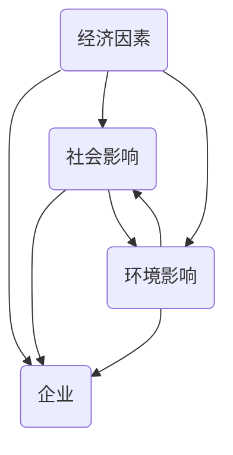
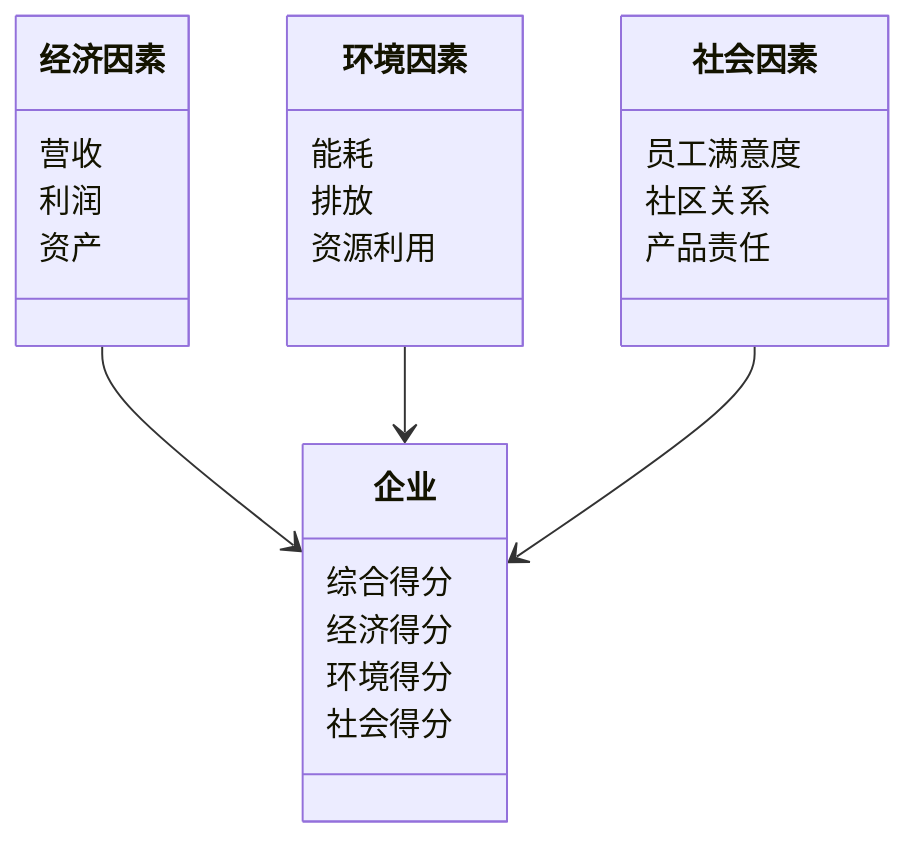
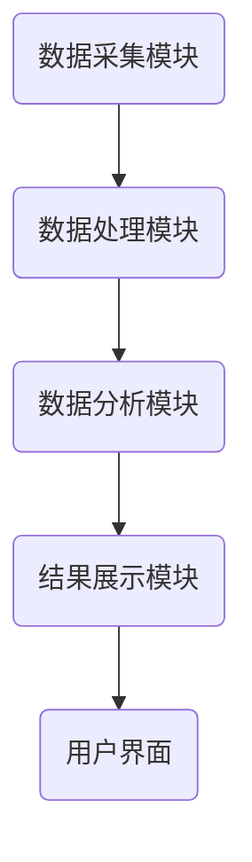
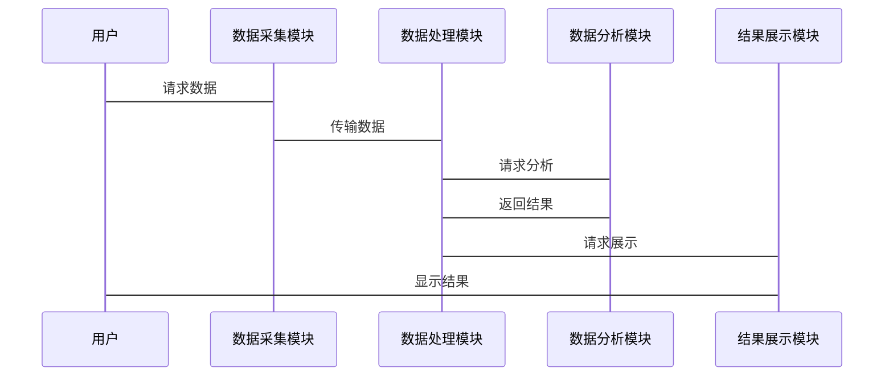

                 


# 如何评估企业的可持续发展能力

> 关键词：企业可持续发展，评估模型，经济因素，环境因素，社会因素，系统架构，算法模型

> 摘要：本文详细探讨了如何评估企业的可持续发展能力，从背景介绍、核心概念、评估模型、系统架构设计到项目实战，全面分析了企业在经济、环境和社会三个维度上的表现，并提供了一个基于生命周期评估和财务指标分析的数学模型，以及系统架构设计和项目案例分析，最后总结了最佳实践和未来发展方向。

---

## 第1章: 可持续发展能力评估的背景与问题背景

### 1.1 问题背景

#### 1.1.1 可持续发展的概念演进
可持续发展（Sustainability）最初起源于环境科学领域，强调在满足当代需求的同时，不损害后代满足其需求的能力。随着全球化的推进，可持续发展逐渐从环境领域扩展到经济、社会等多个方面。企业作为社会的重要组成部分，其可持续发展能力直接影响到企业的长期生存和发展。

#### 1.1.2 企业可持续发展能力的重要性
企业在追求经济效益的同时，也需要关注环境保护和社会责任。可持续发展能力评估帮助企业识别自身的短板，优化资源配置，提升竞争力。同时，这也是企业履行社会责任、应对政策监管和市场需求的重要手段。

#### 1.1.3 当前企业面临的可持续发展挑战
- 环境压力：资源枯竭、环境污染等问题对企业运营提出更高要求。
- 社会责任：员工权益、社区影响等方面的要求日益严格。
- 经济波动：全球经济不确定性增加，企业需要更加灵活的应对策略。

### 1.2 问题描述

#### 1.2.1 可持续发展能力的定义
企业可持续发展能力是指企业在经济、环境和社会三个维度上实现平衡发展的能力，具体表现为在追求经济效益的同时，注重环境保护和社会责任，实现长期稳定的经营。

#### 1.2.2 可持续发展能力的核心要素
- **经济因素**：企业的盈利能力、财务健康状况。
- **环境因素**：企业在生产过程中对环境的影响，包括能源消耗、碳排放等。
- **社会因素**：企业在社会中的责任履行，包括员工权益、社区关系等。

#### 1.2.3 企业可持续发展能力的边界与外延
- **边界**：企业内部资源、生产过程、员工管理。
- **外延**：供应链、产品生命周期、社会影响。

### 1.3 问题解决思路

#### 1.3.1 可持续发展能力评估的目的
通过评估帮助企业识别自身在可持续发展方面的优势和不足，指导企业优化管理策略。

#### 1.3.2 评估方法的选择与优化
- **定性分析**：通过问卷调查、专家访谈等方式收集数据。
- **定量分析**：利用财务数据、环境指标等进行量化评估。

#### 1.3.3 评估结果的应用场景
- **战略规划**：指导企业制定长期发展目标。
- **风险管理**：识别潜在风险，制定应对措施。
- **信息披露**：向利益相关方展示企业的可持续发展表现。

### 1.4 核心概念结构与组成

#### 1.4.1 可持续发展能力的三重底线模型
三重底线模型（Triple Bottom Line）将企业的绩效分为经济、环境和社会三个方面，强调企业在追求经济利益的同时，需要关注环境保护和社会责任。

#### 1.4.2 经济、环境、社会三要素的权重分配
- **经济因素**：权重为40%。
- **环境因素**：权重为30%。
- **社会因素**：权重为30%。

#### 1.4.3 企业内外部因素的相互作用
企业内部资源（如技术、管理）与外部环境（如政策、市场）相互作用，共同影响企业的可持续发展能力。

---

## 第2章: 可持续发展能力的核心概念与联系

### 2.1 核心概念原理

#### 2.1.1 可持续发展的系统性特征
可持续发展是一个复杂的系统工程，涉及经济、环境和社会等多个子系统，各子系统之间相互关联、相互作用。

#### 2.1.2 企业内外部因素的关联性
企业内部资源与外部环境相互作用，共同影响企业的可持续发展能力。例如，企业的技术创新能力（内部因素）与市场需求（外部因素）密切相关。

#### 2.1.3 可持续发展能力的动态平衡
企业的可持续发展能力是一个动态平衡的过程，需要企业在不同阶段根据实际情况调整策略。

### 2.2 核心概念属性特征对比

#### 2.2.1 经济、环境、社会三要素的对比分析
| 维度 | 定义 | 影响因素 | 权重 |
|------|------|----------|------|
| 经济 | 企业的盈利能力 | 财务状况、市场需求 | 40% |
| 环境 | 企业的环境影响 | 能源消耗、碳排放 | 30% |
| 社会 | 企业的社会责任 | 员工权益、社区关系 | 30% |

#### 2.2.2 不同行业可持续发展能力的差异
不同行业在可持续发展能力上有显著差异。例如，制造业需要关注碳排放，而服务业则更关注社会责任。

#### 2.2.3 企业规模与可持续发展能力的关系
企业规模与可持续发展能力呈正相关关系。大型企业有更多的资源和能力进行可持续发展，而小企业则受到资源限制。

### 2.3 ER实体关系图



---

## 第3章: 可持续发展能力评估的数学模型与算法

### 3.1 数学模型概述

#### 3.1.1 综合评估模型
综合评估模型将经济、环境和社会三个维度的指标进行加权计算，得出企业的可持续发展能力综合得分。

#### 3.1.2 经济、环境、社会三要素的加权公式
- 经济影响因子计算公式：
$$ E = \frac{\sum_{i=1}^{n} w_i x_i}{\sum_{i=1}^{n} w_i} $$
- 环境影响因子计算公式：
$$ E = \frac{\sum_{i=1}^{n} w_i x_i}{\sum_{i=1}^{n} w_i} $$
- 社会影响因子计算公式：
$$ S = \frac{\sum_{i=1}^{n} w_i x_i}{\sum_{i=1}^{n} w_i} $$

#### 3.1.3 不同因素对可持续发展能力的影响程度
通过权重分配，经济因素对可持续发展能力的影响最大，其次是环境因素，最后是社会因素。

### 3.2 算法原理

#### 3.2.1 数据预处理与特征提取
- 数据清洗：去除异常值和缺失值。
- 特征提取：从企业公开数据中提取经济、环境和社会相关指标。

#### 3.2.2 综合评估模型的构建
- 确定各维度的权重。
- 计算各维度的得分。
- 综合得分 = 经济得分 × 40% + 环境得分 × 30% + 社会得分 × 30%。

#### 3.2.3 结果计算与优化
- 对计算结果进行归一化处理，确保各维度得分可比。
- 根据行业基准进行调整，确保评估结果的公平性。

### 3.3 算法实现

#### 3.3.1 数据输入与处理
```python
import pandas as pd

# 读取数据
data = pd.read_csv('sustainability_data.csv')

# 数据清洗
data = data.dropna()
data = data.replace({float('inf'): None})
```

#### 3.3.2 权重分配与计算
```python
# 确定权重
weights = {'economic': 0.4, 'environmental': 0.3, 'social': 0.3}

# 计算各维度得分
economic_score = data['economic'].mean() / data['economic'].max()
environmental_score = data['environmental'].mean() / data['environmental'].max()
social_score = data['social'].mean() / data['social'].max()

# 综合得分
total_score = economic_score * weights['economic'] + environmental_score * weights['environmental'] + social_score * weights['social']
```

#### 3.3.3 结果输出
```python
print(f"综合得分: {total_score}")
```

### 3.4 数学公式

#### 3.4.1 经济影响因子计算公式
$$ E = \frac{\sum_{i=1}^{n} w_i x_i}{\sum_{i=1}^{n} w_i} $$

#### 3.4.2 环境影响因子计算公式
$$ E = \frac{\sum_{i=1}^{n} w_i x_i}{\sum_{i=1}^{n} w_i} $$

#### 3.4.3 社会影响因子计算公式
$$ S = \frac{\sum_{i=1}^{n} w_i x_i}{\sum_{i=1}^{n} w_i} $$

---

## 第4章: 可持续发展能力评估的系统分析与架构设计

### 4.1 问题场景介绍

#### 4.1.1 企业可持续发展能力评估的目标
通过系统化的方法，全面评估企业在经济、环境和社会三个维度上的表现，为企业制定可持续发展战略提供依据。

#### 4.1.2 评估系统的功能需求
- 数据采集：收集企业的经济、环境和社会相关数据。
- 数据分析：对数据进行处理和分析，计算各维度的得分。
- 结果展示：以图表形式展示评估结果，便于企业理解和应用。

### 4.2 系统功能设计

#### 4.2.1 领域模型设计


#### 4.2.2 系统架构设计


#### 4.2.3 系统接口设计
- 数据采集接口：从企业数据库中提取数据。
- 数据分析接口：调用第三方数据分析工具。
- 结果展示接口：将评估结果展示在用户界面上。

#### 4.2.4 系统交互设计


### 4.3 项目实战

#### 4.3.1 环境安装
```bash
pip install pandas numpy matplotlib
```

#### 4.3.2 系统核心实现源代码
```python
import pandas as pd
import matplotlib.pyplot as plt

# 数据加载
data = pd.read_csv('sustainability_data.csv')

# 数据清洗
data = data.dropna()

# 数据分析
economic_mean = data['economic'].mean()
environmental_mean = data['environmental'].mean()
social_mean = data['social'].mean()

# 可视化
plt.figure(figsize=(10, 6))
plt.bar(['经济', '环境', '社会'], [economic_mean, environmental_mean, social_mean])
plt.title('可持续发展能力评估结果')
plt.show()
```

#### 4.3.3 代码应用解读与分析
- 数据加载：从CSV文件中读取数据。
- 数据清洗：去除缺失值。
- 数据分析：计算各维度的平均值。
- 可视化：绘制柱状图，直观展示各维度的得分。

#### 4.3.4 实际案例分析
以某制造企业为例，分析其在经济、环境和社会三个维度上的表现，计算综合得分，并提出改进建议。

### 4.4 项目小结

#### 4.4.1 项目总结
通过系统化的评估方法，帮助企业识别在可持续发展能力方面的优势和不足，指导企业优化管理策略。

#### 4.4.2 经验与教训
- 数据质量对企业评估结果的影响重大，需要确保数据的准确性和完整性。
- 不同行业在评估指标和权重分配上有显著差异，需要根据实际情况进行调整。

---

## 第5章: 最佳实践与未来展望

### 5.1 最佳实践 tips

#### 5.1.1 数据收集与处理
- 确保数据的准确性和完整性。
- 使用多种数据来源，包括内部数据和外部数据。

#### 5.1.2 模型优化
- 根据企业实际情况调整权重分配。
- 定期更新模型，确保评估结果的时效性。

#### 5.1.3 结果应用
- 将评估结果与企业战略相结合。
- 定期回顾和优化可持续发展能力。

### 5.2 小结

#### 5.2.1 核心要点回顾
- 可持续发展能力是企业在经济、环境和社会三个维度上的综合表现。
- 通过系统化的评估方法，帮助企业识别优势和不足，优化管理策略。

#### 5.2.2 未来展望
- 随着技术的进步，可持续发展能力评估将更加智能化和自动化。
- 数据科学和人工智能技术将在评估过程中发挥更重要的作用。

### 5.3 注意事项

#### 5.3.1 数据隐私与安全
- 在数据采集和处理过程中，需要注意数据隐私和安全问题。
- 遵守相关法律法规，保护企业敏感信息。

#### 5.3.2 模型局限性
- 评估模型是基于假设和经验的，可能存在局限性。
- 需要根据实际情况进行调整和优化。

### 5.4 拓展阅读

#### 5.4.1 推荐书籍
- 《可持续发展管理》
- 《企业风险管理》

#### 5.4.2 推荐博客与资源
- [可持续发展博客](https://www.sustainabilityblog.com)
- [企业风险管理资源](https://www.enterpriserisk.com)

---

## 总结

通过本文的详细分析，读者可以全面了解如何评估企业的可持续发展能力。从背景介绍、核心概念、评估模型、系统架构设计到项目实战，我们提供了丰富的理论知识和实际案例，帮助企业在可持续发展道路上走得更稳更远。未来，随着技术的不断进步，可持续发展能力评估将变得更加智能化和精准化，为企业创造更大的价值。

