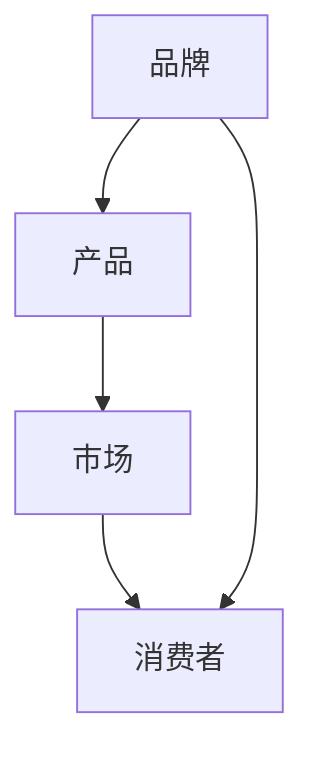
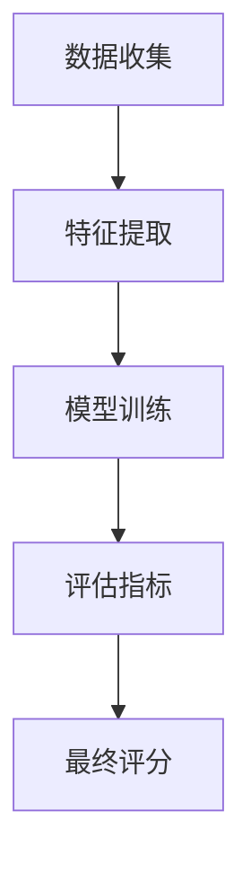
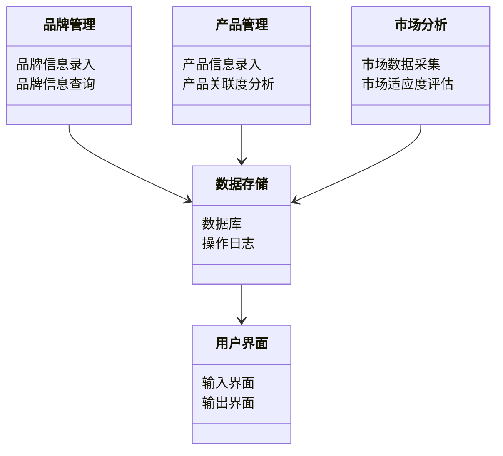
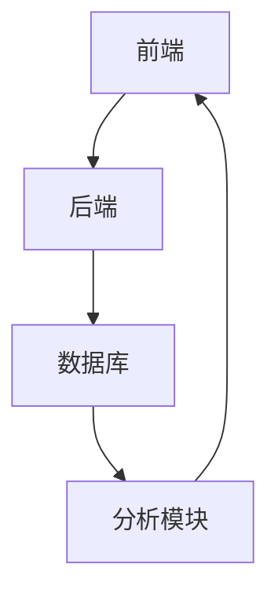

                 


# 如何评估企业的品牌延展能力

> **关键词**：品牌、评估、延展能力、算法、数学模型、系统架构  
> **摘要**：本文将详细探讨如何评估企业的品牌延展能力，从核心概念、算法原理到数学模型、系统架构，再到项目实战，为读者提供全面的指导。通过详细的步骤分析和实例解读，帮助企业在复杂多变的市场环境中有效评估和提升品牌延展能力。

---

## 第1章: 企业品牌延展能力的核心概念

### 1.1 问题背景与描述

**1.1.1 什么是品牌延展能力**  
品牌延展能力是指企业将其品牌扩展到新市场、新产品或新客户群的能力。它是企业在保持现有品牌价值的同时，向外扩展的能力。  

**1.1.2 企业品牌延展能力的重要性**  
在当今竞争激烈的市场环境中，品牌延展能力直接关系到企业的市场占有率和长期发展。具备强大品牌延展能力的企业能够更快地适应市场变化，抓住新的商业机会。  

**1.1.3 品牌延展能力的边界与外延**  
品牌延展能力的边界在于企业的核心品牌价值是否被稀释，外延则涉及如何在新领域中保持品牌一致性。  

---

### 1.2 品牌延展能力的核心要素

**1.2.1 品牌认知度**  
品牌认知度是消费者对品牌的记忆和识别能力。高品牌认知度意味着品牌更容易被消费者记住和选择。  

**1.2.2 产品关联度**  
产品关联度指的是新扩展产品与原有品牌的核心价值之间的契合程度。契合度越高，品牌延展的成功率越高。  

**1.2.3 市场适应度**  
市场适应度是品牌在新市场中的适应能力，包括市场定位、竞争对手分析和目标客户匹配度。  

---

### 1.3 品牌延展能力的关键特征

**1.3.1 可扩展性**  
品牌是否能够轻松扩展到新的市场或产品线。  

**1.3.2 一致性**  
品牌在扩展过程中是否保持核心价值和形象的一致性。  

**1.3.3 适应性**  
品牌在不同市场和文化背景下的适应能力。  

---

## 第2章: 品牌延展能力的核心概念与联系

### 2.1 品牌延展能力的原理

**2.1.1 品牌与产品的关系**  
品牌是产品的核心价值体现，产品是品牌的具体呈现形式。  

**2.1.2 产品与市场的关系**  
产品通过满足市场需求来实现品牌价值的提升。  

**2.1.3 市场与消费者的关系**  
市场是品牌与消费者之间的桥梁，消费者的需求直接影响市场的走向。  

---

### 2.2 核心概念的属性对比

| **概念**       | **品牌认知度**       | **产品关联度**       | **市场适应度**       |
|----------------|---------------------|---------------------|---------------------|
| **定义**       | 消费者对品牌的记忆和识别能力 | 新产品与品牌核心价值的契合度 | 品牌在新市场中的适应能力 |
| **重要性**      | 品牌的核心竞争力     | 品牌延展的关键因素   | 品牌扩展的可行性     |
| **影响因素**    | 品牌历史、市场推广   | 产品设计、市场定位   | 竞争分析、消费者需求 |

---

### 2.3 品牌延展能力的ER实体关系图



---

## 第3章: 品牌延展能力评估的算法原理

### 3.1 算法概述

**3.1.1 基于多维指标的评估方法**  
通过品牌认知度、产品关联度和市场适应度等多个维度进行综合评估。  

**3.1.2 基于机器学习的预测模型**  
利用历史数据和机器学习算法（如随机森林、神经网络）预测品牌延展能力。  

**3.1.3 算法的适用场景与限制**  
适用于数据充足且结构化的市场环境，对非结构化数据的处理能力较弱。  

---

### 3.2 算法流程



---

### 3.3 算法实现

**3.3.1 数据预处理**  
去除重复数据、填充缺失值、标准化数据。  

**3.3.2 特征工程**  
选择关键特征（如品牌认知度、产品关联度）并进行特征组合。  

**3.3.3 模型训练与调优**  
使用随机森林算法进行训练，并通过网格搜索优化模型参数。  

**3.3.4 结果分析与优化**  
分析模型性能，调整特征选择和模型参数以提高准确率。  

---

### 3.4 本章小结

通过多维指标和机器学习算法，我们可以科学地评估企业的品牌延展能力，为决策提供数据支持。  

---

## 第4章: 品牌延展能力评估的数学模型

### 4.1 品牌认知度的计算公式

$$ \text{品牌认知度} = \frac{\text{认知人数}}{\text{目标人群}} $$  

---

### 4.2 产品关联度的计算公式

$$ \text{产品关联度} = \frac{\text{新产品销量}}{\text{原有产品销量}} $$  

---

### 4.3 市场适应度的计算公式

$$ \text{市场适应度} = \frac{\text{市场份额增长率}}{\text{行业平均增长率}} $$  

---

### 4.4 综合评估模型

$$ \text{品牌延展能力评分} = 0.4 \times \text{品牌认知度} + 0.3 \times \text{产品关联度} + 0.3 \times \text{市场适应度} $$  

---

## 第5章: 系统分析与架构设计

### 5.1 问题场景介绍

我们需要设计一个系统来实时监控和评估企业的品牌延展能力，包括数据采集、分析和可视化功能。  

---

### 5.2 系统功能设计



---

### 5.3 系统架构设计



---

## 第6章: 项目实战

### 6.1 环境安装

安装Python、Pandas、Scikit-learn等依赖库。  

---

### 6.2 核心代码实现

```python
import pandas as pd
from sklearn.ensemble import RandomForestRegressor
from sklearn.metrics import mean_squared_error

# 数据加载
data = pd.read_csv('brand_extend.csv')

# 特征选择
features = ['brand_recognition', 'product_association', 'market_adaptability']
target = 'score'

# 数据分割
X = data[features]
y = data[target]

# 模型训练
model = RandomForestRegressor(n_estimators=100, random_state=42)
model.fit(X, y)

# 模型预测
predictions = model.predict(X)

# 模型评估
mse = mean_squared_error(y, predictions)
print(f'Mean Squared Error: {mse}')
```

---

### 6.3 代码解读与分析

- **数据加载**：从CSV文件中读取品牌延展能力数据。  
- **特征选择**：选择品牌认知度、产品关联度和市场适应度作为特征。  
- **模型训练**：使用随机森林算法训练模型。  
- **模型预测**：对测试数据进行预测并评估模型性能。  

---

## 第7章: 最佳实践与注意事项

### 7.1 最佳实践

- 定期评估品牌延展能力，及时调整市场策略。  
- 结合定量分析和定性分析，全面评估品牌延展能力。  

### 7.2 小结

通过本文的详细讲解，读者可以系统地掌握如何评估企业的品牌延展能力，并在实际工作中加以应用。  

### 7.3 注意事项

- 数据质量直接影响评估结果，需谨慎处理数据。  
- 模型选择需根据实际场景进行调整，避免过度复杂化。  

### 7.4 拓展阅读

- 《品牌管理》：深入理解品牌管理的核心理论。  
- 《机器学习实战》：学习更多机器学习算法及其应用。  

---

## 结语

评估企业的品牌延展能力是一个复杂但重要的任务。通过本文的系统分析和实践指导，读者可以掌握科学的评估方法，并在实际工作中提升企业的品牌延展能力。  

---

**全文完**

