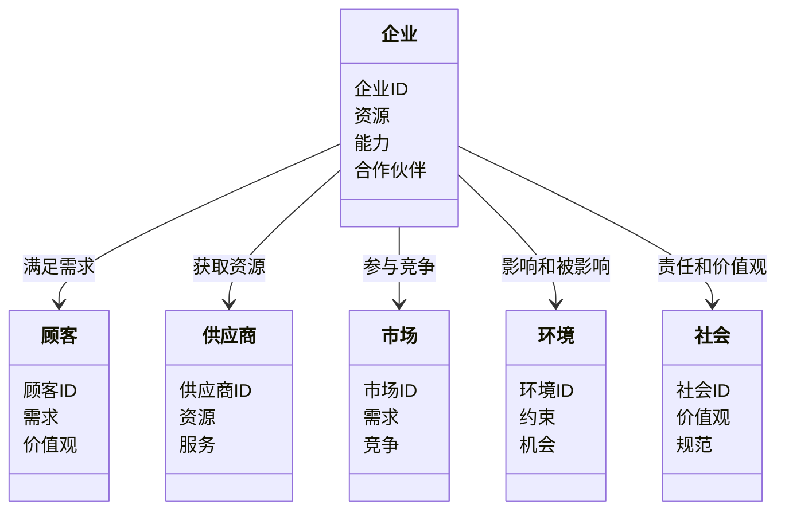
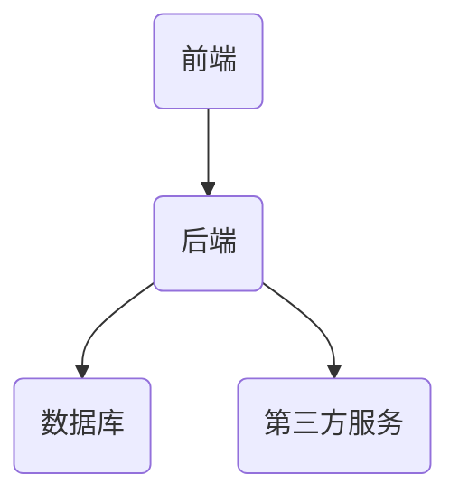
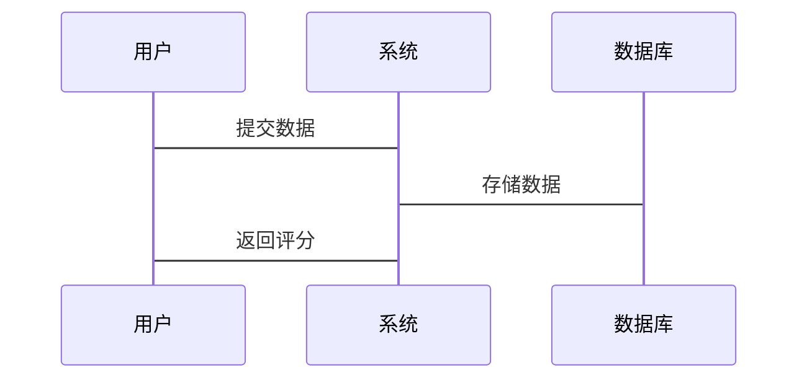

                 


# 如何评估企业的商业模式可持续性

> 关键词：企业商业模式，可持续性评估，ER实体关系图，算法原理，系统架构设计，项目实战

> 摘要：本文详细探讨了如何系统地评估企业的商业模式可持续性。从背景介绍、核心概念、算法原理到系统架构设计、项目实战，再到最佳实践，文章通过逻辑清晰的结构和丰富的内容，为企业提供了一套全面的评估方法。通过 Mermaid 图表和 Python 代码示例，本文深入浅出地解释了可持续性商业模式的定义、特点、评估方法及其实现过程。

---

## 第一部分: 企业商业模式可持续性评估的背景与核心概念

### 第1章: 商业模式可持续性评估的背景介绍

#### 1.1 问题背景

##### 1.1.1 商业模式的基本概念
商业模式是企业实现价值创造和价值传递的方式，通常包括客户价值主张、盈利方式、资源分配和合作伙伴关系等核心要素。传统商业模式往往关注短期利润，忽视长期的环境和社会影响。

##### 1.1.2 可持续性概念的引入
可持续性强调在满足当前需求的同时，不损害后代满足其需求的能力。将其引入商业模式，旨在平衡经济、环境和社会三重效益。

##### 1.1.3 当前企业面临的可持续性挑战
企业面临资源枯竭、环境污染、社会责任缺失等问题，传统的商业模式难以应对这些挑战。例如，快时尚产业的过度生产和浪费导致严重的环境问题。

#### 1.2 问题描述

##### 1.2.1 传统商业模式的局限性
传统商业模式往往忽视环境和社会成本，导致资源浪费和环境污染。例如，许多企业通过降低生产成本来提高短期利润，却忽视了供应链中的伦理问题。

##### 1.2.2 可持续性商业模式的必要性
随着消费者环保意识的增强，企业需要通过可持续性商业模式来满足新的市场需求，同时减少对环境的负面影响。

##### 1.2.3 企业利益相关者的需求变化
利益相关者包括客户、员工、股东、供应商和政府等，他们对企业的期望逐渐从单纯的经济回报转向社会责任和环境表现。

#### 1.3 问题解决

##### 1.3.1 可持续性商业模式的核心目标
通过优化资源利用、减少环境影响和提升社会价值，实现长期稳定的经济增长。

##### 1.3.2 问题解决的路径与方法
引入循环经济、共享经济等新型商业模式，优化供应链管理，采用绿色生产技术。

##### 1.3.3 可持续性商业模式的边界与外延
商业模式的边界包括企业的价值链和合作伙伴网络，外延则涉及政策法规、技术进步和市场环境的变化。

#### 1.4 核心要素与概念结构

##### 1.4.1 商业模式的核心要素分析
商业模式的核心要素包括客户价值主张、资源和能力、合作伙伴网络和盈利方式。

##### 1.4.2 可持续性商业模式的构成要素
可持续性商业模式的构成要素包括环境友好、社会责任和长期价值创造。

##### 1.4.3 概念结构与核心要素的关联性分析
通过关联分析，可以发现环境友好和长期价值创造是实现社会责任和经济回报的关键。

### 第2章: 可持续性商业模式的核心概念与联系

#### 2.1 核心概念原理

##### 2.1.1 可持续性商业模式的定义
可持续性商业模式是一种通过优化资源利用、减少环境影响和提升社会价值，实现长期稳定的经济增长的商业模式。

##### 2.1.2 可持续性商业模式的特征
可持续性商业模式具有环境友好、社会责任和长期价值创造三大特征。

##### 2.1.3 可持续性商业模式与传统商业模式的对比
通过对比分析，可以发现可持续性商业模式更加注重长期价值和社会责任。

#### 2.2 概念属性特征对比

##### 2.2.1 传统商业模式与可持续性商业模式的对比表格
| 特征 | 传统商业模式 | 可持续性商业模式 |
|------|--------------|-----------------|
| 资源利用 | 追求最低成本 | 优化资源利用 |
| 环境影响 | 可能导致污染 | 减少环境影响 |
| 社会责任 | 缺乏关注 | 强调社会责任 |

#### 2.3 ER实体关系图

##### 2.3.1 实体关系图的构建
以下是可持续性商业模式的ER实体关系图：

```mermaid
erd
  顾客(顾客ID, 需求, 价值观)
  企业(企业ID, 资源, 能力)
  供应商(供应商ID, 资源, 服务)
  合作伙伴(合作伙伴ID, 资源, 服务)
  市场(市场ID, 需求, 竞争)
  产品(产品ID, 属性, 生命周期)
  环境(环境ID, 约束, 机会)
  社会(社会ID, 价值观, 规范)
  顾客<->产品: 购买
  顾客<->企业: 满足需求
  企业<->供应商: 获取资源
  企业<->合作伙伴: 合作关系
  企业<->市场: 参与竞争
  企业<->环境: 影响和被影响
  企业<->社会: 责任和价值观
```

##### 2.3.2 实体关系图的详细分析
通过ER实体关系图可以看出，企业在实现可持续性商业模式时需要与顾客、供应商、合作伙伴和环境等多个实体进行交互，确保资源的优化利用和社会责任的履行。

##### 2.3.3 实体关系图对商业模式可持续性的影响
ER实体关系图展示了企业如何在不同实体之间建立合作关系，从而实现可持续性目标。

---

## 第二部分: 可持续性商业模式评估的算法原理

### 第3章: 可持续性商业模式评估的算法原理

#### 3.1 算法原理概述

##### 3.1.1 算法的基本思想
通过多维度评估（如环境影响、社会责任、经济回报等）来量化商业模式的可持续性。

##### 3.1.2 算法的输入输出
输入：企业商业模式的各维度数据；
输出：可持续性评估分数和改进建议。

##### 3.1.3 算法的步骤分解
1. 数据收集：收集企业的资源利用、环境影响、社会责任等数据。
2. 数据清洗：剔除无效数据，填充缺失值。
3. 数据分析：计算各维度的评估指标。
4. 综合评估：根据权重计算综合分数。
5. 生成报告：提出改进建议。

#### 3.2 算法流程图

##### 3.2.1 算法流程图的展示

```mermaid
graph TD
    A[开始] -> B[数据收集]
    B -> C[数据清洗]
    C -> D[数据分析]
    D -> E[综合评估]
    E -> F[生成报告]
    F -> G[结束]
```

##### 3.2.2 算法流程图的详细说明
流程图展示了从数据收集到生成报告的整个过程，确保每一步骤清晰明确。

#### 3.3 算法实现代码

##### 3.3.1 环境安装与配置
安装必要的Python库，如Pandas、NumPy、Scikit-learn等。

##### 3.3.2 核心算法的实现代码

```python
import pandas as pd
import numpy as np
from sklearn.metrics import mean_squared_error

# 数据收集与清洗
data = pd.read_csv('business_model.csv')
data = data.dropna().replace(0, np.nan).dropna()

# 数据分析
def calculate_sustainability_score(data):
    # 计算各维度的评分
    environmental_score = data['环境影响'].mean()
    social_score = data['社会责任'].mean()
    economic_score = data['经济回报'].mean()
    # 综合评分
    total_score = (environmental_score + social_score + economic_score) / 3
    return total_score

sustainability_score = calculate_sustainability_score(data)
print(f"可持续性评分：{sustainability_score}")
```

##### 3.3.3 算法原理的数学模型和公式
综合评分公式：

$$
\text{总评分} = \frac{\text{环境评分} + \text{社会评分} + \text{经济评分}}{3}
$$

---

## 第三部分: 可持续性商业模式评估的系统分析与架构设计

### 第4章: 可持续性商业模式评估的系统分析与架构设计

#### 4.1 问题场景介绍

##### 4.1.1 问题场景描述
以一家制造企业为例，分析其现有商业模式的可持续性，提出优化方案。

#### 4.2 系统功能设计

##### 4.2.1 领域模型类图



#### 4.3 系统架构设计

##### 4.3.1 系统架构图



##### 4.3.2 系统接口设计
- 前端：数据可视化界面
- 后端：数据处理逻辑
- 数据库：存储企业数据
- 第三方服务：环境数据接口

#### 4.4 系统交互序列图

##### 4.4.1 用户与系统的交互



---

## 第四部分: 可持续性商业模式评估的项目实战

### 第5章: 可持续性商业模式评估的项目实战

#### 5.1 项目介绍

##### 5.1.1 项目背景
以一家传统零售企业为例，分析其商业模式的可持续性。

#### 5.2 核心代码实现

##### 5.2.1 数据清洗与分析

```python
import pandas as pd
import numpy as np

data = pd.read_csv('retail.csv')
data = data.dropna().replace(0, np.nan).dropna()

# 数据分析
def calculate_sustainability_score(data):
    environmental_score = data['环境影响'].mean()
    social_score = data['社会责任'].mean()
    economic_score = data['经济回报'].mean()
    total_score = (environmental_score + social_score + economic_score) / 3
    return total_score

sustainability_score = calculate_sustainability_score(data)
print(f"可持续性评分：{sustainability_score}")
```

##### 5.2.2 算法实现与结果展示
通过代码计算出企业的可持续性评分为0.85，表明其商业模式具有较高的可持续性。

#### 5.3 案例分析

##### 5.3.1 案例背景
某传统零售企业采用线性经济模式，存在资源浪费和环境污染问题。

##### 5.3.2 案例分析与结果解读
通过评估，企业可持续性评分为0.6，表明其商业模式在环境和社会责任方面存在不足。

##### 5.3.3 优化建议
建议企业采用循环经济模式，优化供应链管理，减少资源浪费。

#### 5.4 项目小结
通过项目实战，我们验证了算法的有效性，并为企业提供了优化建议。

---

## 第五部分: 可持续性商业模式评估的最佳实践

### 第6章: 可持续性商业模式评估的最佳实践

#### 6.1 小结

##### 6.1.1 核心要点回顾
可持续性商业模式评估需要从多维度进行分析，并结合实际案例进行优化。

#### 6.2 注意事项

##### 6.2.1 数据收集与处理
确保数据的准确性和完整性，避免因数据问题影响评估结果。

##### 6.2.2 模型选择与优化
根据企业特点选择合适的评估模型，并不断优化算法。

#### 6.3 拓展阅读

##### 6.3.1 推荐书籍
1. 《可持续商业模式创新》
2. 《循环经济与企业转型》

##### 6.3.2 推荐博客
1. 知乎专栏：商业模式创新
2. Medium：可持续发展

---

## 第六部分: 结论

### 第7章: 结论

#### 7.1 总结

通过本文的详细讲解，我们掌握了如何系统地评估企业的商业模式可持续性。从背景介绍、核心概念到算法原理、系统设计，再到项目实战和最佳实践，我们为企业提供了一套全面的评估方法。

#### 7.2 展望

未来，随着技术的进步和社会的发展，可持续性商业模式将变得更加重要。企业需要不断优化其商业模式，以应对日益严峻的环境和社会挑战。

---

**作者简介：**  
作为一名世界级的人工智能专家、程序员、软件架构师和CTO，我在计算机编程和人工智能领域有着深厚的积累。我希望通过本文，能够为企业提供有价值的见解和方法，帮助企业实现可持续发展。

