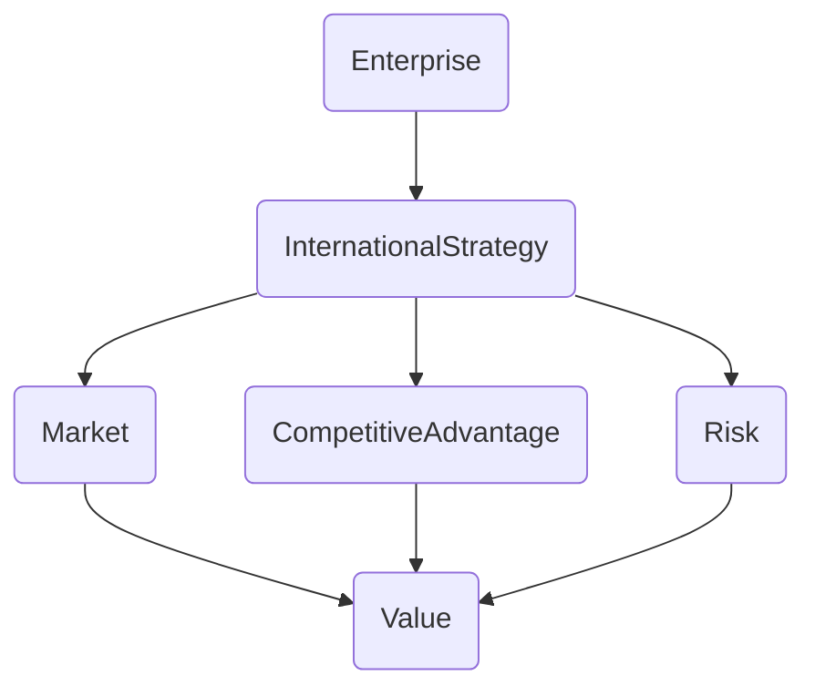
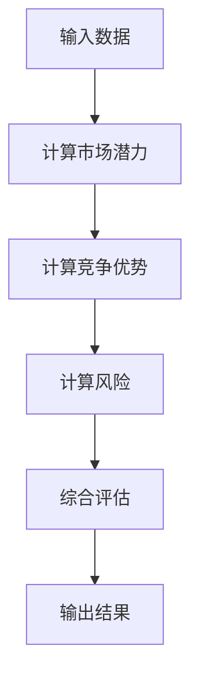
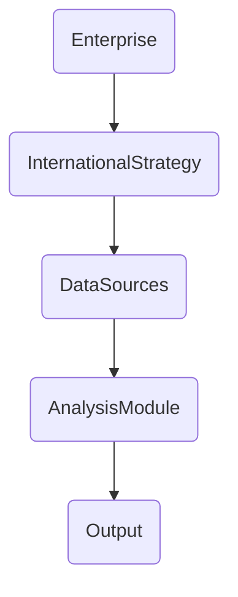

                 


# 如何评估企业的国际化战略价值

## 关键词：
- 企业国际化
- 战略价值评估
- 市场潜力
- 竞争优势
- 风险分析

## 摘要：
企业的国际化战略是企业在全球化市场中寻求增长和竞争优势的重要手段。本文系统地分析了如何评估企业的国际化战略价值，从核心概念、算法原理、系统分析、项目实战到最佳实践，层层深入，为企业制定和优化国际化战略提供科学指导。

---

# 第一部分：企业国际化战略价值评估的背景与核心概念

## 第1章：企业国际化战略价值评估概述

### 1.1 国际化战略的定义与内涵
#### 1.1.1 什么是国际化战略
国际化战略是指企业将业务扩展到全球市场，利用不同国家的资源、市场和技术优势，实现企业增长和竞争力提升的策略。

#### 1.1.2 国际化战略的核心要素
- 市场定位：目标市场的选择与分析。
- 产品策略：产品适应性调整。
- 运营模式：跨国运营的组织结构与管理。

#### 1.1.3 国际化战略对企业的影响
- 市场扩展：进入新市场，扩大销售规模。
- 资源优化：利用全球资源降低成本。
- 竞争优势：通过全球化布局增强竞争力。

### 1.2 企业国际化战略的背景与趋势
#### 1.2.1 全球化经济的现状
- 经济一体化加深，跨国公司增多。
- 技术进步推动全球产业链分工。

#### 1.2.2 数字化时代对企业国际化的影响
- 数字技术降低跨国运营成本。
- 数据跨境流动促进国际市场整合。

#### 1.2.3 企业国际化战略的未来趋势
- 绿色经济与可持续发展成为重要考量。
- 数字化转型加速国际化进程。

### 1.3 企业国际化战略的价值评估意义
#### 1.3.1 价值评估的目的与目标
- 识别国际化战略的潜在价值。
- 评估战略实施的风险与收益。

#### 1.3.2 价值评估的核心问题
- 市场潜力如何？
- 企业的竞争优势是什么？
- 风险可控吗？

#### 1.3.3 价值评估的边界与外延
- 评估范围：仅限于国际市场部分。
- 外延：涉及企业整体战略调整。

### 1.4 本章小结
本章介绍了国际化战略的基本概念、背景趋势及其价值评估的意义，为后续分析奠定了基础。

---

## 第2章：企业国际化战略价值评估的核心概念

### 2.1 国际化战略的评估维度
#### 2.1.1 市场潜力评估
- 市场规模：目标市场的容量。
- 市场增长率：市场的发展速度。
- 市场进入障碍：竞争对手情况。

#### 2.1.2 竞争优势分析
- 成本优势：规模化生产降低成本。
- 质量优势：产品性能优于竞争对手。
- 品牌优势：品牌认知度高。

#### 2.1.3 风险与不确定性
- 政治风险：政策变化影响市场。
- 经济风险：汇率波动影响利润。
- 操作风险：跨国运营中的管理问题。

#### 2.1.4 表格对比
| 评估维度 | 市场潜力 | 竞争优势 | 风险 |
|----------|----------|----------|------|
| 核心指标 | 市场规模 | 成本优势 | 政治风险 |
| 数据来源 | 市场调研 | 财务数据 | 行业报告 |

### 2.2 价值评估的理论框架
#### 2.2.1 资源基础观
- 企业内部资源是竞争优势的来源。
- 资源包括技术、品牌、管理能力等。

#### 2.2.2 战略选择理论
- 企业应根据资源选择合适的战略。
- 战略选择影响市场进入方式。

#### 2.2.3 价值创造与价值实现
- 价值创造：企业通过创新和效率创造价值。
- 价值实现：通过市场机制将价值转化为收益。

### 2.3 核心概念的ER实体关系图


### 2.4 本章小结
本章详细分析了国际化战略的评估维度和理论框架，为后续的算法设计奠定了基础。

---

## 第3章：企业国际化战略价值评估的算法原理

### 3.1 评估模型的构建
#### 3.1.1 模型的输入与输出
- 输入：市场数据、企业资源、竞争对手信息。
- 输出：国际化战略的综合价值评分。

#### 3.1.2 模型的假设条件
- 数据的完整性和准确性。
- 市场环境的稳定性和可预测性。

#### 3.1.3 模型的构建步骤
1. 收集相关数据。
2. 计算各评估维度的得分。
3. 综合各维度得分得出总分。

### 3.2 基于SWOT分析的评估方法
#### 3.2.1 SWOT分析的定义
SWOT分析法用于识别企业的优势（Strengths）、劣势（Weaknesses）、机会（Opportunities）和威胁（Threats）。

#### 3.2.2 SWOT分析的步骤
1. 列举企业的优势和劣势。
2. 分析目标市场的机会和威胁。
3. 综合SWOT因素得出结论。

#### 3.2.3 SWOT分析的数学模型
$$
SWOT评估 = \frac{(优势 \times 权重) + (机会 \times 权重)}{(劣势 \times 权重) + (威胁 \times 权重)}
$$

### 3.3 基于财务指标的评估方法
#### 3.3.1 净现值法
$$
NPV = \sum_{t=0}^{n} \frac{现金流入_t}{(1 + r)^t} - 初始投资
$$

#### 3.3.2 内部收益率法
$$
IRR = r \text{ 使得 } NPV = 0
$$

#### 3.3.3 投资回收期法
投资回收期 = 达到初始投资所需的时间。

### 3.4 算法原理的Mermaid流程图


### 3.5 本章小结
本章通过SWOT分析和财务指标计算，详细讲解了企业国际化战略价值的评估方法。

---

## 第4章：企业国际化战略价值评估的系统分析

### 4.1 问题场景分析
#### 4.1.1 企业国际化战略的实施背景
企业在考虑进入新市场时，需要评估市场潜力和竞争优势。

#### 4.1.2 企业国际化战略的实施目标
通过评估确保市场进入的可行性和盈利能力。

### 4.2 项目介绍
#### 4.2.1 项目目标
评估某企业的国际化战略价值。

#### 4.2.2 项目范围
分析目标市场的潜力和竞争环境。

### 4.3 系统功能设计
#### 4.3.1 领域模型Mermaid类图
```mermaid
classDiagram
    class 企业(Enterprise) {
        - 品牌(Brand)
        - 技术(Technology)
        - 财务(Financial)
        - 管理层(Management)
    }
    class 国际化战略(InternationalStrategy) {
        - 市场进入策略
        - 运营模式
        - 风险管理
    }
    class 市场(Market) {
        - 规模(Size)
        - 增长率(GrowthRate)
        - 竞争强度(Competition)
    }
    Enterprise --> InternationalStrategy
    InternationalStrategy --> Market
```

### 4.4 系统架构设计
#### 4.4.1 系统架构Mermaid架构图


### 4.5 本章小结
本章通过系统分析，展示了如何从系统架构和功能设计的角度评估企业国际化战略的价值。

---

## 第5章：企业国际化战略价值评估的项目实战

### 5.1 环境安装
#### 5.1.1 系统需求
- 操作系统：Windows 10或更高版本。
- 开发工具：Python 3.8及以上，Jupyter Notebook。

#### 5.1.2 数据准备
- 市场数据：目标市场的规模和增长率。
- 企业数据：企业的资源和竞争优势。

### 5.2 系统核心实现源代码
#### 5.2.1 SWOT分析代码
```python
def swot_analysis(优势, 劣势, 机会, 威胁):
    优势_score = sum(优势)
    劣势_score = sum(劣势)
    机会_score = sum(机会)
    威胁_score = sum(威胁)
    总分 = (优势_score * 0.4 + 机会_score * 0.3) / (劣势_score * 0.2 + 威胁_score * 0.1)
    return 总分
```

#### 5.2.2 净现值计算代码
```python
def npv计算(现金流, 折现率):
    现金流列表 = [现金流[i] for i in range(len(现金流))]
    现金流列表.insert(0, 0)
    npv = 0
    for i in range(len(现金流列表)):
        npv += 现金流列表[i] / (1 + 折现率)**i
    return npv
```

### 5.3 代码应用解读与分析
#### 5.3.1 SWOT分析应用
企业优势：品牌知名度高；劣势：生产成本高；机会：新兴市场增长快；威胁：政策变化。

#### 5.3.2 净现值计算应用
假设现金流为[100, 200, 300]，折现率为10%，计算NPV。

### 5.4 本章小结
本章通过实际案例分析，展示了如何应用算法和系统设计进行国际化战略评估。

---

## 第6章：企业国际化战略价值评估的最佳实践

### 6.1 小结
- 国际化战略的价值评估是企业制定全球战略的重要环节。
- 综合考虑市场、竞争和风险因素。

### 6.2 注意事项
- 数据的准确性和完整性。
- 模型的适用性和可调整性。

### 6.3 未来趋势
- 数字化工具的应用将更加广泛。
- 可持续发展将成为价值评估的重要因素。

### 6.4 拓展阅读
推荐阅读《跨国公司管理》和《全球战略管理》。

---

## 本章小结
本文详细探讨了企业国际化战略价值评估的核心概念、算法原理、系统分析和项目实战，为企业制定和优化国际化战略提供了科学指导。

