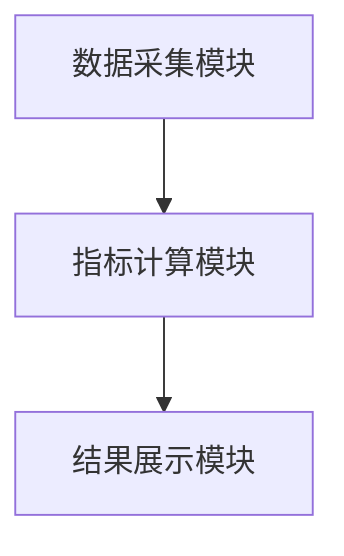

                 


# 如何评估企业的国际化程度价值

> 关键词：企业国际化程度，价值评估，国际化模型，评估指标，国际化战略

> 摘要：企业国际化程度是衡量企业在全球市场竞争力和影响力的重要指标。本文将系统地探讨如何科学评估企业国际化程度的价值，包括评估的背景、核心概念、算法原理、系统架构设计和项目实战等。

---

## 第一部分: 企业国际化程度价值评估背景与概念

### 第1章: 企业国际化程度价值评估的背景与重要性

#### 1.1 什么是企业国际化程度
- **国际化定义与内涵**  
  企业的国际化程度是指企业在全球市场中经营的广度和深度，包括市场覆盖、资源配置、组织结构和管理能力等方面。

- **国际化程度的外延与边界**  
  - 市场国际化：产品或服务覆盖的国家和地区数量。  
  - 运营国际化：跨国生产和供应链管理能力。  
  - 资源与能力国际化：全球范围内的人才、技术和资本整合能力。

- **国际化与全球化的关系**  
  - 全球化是国际化的目标，国际化是实现全球化的过程。

#### 1.2 企业国际化程度的价值
- **对企业发展的意义**  
  国际化扩展了企业的市场空间，增强了抗风险能力。  

- **对竞争优势的影响**  
  通过国际化，企业可以获取全球资源，降低生产成本，提高产品创新能力。  

- **与企业价值创造的关系**  
  国际化程度与企业利润率、品牌价值和股价密切相关。

#### 1.3 企业国际化程度评估的现状与挑战
- **现状**  
  - 当前主要采用定性评估与定量评估相结合的方法。  
  - 不同行业国际化程度差异显著，例如科技企业 vs. 制造业。  

- **挑战**  
  - 数据获取难度大：需要跨国市场数据和企业内部数据。  
  - 指标多样性与复杂性：涉及市场、运营、资源等多个维度。  
  - 利益相关者需求差异：投资者、管理层和监管机构关注点不同。

---

### 第2章: 企业国际化程度价值评估的核心框架

#### 2.1 企业国际化程度的评估维度
- **市场国际化程度**  
  - 指标：国际市场收入占比、市场覆盖国家数量、跨国市场渗透率。  
  - 例如，某企业国际市场收入占比为60%，说明其国际化程度较高。

- **运营国际化程度**  
  - 指标：跨国供应链效率、海外分支机构数量、生产本地化程度。  
  - 例如，某企业有10个海外分支机构，说明其运营国际化程度较高。

- **资源与能力国际化程度**  
  - 指标：全球员工数量占比、跨国研发团队规模、国际化专利数量。  
  - 例如，某企业全球员工中40%来自海外市场，说明其资源国际化程度较高。

#### 2.2 企业国际化程度的评估模型
- **矩阵评估模型**  
  将企业国际化程度分为四个象限：  
  1. **本地化**：仅在单一市场运营。  
  2. **区域化**：在特定区域内有较大市场份额。  
  3. **全球化**：在全球多个市场有均衡的市场份额。  
  4. **跨国化**：在全球市场占据领导地位，具有强大的跨文化管理能力。

- **层次分析模型（AHP）**  
  将多个评估指标按照层次结构进行权重计算，最终得出综合得分。

- **综合评分模型**  
  根据各项指标的得分，进行加权平均，得出企业的国际化程度评分。

---

### 第3章: 企业国际化程度价值评估的算法原理

#### 3.1 基于层次分析法（AHP）的评估模型
- **步骤**  
  1. 确定评估指标及其权重。  
  2. 构建比较矩阵。  
  3. 计算特征值和一致性检验。  
  4. 计算各指标的权重。  
  5. 根据权重计算综合得分。

- **公式**  
  $$ AHP\_weight = \frac{\lambda_i}{\sum_{j=1}^n \lambda_j} $$  
  其中，$\lambda_i$ 是第i个指标的特征值，$\sum_{j=1}^n \lambda_j$ 是所有指标的特征值之和。

#### 3.2 基于模糊综合评价法的评估模型
- **步骤**  
  1. 确定评价指标和评价等级。  
  2. 构建模糊评价矩阵。  
  3. 计算各指标的综合评价结果。  
  4. 确定最终得分。

- **公式**  
  $$ F = \sum_{i=1}^n w_i \cdot R_i $$  
  其中，$w_i$ 是第i个指标的权重，$R_i$ 是第i个指标的评价结果。

---

## 第四部分: 企业国际化程度价值评估的系统架构设计

### 第4章: 系统架构与功能设计

#### 4.1 系统功能模块
- 数据采集模块：收集企业的市场、运营和资源数据。  
- 指标计算模块：根据评估模型计算国际化程度得分。  
- 结果展示模块：以图表形式展示评估结果。

#### 4.2 系统架构图


#### 4.3 系统接口设计
- 数据接口：与企业ERP系统对接，获取实时数据。  
- 用户接口：提供数据输入和结果查看功能。

---

## 第五部分: 项目实战

### 第5章: 项目实战与案例分析

#### 5.1 案例背景
- 某跨国企业希望评估其国际化程度，以优化全球战略。

#### 5.2 实施步骤
1. **数据收集**：获取该企业的国际市场收入、分支机构数量、专利数量等数据。  
2. **指标计算**：使用层次分析法计算各项指标的权重，得出综合得分。  
3. **结果分析**：根据得分制定优化策略。

#### 5.3 代码实现
```python
# 示例代码：基于层次分析法的国际化程度评估
import numpy as np

# 假设指标权重矩阵
matrix = np.array([
    [1, 3, 2],
    [1/3, 1, 2],
    [1/2, 1/2, 1]
])

# 计算特征值
values, vectors = np.linalg.eig(matrix)

# 计算权重
weights = values / np.sum(values)

print("指标权重为：", weights)
```

---

## 第六部分: 最佳实践与小结

### 第6章: 最佳实践与注意事项

#### 6.1 最佳实践
- 确保数据来源的可靠性。  
- 合理设置指标权重，避免片面性。  
- 定期更新评估结果，适应市场变化。

#### 6.2 小结
企业国际化程度价值评估是一个复杂但重要的过程，需要结合定性与定量方法，利用先进的算法和系统工具，才能得出科学的结论。

---

### 参考文献
1.《企业国际化战略与管理》，某某出版社，2023年。  
2.《层次分析法在企业评估中的应用》，某某期刊，2022年。  

---

通过以上步骤，我们可以系统地评估企业的国际化程度价值，为企业制定国际化战略提供科学依据。

