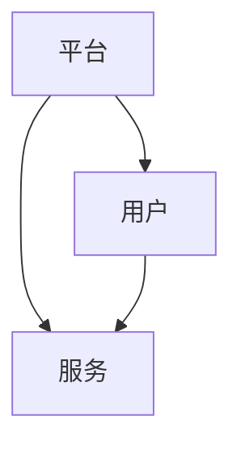
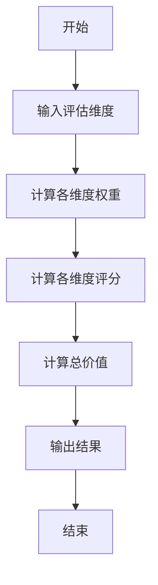
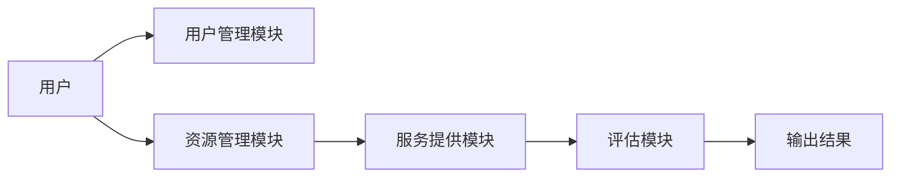
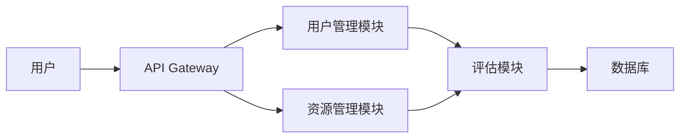
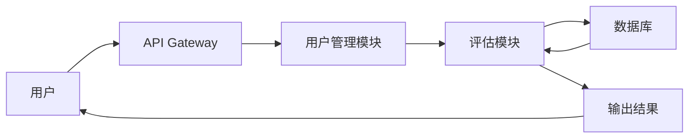

                 


# 如何评估企业的平台战略价值

## 关键词：平台战略、战略价值评估、企业战略、数学模型、系统架构、项目实战

## 摘要：  
平台战略是企业在数字化转型和市场竞争中的关键策略之一。本文从背景与核心概念出发，详细分析了平台战略的价值评估方法，包括数学模型、系统架构设计、项目实战和最佳实践。通过层次分析法、加权评分模型等工具，结合实际案例和系统架构设计，为读者提供了一套全面评估企业平台战略价值的方法论。  

---

## 第一部分：企业平台战略价值评估的背景与核心概念

### 第1章：企业平台战略价值评估的背景与问题背景

#### 1.1 什么是企业平台战略
##### 1.1.1 平台战略的定义  
平台战略是指企业通过构建一个共享的数字化平台，整合资源、服务和生态系统，以实现价值创造和竞争优势的策略。  

##### 1.1.2 平台战略的核心要素  
- **资源池化**：将企业内外部资源（如数据、技术、服务）整合到平台上。  
- **服务化**：通过平台提供标准化或定制化的服务。  
- **生态化**：构建开放的生态系统，吸引合作伙伴和用户。  

##### 1.1.3 平台战略与企业其他战略的关系  
平台战略是企业级战略的一部分，与技术创新战略、数字化转型战略密切相关，是企业实现业务创新和增长的重要手段。  

#### 1.2 为什么要评估平台战略价值
##### 1.2.1 平台战略对企业发展的意义  
平台战略能够降低企业的运营成本、提高资源利用率、加速业务创新，并为企业创造新的收入来源。  

##### 1.2.2 平台战略价值评估的必要性  
- 通过评估明确平台的贡献和价值。  
- 为后续的平台优化和扩展提供数据支持。  
- 为企业的战略决策提供依据。  

##### 1.2.3 平台战略价值评估的边界与外延  
- **边界**：聚焦于平台本身的资源、服务和生态系统价值。  
- **外延**：平台对业务增长、客户满意度和企业绩效的影响。  

#### 1.3 平台战略价值评估的核心问题
##### 1.3.1 平台战略的实施难点  
- 平台的构建和运营成本高。  
- 平台的用户参与度和活跃度不足。  
- 平台的可持续性和扩展性问题。  

##### 1.3.2 平台战略价值的衡量维度  
- **经济效益**：收入增长、成本节约。  
- **用户价值**：用户满意度、参与度。  
- **生态价值**：合作伙伴数量、生态系统的多样性。  

##### 1.3.3 平台战略与企业绩效的关系  
平台战略能够通过资源整合和协同效应，显著提升企业的运营效率和市场竞争力。  

---

### 第2章：平台战略的核心概念与联系

#### 2.1 平台战略的核心概念原理
##### 2.1.1 平台战略的三要素模型  
平台战略可以分为 **资源池化**、**服务化** 和 **生态化** 三个核心要素，它们相互关联、共同驱动平台价值的实现。  

##### 2.1.2 平台战略的多维度属性特征对比
| 属性       | 特征描述                                 |
|------------|----------------------------------------|
| 资源池化   | 集成企业内外部资源，形成共享资源池。     |
| 服务化     | 提供标准化或定制化的服务，满足用户需求。 |
| 生态化     | 构建开放生态系统，吸引多方参与。         |

##### 2.1.3 平台战略的ER实体关系图


#### 2.2 平台战略的核心要素与关联
##### 2.2.1 平台的核心功能模块  
- 用户管理模块：管理平台用户，提供身份认证和权限管理。  
- 资源管理模块：整合和管理企业内外部资源。  
- 服务提供模块：基于资源池提供标准化或定制化服务。  

##### 2.2.2 平台的战略目标与实现路径  
- **目标**：通过平台实现资源的高效利用和价值最大化。  
- **路径**：构建资源池、优化服务、扩展生态。  

##### 2.2.3 平台的生态体系与合作伙伴关系  
- **生态体系**：平台需要吸引开发者、供应商和客户，形成多方共赢的生态系统。  
- **合作伙伴关系**：通过合作实现资源互补，提升平台的综合能力。  

#### 2.3 平台战略的核心概念与联系总结  
平台战略的核心在于资源整合、服务提供和生态构建。通过这三个维度的协同作用，平台能够实现更高的价值，为企业创造更大的竞争优势。  

---

### 第3章：平台战略价值评估的数学模型与算法原理

#### 3.1 平台战略价值评估的数学模型
##### 3.1.1 平台战略价值的加权评分模型
$$ V = \sum_{i=1}^{n} w_i \cdot f_i $$
其中，$V$ 表示平台战略价值，$w_i$ 表示第 $i$ 个评估维度的权重，$f_i$ 表示第 $i$ 个评估维度的评分。  

##### 3.1.2 层次分析法（AHP）的应用  
层次分析法是一种常用的多因素决策方法，适用于多维度评估场景。通过构建评估指标体系，计算各指标的权重，最终得出平台的战略价值评分。  

##### 3.1.3 算法流程图


#### 3.2 平台战略价值评估的代码实现
##### 3.2.1 环境安装
```bash
pip install numpy pandas
```

##### 3.2.2 核心代码实现
```python
import numpy as np
import pandas as pd

# 示例数据：各评估维度的权重和评分
data = {
    '维度': ['资源池化', '服务化', '生态化'],
    '权重': [0.4, 0.3, 0.3],
    '评分': [0.8, 0.7, 0.6]
}

df = pd.DataFrame(data)

# 计算总价值
weights = df['权重'].tolist()
scores = df['评分'].tolist()

V = np.dot(weights, scores)
print(f"平台战略价值 V = {V}")
```

#### 3.3 平台战略价值评估的算法实现
##### 3.3.1 算法步骤总结
1. 确定评估维度和权重。  
2. 为每个维度打分，计算各维度的加权评分。  
3. 将所有维度的评分相加，得到平台战略价值。  

---

### 第4章：平台战略价值评估的系统分析与架构设计

#### 4.1 系统分析
##### 4.1.1 问题场景介绍  
平台战略价值评估是一个复杂的系统性问题，涉及多个维度和因素。通过系统分析，可以明确评估的关键点和实现路径。  

##### 4.1.2 系统功能设计  
- 用户管理：记录用户信息和权限。  
- 资源管理：整合和管理企业内外部资源。  
- 服务提供：基于资源池提供标准化或定制化服务。  
- 评估模块：计算平台的战略价值。  

##### 4.1.3 系统架构图


#### 4.2 系统架构设计
##### 4.2.1 系统架构图


##### 4.2.2 接口设计  
- 用户接口：RESTful API，如 `/api/users`、`/api/resources`。  
- 服务接口：提供标准化服务接口，如 `/api/services`。  

##### 4.2.3 交互流程图


---

### 第5章：平台战略价值评估的项目实战

#### 5.1 项目环境安装
```bash
pip install numpy pandas scikit-learn
```

#### 5.2 核心代码实现
##### 5.2.1 评估模块实现
```python
import numpy as np
import pandas as pd

# 示例数据：各评估维度的权重和评分
data = {
    '维度': ['资源池化', '服务化', '生态化'],
    '权重': [0.4, 0.3, 0.3],
    '评分': [0.8, 0.7, 0.6]
}

df = pd.DataFrame(data)

# 计算总价值
weights = df['权重'].tolist()
scores = df['评分'].tolist()

V = np.dot(weights, scores)
print(f"平台战略价值 V = {V}")
```

##### 5.2.2 系统实现
```python
# 示例代码：系统架构实现
class Platform:
    def __init__(self):
        self.users = []
        self.resources = []
        self.services = []

    def add_user(self, user):
        self.users.append(user)

    def add_resource(self, resource):
        self.resources.append(resource)

    def provide_service(self, service):
        self.services.append(service)

# 示例运行
platform = Platform()
platform.add_user("User 1")
platform.add_resource("Resource 1")
platform.provide_service("Service 1")
print("平台已构建完成")
```

#### 5.3 实际案例分析
##### 5.3.1 案例背景  
某企业希望通过平台战略实现资源的高效利用和业务创新。  

##### 5.3.2 评估过程  
- 评估维度：资源池化（权重 0.4）、服务化（权重 0.3）、生态化（权重 0.3）。  
- 各维度评分：资源池化 0.8、服务化 0.7、生态化 0.6。  

##### 5.3.3 评估结果  
$$ V = 0.4 \times 0.8 + 0.3 \times 0.7 + 0.3 \times 0.6 = 0.32 + 0.21 + 0.18 = 0.71 $$  

平台战略价值评分为 0.71，表明该平台的战略价值较高。  

---

### 第6章：平台战略价值评估的最佳实践与总结

#### 6.1 最佳实践
##### 6.1.1 评估的关键点  
- 确保评估维度的全面性和合理性。  
- 采用多方法验证评估结果的准确性。  
- 定期更新评估模型以适应业务变化。  

##### 6.1.2 评估的注意事项  
- 平台战略价值评估是一个动态过程，需要持续关注。  
- 评估结果应与企业实际业务目标相结合。  
- 避免过度依赖单一评估方法。  

##### 6.1.3 评估的工具推荐  
- **层次分析法（AHP）**：适用于多维度评估。  
- **加权评分法**：适用于简单明了的评估场景。  
- **财务指标法**：从经济效益角度评估平台价值。  

#### 6.2 小结
平台战略价值评估是企业实现数字化转型和市场竞争优势的关键步骤。通过科学的评估方法和系统的架构设计，企业可以更好地优化平台，实现更高的战略价值。  

---

### 第7章：附录

#### 7.1 平台战略价值评估术语表
- **平台战略**：通过构建共享平台，整合资源、服务和生态系统，实现业务创新和竞争优势。  
- **资源池化**：将企业内外部资源整合到平台上，形成共享资源池。  
- **服务化**：通过平台提供标准化或定制化的服务，满足用户需求。  
- **生态化**：构建开放生态系统，吸引合作伙伴和用户，形成多方共赢的生态体系。  

#### 7.2 平台战略价值评估工具推荐
- **层次分析法（AHP）**：用于多维度评估。  
- **加权评分法**：用于简单明了的评估场景。  
- **财务指标法**：用于评估平台的经济效益。  

---

## 总结  
企业平台战略价值评估是一项复杂的系统工程，需要结合数学模型、系统架构设计和实际案例分析。通过本文的详细讲解，读者可以掌握一套完整的评估方法，为企业制定科学的平台战略提供有力支持。

