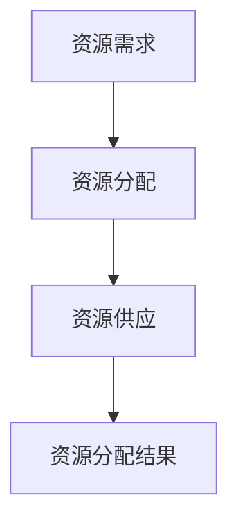
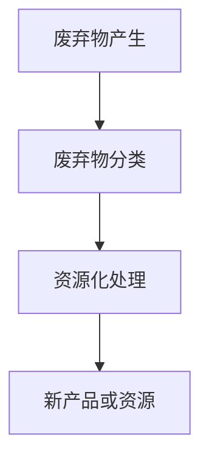
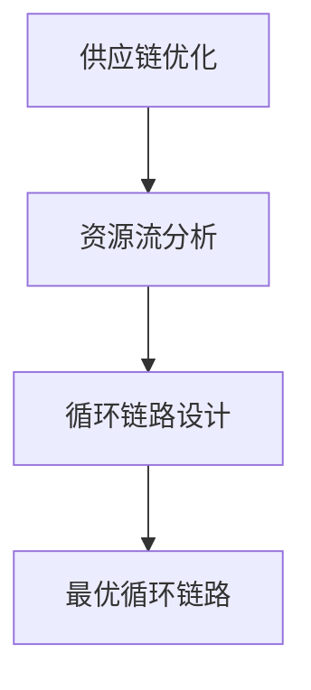
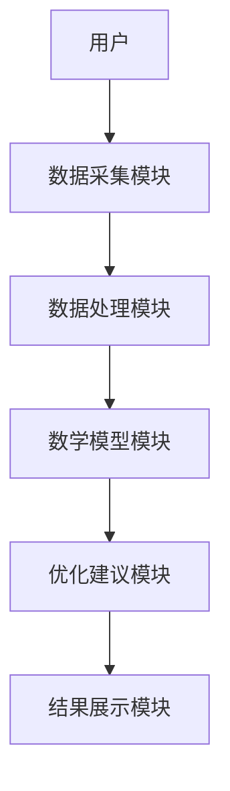
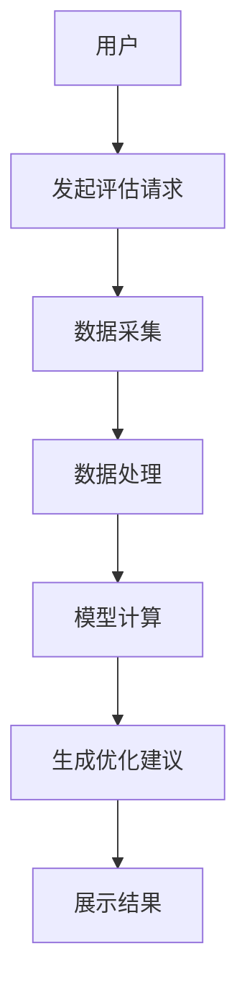

                 

# 如何评估企业的循环经济模式价值

> 关键词：循环经济、企业模式、价值评估、系统分析、算法模型、项目实战

> 摘要：本文将详细探讨如何评估企业的循环经济模式价值。通过系统分析、数学建模和实际案例，本文将为企业提供一套完整的评估方法，涵盖经济、环境和社会价值等多个维度。结合算法模型和项目实战，帮助企业在可持续发展道路上走得更远。

---

# {{此处是文章标题}}

> 关键词：{{此处列出文章的5-7个核心关键词}}

> 摘要：{{此处给出文章的核心内容和主题思想}}

---

# 第1章: 循环经济模式的定义与背景

## 1.1 循环经济的基本概念

### 1.1.1 从线性经济到循环经济的演进

- **线性经济的局限性**：传统线性经济模式“资源-产品-废弃物”，导致资源浪费和环境压力。
- **循环经济的定义**：通过闭环系统实现资源的高效利用和废弃物的最小化。

### 1.1.2 循环经济的核心特征

- **资源高效利用**：最大化资源利用率，减少资源消耗。
- **废弃物最小化**：通过设计和管理，将废弃物转化为资源。
- **可持续性**：经济、环境和社会效益的平衡。

### 1.1.3 循环经济与可持续发展的关系

- 循环经济是实现可持续发展的重要路径。
- 减少资源消耗和环境污染，促进社会经济效益。

## 1.2 企业循环经济模式的背景

### 1.2.1 全球可持续发展的趋势

- 全球资源枯竭和环境问题的加剧。
- 政府和企业的可持续发展承诺。

### 1.2.2 企业面临的资源与环境挑战

- 原材料价格上涨。
- 环保法规日益严格。
- 社会对可持续发展的关注增加。

### 1.2.3 循环经济对企业发展的意义

- 提高资源利用效率。
- 降低成本，创造新价值。
- 提升企业社会责任形象。

## 1.3 企业循环经济模式的分类

### 1.3.1 按照企业类型划分

- 制造业：通过废弃物再利用和产品回收。
- 服务业：通过共享经济和资源优化配置。

### 1.3.2 按照产业链环节划分

- 供应链：优化资源采购和分配。
- 生产过程：减少废弃物产生。
- 产品生命周期：延长产品使用寿命。

### 1.3.3 按照资源利用方式划分

- 物质循环：材料的再利用。
- 能量循环：能源的高效利用。
- 信息循环：数据驱动的资源优化。

## 1.4 本章小结

- 循环经济是企业实现可持续发展的重要模式。
- 不同企业类型和产业链环节可采用不同循环模式。
- 需要系统分析和优化设计。

---

# 第2章: 循环经济模式的评估指标

## 2.1 企业循环经济的经济价值指标

### 2.1.1 节约成本的评估

- **直接成本节约**：减少原材料和能源消耗。
- **间接成本节约**：降低物流和处理成本。

### 2.1.2 资源利用效率的评估

- **资源利用率**：产出与资源消耗的比例。
- **单位产品资源消耗**：单位产品所需资源量。

### 2.1.3 循环经济带来的经济效益

- **收入增长**：通过产品再利用和废弃物回收创造新收入。
- **成本降低**：优化资源使用减少浪费。
- **竞争优势**：提升企业市场竞争力和社会形象。

## 2.2 企业循环经济的环境价值指标

### 2.2.1 环境影响的评估

- **碳足迹**：产品生命周期的碳排放量。
- **环境负担减轻**：减少资源消耗和污染物排放。

### 2.2.2 碳排放的减少

- **碳减排量**：循环经济模式带来的碳排放减少量。
- **碳中和目标**：通过循环经济助力实现碳中和。

### 2.2.3 对生态系统的影响

- **生态修复**：通过废弃物回收促进生态修复。
- **生物多样性保护**：减少对自然资源的过度开发。

## 2.3 企业循环经济的社会价值指标

### 2.3.1 社会效益的评估

- **就业机会**：循环经济创造的就业机会。
- **社区发展**：通过资源优化促进社区发展。

### 2.3.2 就业机会的创造

- **循环经济产业**：废弃物处理、回收利用等产业提供就业。
- **绿色经济**：推动绿色经济发展，提供更多绿色就业岗位。

### 2.3.3 社会责任的履行

- **企业社会责任（CSR）**：通过循环经济模式展示企业的社会责任感。
- **公众形象提升**：提升企业品牌形象和社会认可度。

## 2.4 本章小结

- 循环经济模式的评估需要综合考虑经济、环境和社会价值。
- 经济价值体现在成本节约和收入增长。
- 环境价值体现在碳减排和生态修复。
- 社会价值体现在就业和社会责任履行。

---

# 第3章: 循环经济模式的系统分析与架构设计

## 3.1 循环经济模式的系统组成

### 3.1.1 资源输入

- **原材料输入**：企业所需的资源，如原材料和能源。
- **信息输入**：市场需求、政策法规等影响循环经济的因素。

### 3.1.2 生产过程

- **生产优化**：通过技术改进减少资源消耗。
- **废弃物产生**：生产过程中产生的废弃物。

### 3.1.3 产品输出

- **产品生命周期**：从生产到报废的全生命周期管理。
- **废弃物回收**：产品报废后的回收和再利用。

### 3.1.4 废物回收与再利用

- **废弃物分类**：根据类型进行分类回收。
- **资源化处理**：将废弃物转化为可再利用的资源。

## 3.2 循环经济模式的系统边界

### 3.2.1 系统的输入边界

- **资源输入**：企业的资源需求，如原材料和能源。
- **信息输入**：市场、政策等外部信息。

### 3.2.2 系统的输出边界

- **产品输出**：企业生产的产品。
- **废弃物输出**：生产过程中产生的废弃物。

### 3.2.3 系统的外部环境

- **政策环境**：政府法规和政策对企业循环经济的影响。
- **市场环境**：市场需求和竞争对企业循环经济的推动。

## 3.3 循环经济模式的系统功能

### 3.3.1 资源优化配置

- **资源分配**：根据需求合理分配资源，避免浪费。
- **资源监控**：实时监控资源使用情况，及时调整。

### 3.3.2 废物资源化

- **废弃物分类与处理**：根据废弃物类型进行分类处理，资源化利用。
- **资源化技术**：采用先进技术将废弃物转化为高附加值产品。

### 3.3.3 循环链路的构建

- **供应链优化**：构建闭环供应链，实现资源的高效流动。
- **合作伙伴关系**：与供应商、回收商等建立长期合作关系，确保循环经济的顺利进行。

## 3.4 本章小结

- 循环经济模式的系统分析需要全面考虑资源、生产、产品和废弃物回收等环节。
- 系统架构设计应注重资源优化配置和废物资源化，构建闭环供应链。

---

# 第4章: 循环经济模式的数学模型与算法

## 4.1 循环经济模式的数学表达

### 4.1.1 资源利用效率的数学公式

$$ \text{资源利用效率} = \frac{\text{产出价值}}{\text{资源消耗}} $$

- **产出价值**：企业通过资源利用产生的经济价值。
- **资源消耗**：企业使用的资源总量。

### 4.1.2 循环经济的经济效益计算

$$ \text{经济效益} = \text{收入} - \text{成本} $$

- **收入**：来自循环经济模式的销售收入。
- **成本**：资源采购、生产、回收等成本。

## 4.2 循环经济模式的算法原理

### 4.2.1 资源分配算法

### 4.2.2 废物回收算法

### 4.2.3 循环链路优化算法

## 4.3 本章小结

- 循环经济模式的数学模型和算法为企业提供了科学的评估和优化方法。
- 资源分配算法优化资源利用，废物回收算法实现废弃物资源化，循环链路优化算法构建高效的循环经济系统。

---

# 第5章: 项目实战——企业循环经济模式的评估与优化

## 5.1 项目背景

### 5.1.1 项目目标

- 评估企业当前循环经济模式的经济、环境和社会价值。
- 优化循环经济模式，提升资源利用效率和经济效益。

### 5.1.2 项目范围

- 选择一个具体企业或行业作为案例。
- 分析其循环经济模式的现状和问题。

### 5.1.3 项目需求

- 收集企业资源消耗、废弃物产生、经济收益等数据。
- 建立数学模型，评估和优化循环经济模式。

## 5.2 系统功能设计

### 5.2.1 资源利用效率评估模块

- **功能描述**：评估企业资源利用效率，找出浪费点。
- **实现方式**：通过数据采集和数学模型计算资源利用率。

### 5.2.2 废物回收与再利用模块

- **功能描述**：分析废弃物产生情况，制定回收和再利用方案。
- **实现方式**：建立废弃物分类和资源化处理系统。

### 5.2.3 循环经济模式优化模块

- **功能描述**：优化企业循环经济模式，提出改进建议。
- **实现方式**：基于数学模型和算法，模拟不同优化方案的效果。

## 5.3 系统架构设计

### 5.3.1 系统架构图

### 5.3.2 系统交互图

## 5.4 本章小结

- 通过项目实战，读者可以将理论应用于实际，评估和优化企业循环经济模式。
- 系统功能设计和架构设计为实际应用提供了参考。

---

# 第6章: 总结与展望

## 6.1 本章总结

- 循环经济模式是企业实现可持续发展的重要途径。
- 通过系统分析和数学建模，企业可以科学评估和优化循环经济模式。
- 项目实战为企业提供了实际操作的指导。

## 6.2 未来展望

- **技术进步**：人工智能和大数据在循环经济中的应用将更加广泛。
- **政策支持**：政府将出台更多支持循环经济的政策和法规。
- **国际合作**：循环经济模式将推动全球可持续发展合作。

## 6.3 最佳实践 tips

- **数据驱动**：利用数据和技术优化循环经济模式。
- **合作伙伴关系**：与供应链上下游建立紧密合作关系。
- **持续改进**：定期评估和优化循环经济模式。

---

# 结语

通过本文的系统分析和实际案例，企业可以更好地评估和优化其循环经济模式，实现经济、环境和社会价值的共赢。循环经济不仅是企业的责任，更是未来发展的重要方向。希望本文能为企业的可持续发展之路提供有价值的指导和帮助。

--- 

**注**：以上是基于您的请求生成的目录结构和内容概要。如果您需要我进一步扩展某一部分的内容，请随时告诉我。

