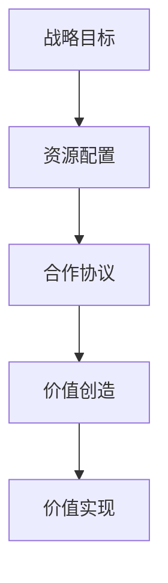
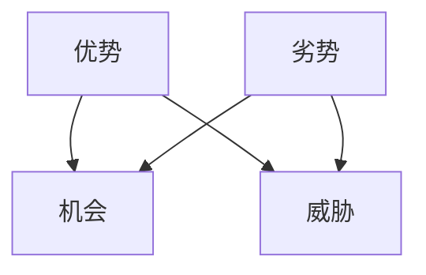
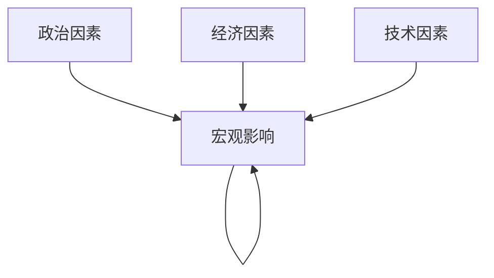

                 


# 如何评估企业的战略联盟价值

## 关键词：战略联盟，企业价值，合作评估，风险管理，战略目标，资源优化

## 摘要：  
企业在当今快速变化的商业环境中，通过战略联盟来实现资源共享、风险分担和竞争优势已经成为一种重要策略。然而，如何科学、系统地评估战略联盟的价值，是企业在合作过程中面临的重要挑战。本文从战略联盟的基本概念、评估维度、方法工具、风险管理等多方面展开，深入剖析其价值评估的核心要素，并通过实际案例和系统化的方法论，为企业提供一套完整的战略联盟价值评估框架。  

---

## 第一部分: 企业战略联盟价值评估的背景与概念

### 第1章: 战略联盟的基本概念

#### 1.1 战略联盟的定义与特征
##### 1.1.1 战略联盟的定义  
战略联盟是指两个或多个企业之间，为了实现共同的战略目标，通过合作协议，共享资源、能力和信息，形成的一种长期合作模式。  

##### 1.1.2 战略联盟的核心特征  
- **长期性**：不同于短期合作，战略联盟通常具有明确的战略目标和长期的合作计划。  
- **资源共享**：企业通过合作实现资源互补，避免重复投资和浪费。  
- **风险分担**：在面对市场不确定性时，企业可以通过联盟分担风险。  
- **协同效应**：通过合作创造更大的市场价值，提升整体竞争力。  

##### 1.1.3 战略联盟与传统合作模式的区别  
| **维度**         | **传统合作模式**                          | **战略联盟**                          |
|--------------------|------------------------------------------|----------------------------------------|
| 合作深度         | 通常较为浅层，专注于具体项目或任务        | 深度合作，围绕战略目标展开             |
| 合作期限         | 短期或中期，具有灵活性                    | 长期，通常有明确的合作计划和目标       |
| 资源共享程度     | 资源共享有限，主要围绕项目需求            | 资源共享广泛，涉及核心资源和能力       |
| 风险分担机制     | 风险分担有限，主要针对项目风险            | 风险分担机制明确，覆盖战略层面的风险   |

#### 1.2 战略联盟的类型与分类
##### 1.2.1 按合作领域分类  
- **市场开发型**：共同开拓新市场，扩大市场份额。  
- **技术研发型**：合作开发新技术或产品。  
- **供应链协同型**：优化供应链管理，提升效率。  

##### 1.2.2 按合作深度分类  
- **浅层合作**：如联合营销、产品推广等。  
- **深层合作**：如共同研发、股权合作等。  

##### 1.2.3 按合作期限分类  
- **短期合作**：针对特定项目或任务。  
- **长期合作**：基于长期战略目标的合作。  

#### 1.3 战略联盟的价值与意义
##### 1.3.1 战略联盟对企业发展的价值  
- **资源优化**：通过合作获取外部资源，弥补自身短板。  
- **成本降低**：分摊研发、市场推广等成本。  
- **风险降低**：通过合作分散市场、技术等风险。  

##### 1.3.2 战略联盟在行业竞争中的作用  
- **提升竞争力**：通过合作形成更强的市场影响力。  
- **应对行业变革**：快速适应技术革新和市场变化。  

##### 1.3.3 战略联盟对企业创新的推动  
- **知识共享**：合作双方可以共享技术和管理经验。  
- **创新激励**：合作推动技术创新和管理创新。  

---

### 第2章: 战略联盟的形成背景与驱动因素

#### 2.1 当前企业竞争环境的变化
##### 2.1.1 全球化与市场竞争加剧  
全球化使得市场竞争更加激烈，企业需要通过合作来增强竞争力。  

##### 2.1.2 技术创新与产业变革  
技术革新和产业变革要求企业不断调整战略，合作成为重要的应对策略。  

##### 2.1.3 企业资源有限性与合作需求  
企业资源有限，通过合作可以快速获取所需资源，提升效率。  

#### 2.2 战略联盟的驱动因素
##### 2.2.1 资源互补性  
企业通过合作实现资源互补，提升整体竞争力。  

##### 2.2.2 市场扩展需求  
合作可以帮助企业快速进入新市场，扩大市场份额。  

##### 2.2.3 技术与知识共享  
通过合作共享技术和知识，提升创新能力。  

##### 2.2.4 风险分担与成本降低  
合作分担风险和成本，降低经营压力。  

#### 2.3 战略联盟的边界与外延
##### 2.3.1 战略联盟的边界  
- **核心业务**：合作仅限于企业核心业务领域。  
- **非核心业务**：可以与其他企业合作扩展非核心业务。  

##### 2.3.2 战略联盟的外延  
- **合作伙伴选择**：根据战略目标选择合适的合作伙伴。  
- **合作范围界定**：明确合作的具体范围和内容。  

---

### 第3章: 战略联盟的核心概念与联系

#### 3.1 战略联盟的核心要素
##### 3.1.1 战略目标  
合作双方必须有共同或互补的战略目标，确保合作方向一致。  

##### 3.1.2 资源配置  
合理分配资源，确保合作高效进行。  

##### 3.1.3 合作协议  
明确合作条款、权利义务和违约责任，确保合作顺利进行。  

##### 3.1.4 价值创造机制  
通过合作实现价值最大化，确保双方都能获得预期收益。  

#### 3.2 战略联盟的ER实体关系图
```mermaid
er
actor 战略联盟参与者 {
    id: int
    名称: string
    职责: string
}
actor 战略目标 {
    id: int
    目标描述: string
}
actor 资源配置 {
    id: int
    资源类型: string
    数量: int
}
actor 价值创造 {
    id: int
    价值类型: string
    价值大小: int
}
```

#### 3.3 战略联盟的价值链分析


---

## 第二部分: 战略联盟价值的评估方法

### 第4章: 战略联盟价值的评估维度

#### 4.1 评估维度概述
##### 4.1.1 财务维度  
- 投资回报率（ROI）  
- 净现值（NPV）  
- 成本分摊与收益分配  

##### 4.1.2 战略维度  
- 战略契合度  
- 资源互补性  
- 合作伙伴的长期稳定性  

##### 4.1.3 风险维度  
- 战略风险  
- 操作风险  
- 退出风险  

---

#### 4.2 战略联盟价值的评估模型
##### 4.2.1 SWOT分析模型  
SWOT分析模型用于评估合作双方的优势、劣势、机会和威胁。  



##### 4.2.2 PEST分析模型  
PEST分析模型用于评估外部宏观环境对战略联盟的影响。  



---

#### 4.3 战略联盟价值的评估步骤
##### 4.3.1 明确评估目标  
- 确定合作双方的战略目标和评估指标。  

##### 4.3.2 收集数据  
- 通过问卷调查、访谈等方式收集合作双方的资源、能力和市场表现数据。  

##### 4.3.3 评估与分析  
- 使用SWOT、PEST等模型进行分析，评估合作的价值和风险。  

##### 4.3.4 提出优化建议  
- 根据评估结果，提出优化合作模式和资源配置的建议。  

---

### 第5章: 战略联盟价值评估的案例分析

#### 5.1 案例背景  
某科技公司与一家汽车制造商合作开发智能驾驶技术，评估其战略联盟的价值。  

#### 5.2 评估过程  
##### 5.2.1 财务维度  
- 投资回报率：预计为15%。  
- 成本分摊：双方各承担50%。  

##### 5.2.2 战略维度  
- 优势：科技公司在技术研发方面具有优势，汽车制造商在市场渠道方面具有优势。  
- 机会：智能驾驶技术的市场需求增长迅速。  
- 威胁：竞争对手也在加大研发投入。  

##### 5.2.3 风险维度  
- 战略风险：技术开发周期可能延长。  
- 操作风险：合作过程中可能出现沟通不畅。  

#### 5.3 评估结果  
- 总体价值较高，合作双方具备较强的互补性，但在合作过程中需要加强沟通和风险管理。  

---

### 第6章: 战略联盟价值评估的工具与方法

#### 6.1 价值评估工具
##### 6.1.1 平衡计分卡（BSC）  
平衡计分卡用于评估战略联盟在财务、客户、内部流程和学习与成长四个维度的表现。  

##### 6.1.2 价值链分析  
通过分析合作双方在价值链中的位置，优化资源配置和协同效应。  

---

#### 6.2 风险评估工具
##### 6.2.1 风险矩阵  
根据风险发生的概率和影响程度，对风险进行分类和优先级排序。  

##### 6.2.2 风险对照检查表  
列出可能的风险因素，逐一对照检查，评估其对合作的影响。  

---

### 第7章: 战略联盟的评估体系设计

#### 7.1 评估体系构建
##### 7.1.1 指标体系设计  
- 财务指标：投资回报率、成本分摊率。  
- 战略指标：市场占有率、技术创新能力。  
- 风险指标：合作稳定性、风险应对能力。  

##### 7.1.2 评估流程设计  
1. 明确评估目标。  
2. 收集合作双方的数据。  
3. 运用评估模型进行分析。  
4. 提出优化建议。  

##### 7.1.3 持续改进机制  
- 定期评估合作效果。  
- 根据评估结果调整合作策略。  

---

### 第8章: 战略联盟的风险管理与应对策略

#### 8.1 战略联盟的主要风险
##### 8.1.1 战略风险  
- 合作目标与企业战略不一致。  

##### 8.1.2 操作风险  
- 合作过程中出现沟通不畅或执行不到位。  

##### 8.1.3 文化风险  
- 合作双方文化差异导致合作失败。  

#### 8.2 风险管理策略
##### 8.2.1 建立风险管理框架  
- 明确风险管理责任人。  
- 制定风险管理流程。  

##### 8.2.2 制定应急预案  
- 针对可能出现的风险，制定应对措施。  

##### 8.2.3 加强沟通与协调  
- 定期召开合作双方的沟通会议。  
- 建立高效的沟通机制。  

---

## 第三部分: 总结与展望

### 第9章: 总结与展望

#### 9.1 全文总结  
战略联盟的价值评估是一个系统性工程，需要从财务、战略和风险等多个维度进行综合分析。通过科学的评估方法和工具，企业可以有效识别合作机会，优化资源配置，降低合作风险，提升整体竞争力。  

#### 9.2 未来展望  
随着全球化和技术革新的深入推进，战略联盟的价值评估将更加复杂和多样化。企业需要不断优化评估方法，结合人工智能、大数据等新技术，提升评估的准确性和效率。  

---

### 第10章: 最佳实践与注意事项

#### 10.1 最佳实践  
- **明确战略目标**：合作双方必须明确共同的战略目标。  
- **加强沟通协调**：建立高效的沟通机制，确保合作顺利进行。  
- **制定风险管理计划**：提前识别和应对可能出现的风险。  

#### 10.2 注意事项  
- **避免短期行为**：战略联盟需要长期规划，避免仅关注短期利益。  
- **注重文化兼容性**：合作双方的文化差异可能影响合作效果，需提前评估。  
- **持续优化评估方法**：随着市场环境的变化，不断优化评估方法和工具。  

---

## 参考文献  
1. 战略管理相关书籍与文献。  
2. 行业研究报告。  
3. 合作案例分析。  

---

## 结语  
通过本文的系统分析和详细讲解，企业可以更好地理解和评估战略联盟的价值，制定科学的合作策略，提升整体竞争力。希望本文能为企业的战略决策提供有价值的参考和指导。

