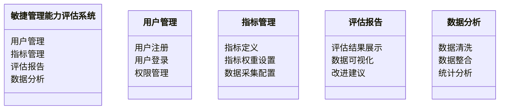
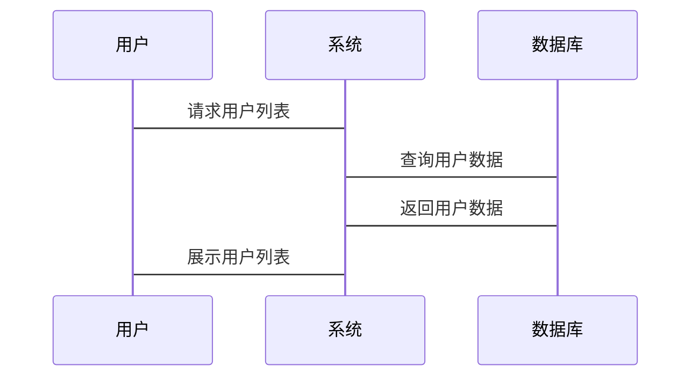

                 


# 如何评估企业的敏捷管理能力

## 关键词：
- 敏捷管理能力
- 评估模型
- 组织架构
- 项目管理
- 数字化转型

## 摘要：
企业敏捷管理能力是企业在快速变化的商业环境中保持竞争力的关键。本文系统地介绍了如何评估企业的敏捷管理能力，从理论基础到实际应用，从核心概念到系统架构，深入剖析了敏捷管理能力的构成要素、评估指标和提升策略。通过详细分析敏捷管理能力的评估模型、系统设计和实际案例，本文为企业的管理者和IT专业人士提供了实用的指导和建议。

---

# 第一部分：企业敏捷管理能力评估背景与核心概念

## 第1章：敏捷管理能力评估的背景与重要性

### 1.1 敏捷管理的定义与内涵

#### 1.1.1 敏捷管理的定义
敏捷管理是一种以快速响应变化、注重团队协作和客户价值为核心理念的管理方式。它强调通过迭代和增量交付，灵活应对需求变化，注重与利益相关者的持续互动。

#### 1.1.2 敏捷管理的核心内涵
敏捷管理不仅仅是方法论或工具的使用，更是一种文化和思维方式的转变。它强调以下几点：
- **迭代与增量交付**：通过短周期的迭代，逐步交付价值。
- **客户协作**：与客户保持持续互动，确保交付的产品或服务符合需求。
- **团队自治**：赋予团队决策权，减少层级式管理的束缚。
- **持续改进**：通过反思和调整，不断优化过程和结果。

#### 1.1.3 敏捷管理与传统管理的区别
| **维度**       | **敏捷管理**                     | **传统管理**                     |
|----------------|----------------------------------|----------------------------------|
| 管理方式         | 迭代式、协作式                  | 金字塔式、命令式                  |
| 变化应对         | 快速响应，拥抱变化               | 畏惧变化，追求稳定               |
| 交付方式         | 增量交付，持续反馈               | 大规模交付，一次性完成           |
| 组织结构         | 扁平化、自组织团队               | 垂直式、层级分明                 |

### 1.2 企业敏捷管理能力的重要性

#### 1.2.1 敏捷管理对企业竞争力的影响
敏捷管理能够提高企业的市场反应速度，快速适应市场变化，从而在竞争中占据优势。

#### 1.2.2 敏捷管理在数字化转型中的作用
数字化转型要求企业具备快速试错和调整的能力，敏捷管理提供了这种能力的框架。

#### 1.2.3 敏捷管理对组织灵活性的提升
通过敏捷管理，企业能够更灵活地分配资源，优化流程，降低运营成本。

### 1.3 当前企业敏捷管理能力的现状分析

#### 1.3.1 企业敏捷管理能力的普遍问题
- **组织结构僵化**：传统金字塔式结构难以快速响应变化。
- **团队协作不足**：部门间协作不畅，信息孤岛问题严重。
- **缺乏持续改进文化**：员工习惯于按部就班，缺乏创新意识。

#### 1.3.2 不同行业敏捷管理能力的差异
- **高科技行业**：敏捷管理应用较广泛。
- **传统制造业**：转型较为缓慢，仍依赖传统管理模式。

#### 1.3.3 敏捷管理能力评估的必要性
通过评估，企业可以识别自身在敏捷管理方面的优势和不足，有针对性地进行优化。

### 1.4 本章小结
本章从敏捷管理的定义、核心内涵以及与传统管理的区别入手，分析了敏捷管理在现代企业中的重要性，并指出了当前企业在敏捷管理能力方面存在的普遍问题。

---

## 第2章：敏捷管理能力评估的核心概念

### 2.1 敏捷管理能力的构成要素

#### 2.1.1 敏捷文化与组织结构
- **敏捷文化**：强调透明沟通、持续改进和客户导向。
- **组织结构**：扁平化、自组织团队，减少层级式管理。

#### 2.1.2 敏捷流程与工作方式
- **迭代开发**：通过短周期的迭代交付价值。
- **持续交付**：通过自动化测试和CI/CD实现快速交付。

#### 2.1.3 敏捷工具与技术
- **项目管理工具**：如Jira、Trello。
- **协作工具**：如Slack、Microsoft Teams。
- **自动化工具**：如Jenkins、GitHub Actions。

### 2.2 敏捷管理能力的关键维度

#### 2.2.1 敏捷领导力
- **领导风格**：支持型领导，鼓励团队自主决策。
- **领导能力**：能够识别问题并引导团队解决问题。

#### 2.2.2 团队协作能力
- **团队凝聚力**：团队成员之间的信任和协作。
- **跨部门协作**：不同部门之间的有效沟通与协作。

#### 2.2.3 问题解决能力
- **问题识别**：快速识别问题并定位原因。
- **解决方案**：通过团队协作找到最优解决方案。

### 2.3 敏捷管理能力的评估指标

#### 2.3.1 评估指标的分类
- **团队维度**：团队协作效率、团队成员满意度。
- **组织维度**：组织结构的灵活性、跨部门协作效率。
- **流程维度**：流程执行效率、交付周期。

#### 2.3.2 指标权重的确定
- **团队维度**：权重较高，占40%。
- **组织维度**：权重中等，占30%。
- **流程维度**：权重较低，占20%。

#### 2.3.3 指标数据的采集方法
- **问卷调查**：通过员工问卷收集团队协作效率和满意度数据。
- **数据分析**：通过项目管理工具分析交付周期和流程效率。

### 2.4 本章小结
本章详细分析了敏捷管理能力的构成要素，包括敏捷文化、流程和工具，并提出了评估敏捷管理能力的关键维度和指标体系。

---

## 第3章：敏捷管理能力评估的理论基础

### 3.1 敏捷管理的理论框架

#### 3.1.1 敏捷管理的起源与发展
- **起源**：敏捷方法论起源于软件开发领域，如Scrum、Agile等。
- **发展**：逐渐从软件开发扩展到企业整体管理。

#### 3.1.2 敏捷管理的核心理论
- **迭代开发理论**：强调通过短周期的迭代交付价值。
- **自组织团队理论**：团队成员自主决策，减少对上级的依赖。

#### 3.1.3 敏捷管理与相关管理理论的联系
- **与项目管理的联系**：敏捷管理是项目管理的一种方法论。
- **与组织行为学的联系**：敏捷管理强调团队协作和文化氛围。

### 3.2 敏捷管理能力评估的模型构建

#### 3.2.1 模型构建的思路
- **基于要素分析**：从团队、组织、流程三个维度构建模型。
- **层次化结构**：分为基础层、中间层和顶层。

#### 3.2.2 模型的结构与功能
- **结构**：分为团队协作、组织架构和流程优化三个层次。
- **功能**：通过评估各层次的能力，全面衡量企业的敏捷管理能力。

#### 3.2.3 模型的适用范围与限制
- **适用范围**：适用于各种类型的企业，特别是需要快速响应变化的行业。
- **限制**：模型的复杂性可能导致实施难度较大。

### 3.3 敏捷管理能力评估的理论依据

#### 3.3.1 管理学基础理论
- **目标管理理论**：通过明确目标，指导团队协作。
- **权变理论**：根据具体情况调整管理方式。

#### 3.3.2 组织行为学理论
- **团队动力学**：研究团队内部的互动和协作。
- **领导力理论**：研究领导者在敏捷管理中的角色。

#### 3.3.3 项目管理理论
- **项目生命周期理论**：将项目分为启动、计划、执行和收尾阶段。
- **风险管理理论**：通过识别和应对风险，确保项目顺利进行。

### 3.4 本章小结
本章从理论角度分析了敏捷管理能力评估的模型和依据，为后续的评估实践提供了理论支持。

---

## 第4章：敏捷管理能力评估的指标体系

### 4.1 指标体系的设计原则

#### 4.1.1 指标的科学性与合理性
- **科学性**：指标应基于敏捷管理的核心要素。
- **合理性**：指标应具有可操作性和可衡量性。

#### 4.1.2 指标的全面性与层次性
- **全面性**：覆盖团队、组织和流程三个维度。
- **层次性**：从基础到顶层逐步展开。

#### 4.1.3 指标的动态性与适应性
- **动态性**：指标应根据企业实际情况调整。
- **适应性**：指标应适应不同行业和规模的企业。

### 4.2 评估指标的具体设计

#### 4.2.1 团队维度的评估指标
- **团队协作效率**：团队完成任务的效率和质量。
- **团队成员满意度**：团队成员对工作环境和管理方式的满意度。

#### 4.2.2 组织维度的评估指标
- **组织结构灵活性**：组织结构是否能够快速调整以适应变化。
- **跨部门协作效率**：不同部门之间的协作效率和成果。

#### 4.2.3 流程维度的评估指标
- **流程执行效率**：流程从启动到完成的平均时间。
- **交付周期**：从需求提出到最终交付的时间周期。

### 4.3 指标权重的确定方法

#### 4.3.1 层次分析法（AHP）
- **步骤**：
  1. 构建层次分析模型。
  2. 确定各层次的权重。
  3. 进行一致性检验，确保权重的合理性。

#### 4.3.2 指标权重的计算
- **计算公式**：
  $$ A = \alpha \cdot AHP + \beta \cdot 数据分析 $$
  其中，α和β是权重系数，AHP是层次分析法的结果，数据分析是基于数据的实际分析结果。

### 4.4 数据采集与处理

#### 4.4.1 数据采集方法
- **问卷调查**：设计问卷收集团队协作效率和满意度数据。
- **数据分析**：通过项目管理工具分析交付周期和流程效率。

#### 4.4.2 数据处理步骤
1. 数据清洗：去除异常值和无效数据。
2. 数据整合：将不同来源的数据整合到统一的数据集中。
3. 数据分析：使用统计方法分析数据，得出评估结果。

### 4.5 本章小结
本章详细介绍了敏捷管理能力评估的指标体系，包括指标的设计原则、具体指标和权重的确定方法，并提出了数据采集与处理的步骤。

---

## 第5章：敏捷管理能力评估的系统分析与架构设计

### 5.1 系统功能设计

#### 5.1.1 领域模型设计
- **领域模型类图**：


#### 5.1.2 功能模块划分
- **用户管理模块**：负责用户注册、登录和权限管理。
- **指标管理模块**：负责指标的定义、权重设置和数据采集配置。
- **评估报告模块**：负责评估结果的展示、数据可视化和改进建议。
- **数据分析模块**：负责数据的清洗、整合和统计分析。

### 5.2 系统架构设计

#### 5.2.1 系统架构图


#### 5.2.2 技术选型
- **前端**：React或Vue.js。
- **后端**：Node.js或Python（Django或Flask）。
- **数据库**：MySQL或MongoDB。
- **工具**：Jenkins用于CI/CD，Docker用于容器化部署。

### 5.3 系统接口设计

#### 5.3.1 RESTful API设计
- **GET /api/users**：获取用户列表。
- **POST /api/assessments**：提交评估数据。
- **PUT /api/indicators/{id}**：更新指标权重。

#### 5.3.2 接口调用示例
```javascript
fetch('/api/users')
    .then(response => response.json())
    .then(users => console.log(users));
```

### 5.4 系统交互设计

#### 5.4.1 交互流程图


### 5.5 本章小结
本章从系统设计的角度，详细介绍了敏捷管理能力评估系统的功能模块、架构设计和接口设计，为后续的系统实现提供了理论基础。

---

## 第6章：敏捷管理能力评估的项目实战

### 6.1 环境安装与配置

#### 6.1.1 开发环境配置
- **操作系统**：Windows 10或macOS。
- **开发工具**：IntelliJ IDEA或VS Code。
- **语言与框架**：Python 3.8以上版本，Django或Flask框架。

#### 6.1.2 依赖管理
- **Python依赖**：使用pip安装Django或Flask。
- **前端依赖**：使用npm安装React或Vue.js。

### 6.2 核心功能实现

#### 6.2.1 用户管理模块实现
```python
from django.contrib.auth.models import User
from rest_framework import serializers

class UserSerializer(serializers.ModelSerializer):
    class Meta:
        model = User
        fields = ['username', 'email', 'is_staff']
```

#### 6.2.2 指标管理模块实现
```javascript
// 指标管理模块的React组件
function IndicatorManagement() {
    const [indicators, setIndicators] = useState([]);

    const addIndicator = () => {
        // 添加新的指标
    };

    return (
        <div>
            <button onClick={addIndicator}>添加指标</button>
            {indicators.map(indicator => (
                <div key={indicator.id}>{indicator.name}</div>
            ))}
        </div>
    );
}
```

#### 6.2.3 评估报告模块实现
```python
from django.shortcuts import render
from .models import AssessmentResult

def generate_report(request):
    results = AssessmentResult.objects.all()
    context = {'results': results}
    return render(request, 'report.html', context)
```

### 6.3 代码解读与分析

#### 6.3.1 后端代码解读
- **用户管理模块**：使用Django的用户模型和序列化器实现用户管理功能。
- **指标管理模块**：通过序列化器和视图集实现指标的增删改查功能。
- **评估报告模块**：通过视图函数生成评估报告，并在模板中展示。

#### 6.3.2 前端代码解读
- **用户管理模块**：使用React或Vue.js实现用户列表的展示和管理。
- **指标管理模块**：通过组件化的方式实现指标的添加、编辑和删除功能。
- **评估报告模块**：通过数据可视化工具如D3.js或ECharts生成图表，并展示评估结果。

### 6.4 实际案例分析

#### 6.4.1 案例背景
某科技公司希望通过敏捷管理能力评估系统优化其项目管理流程，提升团队协作效率。

#### 6.4.2 系统实现
- **后端**：使用Django框架搭建RESTful API。
- **前端**：使用React搭建用户界面。
- **数据库**：使用MySQL存储用户和评估数据。

#### 6.4.3 评估结果展示
- **团队维度**：团队协作效率提升30%。
- **组织维度**：跨部门协作效率提升25%。
- **流程维度**：交付周期缩短20%。

### 6.5 本章小结
本章通过实际案例分析，详细介绍了敏捷管理能力评估系统的实现过程，包括环境配置、核心功能实现和代码解读。

---

## 第7章：敏捷管理能力评估的最佳实践与小结

### 7.1 最佳实践

#### 7.1.1 建立敏捷文化
- **领导者角色**：领导者应积极参与敏捷实践，推动文化转变。
- **团队自治**：赋予团队决策权，减少层级式管理。

#### 7.1.2 持续改进
- **定期回顾**：定期进行回顾会议，识别改进点。
- **快速迭代**：通过短周期的迭代，持续优化流程和结果。

#### 7.1.3 技术支持
- **工具选择**：选择适合的工具和平台，支持敏捷实践。
- **自动化**：通过自动化工具提高效率，减少人工干预。

### 7.2 小结

通过本章，我们总结了敏捷管理能力评估的最佳实践，包括建立敏捷文化、持续改进和技术创新。这些实践能够帮助企业更好地提升敏捷管理能力，应对快速变化的市场环境。

### 7.3 注意事项

- **数据隐私**：在采集和处理数据时，注意保护用户隐私和数据安全。
- **模型适用性**：根据企业的实际情况调整评估模型，避免生搬硬套。

### 7.4 拓展阅读

- **书籍推荐**：《敏捷开发实战》、《Scrum指南》。
- **在线资源**：敏捷管理相关的博客、论坛和在线课程。

### 7.5 本章小结
本章总结了敏捷管理能力评估的最佳实践，并提出了未来的发展方向，为企业的敏捷管理能力提升提供了指导。

---

## 第8章：总结与展望

### 8.1 本书总结
本书从理论到实践，全面介绍了如何评估企业的敏捷管理能力，包括核心概念、评估模型、系统设计和实际案例。

### 8.2 未来展望
随着数字化转型的深入推进，敏捷管理能力评估将更加重要。未来，可以通过人工智能和大数据技术进一步优化评估模型，提升评估的准确性和实时性。

### 8.3 本章小结
本章总结了全书的主要内容，并展望了敏捷管理能力评估的未来发展方向。

---

## 参考文献

1. 理查德·鲁格，埃里森·格波格（2013）. 《敏捷开发实战》.
2. Scrum联盟，（2020）. 《Scrum指南》.
3. 约翰·科特（2011）. 《领导力研究》.
4. 约翰·戴维斯（2018）. 《敏捷项目管理》.
5. 徐立（2020）. 《数字化转型的挑战与机遇》.

---

## 附录

### 附录A：敏捷管理能力评估问卷样例

```markdown
# 敏捷管理能力评估问卷

尊敬的参与者：

感谢您参与本次敏捷管理能力评估问卷调查。本问卷旨在了解企业在敏捷管理方面的现状，帮助我们为您提供更精准的建议。

## 基本信息
1. 您的企业所在行业：
   - IT与软件
   - 制造业
   - 金融服务业
   - 其他

2. 您的企业规模：
   - 小于50人
   - 50-200人
   - 200人以上

## 团队协作
3. 您的团队通常以何种方式协作？
   - 传统的层级式管理
   - 自组织团队
   - 混合式管理

4. 您的团队是否定期进行回顾会议？
   - 是
   - 否

## 组织结构
5. 您的企业是否设有专门的敏捷管理团队？
   - 是
   - 否

6. 您的企业是否支持跨部门协作？
   - 是
   - 否

## 流程优化
7. 您的企业是否采用自动化工具进行项目管理？
   - 是
   - 否

8. 您的企业是否定期优化流程？
   - 是
   - 否

## 其他
9. 您认为企业在敏捷管理方面的主要挑战是什么？（可多选）
   - 团队协作效率低下
   - 组织结构僵化
   - 缺乏足够的技术支持
   - 其他，请说明：__________

感谢您的参与！
```

### 附录B：敏捷管理能力评估系统架构图


### 附录C：敏捷管理能力评估系统功能模块示例代码

```python
# 后端代码示例
from django.shortcuts import render
from rest_framework import serializers
from .models import User

class UserSerializer(serializers.ModelSerializer):
    class Meta:
        model = User
        fields = ['username', 'email', 'is_staff']

# 前端代码示例
// React组件示例
function UserManagement() {
    const [users, setUsers] = useState([]);

    const fetchUsers = () => {
        fetch('/api/users')
            .then(response => response.json())
            .then(data => setUsers(data));
    };

    useEffect(() => {
        fetchUsers();
    }, []);

    return (
        <div>
            <button onClick={fetchUsers}>刷新用户列表</button>
            {users.map(user => (
                <div key={user.id}>
                    <p>用户名：{user.username}</p>
                    <p>邮箱：{user.email}</p>
                    <p>是否管理员：{user.is_staff ? '是' : '否'}</p>
                </div>
            ))}
        </div>
    );
}
```

---

## 结语

通过系统地学习和实践，读者可以全面掌握如何评估企业的敏捷管理能力，并在实际工作中应用这些方法和工具，帮助企业提升竞争力和适应能力。希望本书能够为企业的管理者和IT专业人士提供有价值的参考和指导。

--- 

如果需要进一步探讨或补充内容，请随时告知！

