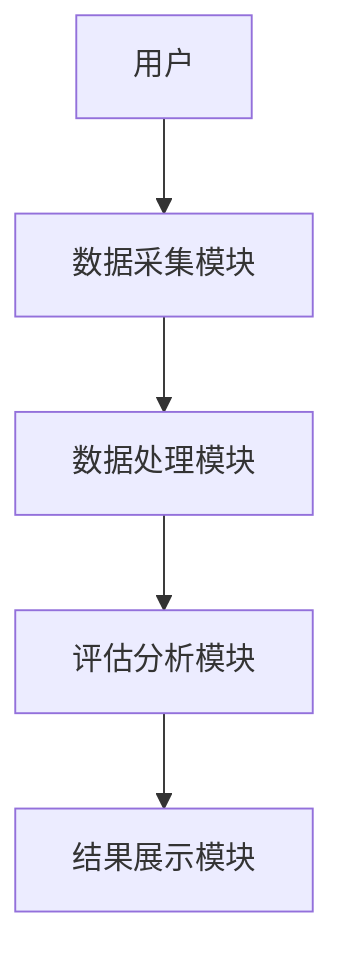
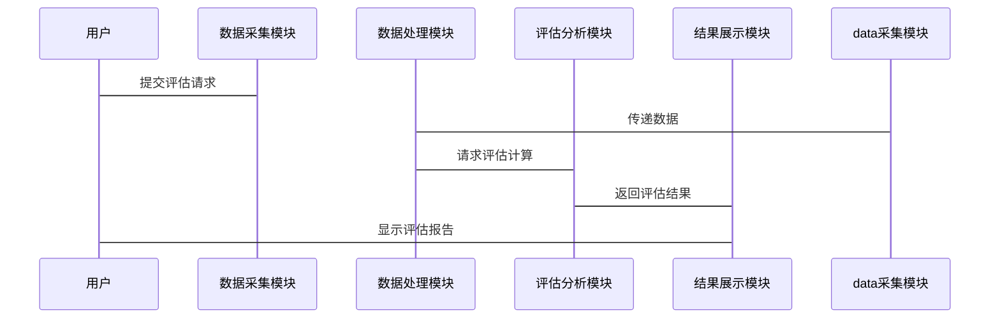

                 


# 如何评估企业的数字化转型

**关键词**：数字化转型，评估方法，企业转型，技术架构，系统评估

**摘要**：本文旨在为企业提供一个系统化的评估框架，以全面评估数字化转型的现状、潜力和挑战。通过结合理论与实践，本文详细介绍了评估的核心概念、算法模型、系统架构以及实际案例，帮助企业在数字化转型过程中做出明智决策。

---

# 第一部分：数字化转型评估的背景与核心概念

## 第1章：数字化转型评估的背景与意义

### 1.1 数字化转型的背景与现状

#### 1.1.1 数字化转型的定义与内涵
- 数字化转型不仅仅是技术的升级，更是对企业商业模式、运营方式和组织结构的全面重构。
- 通过数字化技术（如大数据、人工智能、云计算等）实现业务创新和效率提升。

#### 1.1.2 当前企业数字化转型的趋势
- 全球范围内，企业加速数字化转型以应对市场竞争和客户需求的变化。
- 技术驱动（如AI、物联网）和业务驱动（如客户体验）双轮驱动转型。

#### 1.1.3 数字化转型对企业的影响
- 提高业务效率和决策能力。
- 优化客户体验，增强客户忠诚度。
- 创新商业模式，开拓新的收入来源。

### 1.2 数字化转型评估的重要性

#### 1.2.1 评估的目的与意义
- 量化数字化转型的成果，识别不足之处。
- 为后续转型提供方向和依据。

#### 1.2.2 评估在企业战略中的作用
- 帮助企业制定科学的转型策略。
- 优化资源配置，确保转型目标的实现。

#### 1.2.3 评估对业务价值的提升
- 通过评估发现潜在价值点，提升企业竞争力。
- 降低转型风险，确保转型的可持续性。

### 1.3 本章小结
- 数字化转型不仅是技术问题，更是战略问题。
- 评估是转型成功的关键步骤，需要从多个维度进行综合分析。

---

## 第2章：数字化转型评估的核心概念

### 2.1 数字化转型的关键维度

#### 2.1.1 业务价值维度
- 评估数字化转型对企业核心业务的贡献。
- 关注客户价值、市场份额和利润增长。

#### 2.1.2 技术实现维度
- 评估技术架构的合理性、稳定性和可扩展性。
- 包括数据管理、系统集成和安全性等方面。

#### 2.1.3 组织与文化维度
- 评估组织结构、文化氛围和员工能力对转型的支持程度。
- 包括团队协作、员工培训和创新文化等。

### 2.2 数字化转型评估的框架与模型

#### 2.2.1 数字化成熟度模型
- 通过成熟度模型评估企业在数字化转型中的阶段。
- 包括初期探索、局部应用、全面整合和持续优化四个阶段。

#### 2.2.2 数字化转型价值评估模型
- 通过业务价值、技术实现和组织文化三个维度综合评估转型价值。
- 使用加权评分法计算总价值得分。

#### 2.2.3 数字化转型风险评估模型
- 识别和评估转型过程中可能遇到的风险。
- 包括技术风险、组织风险和外部环境风险。

### 2.3 核心概念对比分析

#### 2.3.1 业务价值与技术实现的对比
- 业务价值关注结果，技术实现关注过程。
- 两者相辅相成，共同推动转型成功。

#### 2.3.2 不同评估模型的优劣势分析
- 成熟度模型：简单直观，但缺乏量化指标。
- 价值评估模型：全面量化，但实施复杂。
- 风险评估模型：帮助规避风险，但对价值提升的指导有限。

#### 2.3.3 评估维度与企业目标的关系
- 评估维度应与企业战略目标一致，确保评估结果的有效性。

### 2.4 本章小结
- 数字化转型评估需要综合考虑业务、技术和组织三个维度。
- 不同模型各有优劣，企业应根据自身情况选择合适的评估方法。

---

# 第二部分：数字化转型评估的算法与数学模型

## 第3章：数字化转型评估的算法原理

### 3.1 基于层次分析法的评估模型

#### 3.1.1 层次分析法的基本原理
- 层次分析法（AHP）是一种用于多 Criteria Decision Making（MCDM）的方法。
- 将复杂问题分解为多个层次，通过比较判断构建决策模型。

#### 3.1.2 数字化转型评估中的层次分析法应用
- 构建评估指标的层次结构，包括目标层、准则层和指标层。
- 通过问卷调查或专家访谈确定各指标的权重。

#### 3.1.3 评估指标的权重计算
- 使用AHP方法计算各指标的权重，作为评估的依据。

#### 3.1.4 层次分析法的优缺点
- 优点：方法简单，易于理解，适用于复杂问题。
- 缺点：依赖专家判断，可能存在主观性。

### 3.2 数字化转型评估的数学模型

#### 3.2.1 数字化成熟度评分模型
- 使用加权平均法计算企业的数字化成熟度得分。
- 公式：$$成熟度得分 = \sum (权重_i \times 指标得分_i)$$

#### 3.2.2 数字化转型价值计算公式
- 考虑业务价值、技术实现和组织文化三个维度的加权和。
- 公式：$$价值得分 = \sum (权重_i \times 价值_i)$$

#### 3.2.3 数字化转型风险评估公式
- 通过风险概率和影响程度计算总体风险得分。
- 公式：$$风险得分 = \sum (风险概率_i \times 风险影响_i)$$

### 3.3 算法实现与代码示例

#### 3.3.1 层次分析法的Python实现
```python
import numpy as np

def calculate_weights(criteria_matrix):
    # 计算一致性检验
    n = len(criteria_matrix)
    row_sums = np.sum(criteria_matrix, axis=1)
    normalized_matrix = criteria_matrix / row_sums[:, np.newaxis]
    # 计算特征向量
    eigvals, eigvecs = np.linalg.eig(normalized_matrix.T)
    # 一致性检验
    ci = (eigvals - n) / (n - 1)
    return eigvecs[:, 0]

# 示例：构建指标矩阵
criteria_matrix = np.array([
    [1, 3, 2],
    [1/3, 1, 2],
    [1/2, 1/2, 1]
])
weights = calculate_weights(criteria_matrix)
print("权重向量为：", weights)
```

---

## 第4章：数字化转型评估系统的设计与实现

### 4.1 系统架构设计

#### 4.1.1 系统功能模块划分
- 数据采集模块：收集企业的业务、技术和组织数据。
- 数据处理模块：清洗、整合和分析数据。
- 评估分析模块：应用算法模型进行评估。
- 结果展示模块：以可视化方式呈现评估结果。

#### 4.1.2 系统架构的Mermaid图表示


### 4.2 系统功能设计

#### 4.2.1 数据采集模块设计
- 支持多种数据源的接入，包括数据库、API和文件。
- 提供数据采集的配置界面。

#### 4.2.2 评估分析模块设计
- 集成多种评估模型，支持用户自定义指标权重。
- 提供风险评估和价值评估的可视化结果。

#### 4.2.3 系统交互设计


### 4.3 本章小结
- 数字化转型评估系统是一个复杂的系统工程，需要模块化的设计和高效的协作。
- 通过系统化的架构设计，可以提高评估的效率和准确性。

---

## 第5章：项目实战与最佳实践

### 5.1 项目实战

#### 5.1.1 环境安装
- 安装Python、numpy、pandas等依赖库。
- 配置开发环境，如Jupyter Notebook或PyCharm。

#### 5.1.2 核心代码实现
- 使用层次分析法进行评估指标的权重计算。
- 实现数字化成熟度评分模型和价值评估模型。

#### 5.1.3 代码应用解读与分析
```python
# 示例代码：计算数字化成熟度得分
def calculate_maturity_score(weights, scores):
    return np.dot(weights, scores)

weights = [0.4, 0.3, 0.3]
scores = [0.8, 0.7, 0.9]
maturity_score = calculate_maturity_score(weights, scores)
print("成熟度得分为：", maturity_score)
```

#### 5.1.4 实际案例分析
- 以一家制造企业为例，详细分析其数字化转型评估的过程。
- 解释如何通过评估发现其在数据管理、系统集成和组织文化方面的不足。

### 5.2 最佳实践

#### 5.2.1 评估的关键点
- 确保评估指标与企业战略目标一致。
- 注重数据的准确性和完整性。
- 及时反馈评估结果，指导后续转型工作。

#### 5.2.2 小结
- 数字化转型评估是一个持续的过程，需要不断优化和改进。
- 通过科学的评估方法和系统的架构设计，可以提高评估的效率和效果。

#### 5.2.3 注意事项
- 避免过于依赖单一模型，结合多种方法进行综合评估。
- 加强团队合作，确保各职能部门的协同工作。

#### 5.2.4 拓展阅读
- 推荐阅读《数字化转型：技术与管理的双轮驱动》。
- 关注行业趋势，学习最新的数字化转型方法论。

---

## 第6章：总结与展望

### 6.1 总结
- 数字化转型评估是企业转型成功的关键步骤。
- 通过科学的评估方法和系统的架构设计，可以有效指导企业的转型工作。

### 6.2 未来展望
- 随着技术的发展，评估方法将更加智能化和自动化。
- 数据隐私和安全问题将成为评估的重要考量因素。

---

**结语**：数字化转型评估是一个复杂但重要的任务，需要企业从战略、技术和组织三个维度进行全面考虑。通过本文提供的方法和工具，企业可以更好地评估自身的数字化转型现状，发现潜力和挑战，并制定科学的转型策略。

