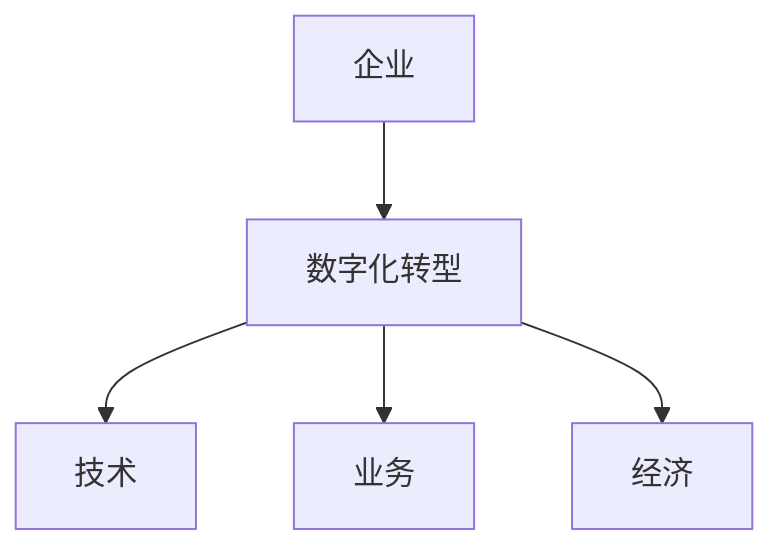
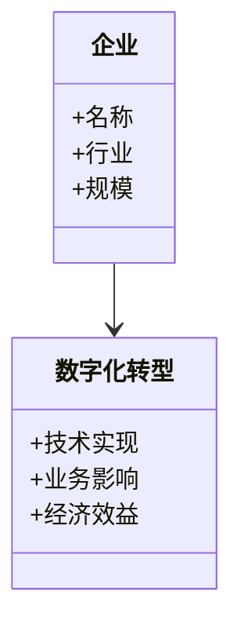
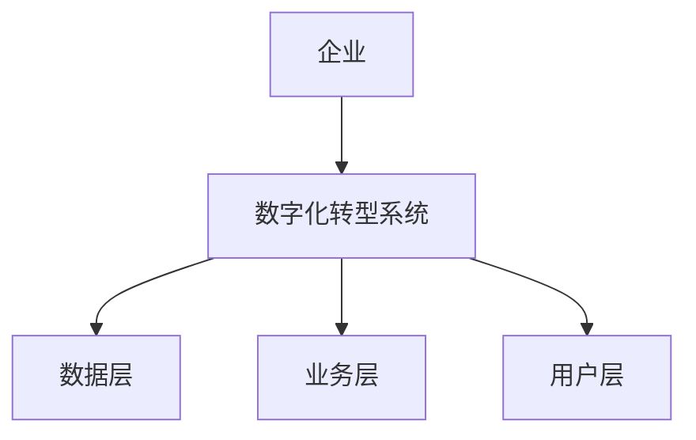
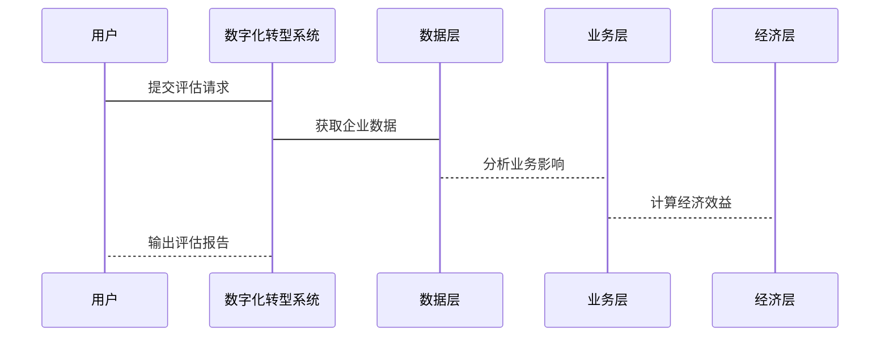

                 


# 如何评估企业的数字化转型价值

## 关键词：数字化转型、企业价值评估、技术实现、业务影响、经济效益

## 摘要：  
数字化转型是企业在现代商业环境中生存和发展的关键。本文从定义、背景、核心概念、评估模型、系统架构到实战案例，全面解析如何科学评估企业数字化转型的价值。通过层次分析法和加权评分模型，结合系统架构设计，帮助企业在技术、业务和经济三个维度实现高效转型。

---

# 第一部分: 数字化转型的背景与概念

## 第1章: 数字化转型的定义与背景

### 1.1 数字化转型的定义与内涵

#### 1.1.1 数字化转型的定义  
数字化转型（Digital Transformation）是指企业利用数字技术（如大数据、人工智能、云计算等）重新设计或优化业务流程、商业模式和用户体验，以提高效率、创造新价值并适应快速变化的市场需求。

#### 1.1.2 数字化转型的核心特征  
- **数据驱动**：依赖数据进行决策和优化。  
- **技术创新**：整合新兴技术（如AI、IoT）提升业务能力。  
- **客户-centric**：以客户体验为中心，提供个性化服务。  
- **敏捷性**：快速响应市场变化和客户需求。  

#### 1.1.3 数字化转型与信息化的区别与联系  
- **信息化**：侧重于将业务流程数字化，解决效率问题。  
- **数字化转型**：更广泛，涉及技术、业务和文化的全面变革。  
- **联系**：数字化转型是在信息化基础上的深化和扩展。  

### 1.2 数字化转型的背景与趋势

#### 1.2.1 全球数字化转型的现状  
- 数字技术的快速发展（如5G、AI、区块链）。  
- 全球企业都在加速数字化转型，以应对市场竞争。  

#### 1.2.2 数字化转型对企业竞争力的影响  
- 提高运营效率，降低成本。  
- 创新商业模式，开拓新市场。  
- 提升客户满意度，增强品牌忠诚度。  

#### 1.2.3 数字化转型的未来趋势  
- 更多企业将采用智能化、自动化技术。  
- 数据安全和隐私保护将成为转型的重要考量。  
- 数字化转型将与可持续发展目标相结合。  

---

## 第2章: 数字化转型的价值评估框架

### 2.1 数字化转型的价值构成

#### 2.1.1 技术价值  
- 引入新技术（如AI、大数据）提升业务能力。  
- 提高技术架构的灵活性和可扩展性。  

#### 2.1.2 业务价值  
- 优化业务流程，提高效率。  
- 创新商业模式，拓展市场。  

#### 2.1.3 经济价值  
- 降低成本，提高利润。  
- 增加收入，提升企业价值。  

### 2.2 数字化转型价值评估的关键维度

#### 2.2.1 技术实现难度  
- 技术复杂性：技术实现的难易程度。  
- 资源需求：所需的人力、物力和财力。  

#### 2.2.2 业务影响范围  
- 业务流程优化：影响的业务环节数量。  
- 客户体验改善：客户满意度的提升。  

#### 2.2.3 经济效益预测  
- 投资回报率（ROI）：数字化转型的经济收益与投入的比值。  
- 成本节约：通过数字化转型节省的成本。  

---

## 第3章: 数字化转型的核心概念与联系

### 3.1 核心概念对比表  

| 概念               | 定义与特征                              | 联系与区别         |
|--------------------|---------------------------------------|-------------------|
| 信息化             | 利用信息技术优化业务流程              | 信息化是数字化转型的基础。 |
| 数字化转型         | 利用数字技术重构业务模式              | 数字化转型是信息化的高级阶段。 |
| 数字化创新         | 利用数字技术创造新的业务价值          | 数字化创新是数字化转型的一部分。 |

### 3.2 实体关系图（ER图）  



---

# 第二部分: 数字化转型的价值评估方法

## 第4章: 数字化转型的评估模型

### 4.1 数字化转型评估模型概述

#### 4.1.1 层次分析法（AHP）  
层次分析法是一种定性和定量相结合的决策方法，适用于多维度评估问题。  

#### 4.1.2 数学建模方法  
通过数学模型量化各维度的权重和评分，得出综合评估结果。  

#### 4.1.3 加权评分模型  
加权评分模型是一种简单有效的评估方法，适用于多维度评估场景。  

### 4.2 数字化转型评估模型的数学公式

#### 加权评分模型公式：  
$$ V = \sum_{i=1}^{n} w_i \cdot s_i $$  
其中，$w_i$ 是第 $i$ 个评估维度的权重，$s_i$ 是第 $i$ 个维度的评分。  

---

## 第5章: 数字化转型的系统分析与架构设计

### 5.1 问题场景介绍

#### 5.1.1 企业数字化转型的典型问题  
- 传统业务流程效率低。  
- 客户需求变化快，难以快速响应。  
- 技术架构落后，难以支持新业务。  

#### 5.1.2 评估系统的功能需求  
- 支持多维度评估（技术、业务、经济）。  
- 提供可视化报告和优化建议。  

#### 5.1.3 系统的边界与范围  
- 仅评估企业内部的数字化转型价值。  
- 不涉及外部合作伙伴或供应商。  

### 5.2 系统功能设计

#### 5.2.1 领域模型（Mermaid 类图）



### 5.3 系统架构设计

#### 5.3.1 系统架构图（Mermaid 架构图）



### 5.4 系统接口设计

#### 5.4.1 接口描述  
- 用户输入评估需求，系统输出评估报告。  

#### 5.4.2 接口交互流程（Mermaid 序列图）



---

## 第6章: 数字化转型的项目实战

### 6.1 环境安装

#### 6.1.1 系统环境  
- 操作系统：Linux 或 Windows。  
- 开发工具：Python、Jupyter Notebook。  
- 数据库：MySQL 或 PostgreSQL。  

### 6.2 系统核心实现源代码

```python
# 数字化转型价值评估系统核心代码

class DigitalTransformation:
    def __init__(self, name, industry, size):
        self.name = name
        self.industry = industry
        self.size = size

    def assess_technical(self):
        # 技术实现难度评估
        return self.size * 0.3

    def assess_business(self):
        # 业务影响范围评估
        return self.industry * 0.5

    def assess_economic(self):
        # 经济效益预测
        return (self.size + self.industry) * 0.2

    def get_total_value(self):
        # 综合价值评估
        total = self.assess_technical() + self.assess_business() + self.assess_economic()
        return total

# 示例代码
enterprise = DigitalTransformation("Example Corp", "Technology", 100)
print(f"技术价值：{enterprise.assess_technical()}")
print(f"业务价值：{enterprise.assess_business()}")
print(f"经济价值：{enterprise.assess_economic()}")
print(f"综合价值：{enterprise.get_total_value()}")
```

### 6.3 代码应用解读与分析

#### 6.3.1 代码解读  
- `DigitalTransformation` 类封装了企业的基本信息和评估方法。  
- `assess_technical`、`assess_business`、`assess_economic` 方法分别评估技术、业务和经济价值。  
- `get_total_value` 方法计算综合价值。  

#### 6.3.2 代码分析  
- 评估方法采用加权评分模型，权重分别为0.3、0.5和0.2。  
- 综合价值是三者的加权和。  

### 6.4 实际案例分析和详细讲解剖析

#### 6.4.1 案例背景  
某科技公司希望评估其数字化转型的综合价值。  

#### 6.4.2 评估过程  
1. 技术价值：100（企业规模） × 0.3 = 30。  
2. 业务价值：Technology（行业） × 0.5 = 50。  
3. 经济价值：(100 + Technology) × 0.2 = 20。  
4. 综合价值：30 + 50 + 20 = 100。  

#### 6.4.3 结论  
该公司的数字化转型综合价值为100，属于较高水平，但在业务影响方面仍有提升空间。  

### 6.5 项目小结

#### 6.5.1 项目总结  
通过代码实现的评估系统能够快速、准确地计算企业的数字化转型价值。  

#### 6.5.2 经验教训  
- 权重的设置需要根据企业实际情况调整。  
- 数据的准确性直接影响评估结果。  

---

## 第7章: 数字化转型的价值评估最佳实践

### 7.1 小结  
数字化转型价值评估是一个复杂但关键的过程，需要结合企业的实际情况，灵活运用多种方法和技术。

### 7.2 注意事项  
- 确保数据的准确性和完整性。  
- 定期更新评估模型和方法。  
- 注重技术与业务的深度融合。  

### 7.3 拓展阅读  
- 《数字化转型：企业重构与未来蓝图》  
- 《数据驱动的企业管理：理论与实践》  

---

通过以上分析，企业可以系统地评估数字化转型的价值，并在实践中不断优化，为企业的长远发展奠定坚实基础。

