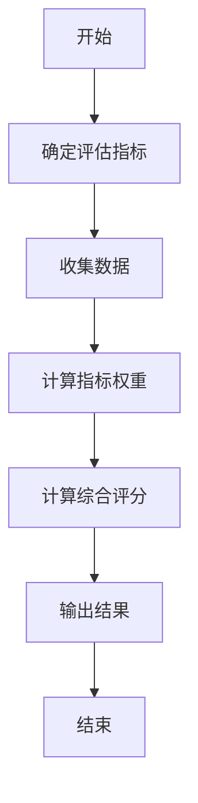
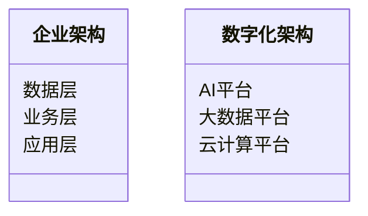
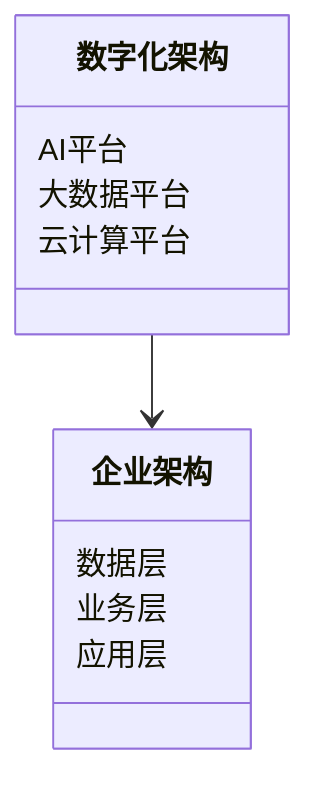

                 


# 如何评估企业的数字化转型成效

## 关键词：
数字化转型、成效评估、指标体系、成熟度模型、系统架构、项目实战

## 摘要：
数字化转型是企业在当前数字时代的必经之路，然而如何有效评估其成效是企业面临的重要挑战。本文将从背景、核心概念、评估方法、系统架构、项目实战等多维度展开分析，构建一个全面的评估框架，帮助企业清晰地衡量数字化转型的进展和成果。

---

# 第一部分: 数字化转型的背景与概念

## 第1章: 数字化转型的定义与背景

### 1.1 数字化转型的定义与内涵
#### 1.1.1 数字化转型的定义
数字化转型是指企业利用数字技术（如人工智能、大数据、云计算等）重构业务模式、流程、文化及员工体验，以实现业务创新和持续竞争优势的过程。

#### 1.1.2 数字化转型的核心特征
| 核心特征 | 描述 |
|----------|------|
| 数据驱动 | 依赖数据进行决策和优化 |
| 技术赋能 | 利用新兴技术提升效率和创新能力 |
| 业务创新 | 改变传统业务模式，创造新价值 |

#### 1.1.3 数字化转型与信息化的区别
| 方面 | 信息化 | 数字化转型 |
|------|--------|------------|
| 目标 | 提升效率 | 创新业务模式 |
| 范围 | 技术应用 | 跨界融合 |
| 驱动力 | 改进流程 | 创新和竞争优势 |

### 1.2 数字化转型的背景与趋势
#### 1.2.1 数字化转型的驱动因素
- 技术进步：AI、大数据、云计算等技术的快速发展。
- 市场需求：客户期望更高的服务质量和个性化体验。
- 竞争压力：数字化转型成为企业保持竞争力的关键。

#### 1.2.2 全球数字化转型的现状
- 企业逐渐从信息化阶段向数字化转型迈进。
- 云计算和大数据分析是当前的主要技术手段。

#### 1.2.3 数字化转型对企业竞争力的影响
- 提高运营效率，降低成本。
- 创新业务模式，开拓新市场。
- 提升客户满意度和忠诚度。

## 第2章: 数字化转型的关键成功因素

### 2.1 企业数字化转型的核心要素
- **业务模式创新**：从传统模式向数据驱动的模式转变。
- **技术能力提升**：引入新兴技术，构建数字化平台。
- **组织文化变革**：推动组织文化的转型，促进员工适应变化。

### 2.2 数字化转型中的挑战与机遇
- **挑战**：技术选型复杂、数据隐私问题、组织变革困难。
- **机遇**：技术创新带来的竞争优势、数据驱动的决策支持、新的业务增长点。

---

# 第二部分: 数字化转型成效的评估框架

## 第3章: 数字化转型成效的评估指标

### 3.1 评估指标体系的构建
- **业务价值指标**：收入增长、成本降低、客户满意度。
- **技术实现指标**：系统稳定性、数据处理能力、技术更新速度。
- **组织能力指标**：员工数字化技能、团队协作效率、组织适应性。

### 3.2 评估指标的权重与优先级
- **指标权重的确定方法**：通过问卷调查和数据分析，结合专家意见确定。
- **优先级排序的策略**：根据企业战略目标和实际需求进行排序。

## 第4章: 数字化转型成熟度模型

### 4.1 成熟度模型的构建
- **初级阶段**：信息化基础建设。
- **中级阶段**：数据驱动的业务优化。
- **高级阶段**：智能化的业务创新。

### 4.2 成熟度模型的评估方法
- **问卷调查与数据分析**：收集数据并进行统计分析。
- **专家访谈与案例分析**：结合专家意见和实际案例进行评估。

## 第5章: 数字化转型评估的数学模型与算法

### 5.1 评估模型的数学表达
- **指标权重计算公式**
$$ w_i = \frac{\sum_{j=1}^{n} s_{ij}}{\sum_{j=1}^{n} \sum_{i=1}^{m} s_{ij}} $$
其中，$w_i$ 表示第 $i$ 个指标的权重，$s_{ij}$ 表示第 $j$ 个样本中第 $i$ 个指标的评分。

- **综合评分公式**
$$ S = \sum_{i=1}^{m} w_i \cdot x_i $$
其中，$S$ 表示综合评分，$w_i$ 表示第 $i$ 个指标的权重，$x_i$ 表示第 $i$ 个指标的具体评分。

### 5.2 算法流程图


---

# 第三部分: 数字化转型评估的系统架构与项目实战

## 第6章: 系统架构设计

### 6.1 当前数字化架构分析


### 6.2 目标架构设计


## 第7章: 项目实战

### 7.1 环境安装与工具选择
- **工具选择**：使用Python的pandas库进行数据分析，使用scikit-learn库进行模型训练。

### 7.2 核心实现代码
```python
import pandas as pd
from sklearn.metrics import accuracy_score

# 数据预处理
data = pd.read_csv('转型数据.csv')
X = data.drop('标签', axis=1)
y = data['标签']

# 划分训练集和测试集
from sklearn.model_selection import train_test_split
X_train, X_test, y_train, y_test = train_test_split(X, y, test_size=0.2)

# 模型训练
from sklearn.linear_model import LogisticRegression
model = LogisticRegression().fit(X_train, y_train)

# 模型预测
y_pred = model.predict(X_test)

# 计算准确率
print("准确率：", accuracy_score(y_test, y_pred))
```

### 7.3 案例分析与解读
- **案例分析**：以某制造企业的数字化转型项目为例，分析其在数据采集、系统集成、业务优化等方面的实践。
- **详细解读**：通过具体的数据和结果，展示数字化转型带来的实际效益。

---

# 第四部分: 最佳实践与总结

## 第8章: 最佳实践

### 8.1 建立持续的评估体系
- 定期进行评估，跟踪转型进展。
- 根据评估结果调整转型策略。

### 8.2 持续改进的方法
- 培训员工，提升数字化技能。
- 引入新技术，优化系统架构。

## 第9章: 总结与展望

### 9.1 总结
- 数字化转型是一个长期而复杂的过程，需要企业在战略、技术、组织等多个方面进行深度变革。
- 通过科学的评估框架和系统的架构设计，可以有效衡量转型成效，指导后续工作。

### 9.2 展望
- 随着技术的不断进步，数字化转型将更加智能化和个性化。
- 企业应保持开放和创新的态度，积极应对数字化时代的挑战。

---

通过以上结构和内容，我将逐步展开每一部分的详细分析，确保文章逻辑清晰、内容丰富，为企业提供实用的评估方法和工具。

