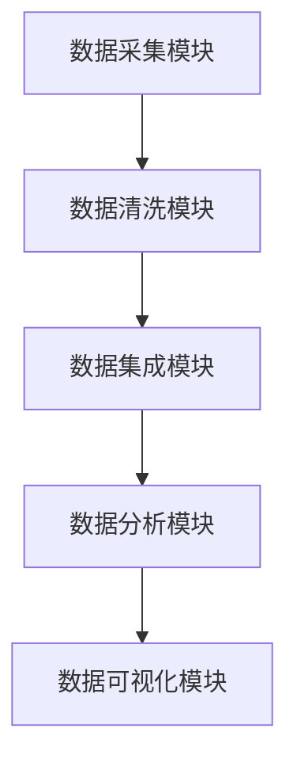
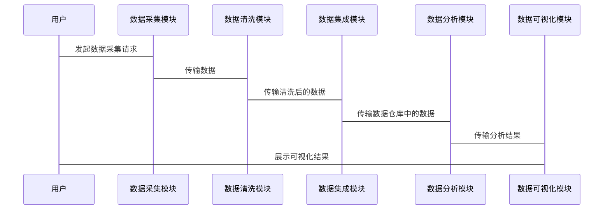

                 


# 如何评估企业的数据变现能力

> 关键词：数据资产、数据变现、数据价值、数据质量、数据安全、数据隐私、数据治理

> 摘要：在数字化转型的背景下，数据已成为企业最重要的资产之一。评估企业的数据变现能力不仅需要理解数据资产的核心概念，还需要掌握数据价值的评估方法、数据安全的保护策略以及数据变现的实现模式。本文将从数据资产的定义与特征出发，逐步分析数据资产价值的评估方法，探讨数据安全与隐私保护的重要性，结合实际案例，详细讲解数据变现模式的应用场景，最后通过系统架构设计和项目实战，帮助读者全面掌握如何评估企业的数据变现能力。

---

# 第1章：数据资产与数据变现能力概述

## 1.1 数据资产的定义与特征

### 1.1.1 数据资产的定义
数据资产是指企业拥有或控制的、能够为企业创造价值的数据资源。数据资产可以是结构化数据、非结构化数据或半结构化数据，涵盖企业的运营数据、用户数据、市场数据等。数据资产的核心价值在于其能够为企业提供决策支持、优化业务流程、提升产品服务质量以及开拓新的商业模式。

### 1.1.2 数据资产的特征
数据资产具有以下特征：
1. **可衡量性**：数据资产的价值可以通过多种指标进行量化评估，如数据的准确性、完整性、及时性等。
2. **可流动性**：数据资产可以通过技术手段在企业内部或外部进行流动和共享。
3. **可增值性**：通过数据分析和挖掘，数据资产可以转化为更高的价值，为企业创造新的收益。
4. **风险性**：数据资产的泄露或滥用可能导致企业的经济损失和声誉损害。

### 1.1.3 数据资产对企业价值的影响
数据资产是企业核心竞争力的重要组成部分。通过有效的数据管理，企业可以优化运营效率、提高客户满意度、降低运营成本，并通过数据驱动的创新实现业务增长。

## 1.2 数据变现能力的背景与意义

### 1.2.1 数据驱动经济的现状
随着大数据技术的快速发展，数据已成为推动经济增长的重要引擎。企业通过数据变现，可以将数据转化为实际的经济收益，如数据销售、数据产品开发、数据服务提供等。

### 1.2.2 数据变现能力的重要性
数据变现能力是企业在数字经济时代的核心竞争力之一。通过有效评估数据变现能力，企业可以更好地利用数据资产，优化业务模式，提升市场竞争力。

### 1.2.3 数据变现能力的边界与外延
数据变现能力的边界包括数据的可用性、数据的安全性以及数据的合规性。数据变现能力的外延则涵盖了数据的应用场景、数据的处理技术以及数据的交易模式。

## 1.3 数据变现能力的核心要素

### 1.3.1 数据质量
数据质量是数据资产价值的重要决定因素。高质量的数据能够为企业的决策提供准确的支持，从而提高数据变现的成功率。

### 1.3.2 数据安全
数据安全是数据变现的基础保障。只有确保数据的安全性，企业才能放心地将数据用于变现活动，避免数据泄露和滥用的风险。

### 1.3.3 数据变现模式
数据变现模式是企业将数据转化为经济收益的具体方式。常见的数据变现模式包括数据销售、数据产品开发、数据服务提供等。

## 1.4 本章小结
本章从数据资产的定义与特征出发，探讨了数据资产对企业价值的影响，并详细分析了数据变现能力的核心要素，包括数据质量、数据安全和数据变现模式。这些内容为后续章节的深入分析奠定了基础。

---

# 第2章：数据资产的核心概念与联系

## 2.1 数据资产的核心概念

### 2.1.1 数据资产的生命周期
数据资产的生命周期包括数据生成、数据存储、数据处理、数据分析、数据应用和数据归档等阶段。每个阶段都涉及到不同的数据管理活动，如数据清洗、数据整合、数据挖掘等。

### 2.1.2 数据资产的分类
数据资产可以按照不同的标准进行分类。例如，根据数据的来源，可以分为内部数据和外部数据；根据数据的结构，可以分为结构化数据和非结构化数据；根据数据的应用场景，可以分为运营数据、用户数据、市场数据等。

### 2.1.3 数据资产的评估维度
数据资产的评估维度包括数据的准确性、完整性、及时性、一致性、安全性、隐私性等。这些维度共同决定了数据资产的价值和可用性。

## 2.2 数据资产与数据变现能力的关系

### 2.2.1 数据资产对企业数据变现能力的影响
数据资产是企业数据变现的基础。高质量的数据资产能够为企业提供更多的变现机会，而低质量或不安全的数据资产则可能限制企业的数据变现能力。

### 2.2.2 数据资产的流动与变现
数据资产的流动和变现是企业数据管理的重要环节。通过数据的流动，企业可以将分散的数据资源整合起来，形成更大的价值。通过数据的变现，企业可以将数据资源转化为实际的经济收益。

### 2.2.3 数据资产的保护与利用
数据资产的保护与利用是企业数据管理的核心任务。只有在确保数据安全的前提下，企业才能充分利用数据资产，实现数据的高效变现。

## 2.3 数据资产的ER实体关系图

```mermaid
er
    entity 数据资产 {
        id
        类型
        所有者
        存储位置
        访问权限
    }
    entity 数据变现能力 {
        id
        评估指标
        评估结果
        关联数据资产
    }
    数据资产 --> 数据变现能力
```

## 2.4 本章小结
本章从数据资产的核心概念出发，分析了数据资产的生命周期、分类和评估维度，并探讨了数据资产与数据变现能力之间的关系。通过ER实体关系图，展示了数据资产与数据变现能力之间的关联，为后续章节的分析提供了理论基础。

---

# 第3章：数据资产价值评估的算法原理

## 3.1 数据资产价值评估的数学模型

### 3.1.1 数据质量评估的公式
$$ 数据质量 = \frac{准确性 + 完整性 + 及时性}{3} $$

### 3.1.2 数据价值评估的公式
$$ 数据价值 = 数据质量 \times 数据可用性 \times 数据稀缺性 $$

### 3.1.3 数据安全评估的公式
$$ 数据安全性 = 数据访问控制 \times 数据加密强度 \times 数据备份能力 $$

## 3.2 数据资产价值评估的算法实现

### 3.2.1 数据清洗算法
数据清洗是数据资产价值评估的重要步骤。常用的算法包括：
1. **重复数据删除**：通过哈希算法去除重复数据。
2. **数据补齐**：使用均值、中位数或模式填补缺失值。
3. **异常值处理**：通过聚类算法或统计方法识别并处理异常值。

### 3.2.2 数据集成算法
数据集成是将多个数据源中的数据整合到一个统一的数据仓库中。常用算法包括：
1. **数据抽取**：使用ETL（抽取、转换、加载）工具将数据从多个源中抽取出来。
2. **数据转换**：通过数据映射或数据转换规则将数据转换为统一的格式。
3. **数据合并**：将多个数据源中的数据合并到一个数据仓库中。

### 3.2.3 数据分析算法
数据分析是数据资产价值评估的关键步骤。常用算法包括：
1. **描述性分析**：通过统计方法分析数据的分布、趋势和关联性。
2. **预测性分析**：使用回归分析、决策树、随机森林等算法预测未来趋势。
3. **诊断性分析**：通过因果分析、关联规则挖掘等方法分析数据背后的原因。

## 3.3 数据资产价值评估的实现步骤

### 3.3.1 数据采集
数据采集是数据资产价值评估的第一步。通过数据抽取工具，从企业内部系统和外部数据源中采集数据。

### 3.3.2 数据清洗
对采集到的数据进行清洗，去除重复数据、填补缺失值、处理异常值，确保数据的准确性和完整性。

### 3.3.3 数据集成
将清洗后的数据集成到一个统一的数据仓库中，为后续分析提供数据支持。

### 3.3.4 数据分析
通过对数据进行描述性、预测性和诊断性分析，评估数据资产的价值和潜力。

### 3.3.5 数据可视化
将分析结果可视化，帮助企业更好地理解和利用数据资产。

## 3.4 本章小结
本章详细讲解了数据资产价值评估的数学模型和算法实现，包括数据清洗、数据集成和数据分析的具体步骤。通过这些算法，企业可以有效地评估数据资产的价值，为数据变现能力的提升提供理论支持。

---

# 第4章：数据安全与隐私保护

## 4.1 数据安全的重要性

### 4.1.1 数据安全对企业的影响
数据安全是企业数据变现的基础。数据泄露可能导致企业的经济损失和声誉损害，直接影响企业的数据变现能力。

### 4.1.2 数据安全的法律要求
随着数据隐私保护法律法规的不断完善，企业必须遵守数据安全的相关法律，确保数据的合法性和合规性。

## 4.2 数据隐私保护的实现

### 4.2.1 数据加密技术
数据加密是保护数据隐私的重要手段。通过加密算法，可以确保数据在传输和存储过程中的安全性。

### 4.2.2 数据访问控制
数据访问控制是通过权限管理，确保只有授权人员可以访问敏感数据。

### 4.2.3 数据匿名化处理
数据匿名化处理是将数据中的敏感信息进行匿名化处理，确保数据在分析和应用过程中不会泄露个人隐私。

## 4.3 数据安全风险评估

### 4.3.1 数据安全风险的识别
通过风险评估方法，识别可能存在的数据安全风险，如数据泄露、数据篡改、数据丢失等。

### 4.3.2 数据安全风险的评估
评估数据安全风险的严重性和发生的可能性，制定相应的风险管理策略。

### 4.3.3 数据安全风险的应对
通过技术手段和管理措施，降低数据安全风险，确保数据的安全性和可靠性。

## 4.4 本章小结
本章从数据安全和隐私保护的角度，分析了数据安全对企业数据变现能力的影响，并详细讲解了数据加密、数据访问控制和数据匿名化等技术。通过数据安全风险评估，企业可以更好地保护数据资产，确保数据的安全性和合规性。

---

# 第5章：数据变现模式与应用场景

## 5.1 数据变现模式

### 5.1.1 数据销售
数据销售是企业将数据资产出售给其他企业或第三方机构，获取经济收益。

### 5.1.2 数据产品开发
数据产品开发是将数据资产转化为数据产品，如数据分析报告、数据可视化工具、数据预测模型等，为企业创造新的收益。

### 5.1.3 数据服务提供
数据服务提供是通过数据接口或API，为企业提供数据查询、数据订阅等服务，实现数据的间接变现。

## 5.2 数据变现的应用场景

### 5.2.1 零售行业
在零售行业中，企业可以通过分析用户数据，优化库存管理、提升客户体验、制定精准营销策略，实现数据的高效变现。

### 5.2.2 金融行业
在金融行业中，企业可以通过分析交易数据、信用数据、市场数据等，提供风险评估、信用评分、投资建议等服务，实现数据的深度变现。

### 5.2.3 医疗行业
在医疗行业中，企业可以通过分析患者数据、诊疗数据、健康数据等，提供疾病预测、健康管理、药物研发等服务，实现数据的医疗变现。

## 5.3 数据变现的实现步骤

### 5.3.1 数据需求分析
通过需求分析，明确数据变现的目标、范围和实现路径。

### 5.3.2 数据处理与分析
对数据进行清洗、整合和分析，提取有价值的信息，为数据变现提供支持。

### 5.3.3 数据产品设计
根据数据分析结果，设计数据产品或数据服务，满足市场需求。

### 5.3.4 数据产品实现
通过技术手段实现数据产品或数据服务，确保产品的功能和性能满足用户需求。

### 5.3.5 数据产品推广
通过市场推广和营销，扩大数据产品的影响力，提升数据变现的收益。

## 5.4 本章小结
本章从数据变现模式出发，分析了数据销售、数据产品开发和数据服务提供的实现方式，并结合零售、金融、医疗等行业的实际案例，详细讲解了数据变现的应用场景。通过数据需求分析、数据处理与分析、数据产品设计、数据产品实现和数据产品推广等步骤，企业可以有效地实现数据变现。

---

# 第6章：数据变现能力评估的系统架构

## 6.1 系统功能设计

### 6.1.1 数据采集模块
数据采集模块负责从企业内部系统和外部数据源中采集数据，确保数据的完整性和准确性。

### 6.1.2 数据清洗模块
数据清洗模块对采集到的数据进行清洗，去除重复数据、填补缺失值、处理异常值，确保数据的高质量。

### 6.1.3 数据集成模块
数据集成模块将清洗后的数据集成到一个统一的数据仓库中，为后续分析提供数据支持。

### 6.1.4 数据分析模块
数据分析模块通过对数据进行描述性、预测性和诊断性分析，评估数据资产的价值和潜力。

### 6.1.5 数据可视化模块
数据可视化模块将分析结果可视化，帮助用户更好地理解和利用数据资产。

## 6.2 系统架构设计



## 6.3 系统接口设计

### 6.3.1 数据采集接口
数据采集接口负责从企业内部系统和外部数据源中采集数据，接口设计需要考虑数据格式、数据量和数据传输速度。

### 6.3.2 数据清洗接口
数据清洗接口负责对采集到的数据进行清洗，接口设计需要考虑数据格式、清洗规则和清洗结果的返回方式。

### 6.3.3 数据集成接口
数据集成接口负责将清洗后的数据集成到数据仓库中，接口设计需要考虑数据仓库的结构、数据存储格式和数据加载方式。

### 6.3.4 数据分析接口
数据分析接口负责对数据进行分析，接口设计需要考虑分析算法、分析参数和分析结果的返回方式。

### 6.3.5 数据可视化接口
数据可视化接口负责将分析结果可视化，接口设计需要考虑可视化图表类型、图表样式和图表展示方式。

## 6.4 系统交互流程



## 6.5 本章小结
本章从系统架构的角度，详细讲解了数据变现能力评估的系统功能设计、架构设计和交互流程。通过数据采集、数据清洗、数据集成、数据分析和数据可视化等模块的设计，企业可以构建一个高效的数据变现能力评估系统。

---

# 第7章：数据变现能力评估的项目实战

## 7.1 环境安装与配置

### 7.1.1 数据库安装
安装MySQL数据库，用于存储数据资产。

### 7.1.2 数据分析工具安装
安装Python和Pandas库，用于数据清洗和分析。

### 7.1.3 可视化工具安装
安装Matplotlib和Seaborn库，用于数据可视化。

## 7.2 核心代码实现

### 7.2.1 数据采集代码
```python
import pandas as pd
import requests

def collect_data(url):
    response = requests.get(url)
    data = response.json()
    df = pd.DataFrame(data)
    return df

# 示例数据采集
url = 'https://example.com/api/data'
df = collect_data(url)
print(df)
```

### 7.2.2 数据清洗代码
```python
def clean_data(df):
    # 删除重复数据
    df = df.drop_duplicates()
    # 填补缺失值
    df['fill_missing'] = df['fill_missing'].fillna(df['fill_missing'].mean())
    # 处理异常值
    df = df[df['outlier_field'] < 100]
    return df

# 示例数据清洗
df_cleaned = clean_data(df)
print(df_cleaned)
```

### 7.2.3 数据分析代码
```python
from sklearn.tree import DecisionTreeRegressor
import numpy as np

def analyze_data(df):
    # 特征工程
    features = df.drop('target', axis=1)
    target = df['target']
    # 模型训练
    model = DecisionTreeRegressor()
    model.fit(features, target)
    # 预测结果
    predictions = model.predict(features)
    return predictions

# 示例数据分析
predictions = analyze_data(df_cleaned)
print(predictions)
```

### 7.2.4 数据可视化代码
```python
import matplotlib.pyplot as plt
import seaborn as sns

def visualize_data(df, predictions):
    plt.figure(figsize=(10, 6))
    sns.scatterplot(x='x', y='y', data=df)
    plt.title('Data Visualization')
    plt.show()

# 示例数据可视化
visualize_data(df_cleaned, predictions)
```

## 7.3 案例分析与总结

### 7.3.1 案例分析
通过上述代码实现，我们对采集到的数据进行了清洗、分析和可视化，评估了数据资产的价值和潜力。

### 7.3.2 项目总结
通过本项目，我们掌握了数据变现能力评估的核心步骤，包括数据采集、数据清洗、数据分析和数据可视化。这些技能为企业实现数据变现提供了有力支持。

## 7.4 本章小结
本章通过项目实战，详细讲解了数据变现能力评估的环境安装、代码实现和案例分析。通过实际操作，读者可以更好地理解和掌握数据变现能力评估的核心技能。

---

# 第8章：高级话题与最佳实践

## 8.1 数据治理与数据资产化

### 8.1.1 数据治理的重要性
数据治理是企业数据管理的核心任务。通过数据治理，企业可以确保数据的准确性和一致性，为数据变现能力的评估提供支持。

### 8.1.2 数据资产化的实现
数据资产化是将数据转化为资产的过程。通过数据清洗、数据集成和数据分析等技术手段，企业可以将数据转化为高价值的资产。

## 8.2 数据孤岛与数据共享

### 8.2.1 数据孤岛的挑战
数据孤岛是企业在数据管理中面临的重要挑战。数据孤岛会导致数据无法充分利用，限制企业的数据变现能力。

### 8.2.2 数据共享的实现
通过数据共享，企业可以将分散的数据资源整合起来，形成更大的价值。数据共享需要考虑数据安全和数据隐私保护。

## 8.3 数据变现能力的持续优化

### 8.3.1 数据质量管理
数据质量管理是确保数据资产价值的重要手段。通过数据清洗、数据校准和数据标准化等技术，企业可以提高数据资产的质量。

### 8.3.2 数据安全与隐私保护
数据安全与隐私保护是企业数据管理的重要任务。通过数据加密、数据访问控制和数据匿名化等技术，企业可以确保数据的安全性和合规性。

## 8.4 本章小结
本章从高级话题的角度，分析了数据治理、数据孤岛和数据共享等重要问题，并提出了数据质量管理、数据安全与隐私保护等最佳实践。通过这些措施，企业可以持续优化数据变现能力，提高数据资产的价值。

---

# 第9章：总结与展望

## 9.1 全书总结
本书从数据资产的定义与特征出发，详细讲解了数据资产价值评估的数学模型和算法实现，探讨了数据安全与隐私保护的重要性，并结合实际案例，详细讲解了数据变现模式的应用场景。通过系统架构设计和项目实战，帮助读者全面掌握如何评估企业的数据变现能力。

## 9.2 未来展望
随着大数据技术的不断发展，数据变现能力评估将变得更加重要。未来，企业可以通过人工智能、机器学习等技术，进一步提高数据资产的价值评估能力，实现数据的深度变现。同时，数据安全与隐私保护也将成为企业数据管理的核心任务，为企业数据变现能力的持续优化提供保障。

## 9.3 最佳实践 Tips
- 数据资产是企业核心竞争力的重要组成部分，企业应重视数据资产的管理与利用。
- 数据安全与隐私保护是数据变现的基础，企业必须确保数据的安全性和合规性。
- 数据变现模式的选择应结合企业的实际需求和市场环境，制定合理的数据变现策略。

## 9.4 本章小结
本章总结了全书的核心内容，并对未来的发展趋势进行了展望。通过最佳实践 Tips，为企业提供了数据管理与数据变现的实用建议。

---

# 附录：术语表与参考文献

## 附录A：术语表
1. 数据资产：企业拥有或控制的、能够为企业创造价值的数据资源。
2. 数据变现：将数据资产转化为经济收益的过程。
3. 数据质量：数据的准确性、完整性、及时性等特征的综合度量。
4. 数据安全：保护数据资产不被未经授权的访问、泄露或篡改。
5. 数据隐私：保护个人隐私信息不被滥用的技术和措施。

## 附录B：参考文献
1. [1] 数据管理与数据治理相关文献
2. [2] 数据安全与隐私保护相关文献
3. [3] 数据变现模式与应用案例相关文献
4. [4] 大数据技术与数据科学相关文献

---

通过以上目录结构和内容安排，读者可以系统地学习如何评估企业的数据变现能力，掌握数据资产的管理与利用、数据安全与隐私保护、数据变现模式的选择与实现等核心技能。

