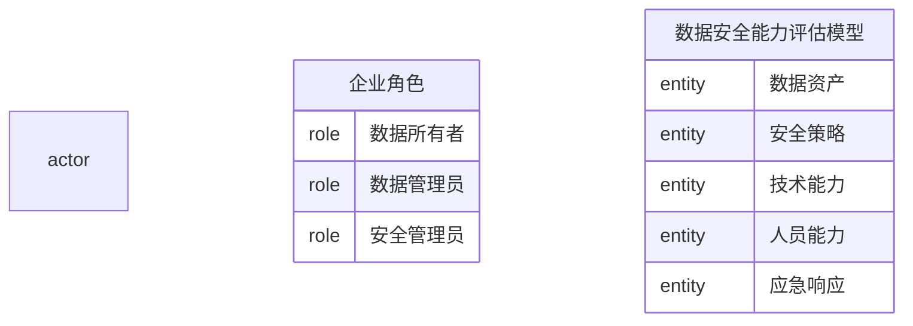
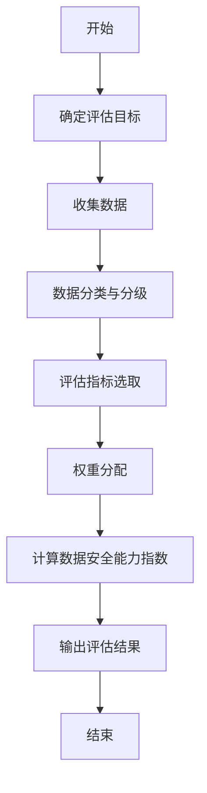
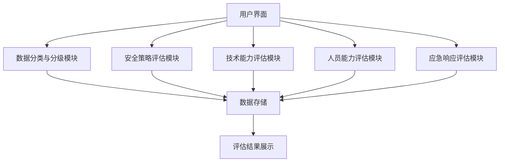

                 


# 如何评估企业的数据安全能力

> 关键词：数据安全，能力评估，企业安全，数据分类，安全策略，技术能力

> 摘要：本文将详细探讨如何系统性地评估企业的数据安全能力。通过介绍数据安全能力评估的核心概念、评估模型、系统架构、项目实战及最佳实践，帮助读者全面了解和提升企业的数据安全能力。内容涵盖数据分类、安全策略、技术能力、人员意识及应急响应等方面，结合实际案例和工具，为企业的数据安全能力评估提供全面指导。

---

# 如何评估企业的数据安全能力

## 第1章: 数据安全能力评估的背景与概念

### 1.1 数据安全的重要性

数据在当今企业中扮演着至关重要的角色，是企业核心资产之一。数据的安全性直接关系到企业的生存、发展和声誉。随着数字化转型的推进，数据的种类和数量急剧增加，数据泄露、篡改、丢失等安全问题也随之增加。数据安全能力评估是企业在数字化时代必须具备的核心能力。

#### 1.1.1 数据在企业中的战略地位

数据是企业决策的基础，支持业务流程优化、客户关系管理、市场分析等。数据的价值不仅在于其存储的内容，更在于其对企业战略目标的贡献。数据安全能力直接影响数据的可用性、完整性和机密性，进而影响企业的整体竞争力。

#### 1.1.2 数据安全对企业的影响

数据泄露可能导致经济损失、法律纠纷、客户信任度下降等问题。例如，2018年Facebook的数据泄露事件导致用户信息被滥用，引发了广泛的信任危机。数据安全能力的强弱直接决定了企业能否在数字化竞争中立于不败之地。

#### 1.1.3 数据安全能力的定义与内涵

数据安全能力是指企业在保护数据的机密性、完整性和可用性方面的能力。它包括技术手段、管理策略、人员意识等多个维度，是企业在数据全生命周期中抵御安全威胁、应对突发事件的能力。

### 1.2 数据安全能力评估的必要性

企业需要定期评估自身的数据安全能力，以识别潜在风险、优化安全策略、应对法律法规要求。

#### 1.2.1 企业数据安全风险的现状

随着云计算、大数据等技术的应用，数据分布广泛，安全威胁也随之多样化。企业内部可能存在数据访问权限设置不当、员工安全意识薄弱等问题，外部则面临黑客攻击、数据窃取等威胁。

#### 1.2.2 数据安全能力评估的目的

评估数据安全能力的目的是为了发现安全漏洞、优化资源配置、验证安全策略的有效性，从而提升整体数据安全水平。

#### 1.2.3 数据安全能力评估的边界与外延

数据安全能力评估的边界包括企业的数据资产、信息系统、人员和流程。外延则涉及供应链安全、第三方服务提供商的安全能力，以及数据跨境流动的合规性。

### 1.3 数据安全能力评估的核心要素

数据安全能力评估需要综合考虑多个维度，包括数据分类与分级、安全策略与制度、技术能力、人员能力、应急响应与恢复能力。

#### 1.3.1 数据分类与分级

数据分类与分级是数据安全的基础，通过将数据按重要性和敏感程度分类，制定差异化的安全策略。例如，企业可以将数据分为公开数据、内部数据、敏感数据和机密数据。

#### 1.3.2 安全策略与制度

企业需要制定全面的安全策略，包括数据访问控制、权限管理、安全审计等制度。安全策略的制定需要考虑企业的业务模式、行业特点和法律法规要求。

#### 1.3.3 技术能力与工具

数据安全能力的实现依赖于技术手段，包括防火墙、入侵检测系统、加密技术、身份认证等工具。企业需要评估现有技术工具的有效性，并根据安全需求进行优化。

#### 1.3.4 人员能力与意识

员工是数据安全的第一道防线，提升员工的安全意识和技能至关重要。企业需要通过培训、模拟演练等方式，增强员工的数据安全意识。

#### 1.3.5 应急响应与恢复能力

企业在发生数据安全事件时，需要具备快速响应和恢复的能力。这包括制定应急预案、建立应急响应团队、定期进行应急演练等。

---

## 第2章: 数据安全能力评估的核心概念与联系

### 2.1 数据安全能力评估的核心概念

数据安全能力评估涉及多个核心概念，包括数据分类与分级、安全策略、技术能力、人员能力和应急响应能力。

#### 2.1.1 数据分类与分级

数据分类与分级是数据安全的基础，决定了数据的安全策略和保护措施。例如，机密数据需要更高的安全级别，而公开数据则相对宽松。

#### 2.1.2 安全策略与制度

安全策略是企业数据安全的核心指导文件，包括访问控制、数据备份、安全审计等内容。制度则是对安全策略的具体实施规范。

#### 2.1.3 技术能力与工具

技术能力是数据安全能力的重要组成部分，包括防火墙、入侵检测系统、加密技术等工具。这些工具的有效性直接影响企业的数据安全水平。

#### 2.1.4 人员能力与意识

人员能力是数据安全的重要因素，员工的安全意识和技能直接影响数据的安全性。例如，员工是否能够识别钓鱼邮件，是否遵守安全制度等。

#### 2.1.5 应急响应与恢复能力

应急响应能力是企业在数据安全事件发生后的快速反应能力，包括事件发现、处置和恢复。这需要企业的组织架构、技术工具和人员协同能力。

### 2.2 数据安全能力评估的核心概念属性对比

以下是核心概念属性的对比表格：

| 属性             | 描述                                                         |
|------------------|--------------------------------------------------------------|
| 数据分类与分级   | 数据的敏感性、重要性分类                                     |
| 安全策略与制度   | 数据保护的规则与标准                                         |
| 技术能力         | 数据安全技术的实现能力                                       |
| 人员能力         | 数据安全相关人员的技能与意识                               |
| 应急响应与恢复能力 | 数据安全事件的应对能力                                       |

### 2.3 数据安全能力评估的ER实体关系图

以下是一个简单的ER实体关系图，展示了数据安全能力评估的主要实体及其关系：



---

## 第3章: 数据安全能力评估的算法原理

### 3.1 数据安全能力评估模型的构建

数据安全能力评估模型的构建需要考虑多个因素，包括数据分类、安全策略、技术能力、人员能力和应急响应能力。以下是构建模型的步骤：

#### 3.1.1 数据分类与权重分配

首先需要将数据进行分类，并为每个类别分配权重。例如，机密数据的权重可能高于公开数据。

#### 3.1.2 评估指标的选取与量化

选择关键的评估指标，并将其量化。例如，数据访问控制的有效性可以量化为0到10分。

#### 3.1.3 模型的训练与优化

通过收集历史数据，训练模型并进行优化，确保模型能够准确反映企业的数据安全能力。

### 3.2 数据安全能力评估的数学模型

数据安全能力指数的计算公式如下：

$$
\text{数据安全能力指数} = \sum_{i=1}^{n} w_i \cdot s_i
$$

其中，$w_i$ 是第i个评估指标的权重，$s_i$ 是第i个评估指标的评分。

### 3.3 数据安全能力评估的流程图

以下是一个数据安全能力评估的流程图：



---

## 第4章: 数据安全能力评估的系统分析与架构设计

### 4.1 项目介绍

本项目旨在开发一个数据安全能力评估系统，帮助企业全面评估自身的数据安全能力，并提供改进建议。

### 4.2 系统功能设计

系统功能包括数据分类与分级、安全策略评估、技术能力评估、人员能力评估和应急响应评估。

#### 4.2.1 数据分类与分级

通过数据分类与分级功能，企业可以将数据分为不同的类别，并制定相应的安全策略。

### 4.3 系统架构设计

以下是系统架构设计的示意图：



---

## 第5章: 数据安全能力评估的项目实战

### 5.1 环境安装

需要安装数据库、服务器和开发工具，建议使用Linux系统和MySQL数据库。

### 5.2 系统核心实现源代码

以下是系统核心实现的源代码示例：

```python
def assess_data_security():
    data_classification = classify_data()
    security_policy = evaluate_policy()
    technical_capabilities = check_technical_capabilities()
   人员能力 = assess_staff_capabilities()
    emergency_response = evaluate_emergency_response()
    
    data_security_index = data_classification * 0.3 + security_policy * 0.2 + technical_capabilities * 0.2 + 人员能力 * 0.1 + emergency_response * 0.2
    return data_security_index

assess_data_security()
```

### 5.3 代码应用解读与分析

上述代码通过函数调用，对数据分类、安全策略、技术能力、人员能力和应急响应能力进行评估，并计算数据安全指数。每个评估指标的权重不同，权重总和为1。

### 5.4 实际案例分析

以某企业为例，假设数据分类得分为80，安全策略得分为70，技术能力得分为75，人员能力得分为60，应急响应得分为85。数据安全指数为：

$$
80 \times 0.3 + 70 \times 0.2 + 75 \times 0.2 + 60 \times 0.1 + 85 \times 0.2 = 24 + 14 + 15 + 6 + 17 = 76
$$

---

## 第6章: 数据安全能力评估的最佳实践与总结

### 6.1 最佳实践 tips

1. 定期进行数据安全能力评估，确保安全措施的有效性。
2. 加强员工的安全意识培训，提升人员能力。
3. 使用先进的技术工具，优化数据安全防护能力。

### 6.2 小结

数据安全能力评估是企业在数字化转型中必须具备的核心能力。通过系统性地评估和优化，企业可以更好地保护数据资产，提升整体竞争力。

### 6.3 注意事项

1. 数据安全能力评估需要结合企业的实际情况，避免过于理论化。
2. 在评估过程中，需要注意数据的保密性和隐私性。
3. 评估结果需要与企业的实际需求相结合，制定切实可行的改进措施。

### 6.4 拓展阅读

建议阅读相关书籍和文献，深入了解数据安全领域的最新技术和管理方法。

---

通过以上内容，我们可以全面了解如何评估企业的数据安全能力，并为企业提供实用的指导和建议。

