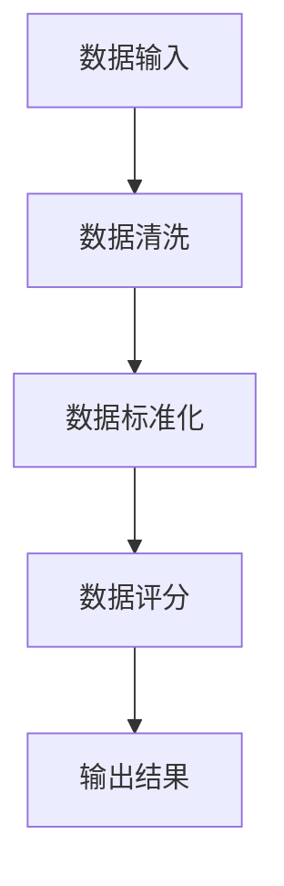
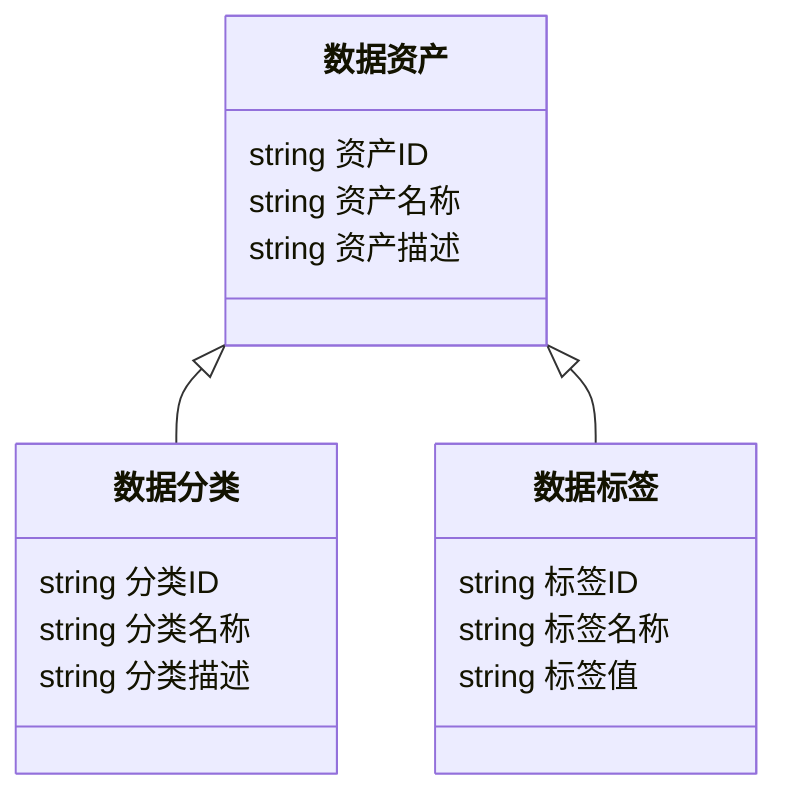

                 


# 如何评估企业的数据治理能力

> 关键词：数据治理能力，数据质量管理，数据安全，数据可用性，数据治理框架

> 摘要：  
数据治理能力是企业在数字化转型中不可或缺的核心竞争力。本文将从数据治理的基本概念、核心要素、评估方法、技术实现、系统架构设计等多维度，详细分析如何系统性地评估企业的数据治理能力。通过本文的阐述，读者可以全面了解数据治理能力的评估框架，并掌握实际操作方法。

---

## 第1章: 数据治理能力评估概述

### 1.1 数据治理的基本概念

#### 1.1.1 数据治理的定义与内涵  
数据治理是指对数据的全生命周期进行规划、组织、监控和优化的过程，旨在确保数据的完整性、准确性、一致性、可追溯性和安全性。数据治理不仅仅是技术问题，更涉及组织结构、管理流程和文化因素。

#### 1.1.2 数据治理的核心目标  
- 确保数据质量：数据准确、完整、一致。  
- 提高数据可用性：数据能够快速、可靠地被业务部门使用。  
- 保障数据安全：数据在存储、传输和使用过程中不被泄露或篡改。  
- 优化数据管理：通过规范化流程降低数据管理成本。  
- 推动数据驱动决策：利用高质量数据支持业务创新。  

#### 1.1.3 数据治理的边界与外延  
数据治理的边界在于数据的全生命周期管理，包括数据生成、存储、处理、分析和应用。其外延则涉及数据安全、数据隐私、数据合规等多个方面。

---

### 1.2 数据治理能力评估的必要性

#### 1.2.1 数据治理对企业的重要性  
在数字化转型背景下，数据已成为企业的核心资产。数据治理能力直接关系到企业的竞争力、合规性和创新能力。

#### 1.2.2 数据治理能力评估的意义  
- 量化企业的数据管理能力，为改进提供方向。  
- 识别数据管理中的短板，降低数据风险。  
- 为数据驱动的业务决策提供支持。  

#### 1.2.3 数据治理能力评估的现状与挑战  
- 数据孤岛现象普遍，导致数据分散、难以统一管理。  
- 数据安全风险日益增加，数据泄露事件频发。  
- 数据治理标准不统一，不同行业对数据治理的要求差异较大。  

---

## 第2章: 数据治理能力评估的核心概念

### 2.1 数据治理的核心要素

#### 2.1.1 数据质量  
数据质量是数据治理的核心要素之一，包括准确性、完整性、一致性和及时性。

#### 2.1.2 数据安全  
数据安全是数据治理的重要组成部分，涉及数据的访问控制、加密存储和安全传输。

#### 2.1.3 数据可用性  
数据可用性指数据能够被授权用户快速、可靠地访问和使用。

#### 2.1.4 数据完整性  
数据完整性确保数据在存储和传输过程中不被篡改或丢失。

---

### 2.2 数据治理能力评估的关键维度

#### 2.2.1 数据管理能力  
- 数据资产管理能力：是否建立了统一的数据资产目录。  
- 数据质量管理能力：数据清洗和标准化的效率。  

#### 2.2.2 数据应用能力  
- 数据分析能力：数据是否能够支持决策。  
- 数据创新能力：是否能够基于数据开发新业务模式。  

#### 2.2.3 数据安全能力  
- 数据加密能力：数据是否加密存储。  
- 数据访问控制：是否采用权限管理。  

#### 2.2.4 数据创新能力  
- 数据产品开发能力：是否基于数据开发了创新产品。  
- 数据驱动的业务模式：是否实现了数据驱动的业务创新。  

---

### 2.3 数据治理能力评估的核心模型

#### 2.3.1 数据治理成熟度模型  
数据治理成熟度模型将企业的数据治理能力分为多个等级，包括：

1. 初级阶段：数据散落在各部门，缺乏统一管理。  
2. 基础阶段：建立了初步的数据管理制度和流程。  
3. 成熟阶段：数据治理能力与业务目标高度匹配。  
4. 领先阶段：数据成为企业核心竞争力，支持数据驱动的创新。  

#### 2.3.2 数据治理能力评估矩阵  
以下是数据治理能力评估矩阵示例：

| 能力维度      | 低级 | 中级 | 高级 |
|---------------|------|------|------|
| 数据质量管理  | 无   | 部分 | 全面 |
| 数据安全管理  | 无   | 部分 | 全面 |
| 数据可用性    | 低   | 中   | 高   |
| 数据完整性    | 低   | 中   | 高   |

#### 2.3.3 数据治理能力评分标准  
数据治理能力评分公式：  
$$ \text{评分} = \frac{\text{实际得分}}{\text{满分}} \times 100 $$  

---

### 2.4 数据治理能力评估的ER实体关系图

```mermaid
erDiagram
    actor 顾客 {
        key string 用户ID
        string 用户名
        string 密码
    }
    actor 管理员 {
        key string 管理员ID
        string 管理员名
        string 权限
    }
    actor 开发者 {
        key string 开发者ID
        string 开发者名
        string 项目ID
    }
    database 数据库 {
        key string 数据ID
        string 数据内容
        string 数据类型
        string 数据来源
    }
    rule 数据治理规则 {
        key string 规则ID
        string 规则名称
        string 规则描述
        string 执行方式
    }
    relationship 用户-规则 {
        用户 -> 数据库: 读取数据
        用户 -> 数据库: 写入数据
        管理员 -> 数据库: 管理数据
        开发者 -> 数据库: 开发数据应用
        数据库 -> 规则: 应用数据治理规则
    }
```

---

## 第3章: 数据治理能力评估的技术实现

### 3.1 数据治理能力评估的算法原理

#### 3.1.1 数据质量评估算法  
数据质量评估算法基于数据的准确性、完整性和一致性进行评分。

算法流程图：



代码实现：

```python
def data_quality_score(data):
    # 数据清洗
    cleaned_data = data.dropna()
    # 数据标准化
    normalized_data = (cleaned_data - cleaned_data.mean()) / cleaned_data.std()
    # 数据评分
    score = (1 - (normalized_data.isin([None]).mean())) * 100
    return score
```

---

### 3.2 数据治理能力评估的数学模型

数据治理能力评估的综合评分公式：  
$$ \text{综合评分} = \alpha \times \text{数据质量评分} + \beta \times \text{数据安全评分} + \gamma \times \text{数据可用性评分} $$  

其中，$\alpha + \beta + \gamma = 1$，$\alpha = 0.4$，$\beta = 0.3$，$\gamma = 0.3$。

---

## 第4章: 数据治理能力评估的系统架构设计

### 4.1 系统功能设计

#### 4.1.1 数据资产管理模块  
功能：管理企业的数据资产，包括数据分类、数据标签、数据存储位置等。

领域模型类图：



---

### 4.2 系统架构设计

系统架构设计图：

```mermaid
archiDiagram
    Client ---(http)--> Web层
    Web层 ---(rest)--> 服务层
    服务层 ---(jdbc)--> 数据库层
    数据库层 ---(file)--> 存储层
```

---

## 第5章: 数据治理能力评估的项目实战

### 5.1 环境安装

- 数据库：MySQL 8.0  
- 开发工具：PyCharm 2023.1  
- 语言：Python 3.9  

---

### 5.2 核心代码实现

数据治理能力评估的Python代码示例：

```python
def assess_data_governance(data_quality, data_security, data_available):
    alpha = 0.4
    beta = 0.3
    gamma = 0.3
    score = alpha * data_quality + beta * data_security + gamma * data_available
    return score

# 示例数据
data_quality = 85
data_security = 90
data_available = 80

# 评估数据治理能力
score = assess_data_governance(data_quality, data_security, data_available)
print(f"数据治理能力综合评分：{score}%")
```

---

### 5.3 案例分析

某银行的数据治理能力评估案例：  
- 数据质量评分：85  
- 数据安全评分：90  
- 数据可用性评分：80  

综合评分：  
$$ 0.4 \times 85 + 0.3 \times 90 + 0.3 \times 80 = 34 + 27 + 24 = 85\% $$  

---

## 第6章: 数据治理能力评估的最佳实践

### 6.1 小结  
数据治理能力评估是企业数字化转型的关键环节，通过建立科学的评估框架和方法，企业可以更好地优化数据管理能力。

### 6.2 注意事项  
- 数据治理能力评估需要结合企业的实际情况。  
- 数据治理能力的提升是一个持续的过程，需要长期投入。  
- 数据治理能力评估结果应与业务目标相结合。  

### 6.3 拓展阅读  
- 《企业数据治理白皮书》  
- 《数据治理：方法、工具与实践》  

---

## 总结

企业数据治理能力评估是一个复杂但重要的系统工程。通过本文的系统性分析，读者可以全面了解数据治理能力的评估框架，并掌握实际操作方法。未来，随着数据量的增加和数据应用场景的拓展，数据治理能力评估将变得更加重要，企业需要不断优化其数据治理能力，以应对日益复杂的数字化挑战。

