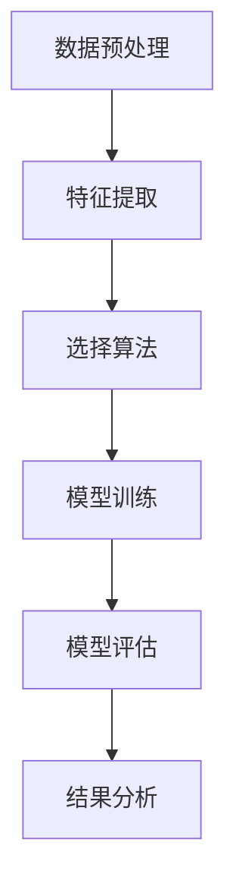

                 


# 如何评估企业的机器学习能力

> 关键词：企业，机器学习，能力评估，AI，技术能力，评估标准

> 摘要：  
> 机器学习作为人工智能的核心技术之一，正在成为企业数字化转型和智能化发展的重要驱动力。然而，如何系统地评估企业的机器学习能力，以确保其在实际应用中能够充分发挥潜力，是当前企业面临的重要挑战。本文将从机器学习的核心概念、算法原理、系统架构、项目实战等多维度，详细分析企业机器学习能力的评估方法和策略，为企业提供切实可行的指导。

---

## 第一部分：机器学习能力评估的背景与核心概念

### 第1章：机器学习与企业能力评估概述

#### 1.1 机器学习的基本概念

##### 1.1.1 机器学习的定义与核心要素
- **定义**：  
  机器学习（Machine Learning）是一种通过数据和经验不断改进模型性能的技术，其核心在于让模型从数据中“学习”规律，而无需明确编程。
- **核心要素**：  
  - 数据（Data）：机器学习的原材料。  
  - 算法（Algorithm）：模型训练的核心工具。  
  - 模型（Model）：学习的输出，用于预测或决策。  
  - 性能（Performance）：模型的优劣衡量标准。

##### 1.1.2 机器学习的分类与应用场景
- **分类**：  
  - **监督学习（Supervised Learning）**：基于标记的数据进行训练，适用于分类和回归任务。  
  - **无监督学习（Unsupervised Learning）**：在无标签数据上发现隐藏模式。  
  - **强化学习（Reinforcement Learning）**：通过试错优化决策策略。  
- **应用场景**：  
  - 预测分析（如销售预测、客户 churn 预测）。  
  - 智能推荐（如个性化推荐系统）。  
  - 自然语言处理（如聊天机器人、文本分类）。  
  - 图像识别（如物体检测、人脸识别）。  

##### 1.1.3 企业为何需要评估机器学习能力
- **技术驱动**：机器学习正在改变企业的运营模式。  
- **竞争优势**：通过机器学习优化决策、提升效率，增强市场竞争力。  
- **资源分配**：评估能力可以帮助企业合理分配资源，避免过度投入或资源浪费。  

#### 1.2 企业机器学习能力评估的背景

##### 1.2.1 数字化转型与机器学习的重要性
- 数字化转型要求企业利用新技术提升效率和客户体验。  
- 机器学习是实现数据驱动决策的关键技术。  

##### 1.2.2 企业智能化发展的趋势
- 智能化是企业发展的必然趋势。  
- 机器学习在企业中的应用越来越广泛，从自动化运维到智能客服，无所不在。  

##### 1.2.3 机器学习在企业中的潜在价值
- **成本降低**：通过自动化流程减少人工干预。  
- **效率提升**：快速处理大量数据，提高决策速度。  
- **创新机会**：机器学习为企业提供了新的业务模式和产品创新的可能性。  

#### 1.3 本章小结
- 本章介绍了机器学习的基本概念、分类、应用场景，以及企业在数字化转型中为何需要评估机器学习能力。  
- 通过了解这些内容，读者可以初步掌握机器学习在企业中的重要性，为后续的评估工作奠定基础。

---

## 第二部分：机器学习能力评估的核心概念与联系

### 第2章：机器学习能力评估的核心要素

#### 2.1 核心概念与原理

##### 2.1.1 数据：机器学习的基石
- **数据质量**：数据的准确性、完整性和一致性直接影响模型性能。  
- **数据量**：数据量越大，模型的泛化能力越强。  
- **数据多样性**：多样化的数据有助于模型更好地适应不同场景。  

##### 2.1.2 算法：机器学习的引擎
- **算法选择**：不同的算法适用于不同的任务。  
- **算法性能**：算法的计算效率和预测准确性是关键指标。  

##### 2.1.3 模型：机器学习的输出
- **模型复杂度**：复杂度高的模型可能过拟合，复杂度低的模型可能欠拟合。  
- **模型解释性**：模型的可解释性影响其实际应用价值。  

##### 2.1.4 性能：评估模型效果的关键指标
- **准确率（Accuracy）**：正确预测的比例。  
- **召回率（Recall）**：真实正例中被正确预测的比例。  
- **F1 值**：准确率和召回率的调和平均值。  
- **ROC 曲线**：评估分类模型的整体性能。  

#### 2.2 核心要素对比分析

##### 2.2.1 数据与算法的对比分析
- **数据的重要性**：数据是模型的输入，决定了模型的上限。  
- **算法的作用**：算法是模型的构建工具，决定了如何利用数据。  
- **数据与算法的协同关系**：数据质量高且多样化时，算法的性能提升更显著。  

##### 2.2.2 模型与性能的相互关系
- **模型复杂度与性能的关系**：复杂度高不一定性能好，需平衡过拟合与欠拟合。  
- **模型解释性与性能的权衡**：高解释性的模型可能在性能上有所妥协。  

##### 2.2.3 企业内外部资源的协同作用
- **内部资源**：企业的数据、算法能力和技术团队。  
- **外部资源**：云服务、第三方数据源和工具。  
- **协同效应**：合理利用内外部资源，可以提升企业的机器学习能力。  

#### 2.3 机器学习能力评估的 ER 实体关系图

```mermaid
erDiagram
    actor 企业角色
    actor 机器学习系统
    actor 数据源
    actor 评估指标
    actor 优化建议
    企业角色 --> 机器学习系统: 使用
    机器学习系统 --> 数据源: 依赖
    机器学习系统 --> 评估指标: 输入
    评估指标 --> 优化建议: 输出
```

---

## 第三部分：机器学习能力评估的算法原理与数学模型

### 第3章：机器学习算法的核心原理

#### 3.1 常见机器学习算法概述

##### 3.1.1 监督学习算法

###### 3.1.1.1 线性回归
- **定义**：通过拟合一条直线来预测目标变量。  
- **适用场景**：回归问题，如销售预测。  
- **数学公式**：  
  $$ y = \beta_0 + \beta_1x + \epsilon $$  
  其中，$\beta_0$ 是截距，$\beta_1$ 是斜率，$\epsilon$ 是误差项。  

###### 3.1.1.2 逻辑回归
- **定义**：通过 sigmoid 函数将线性回归的结果映射到概率空间。  
- **适用场景**：分类问题，如客户 churn 预测。  
- **数学公式**：  
  $$ P(y=1|x) = \frac{1}{1 + e^{-(\beta_0 + \beta_1x)}} $$  

##### 3.1.2 无监督学习算法

###### 3.1.2.1 K-means 聚类
- **定义**：通过最小化簇内距离，将数据划分为 K 个簇。  
- **适用场景**：无标签数据的分群，如客户细分。  
- **数学公式**：  
  $$ \text{目标函数} = \sum_{i=1}^{n} \min_{j} \|x_i - c_j\|^2 $$  
  其中，$c_j$ 是第 j 个簇的中心，$x_i$ 是第 i 个数据点。  

##### 3.1.3 强化学习算法

###### 3.1.3.1 Q-Learning
- **定义**：通过学习状态-动作值函数，优化决策策略。  
- **适用场景**：机器人控制、游戏 AI 等。  
- **数学公式**：  
  $$ Q(s, a) = Q(s, a) + \alpha (r + \max_{a'} Q(s', a') - Q(s, a)) $$  
  其中，$\alpha$ 是学习率，$r$ 是奖励，$s'$ 是下一个状态。  

#### 3.2 算法选择与评估指标

##### 3.2.1 算法选择的依据
- **任务类型**：分类、回归、聚类等。  
- **数据特性**：数据量、数据类型、特征维度。  
- **计算资源**：算法的计算复杂度和运行时间。  

##### 3.2.2 评估指标的分类与应用
- **分类任务**：准确率、召回率、F1 值。  
- **回归任务**：均方误差（MSE）、平均绝对误差（MAE）。  
- **聚类任务**：聚类纯度、轮廓系数。  

#### 3.3 算法流程图



---

## 第四部分：企业机器学习能力的系统分析与架构设计

### 第5章：企业机器学习系统的分析与设计

#### 5.1 系统分析

##### 5.1.1 问题场景分析
- **问题描述**：企业需要通过机器学习优化某个业务流程，但缺乏对现有能力的清晰评估。  
- **边界与外延**：评估仅关注技术能力，不涉及业务流程的其他环节。  

##### 5.1.2 项目目标设定
- **目标**：评估企业的机器学习能力，找出瓶颈并提出优化建议。  

---

由于篇幅限制，以上为文章的前半部分。完整文章将涵盖更多内容，包括系统架构设计、项目实战、最佳实践等。如需继续阅读，请查看完整版文章。

