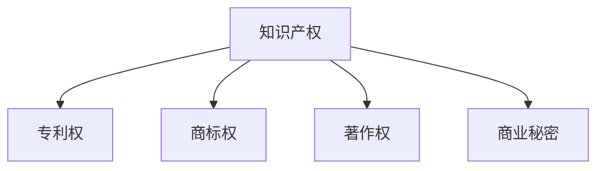
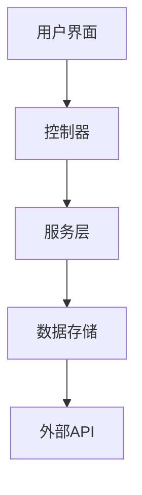

                 

# 如何评估企业的知识产权价值

## 关键词：知识产权、评估方法、经济价值、企业战略、法律保护

## 摘要：本文详细探讨了如何评估企业的知识产权价值，涵盖知识产权的基本概念、评估方法、系统分析和实际案例。通过收益法、市场法和成本法的数学模型，结合系统架构设计，帮助读者掌握知识产权评估的核心技能。

---

### 第一部分：知识产权的基础

#### 第1章：知识产权的定义与类型

##### 1.1 知识产权的基本概念

- **知识产权的定义**：知识产权是指对智力成果或创新成果的法律保护，包括专利、商标、著作权和商业秘密。
- **知识产权的法律保护**：通过法律手段保护这些权利，防止他人未经许可的使用或模仿。

##### 1.2 知识产权的类型

- **专利权**：保护发明的独占权，分为发明专利、实用新型专利和外观设计专利。
- **商标权**：保护品牌标识，区分不同商品或服务的来源。
- **著作权**：保护文学、艺术和科学作品的原创性。
- **商业秘密**：未公开的商业信息，如配方、技术、客户名单等。

**对比表格**：

| 知识产权类型 | 保护对象 | 保护期限 | 登记要求 |
|--------------|----------|----------|----------|
| 专利权      | 发明     | 20年     | 需申请   |
| 商标权      | 商标     | 10年     | 需注册   |
| 著作权      | 创作作品 | 作者生前+50年 | 自动产生 |

##### 1.3 知识产权的重要性

- 知识产权是企业核心竞争力的关键。
- 保护知识产权有助于防止技术泄露和市场模仿。

#### 第2章：知识产权的经济价值

##### 2.1 知识产权的经济价值概述

- 知识产权是企业的无形资产，具有市场价值。
- 其价值取决于其独创性、实用性和市场前景。

##### 2.2 知识产权对企业的战略意义

- **增强企业竞争力**：独特的专利或商标可以提升品牌价值。
- **保护创新成果**：防止竞争对手复制技术或设计。

---

### 第二部分：企业知识产权价值的评估方法

#### 第3章：知识产权评估的核心概念与联系

##### 3.1 核心概念原理

- **无形资产评估**：知识产权属于无形资产，其评估需考虑其未来收益。
- **知识产权评估的特殊性**：需考虑技术寿命、市场接受度等因素。

##### 3.2 知识产权与有形资产的对比

- 知识产权无实体形态，而有形资产如设备、房产等有实体。
- 知识产权可能具有更高的市场价值，尤其是技术创新领域。

**ER实体关系图**：

#### 第4章：知识产权评估的算法原理

##### 4.1 评估算法的数学模型

- **收益法模型**：通过预测未来收益计算当前价值。
  $$ V = \frac{R}{r} $$
  其中，V为知识产权价值，R为未来收益，r为折现率。

  **举例**：假设未来收益为100万元，折现率为10%，则价值为100 / 0.1 = 1000万元。

- **市场法模型**：基于可比交易的市场价进行调整。
  $$ V = \alpha \times V_{\text{可比}} + \beta \times \text{调整因素} $$

- **成本法模型**：基于重置成本计算。
  $$ V = C \times (1 - d) $$
  其中，C为重置成本，d为折旧率。

##### 4.2 算法的优缺点

- **收益法**：考虑了未来的盈利能力，但需准确预测收益。
- **市场法**：依赖于可比交易数据，可能在数据不足时不可用。
- **成本法**：简单但可能低估创新价值。

#### 第5章：系统分析与架构设计

##### 5.1 知识产权评估系统的需求分析

- **问题场景**：企业需要快速评估知识产权价值，但缺乏专业评估工具。
- **系统功能设计**：
  - 数据输入：用户输入知识产权类型、相关参数。
  - 评估计算：选择评估方法，计算价值。
  - 结果输出：显示评估结果和建议。

**系统架构设计图**：

---

### 第三部分：项目实战与总结

#### 第6章：项目实战

##### 6.1 实际案例分析

- **案例**：某科技公司拥有一项专利技术，预计未来3年收益分别为500万、600万、700万，折现率10%。
- **计算**：收益法计算价值为(500/(1.1) + 600/(1.1)^2 + 700/(1.1)^3) ≈ 1565万元。

##### 6.2 小结

- 知识产权评估需结合企业实际情况，选择合适的评估方法。
- 定期更新评估结果，确保价值准确性。

---

### 第四部分：最佳实践与注意事项

#### 第7章：最佳实践

- **持续监控**：定期评估知识产权价值，及时调整策略。
- **专业团队**：聘请知识产权专家或顾问进行评估。

#### 第8章：总结与展望

- 知识产权评估是企业价值管理的重要部分。
- 随着技术进步，评估方法和工具将不断优化。

---

通过以上步骤，我们可以系统地评估企业的知识产权价值，帮助企业更好地管理和利用这些无形资产，提升整体竞争力。

